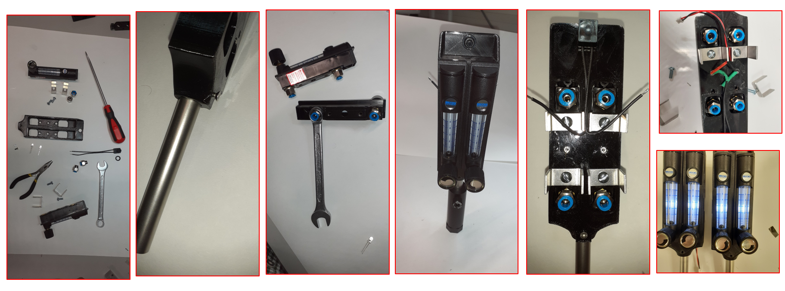
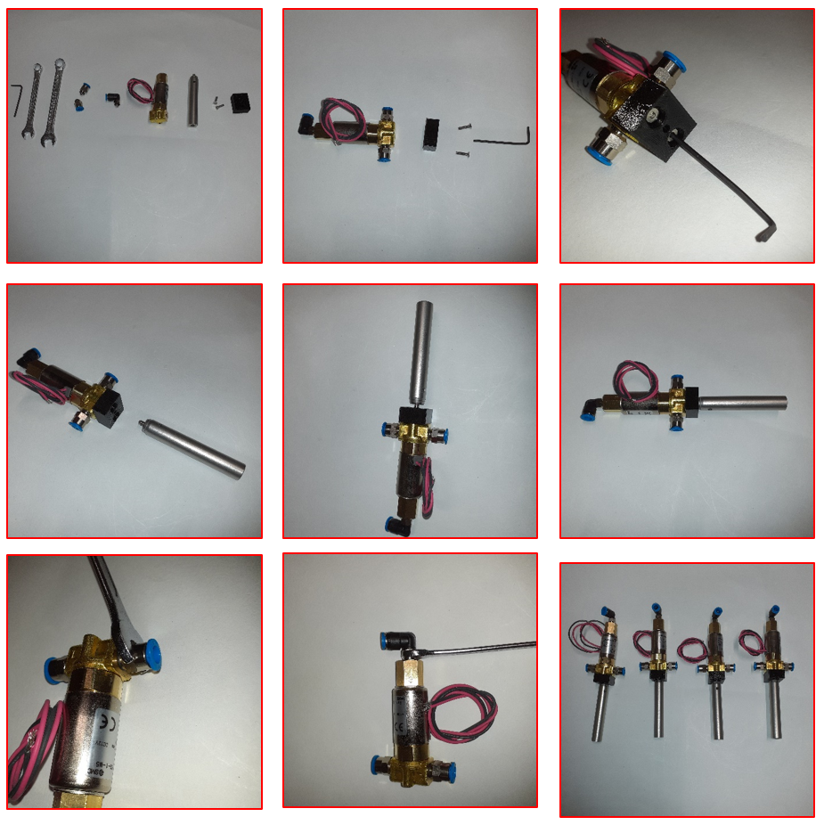
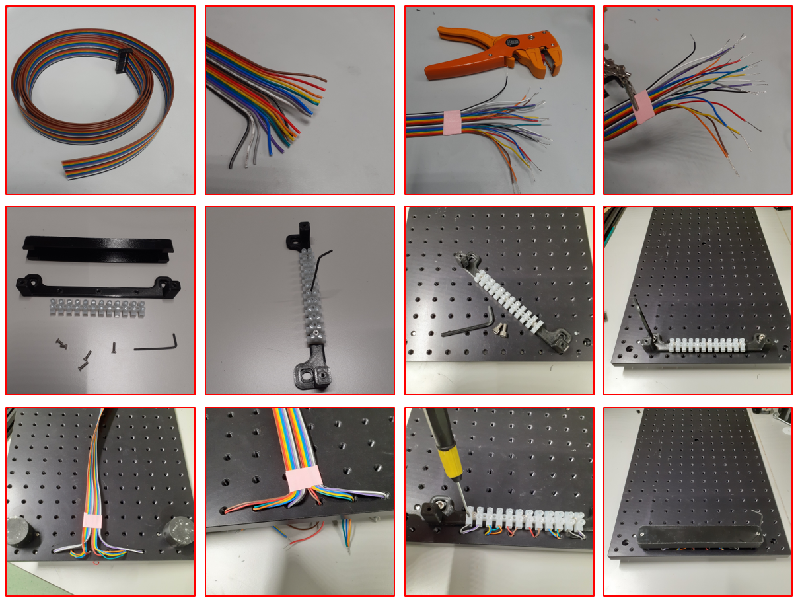
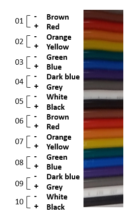

# Air/Odors Delivery System

The IDOC Air/Odors Delivery System is a tool used in conjunction with the IDOC chamber to deliver controlled air and odor stimuli to *Drosophila* during behavioral experiments. The system consists of a series of components that are designed to regulate the delivery of air and odor stimuli, including a custom-built manifold, solenoid valves, and an Arduino microcontroller.

**Building the IDOC Air/Odors Delivery System involves several steps:**

1. Install and configure solenoid valves, which regulate the flow of air and odor stimuli through the     manifold to the IDOC chamber.
2. Design and build the manifold, which consists of a series of ports for delivering air and odor stimuli to     the IDOC chamber.
3. Install and configure vacuum suction system, which regulate and balance the outflow of air and odor stimuli from IDOC chamber. 
4. Install and configure an Arduino microcontroller circuit, which controls the solenoid valves and regulates the precise delivery of air and odor stimuli.
5. Test the IDOC Air/Odors delivery system and ensure that it is functioning properly before conducting behavioral experiments.

The regulated air is delivered to the recording chambers via solenoid valves controlled by Arduino-control-relay- switch unit as follow:

-  The controlled air is  passed through activated carbon capsule (Fisher, [10526921](https://www.fishersci.be/shop/products/whatman-carbon-cap-disposable-activated-carbon-capsules/10526921)) to be filtered and dried.

- The dried filtered air then connected to a solenoid valve 2 ports (named Main Valve) , (Normal close NC, 12 VDC, RS, [840-7020](https://benl.rs-online.com/web/p/solenoid-valves/8407020/)).  This valve is only open when connected to 12VDC. The Arduino-control-relay-unit switch this valve when an experiment starts. 

- When the Main Valve opened, the air passed through  air washing-bottles* to re-humidification. 

  - The humidification process involve two steps: 

    - The first one is to heat a glass bottle of water up to 50°C  (~600ml of water in 1L glass bottle, VWR ) into  water-bath (2 L , VWR, [462-0554](https://be.vwr.com/store/product?keyword=462-0554%20)) to get vaporized air.

    - The hot moist air then passed through  large  water bottle (4L of water in 5L glass bottle (VWR, [215-0057](https://be.vwr.com/store/product/en/544458/laboratory-bottles-round) ) at room temperature to regulate the moisture air temperature.

    - One-way non return valves were used between fittings connection to prevent water back return (RS, [367-0624](https://benl.rs-online.com/web/p/pneumatic-non-return-valves/3670624)). 

      ​

      *GL 45 Cap Connection System, 2 Hose Barb Connectors (Fisher, [15363647](https://www.fishersci.be/shop/products/gl45-screw-cap-pyrex-gl-45-media-lab-bottle-1/15193927)) was used to connect the air inlet and outlet. 

      ​

- The moisture-air then connected to 4-outlets manifold (RS , [431-7194](https://benl.rs-online.com/web/p/pneumatic-manifold-fittings/4317194)) which regulate the air via multiple flow regulator (RS, [197-5337](https://benl.rs-online.com/web/p/pneumatic-function-fittings/1975337)).

  -  1st port: connected to the inflow regulators, threaded flow regulator (RS, [197-5337](https://benl.rs-online.com/web/p/pneumatic-function-fittings/1975337))  used to provide only the required volume of air.

  - 2nd  port: used to clear any condensed water in the delivery tubing. A glass bottle used to collect the condensed water. 

  - 3re port: opened to release any extra pressure and guarantee that the inflow regulators having the same values all the time. 

  - 4th port: Plugged (RS , [367-6098](https://benl.rs-online.com/web/p/pneumatic-fitting-accessories/3676098)). 

    ​

-  The cleaned moisturized air then connected to two air inflow-meters (Right and Left side flowmeters, 0.4 L/min → 5 L/min, RS, [198-2919](https://benl.rs-online.com/web/p/flow-sensors/1982919/)). The air then balanced between both meters to be adjusted at 2L/min for each meter. The regulators of the Flow meter were opened to the maximum since the total air volume is regulated by the threaded flow regulator (RS, [197-5337](https://benl.rs-online.com/web/p/pneumatic-function-fittings/1975337))  connection between the manifold and inflow meters. 

-  Each flowmeter then connected to  a solenoid valve 3 ports, Normal open/Normal close NO/NC, 12 V dc, M5 (RS Components, [838-8660](https://benl.rs-online.com/web/p/solenoid-valves/8388660)) to switch between air and one odor in each side.

  -  The NO outlet of the above 3-port valve then connected to the air washing bottle to deliver air to the solvent (Mineral oil),  

  - The NC outlet of the first valve connected to an air washing bottle to deliver air to the odor A (odor diluted in mineral oil at desired concentration). 

  - One-way check valves, [Female Luer Lock Inlet, Male Luer Lock Outlet] were used between fittings connection to prevent mineral oil back return (WPI, [14039-10](https://www.wpiinc.com/14039-10-check-valve-female-luer-lock-inlet-male-luer-lock-outlet) , Fisher, [11909638](https://www.fishersci.be/shop/products/san-one-way-luer-fitting/11909638)).

    ​

    ​

- If you are going to switch between two odors then the NO outlet of the above solenoid valve 3 ports connected to to the inlet port of  another solenoid valve 3 ports in each side.

  - The NO outlet of the second valve then connected to the air washing bottle to deliver air to the solvent (Mineral oil),  

  - The NC outlet of the first valve connected to an air washing bottle to deliver air to the odor A (odor diluted in mineral oil at desired concentration), 

  - The NC outlet of the second valve connected to an air washing bottle to deliver air to the odor B (odor diluted in mineral oil at desired concentration).

  - One-way check valves, [Female Luer Lock Inlet, Male Luer Lock Outlet] were used between fittings connection to prevent mineral oil back return (WPI, [14039-10](https://www.wpiinc.com/14039-10-check-valve-female-luer-lock-inlet-male-luer-lock-outlet) , Fisher, [11909638](https://www.fishersci.be/shop/products/san-one-way-luer-fitting/11909638)).

    ​

    ​

- The washed cleaned humidified air/odor then delivered to the recording chambers via 20-ports 3D printed manifold.

- Two manifold were used for delivering the air/odors for each side. chemical resistant silicon tubing or Tygon tubing  then collected from the tubing-wiring box and a male luer is connected to the other end which is connected to recording chambers female Luer.

- To ensure that the odors precisely delivered at only the time of the applications, each input first passed through an exhaust valve (Solenoid release exhaust valve S 3-way (Aliexpress/Miniyard, [32881849871 (12V)](https://www.aliexpress.com/item/32881849871.html)) that only open when getting 12VDC signal. By This way when stopping the odor valves the air delivered to the chambers will be stopped and released  to the NO port of the exhaust valves which then collected in a water receiver  to avoid spreading in the room. We found that the switched air bubbling in the water for about 7 seconds after stopping the solenoid valve. If this air is not released the fly will get some diluted concentration of the odors at the end of each treatment. 

  ​

  **If you need only air flow to your chambers you just need a 2ports solenoid valve and two flow regulators to be connected to only two air-washing glass bottles , one for each side. For example your conditioned stimulus is only optogenetic photo-stimulation instead of odors.**

  ​

  ------

**To build a heavy-duty delivery system to switch between air and 2 odors  for 20 recording chambers you will need the following:** 

- Carbon-Cap Disposable Activated Carbon Capsules(Fisher, [10526921](https://www.fishersci.be/shop/products/whatman-carbon-cap-disposable-activated-carbon-capsules/10526921)) Q:1x

- Solenoid Valve 3 port(s) , NO/NC, 12 V dc, M5 (RS Components, [838-8660](https://benl.rs-online.com/web/p/solenoid-valves/8388660)) Q:2x

- Solenoid Valve 2 port(s) , NC, 12 V dc, 1/8in (RS Components, [840-7020](https://benl.rs-online.com/web/p/solenoid-valves/8407020/)) Q: 1x

- DC 12V Solenoid Air Gas valve Release exhaust Valve Switch 2-position 3-way (Aliexpress/Miniyard, [32881849871 (12V)](https://www.aliexpress.com/item/32881849871.html)) Q: 6x

- Laboratory bottles, 100 ML (VWR, [LENZ07105037](https://be.vwr.com/store/product?keyword=LENZ07105037)) Q: 6x

- Laboratory bottles, 5000 ML (VWR, [215-0057](https://be.vwr.com/store/product/en/544458/laboratory-bottles-round)) Q: 1x

- Laboratory bottles, 1000 ML (VWR, [215-1595](https://be.vwr.com/store/product/en/544458/laboratory-bottles-round)) Q: 1x

- GL 45 Cap Connection System, 2 Hose Barb Connectors (Fisher, [15363647](https://www.fishersci.be/shop/products/gl45-screw-cap-pyrex-gl-45-media-lab-bottle-1/15193927)) Q: 8x

- Water bath, 2 L (VWR, [462-0554](https://be.vwr.com/store/product?keyword=462-0554%20)) Q: 1x

-  Luer fitting check valves (WPI, [14039-10](https://www.wpiinc.com/14039-10-check-valve-female-luer-lock-inlet-male-luer-lock-outlet) , Fisher, [11909638](https://www.fishersci.be/shop/products/san-one-way-luer-fitting/11909638)). Q:  10x

- Non Return Valve, 6mm Tube Inlet, 6mm Tube Outlet (RS Components, [367-0624](https://benl.rs-online.com/web/p/pneumatic-non-return-valves/3670624)) Q: 2x

- 4 Outlet Pneumatic Manifold Threaded Fitting, G 1/4 G 1/8 (RS Components, [431-7194](https://benl.rs-online.com/web/p/pneumatic-manifold-fittings/4317194)) Q: 1x

- G 1/8 Brass Corrosion Resistant Plug (RS Components, [367-6098](https://benl.rs-online.com/web/p/pneumatic-fitting-accessories/3676098)) Q: 1x

- G 1/4 Brass Corrosion Resistant Plug (RS Components, [367-6105](https://benl.rs-online.com/web/p/pneumatic-fitting-accessories/3676105)) Q: 1x

- Straight Threaded Adaptor, G 1/4 Male to Push In 6 mm, Threaded-to-Tube Connection Style (RS Components, [125-9600](https://benl.rs-online.com/web/p/pneumatic-fittings/1259600))  Q: 1x

- Straight Threaded-to-Tube Adapter, Uni 1/8 Male, Push In 6 mm (RS Components, [771-5100](https://benl.rs-online.com/web/p/pneumatic-fittings/7715100/)) Q: 2x

  Threaded Flow Regulator x 6mm Tube Outlet Port (RS Components, [197-5337](https://benl.rs-online.com/web/p/pneumatic-function-fittings/1975337)) Q: 3x 

- Elbow Threaded Adaptor, M5 Male to Push In 6 mm, Threaded-to-Tube Connection Style (RS Components, [121-6024](https://benl.rs-online.com/web/p/pneumatic-fittings/1216024)) Q: 2x

- Straight Threaded Adaptor, M5 Male to Push In 6 mm, Threaded-to-Tube Connection Style (RS Components, [121-6039](https://benl.rs-online.com/web/p/pneumatic-fittings/1216039/)) Q: 4x

- Variable Area Flow Meter, 0.05 L/min → 0.5 L/min, (RS Components, [198-2896](https://benl.rs-online.com/web/p/flow-sensors/198-2896))  Q: 2x

- Straight Threaded Adaptor, G 1/8 Male to Push In 6 mm, Threaded-to-Tube Connection Style (RS Components, [121-6009](https://benl.rs-online.com/web/p/pneumatic-fittings/1216009/)) Q: 4x

- 12 Circuit - Terminal Strip Connector Screws (Digi-Key, [277-15432-ND](https://www.digikey.be/en/products/detail/phoenix-contact/3240171/3603832)) Q:1x

- IDC ribbon cable , one IDC connector in one end while the other end is opened.  Q:1x

- Fork ring wrench (amazon.de, [M19652](https://www.amazon.de/-/en/Brothers-Mannesmann-M19652-wrench-pieces/dp/B000ET7G0E?th=1) ; [B001ILAFRI](https://www.amazon.de/-/en/171198-Combination-Spanner-Set-SW/dp/B001ILAFRI/)).

- Ø12.7 mm Optical Post, SS, M4 Setscrew, M6 Tap, L = 100 mm, 5 Pack (Thorlabs, [TR100/M-P5](https://www.thorlabs.de/thorproduct.cfm?partnumber=TR100/M-P5)) Q:10x

- 3D-printed parts

  - 2 port main valve holder Q:1x
  - Manifold holder Q:1x
  - Exhaust valves holder Q:1x
  - 3-ports valve holder Q:4x
  - Flowmeter holder double Q:1x 
  - Powering station holder  Q:1x 

***

**Flowmeters  installation:**

Inflow and outflow meters installation is the same procedures. Use fork ring wrench  or spanner #13 (amazon.de, [M19652](https://www.amazon.de/-/en/Brothers-Mannesmann-M19652-wrench-pieces/dp/B000ET7G0E?th=1) ; [B001ILAFRI](https://www.amazon.de/-/en/171198-Combination-Spanner-Set-SW/dp/B001ILAFRI/))  to connect straight threaded adaptor, G 1/8 Male to Push In 6 mm, Threaded-to-Tube Connection Style (RS Components, [121-6009](https://benl.rs-online.com/web/p/pneumatic-fittings/1216009/)) to the Variable Area Flow Meter, 0.05 L/min → 0.5 L/min, (RS Components, [198-2896](https://benl.rs-online.com/web/p/flow-sensors/198-2896)). Then use screws provided with the flowmeters to fix them to the 3D printed holders. Connect one optical post 10-cm to each holder to be fixed at mounting base the breadboard.

Tip: Backlighting of the flow help to precisely adjust the meters to the same level, just add one white LEDs  in the back hole of each flow regulators. and then connect all LEDs in series with a switch to only illuminated when needed especially when recording at dark room. 

------

**Main Valve Installation**

Use fork ring wrench  or spanner #12 (amazon.de, [M19652](https://www.amazon.de/-/en/Brothers-Mannesmann-M19652-wrench-pieces/dp/B000ET7G0E?th=1) ; [B001ILAFRI](https://www.amazon.de/-/en/171198-Combination-Spanner-Set-SW/dp/B001ILAFRI/))  to connect Straight Threaded-to-Tube Adapter, Uni 1/8 Male, Push In 6 mm (RS Components, [771-5100](https://benl.rs-online.com/web/p/pneumatic-fittings/7715100/)) to the Solenoid Valve 2 port(s) , NC, 12 V dc, 1/8in (RS Components, [840-7020](https://benl.rs-online.com/web/p/solenoid-valves/8407020/)). Then use 2 M3x10mm screws to fix the main valve to the 3D printed holders. 

------

**3-ports Solenoid Valve Installation**

Use fork ring wrench  or spanner #12 (amazon.de, [M19652](https://www.amazon.de/-/en/Brothers-Mannesmann-M19652-wrench-pieces/dp/B000ET7G0E?th=1) ; [B001ILAFRI](https://www.amazon.de/-/en/171198-Combination-Spanner-Set-SW/dp/B001ILAFRI/))  to connect Elbow Threaded Adaptor, M5 Male to Push In 6 mm, Threaded-to-Tube Connection Style (RS Components, [121-6024](https://benl.rs-online.com/web/p/pneumatic-fittings/1216024)) to the top outlet of the Solenoid Valve 3 port(s) , NO/NC, 12 V dc, M5 (RS Components, [838-8660](https://benl.rs-online.com/web/p/solenoid-valves/8388660)). then connect Straight Threaded Adaptor, M5 Male to Push In 6 mm, Threaded-to-Tube Connection Style (RS Components, [121-6039 ](https://benl.rs-online.com/web/p/pneumatic-fittings/1216039/)) to the other ports of the Solenoid valves. Then use 2 M3x10mm screws to fix the base of each valve to the 3D printed holder.  Attach one post 10-cm to each holder to be fixed at mounting base the breadboard. 4-valves in total needed to switch 2-odors system.

------

**Powering Cables to the mounting board:**

To power the valves through connection to the Arduino-control-relay-switch unit, 20-way ribbon cable with on IDC connector connected to the control board while the other end is opened and connected to power station. The power station contains screw terminal block  (12 Circuit - Terminal Strip Connector Screws (Digi-Key, [277-15432-ND](https://www.digikey.be/en/products/detail/phoenix-contact/3240171/3603832))), that enable easy and robust connection between the valves and the control unit. 

Fix the terminal strip connector with M3 10mm screws to the 3D printed powering station holder. Then with M6 screws  fix the holder to the breadboard.  

With the use of a wire stripper, remove at least 1 cm casing to expose the cut wires and then flip the breadboard to the back and insert the wires through the back holes to be connected to the screw terminal from the top of the breadboard. 

**Here is the pinout mapping of the cable connections:**

Mapping_of_ 20-way IDC_header box

------

**Exhaust release Valves Installation**

To ensure that the odors precisely delivered at only the time of the applications, each input first passed through an exhaust valve (Solenoid release exhaust valve S 3-way (Aliexpress/Miniyard, [32881849871 (12V)](https://www.aliexpress.com/item/32881849871.html)) that only open when getting 12VDC signal. By This way when stopping the odor valves the air delivered to the chambers/flies  will be stopped and released  to the NO port of the exhaust valves which then collected in a water receiver  to avoid spreading in the room. We found that the switched air bubbling in the water for about 7 seconds after stopping the solenoid valve. If this air is not released the fly will get some diluted concentration of the odors at the end of each treatment. 

*to install this unit you will need the following items:*

- Female Luer Bulkhead Fitting (Aliexpress/MicroFluidics Store, [RH-C-M024](https://www.aliexpress.com/item/4000025751111.html)) Q:12x

- 3D-print exhaust valves holder  Q:1x

- DC 12V Solenoid Air Gas valve Release exhaust Valve Switch 2-position 3-way (Aliexpress/Miniyard, [32881849871 (12V)](https://www.aliexpress.com/item/32881849871.html)) Q: 6x

- Straight PCB Header, 2.54mm Pitch, 6 Way, 2 Row, Through Hole (RS Components, [832-3496](https://benl.rs-online.com/web/p/pcb-headers/8323496/)) Q:2x

- 6-Way ribbon cable with one IDC Connector Socket at one side (Farnell, [T812106A101CEU](https://be.farnell.com/amphenol/t812106a101ceu/socket-idc-s-relief-2-54mm-6way/dp/2215245); RS Components, [832-3648](https://benl.rs-online.com/web/p/idc-connectors/8323648/)), while the other side is open.

- Resistor Kit, 10ohm to 1Mohm Resistors (Farnell, [MF0W4FFE006KIT](https://be.farnell.com/multicomp/mf0w4ffe006kit/resistor-kit-0-25w-1-e6/dp/9342362))

  ​

  *You also will need*

- Soldering Station (RS Components, [122-7917](https://benl.rs-online.com/web/p/soldering-stations/1227917); for Hot Air Amazon.de, [8786D](https://www.amazon.de/-/en/Soldering-Desoldering-Temperature-Adjustable-Conversion/dp/B08C51QRH5/))

- Lead Free Solder (RS Componentss, [756-8884](https://benl.rs-online.com/web/p/solder/7568884) ; [625-8233](https://benl.rs-online.com/web/p/solder/6258233))

- Side Cutters (Amazon.de, [M10997](https://www.amazon.nl/KNIPEX-Krimptang-240-97-22/dp/B004LY28J2/))

- Heat shrink tubing (amazon.de, [ET1002](https://www.amazon.de/Eventronic-ET1002-Schrumpfschlauch-Farben-560-tlg/dp/B071D7LJ31))

- Wire Stripper (RS Components, [613-044](https://benl.rs-online.com/web/p/wire-strippers/0613044/))

**Procedures:**

- Attach  12 female [luer fittings](https://www.aliexpress.com/item/4000025751111.html) at each circle of the holder, screw them with the included plastic nut and fixers. 

- Insert [solenoid valves](https://www.aliexpress.com/item/32881849871.html) in the recessed area in the 3D printed holder. Just push all of the them in the place by the way the NO outlet is faced the bottom while the two u-shaped ports appeared from the top face of the holder.

- Attach two of [6-Way, 2-Row, boxes](https://benl.rs-online.com/web/p/pcb-headers/8323496/) to the recessed areas.

- Connect and solder each solenoid valve to two pins of the 6-way box.

- Connect a LED parallelly in your preferred color to each valve pins (5 mm LED amazon.de, [110040_SML](https://www.amazon.de/-/en/APTWONZ-Diffuse-Emitting-Electronic-Components/dp/B06X3VT6TD)) as marker when ON. Preferably use the right  resistors (Farnell, [MF0W4FFE006KIT](https://be.farnell.com/multicomp/mf0w4ffe006kit/resistor-kit-0-25w-1-e6/dp/9342362))  to establish the connection to the 12VDC. However you can use 1K Ohm resistor for all of the LEDs.

  ​

  $Source.Voltage  = 12 VDC$

  $Forward .Voltage : white: 3.2-3.4 V; green: 3.0-3.2 V; yellow: 2.0-2.2 V; blue: 3.2-3.4 V; red: 2-2.2 V,$ 

  $forward .Current: 20 mA.$

  $Resistor = (Source .Voltage - Forward. Voltage) / Forward .Current$

  e.g. red color LED  = (12-2)/0.020 = 500 Ohm

  ​

  [Go to this website to calculate the resistor according the above values for each color](https://www.digikey.be/en/resources/conversion-calculators/conversion-calculator-led-series-resistor)

- Connect two IDC 6-Way ribbon cables to the 6-way box, while the other opened side should be connected the corresponding 3-ports Solenoid valve connection at the powering station to be synchronized and prevent extra odor air to be delivered after stopping the odor valves. 

------

**Vacuum Suction system :**

each chamber has two vent in the middle. Each port allows the air to outflow outside of the chamber. to provide  clear decision zones we connected each outlet port to active vacuum. In which outflow amount equal to the inflow air stream. One of the challenging is to balance the airflow system. For that we connect each outlet individually via luer fitting male -female connection. then all tubing collected and bundled together to be imbedded into a vacuum receiver for each side. a 3D-designed and printed GL45 threaded cap with 20 holes were used to collect all of the tubing of one side. Glue and/or silicon paste was used to completely fix the tubing to the holes of the each cap. Each cap  has an outlet port that connected to a threaded adaptor, G 1/8 Male to Push In 6 mm, Threaded-to-Tube Connection Style (RS Components, [121-6009](https://benl.rs-online.com/web/p/pneumatic-fittings/1216009/)) which then connected to the manifold of the vacuum system.

**Vacuum manifold:**

