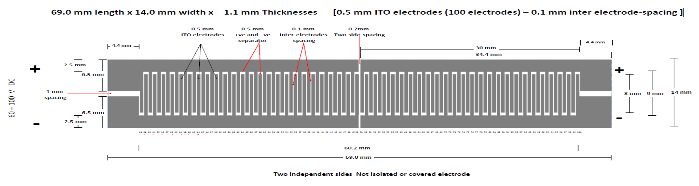
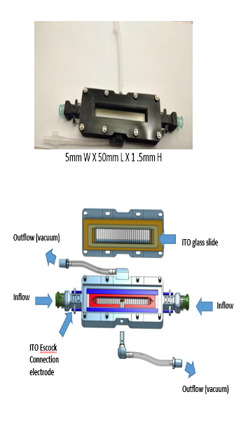
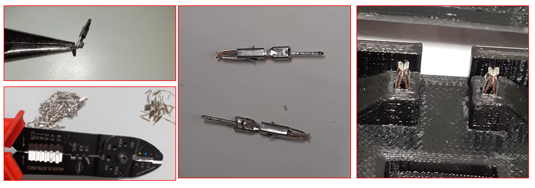
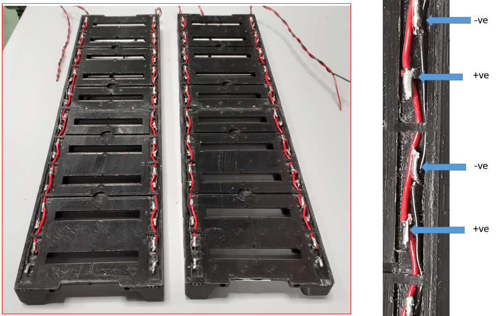

# **Electric Shocks Delivery Circuit**

For aversive electric shock learning conditioning, we used patterned coated indium tin oxide (ITO) transparent glass slides . ITO is a conductive transparent substance. A grid was laser-cut and -etched onto the ITO glass in order to insulate the positive and negative electrodes.  with the following specifications: 69.0 mm length x 14.0 mm width x 1.1 mm Thicknesses [0.5 mm ITO electrodes (100 electrodes) – 0.1 mm inter electrode-spacing ]. The two halves of the grid can be independently controlled. 

| **Indium Tin Oxide coated patterned glass slides ** |
| ---------------------------------------- |
| **- [Design_ITO_glass_Slide](../src/ElectricShock)** CAD DXF drawing |
| 69.0 mm length x 14.0 mm width x 1.1 mm Thicknesses [0.5 mm ITO electrodes (100 electrodes) – 0.1 mm inter electrode-spacing ] |
| **Prepared for the  laboratory of**      |
| **Sha Liu**                              |
| Principle Investigator                   |
| **Email:  [sha.liu@kuleuven.be](mailto:sha.liu@kuleuven.be)** |
| Laboratory of Sleep and Synaptic Plasticity |
| VIB-KU Leuven, Center for Brain and Disease Research, Herestraat 49 - Box 602 B-3000 Leuven - Belgium |
|                                          |
| **Contact Scientist**                    |
| **El-Sayed Baz**                         |
| Postdoctoral Scientist                   |
| **Emails: [elsayed.baz@kuleuven.be](mailto:elsayed.baz@kuleuven.be)      &   [e.baz@science.suez.edu.eg](mailto:e.baz@science.suez.edu.eg)** |
| Laboratory of Sleep and Synaptic Plasticity |
| VIB-KU Leuven, Center for Brain and Disease Research, Herestraat 49 - Box 602 B-3000 Leuven - Belgium |
|                                          |
| **Production laser etching**             |
| **Visiontek systems ltd**                |
| 1 The Acorns, Upton,  Chester,  Cheshire CH2 1JL - United Kingdom. |
| **Email:   **  [visiontek.sales@gmail.com](mailto:visiontek.sales@gmail.com)               & http://www.visionteksystems.co.uk/ito-glass.htm |
|                                          |

**Reorder Details:** 

**15ohm/sq ITOGLASS 15p SODA LIME**

**surface: polished**

**pattern: ZY0423**

**size : 14mm x 69mm x 1.1mm**

Each chamber consists four custom-made  electrodes to contact the ITO surface of the top and bottom glass slides . Two (+ve &-ve) in each side to provide Shocks indecently. 

these electrodes are made in house using the flat metal part of crimp socket  (Farnell, [1593529](https://be.farnell.com/multicomp/2226tg/crimp-terminal-24-28awg/dp/1593529?ost=1593529)), formed in U-shape, then soldered to  a single pin of electric contact  Components, [548-7171](https://benl.rs-online.com/web/p/pcb-headers/5487171) or  [548-7222](https://benl.rs-online.com/web/p/pcb-headers/5487222))

each electrode is set in an connector socket (Digi-Key, [962876-2](https://www.digikey.be/en/products/detail/te-connectivity-amp-connectors/962876-2/2332160)). All sockets are mounted on the chamber holder and connected to a bin header  from the bottom (RS Components, [681-2994](https://benl.rs-online.com/web/p/pcb-headers/6812994/)), There are 80 electrodes contact sockets , 4 for each  chambers .

each side has two sockets, one for positive line while the other for the negative power line which controlled by the Arduino-relay-board. 

all of the sockets are well-covered and isolated.

Arduino relay switch  control unit 

