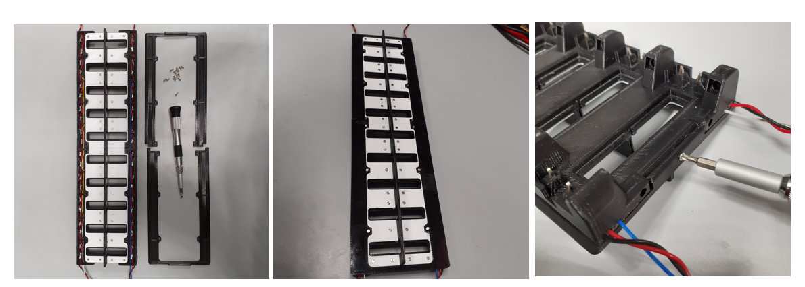
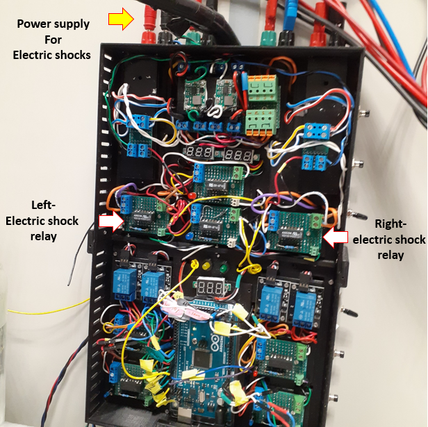

# **Electric Shocks Delivery Circuit**

Electric shocks are commonly used in *Drosophila* research to deliver a controlled electrical shock to the flies during aversive learning and memory experiments. The circuits typically consist of a power supply, and a set of electrodes that can be placed in contact with the flies. The intensity and duration of the electric shock can be controlled by adjusting the voltage and pulse duration of the circuit. However, the specific design and implementation of electric shock delivery circuits can vary widely depending on the specific experimental setup and research question.

The electric shock system consists of a series of components that are designed to regulate the delivery of electric shocks, including a programmable power source and custom glass slides coated with Indium Tin Oxide (ITO) to allow for current delivery through the glass. The circuit is also designed to be controlled by a computer, which can allow for precise control over the timing and intensity of the electric shocks delivered to individual flies, which can be important for controlling experimental variables and ensuring reproducibility of results.

Building the IDOC Electric Shock Circuit involves several steps:

1. Design and order the custom ITO coated patterned glass slides, which is placed in contact with the flies to deliver of electric shocks.
2. Connect the ITO glass slides to the IDOC chamber and ensure that current can be passed through the entire chamber.
3. Install and build the connectors and electrodes which can deliver shocks from the overall machine into the IDOC chambers.
4. Install and configure an Arduino microcontroller circuit, which regulates the precise timing and intensity of the electric shocks.
5. Test the IDOC Electric Shock Circuit and ensure that it is functioning properly before conducting behavioral experiments.

**Indium Tin Oxide coated patterned glass slides** 

For aversive electric shock learning conditioning, we used patterned coated indium tin oxide (ITO) transparent glass slides. ITO is a conductive transparent substance. A grid was laser-cut and -etched onto the ITO glass in order to insulate the positive and negative electrodes. Our ITO slides were designed with the following specifications: 69.0 mm length x 14.0 mm width x 1.1 mm Thicknesses [0.5 mm ITO electrodes (100 electrodes) – 0.1 mm inter electrode-spacing ]. The two halves of the grid can be independently controlled. 

| **Indium Tin Oxide coated patterned glass slides ** |
| ---------------------------------------- |
| **- [Design_ITO_glass_Slide](../src/ElectricShock)** CAD DXF drawing |
| 69.0 mm length x 14.0 mm width x 1.1 mm Thicknesses [0.5 mm ITO electrodes (100 electrodes) – 0.1 mm inter electrode-spacing ] |
| **Prepared for the  laboratory of**      |
| **Sha Liu**                              |
| Principle Investigator                   |
| **Email:  [sha.liu@kuleuven.be](mailto:sha.liu@kuleuven.be)** |
| Laboratory of Sleep and Synaptic Plasticity |
| VIB-KU Leuven, Center for Brain and Disease Research, Herestraat 49 - Box 602 B-3000 Leuven - Belgium |
|                                          |
| **Contact Scientist**                    |
| **El-Sayed Baz**                         |
| Postdoctoral Scientist                   |
| **Emails: [elsayed.baz@kuleuven.be](mailto:elsayed.baz@kuleuven.be)      &   [e.baz@science.suez.edu.eg](mailto:e.baz@science.suez.edu.eg)** |
| Laboratory of Sleep and Synaptic Plasticity |
| VIB-KU Leuven, Center for Brain and Disease Research, Herestraat 49 - Box 602 B-3000 Leuven - Belgium |
|                                          |
| **Production laser etching**             |
| **Visiontek systems ltd**                |
| 1 The Acorns, Upton,  Chester,  Cheshire CH2 1JL - United Kingdom. |
| **Email:   **  [visiontek.sales@gmail.com](mailto:visiontek.sales@gmail.com)               & http://www.visionteksystems.co.uk/ito-glass.htm |
|                                          |

**Reorder Details:** 

**15ohm/sq ITOGLASS 15p SODA LIME**

**surface: polished**

**pattern: ZY0423**

**size : 14mm x 69mm x 1.1mm**

**Electrical connections in the chamber**

Each chamber is designed to have four custom-made electrodes that create a connection between the interior and exterior of the IDOC chambers. Inside the chambers, each electrode pin is connected to a long metal strip that connects the left and right side of the chambers. Also, to ensure that the entire ITO slide is subjected to the current, 2 of these metal strips are needed - one for the top and another for the bottom half of the chamber. The ITO slides themselves will rest in contact with these metal strips.

**Electrical connections for the chamber tray**

Both the pins and the connecting metal strip are made in-house from standard electrical components. The metal strips are made from the flat section that crimp sockets are usually delivered with (Farnell, [1593529](https://be.farnell.com/multicomp/2226tg/crimp-terminal-24-28awg/dp/1593529?ost=1593529)). The pins that connect the interior and exterior of the chambers are also simply taken from fairly standard pin headers ([548-7171](https://benl.rs-online.com/web/p/pcb-headers/5487171) or  [548-7222](https://benl.rs-online.com/web/p/pcb-headers/5487222)). To establish a connection between the pins and metal strips, you will simply have to solder them together.

To deliver the current to the pins of the IDOC chambers, we embed connector sockets into the tray that holds the chambers. For each chamber, there is a set of 4 contact sockets, totalling to 80 sockets for the entire IDOC setup. The connectors are made by combining the "clamp-side" of a connector socket (Digi-Key, [962876-2](https://www.digikey.be/en/products/detail/te-connectivity-amp-connectors/962876-2/2332160)) with a basic pin header (RS Components, [681-2994](https://benl.rs-online.com/web/p/pcb-headers/6812994/)) soldered into its bottom half.

Either side of the chamber has 2 sockets, one negative and one positive. The wiring design can be seen in the figure below.

Once the wiring in the chamber tray is finalized, the whole system is properly covered and insulated with 3D printed covers

Finally, the entire electroshock system is controlled by the Arduino relay switch unit. Here the shocks are sent into the rest of the circuit we have established in this section.

