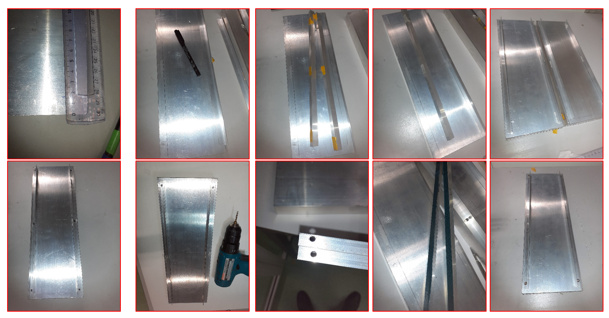

# Heatsink installation

Running high power LEDs requires a cooling system to dissipate the heat produced inside the LEDs. In our setup cooling is already achieved by mounting the LED directly to a finned [aluminum heat sink](https://www.digikey.be/en/products/detail/wakefield-vette/125404/9957688) with a running air flow to extract the heat from the heatsink enclosure.

Although Rebel LEDs are rated to operate as high as 1000mA, we limited our LED drives current to 350-mA for long life, wavelength stability and most importantly low heat generation produced inside the LED. During the experiment while turning the high-power LEDs on, the temperature inside the recording chamber has no significant differences above ambient temperature.

**Selecting the heatsink**

The area that the heatsink is fixed determines its width and length. We order an extruded aluminum heatsink from Digikey ([345-1936-ND](https://www.digikey.be/product-detail/en/wakefield-vette/125404/345-1936-ND/9957688)) with a width of 136.53mm and a length of 914.40mm. Luckily the width of the heatsink is perfectly match the width of the recessed area on the setup. After getting the heatsink, we further fabricate it to fit on its place in the setup. The fabrication includes cutting (sawing), chamfering and drilling.Below you can find a guide steps how to prepare the heatsink. Note that some adjustments and drilling might be necessary during the installation process.

 

**Cut to a specified length**

 

As mentioned above the total length of the heatsink is about 914mm. So, we cut it to two pieces with400mm each. We got help from the technical logistic services of the CBD to perform the cutting step. 

**Procedures:**

1. Using a tape measure to mark a line at 400mmfrom each side of the aluminum heatsink to. 
2. Cut all the way through the board following the lines. A disk saw with carbide tip blade and oil should cut easily through this aluminum heatsink. 
3. Trim and file the rough edges of each aluminum heatsink using proper file set (Conrad, [829638](https://www.conrad.be/nl/p/c-k-t0124p-naaldvijlenset-6-delig-140-mm-1-stuk-s-829638.html?searchType=SearchRedirect) , [406897](https://www.conrad.be/nl/p/bernstein-5-240-set-sleutelvijlen-met-houten-heft-in-etui-6-dlg-100-mm-1-stuk-s-406897.html?searchType=SearchRedirect); Amazon.de, [B012DDEK16](https://www.amazon.de/Draper-68904-68904-Redline-Feilen-Set-16-teilig/dp/B012DDEK16). Keep the cut center part of the aluminum heatsink to be used in other application. 

**Mount angel profile aluminum on each side of the aluminum heatsink**

Additionally, we mounted an angle profile aluminum (Amazon.nl, ‎[470302.0  alu -1000x15x10](https://www.amazon.nl/-/en/gp/product/B00ZXPLX3K/))  at each side of the heat sink to organize the wiring cables outside of the LEDs matrix area and to add extra extrusion to hold the 3D printed light box. If necessary, an extra LED stripe can be added on this aluminum heatsink.

**Procedures:**

1. Using a hacksaw (Conrad, [840390](https://www.conrad.be/nl/search.html?search=840390); RS Components, [734-393](https://nl.rs-online.com/web/p/hand-saws/0734393); Blades [185-3710](https://nl.rs-online.com/web/p/hand-saw-blades/1853710)) to cut 4 pieces of about 380mm length of the angle profile aluminum. This is so easy to cut by yourself. 
2. Trim the rough edges of each side.
3. Mark a line at each side of the heatsink (about 15mm from the edges,to provide a space for LED wiring connections) 
4. Add small pieces of adhesive double-sided tape (RS, [273-598](https://benl.rs-online.com/web/p/double-sided-tapes/0273598)) on the 10mm side of the aluminum profile.  Then simply peel off the tape backing and attach the angel profile to the heatsink in the marked area
5. Mark three dots along the angle profile aluminum to be used as guidesto create holes for screw fixation
6. With a 3mm or smaller drill bit (Amazon.nl,  [DT40283-GER](https://www.amazon.nl/-/en/dp/B08F7L4RWB), make a hole on each dot. 
7. With a M4 drill tap bit (Amazon.nl,[B086C2PGR9](https://www.amazon.nl/dp/B086C2PGR9/)), and using the 3mm hole as a guide, make threaded holes to fit the screw size (RS, [521-541](https://benl.rs-online.com/web/p/self-tapping-screws/0521541/)).
8. Removethe angle profile and with a larger drill bit (e.g., 5mm) make the holes bigenough to insert the screw.
9. ​
10. You might want to clean the surface of the heatsink and aluminumprofile from any remaining residue or dust with some ethanol and air pressure(e.g., dust off  Rs Component, [169-9912](https://benl.rs-online.com/web/p/air-dusters/1699912/) or Conrad, [827802](https://www.conrad.be/nl/search.html?search=827802)).
11. To attach the angle profilepermanently and efficiently to the heatsink you might need to add extra thermaltape plus the screw fixation.
12. Remove the film from one side of the thermal tape (Thorlabs,[TCDT1](https://www.thorlabs.de/thorproduct.cfm?partnumber=TCDT1)) to expose the adhesive part of this side and place the thermal tape on the 10mm-wide area 
13. Remove the remaining top film from the thermal tape and then mount the angel profile onto the top of the heatsink to be assembled, use the hole and the line as guide. Trim the edges of the adhesive double-sided tape. 
14. Once you place the angel profile, Insert self-tapping screw (No. 4 x 9.5mm Long, RS Components, [521-541](https://benl.rs-online.com/web/p/self-tapping-screws/0521541/)) into the three threaded holes of each side. Tighten all screws down with the Pozidriv screw driver bit (RS Components, [668-5723](https://benl.rs-online.com/web/p/screwdriver-bit-sets/6685727); amazon.de, [B01M7PPJI7](https://www.amazon.co.uk/Precision-Screwdriver-Magnetic-Macbook-Electronics/dp/B01M7PPJI7)).

**Drilling side holes  for LED wiring connections**

The aim of the above angle aluminum profile  fixation is to provide an organized space for the LED wiring connections at each side of the heatsinks. We kept about 15-mm wide area on each side of the heat sink to collect all of the cables. The cable then connected to each LED string by inserting the wires through a series of hole along the aluminum profile.

**To create holes on the side of the aluminum profile:**

1. Mark 40 dots or more (about 8-10 mm apart) along the bottom part of the vertical wall of the angle profile aluminum to be used as guides to create holes for screw fixation
2. With a 1.5mm drill bit (Amazon.nl,  [DT40283-GER](https://www.amazon.nl/-/en/dp/B08F7L4RWB), make a hole on each dot. 
3. You might want to clean the surface of the heatsink and aluminum profile from any remaining residue or dust with some ethanol and air pressure(e.g., dust off  RS, [169-9912](https://benl.rs-online.com/web/p/air-dusters/1699912/) or Conrad, [827802](https://www.conrad.be/nl/search.html?search=827802)).

 **Heatsink mounting base**

The heatsink is mounted on the top of basement box of the setup **(See: Tubing& Wiring Box assembly) **by two mounting brackets for each side.

**For this step you will need:**

Fabricated heatsink
Four 3D-printed heatsink mounting brackets (heatsink connectors).
M2self-tapping screws (Amazon, [B07RYLM9N2](https://www.amazon.nl/-/en/dp/B07RYLM9N2)).
Screwdriver Set (RS Components, [668-5723](https://benl.rs-online.com/web/p/screwdriver-bit-sets/6685727); Amazon, [B01M7PPJI7](https://www.amazon.co.uk/Precision-Screwdriver-Magnetic-Macbook-Electronics/dp/B01M7PPJI7)).

**Procedures**

1. Flip the Heat sink upside down to face the extruded aluminum walls.
2. Attach two mounting brackets to the heatsink about 65mm away from both ends. Note that each bracket has a rail slot in each side to be mated with the extruded outside aluminum wall profile
3. Once you mounted the brackets, move the heatsink to the top of the basement box of the setup. 
4. Adjustthe mounting brackets to align and match the holes of the brackets and thebase.
5. Remove the heatsink for now away from the top of basement box.  
6. Mark the boarders of each side of the brackets on the outside wall of the heatsink to facilitate finding the same area after drilling.
7. Using 2mm drill bit, initially mark the positions of the fixation holes on the heatsink outer profile. Then remove the heatsink mounting brackets to avoid damage during drilling
8. Drill through the pre-marked holes in the outside aluminum wall profile. Drill only into the first layer of the aluminum profile. 
9. Return the mounting brackets into their recessed place. Find the drilled holes. and insert  M2 x 8mm screws (Amazon.nl,[B07RYLM9N2](https://www.amazon.nl/-/en/dp/B07RYLM9N2)) to secure the heatsink to the mounting brackets to the outside extruded aluminum profiles.
10. Now the heatsink is ready and can be screwed later to the setup basement after lighting and wiring installation.

**Drilling holes on the top mount of heatsink for light box fixation**

The IR optogenetic panels are then covered by a 3D-printed box (light box). The middle part of this box contains a rail to slot IR filter separator to divide the LEDs beneath each chamber into right and left side. The mid-rail must be fixed very well to the midline of the heatsink to prevent any light leak through the wo sides. 

You need the following

- Fabricated heatsink

- Four 3D-printed light box mounting brackets

- M2 self-tapping screws with countersunk head (Amazon, [B07RYLM9N2](https://www.amazon.nl/-/en/dp/B07RYLM9N2))

- M1.6x 6 mm screws (RS , [179-5667](https://benl.rs-online.com/web/p/machine-screws/1795667)).

- Screwdriver set (RS , [668-5723](https://benl.rs-online.com/web/p/screwdriver-bit-sets/6685727); Amazon, [B01M7PPJI7](https://www.amazon.co.uk/Precision-Screwdriver-Magnetic-Macbook-Electronics/dp/B01M7PPJI7)).

  ​       

1. Once you assembled the 3D-printed light box (See: **Light Box Assembly**)and heatsink mounting brackets, insert the 3D-printed U-shaped mounting brackets from the bottom side of the heatsink
2. Place the light box over the two top holes and allow it to slide down. 
3. Fix the light box onto the mounting brackets using the M2 x 8mm screws. Note that to move the box to the end of  each side of the heatsink 
4. The above step is necessary to fix the light box chamber correctly on the heatsink to allow marking and drilling the middle rail of the light box on the precise position. So, it is necessary to tighten all four screws securely against the mounting brackets of the light box and heatsink. 
5. Drill holes into heatsink through middle rail channel holes using a 1.5mm drill bit. Do not drill all the way through the heatsink. only enough to insert the screws. Keep the channel straight. It is useful to ruler or metal flat bar (RS, [681-104](https://benl.rs-online.com/web/p/metal-bars-metal-rods/0681104/)) to ensure that the channel in straight position
6. After each hole drilling, insert a M1.6 x 6 mm screw (RS, [179-5667](https://benl.rs-online.com/web/p/machine-screws/1795667)) to fix the frame to the heatsink while drilling the other holes to avoid drifting or misalign.
7. After drilling all holes and securely tighten the middle screws, the light box should be removed for giving the space to install the lighting components on the top mount of the heatsink. Remove the screws securing the lightbox to the heatsink and retain the screw for future use when all the IR and optogenetic LED panel installed. 

