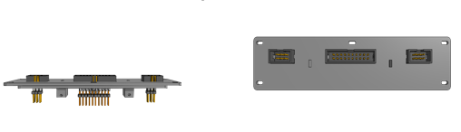
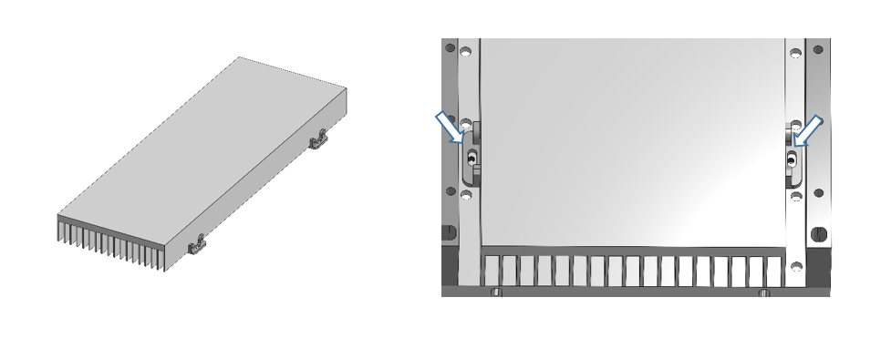

# **IDOC 3D-Parts_ Assembly:**

The IDOC setup consists of multiple 3D printed parts. The dimension of the setup is400x350 mm (L x W). Due to its relatively large size that cannot fit into the build volume of our 3D printers, components have been split into smaller parts to be printed part by part. Printed parts have been assembled with screws, fastened mate and plastic adhesive glue. Cyanoacrylate, or superglue (RS Components, [133-0093](https://benl.rs-online.com/web/p/glues/1330093/)), is the best option for gluing 3D printed parts together.  Overall, 3D printing is performed in three steps. The first step involves designing and modeling using Onshape cloud-based CAD package. Then, object models can be saved as a stereolithography (STL). The second step involves building the parts with a 3D printer. While the last step consists of assembling, finishing, and testing.

Using the 3D printing can be a cost-effective and efficient way to build the IDOC system, as it eliminates the need for custom machining or purchasing expensive components. However, it requires access to a 3D printer and a moderate level of technical expertise to assemble the parts and construct the system to
perform olfactory, optogenetic, and thermogenetic experiments on Drosophila.

Here we provide step-by-step instructions on how to print, build and assemble the parts of the IDOC setup as well as tips & tricks!

## **Files to prints** 

The 3D printed parts are available for download on Onshape website and from IDOC GitHub page, and can be printed using a 3D printer with a suitable material (see below).

(Onshape)

[List of files](../src/3D_printed_parts/IDOC_setup/)

Custom components were 3D printed in-house. We have one Ultimaker 2+ and one Ultimaker S3 in the lab. The listed 3D items should be printed in very solid and tough materials for better deals with light, heat, air pressure, and odors. The suggested materials will achieve best surface quality with increased mechanical and thermal performance without having brittle failure overtime. 

## **Materials needed**

| **Part Name**                      | **Color**                               | **Vendor/Link**                          | **Notes**                                |
| ---------------------------------- | --------------------------------------- | ---------------------------------------- | ---------------------------------------- |
| Ultimaker CPE (co-polyester)       | Black                                   | RS Components,  Black [134-8174](https://benl.rs-online.com/web/p/3d-printing-materials/1348174) | [How to print CPE](https://support.ultimaker.com/hc/en-us/articles/360012051939-How-to-print-with-Ultimaker-CPE) |
| Ultimaker  CPE+ (co-polyester)     | Black  & White                          | Black; RS Components, [159-6348](https://benl.rs-online.com/web/p/3d-printing-materials/1596348);  White RS Components, [159-6350](https://benl.rs-online.com/web/p/3d-printing-materials/1596350) | [How to print CPE+](https://support.ultimaker.com/hc/en-us/articles/360011955120-How-to-print-with-Ultimaker-CPE-) |
| Ultimaker PC (polycarbonate)       | Transparent  & Black                    | Transparent, RS Components, [159-6352](https://benl.rs-online.com/web/p/3d-printing-materials/1596352/) ;  Black, RS Components, [159-6351](https://benl.rs-online.com/web/p/3d-printing-materials/1596351) | [How to print PC](https://support.ultimaker.com/hc/en-us/articles/360012055159-How-to-print-with-Ultimaker-PC ) |
| Ultimaker  PVA  polyvinyl alcohol) | Natural  water-soluble support material | PVA, RS Components,  [1348195](https://benl.rs-online.com/web/p/3d-printing-materials/1348195) | [How to print and dissolve PVA](https://support.ultimaker.com/hc/en-us/articles/360012055939-How-to-print-with-Ultimaker-PVA) |

Ultimaker CPE+ (co-polyester) is similar to Ultimaker CPE, but tougher and with higher temperature resistance. PC (polycarbonate) is one of the toughest print materials, making it a perfect choice for printing strong objects and high thermal resistance. CPE+ or PC, in particular, are suited to for lighting box, recording chamber due to its higher heat resistance.  We also used water-soluble support PVA material for large parts to keep high quality and smooth surfaces.

**Note:** We don’t recommend using PLA or Tough PLA filament. Items printed with PLA can lose their properties and may become brittle over time. In addition, both filaments may deform at temperatures above 50 °C.

**Note:**  Printing in PC can be challenging due to the high temperature required to print.

For further information, refer to the material data sheets for technical data and the [material guides](https://support.ultimaker.com/hc/en-us/categories/360002336619) for printing instructions.

## Assembly

- Check that all of the 3D-parts are printed by checking off the components on the “Files to print”. 

- Prior to assembly, examine all 3D-parts for damage, clean and smooth the edges and surfaces with file set File set (e.g., Conrad, [829638](https://www.conrad.be/nl/p/c-k-t0124p-naaldvijlenset-6-delig-140-mm-1-stuk-s-829638.html?searchType=SearchRedirect) , [406897](https://www.conrad.be/nl/p/bernstein-5-240-set-sleutelvijlen-met-houten-heft-in-etui-6-dlg-100-mm-1-stuk-s-406897.html?searchType=SearchRedirect), Amazon, [B012DDEK16](https://www.amazon.de/Draper-68904-68904-Redline-Feilen-Set-16-teilig/dp/B012DDEK16)) 
- If the part has a finishing defect, or has misshaped, please reprint it considering high quality printing according to the configuration file attached to each part.
- Driver Bit Set (RS Components, [668-5723](https://benl.rs-online.com/web/p/screwdriver-bit-sets/6685727); amazon.de, [B01M7PPJI7](https://www.amazon.co.uk/Precision-Screwdriver-Magnetic-Macbook-Electronics/dp/B01M7PPJI7)) &  M2 self-tapping screws with countersunk head (Amazon.nl, [B07RYLM9N2](https://www.amazon.nl/-/en/dp/B07RYLM9N2)) are necessary tools to fix the parts together
- This [file](/docs/IDOC_3D_Assemply_Parts.pdf) provide a step by step to assemble the different 3D printed parts.

### **Parts of the setup**

#### Tubing & wires box 

This box is necessary for housing the inflow manifold, the outflow vacuum/exhaust tubing, and the electric wire that is required to power the setup components. The bottom side of the box holdsthe rubber feet for the whole setup, while the top side of the box serve as abasement of the heatsink and lighting box. 

The box size is 400 mm x 350 mm. For 3D printability, we need to split this box to four parts of equal surface area (Lx W 200mm x175mm). Printed parts can be assembled with screws. No support is needed while printing this box. 

#### Powering platform

This parts is placed at the backside of the tubing & wiring box. This panel consists of [pin headers]() to hold [IDC cable]() to power the setup. IR-LED, Electric shocks, odor indicators, and vibration motors.

Mapping_of_ 20-way IDC_header box

|               **+**               |               **+**               |      **+**       |         **+**          |         **+**         |         **+**          |             **+**             |       **+**       |               **+**                |               **+**                |
| :-------------------------------: | :-------------------------------: | :--------------: | :--------------------: | :-------------------: | :--------------------: | :---------------------------: | :---------------: | :--------------------------------: | :--------------------------------: |
| **Odor B  Left IR-LED indicator** | **Odor A  Left IR-LED indicator** | **EShock  Left** | **IR  LED back light** | **Vibration  Motors** | **Tracking 3 objects** | **Low Voltage  ES Indicator** | **EShock  Right** | **Odor A  Right IR-LED indicator** | **Odor B  Right IR-LED indicator** |
|               **-**               |               **-**               |      **-**       |         **-**          |         **-**         |         **-**          |             **-**             |       **-**       |               **-**                |               **-**                |

#### Tubing collector

This part is placed at the the top part of the basement box. There is one hole for each tube coming from the main manifold inside the tubing box total 40 tubes.

#### **Heatsink Connectors**

Two mounting brackets at each side to fix the heatsink to the basement of the setup

**Light box**

This box is mounted on the top heatsink to cover the IR-LED backlighting and optogenetic LED panels. also it has a rail in the midline to slide an IR filter to separate the two half of chambers during optogenetic application

#### Chambers holder

the part is placed at the top of each light box. 10 recording chambers are mounted on top of each side 

.

* Make sure to remove any remaining material from **adhesion** of your 3D printed parts. **Smooth**

the edges of each part thoroughly. Hand file or sanding, for example, are a very good ways to smooth out any unevenness.

* Connect the front and back parts of each  side together via the fastened mate in each corner, then secure with screws following  this [illustration file](/docs/IDOC_3D_Assemply_Parts.pdf) . 

## Setup Basement and Cover 

Acrylic plastic glass sheet   (RS Components, [824-676](https://benl.rs-online.com/web/p/plastic-sheets/0824660)) was fabricated to cover the tubing-wiring box . To fabricate and prepare this sheet to be mounted on the setup base first you will need to cut it to the setup size. luckily the width of this sheet is exactly the same like the setup i.e., 400mm. However the length needed to be cut to 350mm instead of 500mm. we used table Jigsaw (Conrad, [818878](https://www.conrad.be/nl/p/dremel-ms20-1-5-tafeldecoupeerzaag-70-w-zaagblad-lengte-100-mm-818878.html?searchType=SearchRedirect)); saw blade set (Conrad, [819573- 8J](https://www.conrad.be/nl/p/universele-houtzaag-ms51-dremel-2615ms51ja-n-a-819573.html)) to cut. After cutting,  place it turn the box upside down and place the sheet. Mark the fixation holes. Drill the remarked area to create a holes for M3 screws. Then initially fix  the sheet to the box using 9 screws M3x12mm (Amazon, [B0963DYT9X](https://www.amazon.nl/-/en/dp/B0963DYT9X/)) 

 

To isolate the setup from vibration also we added an extra rubber feet (Anti Vibration Feet 22.4mm Natural Rubber (RS Components, [179-4808](https://benl.rs-online.com/web/p/anti-slip-pads/1794808/))) to the bottom of the setup. 

1. Turn the box upside down.
2. Remove the backing sheet from the rubber feet. 
3. Position the feet as desired, then press and hold for a few seconds until the adhesive has bonded. 
4. The setup may now be sitting on its rubber feet.

The base plate should be removed for further installation of tubing and electrical wires connections.  Remove the screws securing the acrylic plastic glass sheet to the box using a hexagon key.  Retain the screw for future use when all of the box components installed. 

