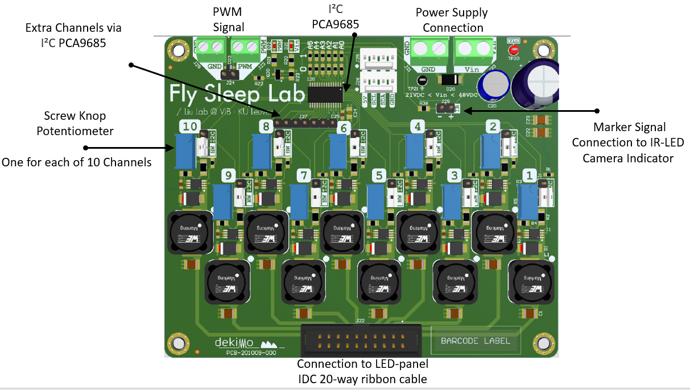
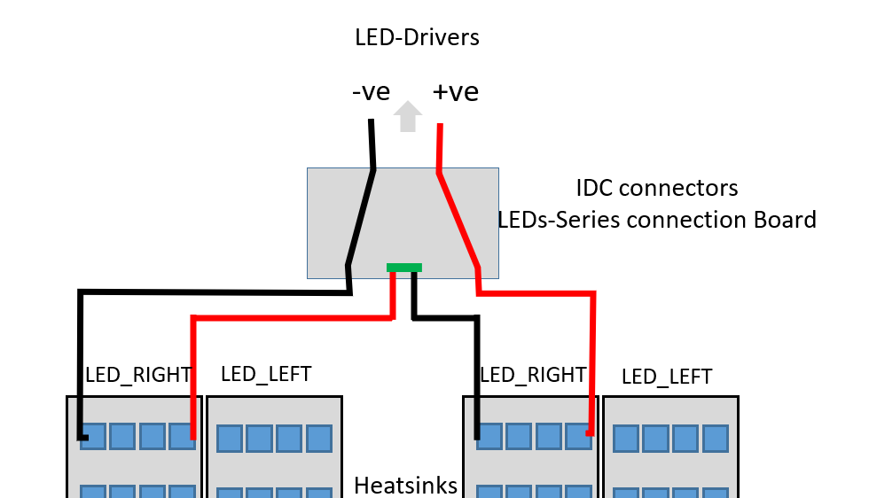
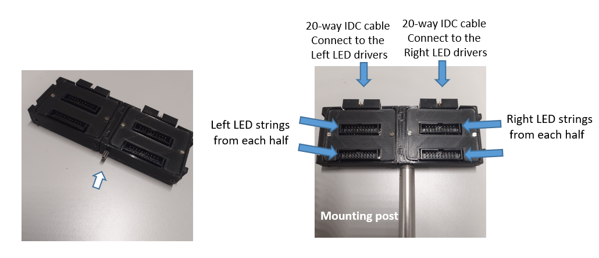
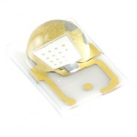
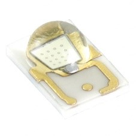
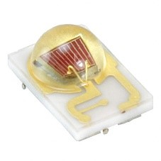

****

#   Optogenetic System

## **Introduction** 

The Optogenetics-LED module is specially designed to provide high power light to control neural activity, enabling study of *Drosophila* associated behaviors related to neuron networks. Optogenetic experiments carried out with freely moving fly inside a custom-made chamber.

When selecting an optogenetic light source, you need to consider two key factors: the required light wavelength and light intensity. The light intensity is dependent on the illuminated area the opsin channels you select at certain wavelengths of light. Therefore, we selected a power LEDs as a light source, which are so close to the peak wavelength to achieve optimal activation. For example, we used LED wavelengths close to 627nm for optogenetic activation of CsChrimson. We decide to use high power LEDs in our setup for many reasons: LEDs are low cost, long lifetime, stable, easy to mount,easily turned on and off with high frequencies and low operating temperature making them a great choice for any lab looking to perform optogenetic experiments. The setup has the capacity to use different wavelengths independently with modulation of the light intensity to stimulate different sets of neurons. 

****

**Here we explain all the key components necessary to build an optogenetics setup including power supply,  LED-drivers, high power LED-light sources, cooling system, control unit, and more. Components are custom-designed or sold separately from different seller, all of them are designed to work with each other.**

****

## **Set-up of the optogenetic device**

The following sketch shows the optogenetics system components: 

  

### A-    LED Drivers

| **Optogenetic  LED Driver_.01**          |
| ---------------------------------------- |
| **- [Design_Files_LED_Driver_.01](../src/Design_Files_LED_Driver_.01)** |
|                                          |
| **Prepared for the  laboratory of**      |
| **Sha Liu**                              |
| Principle Investigator                   |
| **Email:  [sha.liu@kuleuven.be](mailto:sha.liu@kuleuven.be)** |
| Laboratory of Sleep and Synaptic Plasticity |
| VIB-KU Leuven, Center for Brain and Disease Research, Herestraat 49 - Box 602 B-3000 Leuven - Belgium |
|                                          |
| **Contact Scientist**                    |
| **El-Sayed Baz**                         |
| Postdoctoral Scientist                   |
| **Emails: [elsayed.baz@kuleuven.be](mailto:elsayed.baz@kuleuven.be)      &   [e.baz@science.suez.edu.eg](mailto:e.baz@science.suez.edu.eg)** |
| Laboratory of Sleep and Synaptic Plasticity |
| VIB-KU Leuven, Center for Brain and Disease Research, Herestraat 49 - Box 602 B-3000 Leuven - Belgium |
|                                          |
| **Production & Engineer**                |
| **Wim Van Gool**                         |
| Electrical Engineer                      |
| **Email:  [Wim.VanGool@dekimo.com](mailto:Wim.VanGool@dekimo.com)** |
| Dekimo  Layers Leuven NV  Rijschoolstraat  11 - B-3000 Leuven - Belgium |

A custom-made LED drivers was used for controlling high power LEDs mounted below each recording chambers. The LED-drivers board is relatively small (9 x 11 cm), and contains 10 drivers  for individually adjust of the LED intensity to be the same across all recording chambers.  The LED current delivered to turn LEDs ON can be limited by means of a single turn control potentiometer knob at the top of each drivers to set the maximum current needed for each channel  to ensure that all led strings getting the same forward current.. A global pulse width modulation (PWM) signal then be used to control the LEDs current and the brightness of the LEDs via the software communication.  We also added a I²C  (the IC is an [PCA9685](https://www.nxp.com/docs/en/data-sheet/PCA9685.pdf) )) to PWM driver. This ship is the same as the one used in the Adafruit PCA9685 16-Channel Servo Driver ([Adafruit PCA9685 library](https://learn.adafruit.com/16-channel-pwm-servo-driver/using-the-adafruit-library)). This chip could allow us to calibrate the LEDs in software if someone later want this as on option (to expand the functionality of this board up to 16-Channel LED controller) this chip has a general PWM + an individual PWM for each output. So using the individual you can equalize the light output, and with the general PWM you can control the overall light output.

| **
** |
| ---------------------------------------- | ---------------------------------------- |
| the board footprint is 9 x 11 cm and contains 10 drivers or via PCA9685 16-Channels. | LED power can be adjusted using the potentiometer on front panel.  Each channel can be regulated independently *but* they all have the same PWM signal & Frequency to run. |

**Specifications**

| Board                                  | **- [LED_Driver_.01](../src/Design_Files_LED_Driver_.01)** |
| -------------------------------------- | ---------------------------------------- |
| **Digital modulation inputs**          | TTL, Arduino Mega                        |
| **Connector for TTL and Analog input** | Terminal block                           |
| **Analog input voltage range**         | 0-5 V                                    |
| **Input Voltage**                      | 21-45 V                                  |
| **LED Current Range**                  | Each channel tuned for 350 mA            |
| **Output channels**                    | 10 drivers & 16  via I²C  [PCA9685](https://www.nxp.com/docs/en/data-sheet/PCA9685.pdf) |
| **Modulation Form**                    | PWM , knob potentiometer                 |
| **Input  Forward Voltage**             | 21-48 VDC                                |
| **Software control**                   | Python Fermata , [Adafruit PCA9685 library](https://learn.adafruit.com/16-channel-pwm-servo-driver/using-the-adafruit-library) |
| **Light Source**                       | High Power LEDs                          |
| **Board dimensions**                   | 9 x 11 cm                                |

****

#### **Number of required boards**

At least 2 boards are needed to run the left and right side optogenetic panels independently. 5 boards would be perfectly  required to drive the complete setup in case you use Red, Green and Blue light. Having 5 identical boards with 10 channels each are cheaper and easier to produce than large board with all the drivers. 

#### **Output ports and pinouts** 

There are 10 output ports. Each port has 2 pins: V+, GND (-ve) . The LED drivers and optogenetic LED panels are connected via the ribbon cables with 20-way IDC connector, which is compatible with all LED assemblies in the system - see Section LED Connectors & IDC Cables. The figure below shows the pin-out of the male connector at the bottom of the driver board 

**
**

**
**

#### **LED-Driver enclosure & mounting**  

 We designed a 3D plastic enclosure [(Onshape)](https://cad.onshape.com/documents/7311a44d87579c0899650b4a/w/81c191560d810e89a94453ba/e/f0a8bf10642312bda53f0c61?renderMode=0&uiState=6244479bfbeafd34ddca1a1c) to hold and protect the board of the LED driver. at least two independently boards are required to drive both right and left LED panels at each half of the setup. So two enclosures are also needed to mount both boards.

**The front panel of Optogenetics-LED driver enclosure features:** 

- Power input sockets 
- Connector socket for PWM signal for control of LED power from Arduino & Computer, 
- Toggle switch PWM Input/External to enable LED (ON/OFF) by external 0-5 VDC signal

****

**The back panel of Optogenetics-LED unit features:** 

- Connector socket for external input (0-5V) for control of LED power ON/OFF manually. 
- Connector socket for Indicator IR LED during recording. 

****

**The top panel of Optogenetics-LED driver board features:** 

- Terminal screw for power input (Right) . 
- Terminal screws for PWM input (LEFT).
- 10 turn knop potentiometer for manual setup of output power.
- IR LED straight pin header, 2.54mm pitch, 20 way, 1 row, Marker signal.

**To assembly the LED-Board enclosure you will need the following :**

- 3D-printed boxes  LEFT , RIGHT 
- LED Driver PCB- [Driver-.01](../src/Design_Files_LED_Driver_.01)

- Black, Red Female Banana Socket - Solder Termination (RS Componentss, [888-4588](https://benl.rs-online.com/web/p/banana-connectors/8884588)) (Q:1 for each box)
- JST PH 2 pin cable male Header (Digi-Key, [1528-2617-ND](https://www.digikey.be/product-detail/en/adafruit-industries-llc/3814/1528-2617-ND/9380221)) (Q: 3 for each box)

- 2 different colors of hook up wire (about 15cm each color)
- Toggle Switch DPDT (Digi-Key, [EG2400-ND](https://www.digikey.be/product-detail/en/e-switch/100DP1T1B1M2QEH/EG2400-ND/378869)) (1 for each)

- Clear Plastic Sheet, 500mm x 400mm x 1.5mm (RS Componentss, [769-8724](https://benl.rs-online.com/web/p/plastic-sheets/7698724))

- Socket, Crimp, Wire-to-Board Crimp Housings (Farnell, [1593529](https://be.farnell.com/multicomp/2226tg/crimp-terminal-24-28awg/dp/1593529?ost=1593529))

- Connector Housing, 2 Ways, 2.54 mm (Farnell, [1593506](https://be.farnell.com/multicomp/2226a-02/crimp-housing-1-row-2-way/dp/1593506))
- M3 x 10mm Hex Socket Countersunk Screw Black, (RS Components, [281-394](https://benl.rs-online.com/web/p/socket-screws/0281394/))

You also need: 

- Screw Driver Bit Set (RS Components, [668-5723](https://benl.rs-online.com/web/p/screwdriver-bit-sets/6685727); amazon.de, [B01M7PPJI7](https://www.amazon.co.uk/Precision-Screwdriver-Magnetic-Macbook-Electronics/dp/B01M7PPJI7))

- Soldering Station (RS Components, [122-7917](https://benl.rs-online.com/web/p/soldering-stations/1227917); for Hot Air Amazon.de, [8786D](https://www.amazon.de/-/en/Soldering-Desoldering-Temperature-Adjustable-Conversion/dp/B08C51QRH5/))

- Lead Free Solder (RS Componentss, [756-8884](https://benl.rs-online.com/web/p/solder/7568884) ; [625-8233](https://benl.rs-online.com/web/p/solder/6258233))

- Crimping  tool, (Amazon.nl,[97 22 240 ](https://www.amazon.nl/KNIPEX-Krimptang-240-97-22/dp/B004LY28J2/))

- Side Cutters (Amazon.de, [M10997](https://www.amazon.nl/KNIPEX-Krimptang-240-97-22/dp/B004LY28J2/))

- Heat shrink tubing (amazon.de, [ET1002](https://www.amazon.de/Eventronic-ET1002-Schrumpfschlauch-Farben-560-tlg/dp/B071D7LJ31))

- Wire Stripper (RS Components, [613-044](https://benl.rs-online.com/web/p/wire-strippers/0613044/))

**Steps**

1. Connect the banana socket (RS, [888-4588](https://benl.rs-online.com/web/p/banana-connectors/8884588)) at the two holes named Vin in the front panel of the enclosure, solder two 10cm hook wires to the end of the socket, insulate both with a heat shrink tubing. the other opened end will be connected to the LED drivers board

2. Add one toggle switch DPDT at the right hole to switch between signal comes from Arduino PWM signal or an external source
3. Insert one JST PH 2 pin cable male Header into the PWM socket in the front of the box. 
4. With the use of a wire stripper, remove at least 1 cm casing to expose the cut wires and then add two pieces of heat shrink tubes on each wire.
5. Solder the end of the cable with male header to the pins of the  left side of the switch then solder the middle pins of the toggle switch to the pre-cut wires. The black and red wires should be at the same direction. This open ended wires will be connected to PWM connector screw terminal at the PCB.

6. Add a second JST PH 2 pin cable male header from the back panel into the left socket  named (external 0-5VDC), add heat shrink tubing,  then solder this wires ends to the right bins of the toggle switch. 

7. Add one last wire into the IR-LED socket, the other opened end should be then connected to crimp socket to be connected to the straight pins in the PCB named IR.

   ​

   

8. Place he LED driver board into the the center of the enclosure. Connect the power hook up wires to the left terminal blocks where the red socket must be connected to the positive while the black socket must be connected to the GND.
9. Then connect the middle wires of the toggle switch to the PWM screws terminal block . Where the red socket must connected to the PWM +ve while the black cable must connected to the GND.

10. Mount the board to the center of the enclosure with four M3 screws at each corner.

11. Repeat the above steps to install other boards

**Tip!** The inputs and outputs of the front and back panels are marked and engraved during 3D-printing.  For making it easy readable even with dim light just fill the engraved text with a white paste e g. Silicon Rubber (RS , [494-118](https://benl.rs-online.com/web/p/silicone-sealants/0494118/) ; Farnell, [2289630](https://be.farnell.com/dowsil-formerly-dow-corning/732-white-90ml/rtv-silicone-732-white-90ml/dp/2289630))

12.  To connect two assembled box-board  just slide both enclosures together and then screw them with 2 M3x10mm screws from the front and the back panel of the enclosure.

13. If you are going to use the same power supply you can connect both board  via bridge hook up wires through right screw terminal of each board. 

Initial operation & test  of LED Driver 

14. Connect the driver to the power supply. also the power supply can be connected directly via  terminal screws at the PCB. Attention Connect the LED driver to an already powered external power supply. Be sure that the input voltage corresponds to the input voltage range of the power LEDs.

15. Connect LED panel with 20-way ribbon cable to the socket of the LED driver. Do not operate the connector with excessive force. 

16. Connect an external 5VDC volt to the header from the back panel of the enclosure and PWM signal from the Arduino

**Note:** The LED (ON/OFF) is controlled by two means of signal: PWM or external mode. When operating in external mode, an external up to 5VDC signal start the LEDs of all channels at high brightness. This is ideal for checking the system. The LED current limit control potentiometer is placed on the front side of the driver. A screwdriver is necessary to adjust the LED current limit to 350mA.

17. Switch the toggle switch in the front panel to the external mode and then Increase the voltage from 0 to 5V and notice how the LED brightness increases accordingly. 
18. If a PWM signal is applied via Arduino, switch the toggle switch in the front panel to the PWM mode, then LED is modulated accordingly.
19. Your LED driver is now ready for use. 

**! important!** To avoid current unbalancing when connecting several LEDs in parallel and therefore having a different light intensity between different chambers, we connect two right LEDs and two Left LEDs panel from each side in series.

each panel is connected via 20-way IDC cable to the powering platform of the enclosure. from the outside back of the enclosure, the cables of the same side panel are then connected to a custom-made board in house. This board enable connecting each strings of each channel in series with the   

**
**

- PCB Prototype Board, Snappable Strip Board (Amazon.nl, [B081R45KN8](https://www.amazon.nl/-/en/dp/B081R45KN8) )
- Tinned-Copper Wire Breadboard Jumper Wire (RS Components,0.5mm [199-6217](https://benl.rs-online.com/web/p/breadboard-jumper-wire/1996217) ;0.8mm RS Componentss, [199-6231](https://benl.rs-online.com/web/p/breadboard-jumper-wires/1996228) ;1mm RS Componentss, [199-6228](https://benl.rs-online.com/web/p/breadboard-jumper-wires/1996231))
- Right Angle PCB Header, 2.54mm Pitch, 20 Way, 2 Row (RS Components, [832-3519](https://benl.rs-online.com/web/p/pcb-headers/8323519))
- Straight PCB Header, 2.54mm Pitch, 20 Way, 2 Row, Through Hole (RS Components, [832-3499](https://benl.rs-online.com/web/p/pcb-headers/8323499/))
- 3D-designed enclosure with cover.

you also need: 

- Soldering Station (RS Components, [122-7917](https://benl.rs-online.com/web/p/soldering-stations/1227917); for Hot Air Amazon.de, [8786D](https://www.amazon.de/-/en/Soldering-Desoldering-Temperature-Adjustable-Conversion/dp/B08C51QRH5/))

- Lead Free Solder (RS Componentss, [756-8884](https://benl.rs-online.com/web/p/solder/7568884) ; [625-8233](https://benl.rs-online.com/web/p/solder/6258233))

- Soldering Arm Stand (RS Components, [208-3892](https://benl.rs-online.com/web/p/soldering-accessories/2083892))

- Screw Driver Bit Set (RS Components, [668-5723](https://benl.rs-online.com/web/p/screwdriver-bit-sets/6685727); amazon.de, [B01M7PPJI7](https://www.amazon.co.uk/Precision-Screwdriver-Magnetic-Macbook-Electronics/dp/B01M7PPJI7))

**
**

**Procedures:** 

1. Using jumper wire to connect the +ve and -ve side of the 20-way PCB headers from each side

2. Connect and solder solder the two +ve side

3. ****connect and solder the 20-way PCB headers into the recessed place to establish the series connection.****

**
**

4. After  soldering, to avoid shortcuts, place the board into the 3D-printed box and screw it with 4 3Mx6mm screws. 
5. **Cover the box and screw it with 2 3Mx6mm screws**
6. Now the box is ready  

**
**

7- due to its small size, multiple boxes can be to combined together, to do that , simply connect two boxes through the male and female mate slide on the opposite directions.  

**Series-connection-LED-PCB-2Box**

**
**

8- Finally, insert a 4mm screw set to the wall of the one box and then connect an optical post in your desired length to be mounted in the back of the setup of the enclosure.

**
**

## B- Power supply

In addition to our customized LED driver, you will also need a DC power supply. The drivers are connected to the power suppply using high load power leads^ . It is necessary that the input DC voltage and current are more than the inputs required to run the LEDs. Use of LEDs with a lower or high forward current could result in damage to the LED. Power supply with an output voltage of 30V, and a current output of more than 7A would be ideal to run 20 series circuits of 4 square PCBs with each 1 LED at 0.35A e.g. (DC Laboratory Power Supply, 0-30V 0-10A DC Adjustable Switching (Banggood, [1121229](https://nl.banggood.com/LONG-WEI-LW-K3010D-110V-or-220V-30V-10A-Adjustable-Digital-DC-Power-Supply-Switching-Power-Supply-p-1121229.html); amazon.de, [KPS-3010D](https://www.amazon.de/-/en/Eventek-Laboratory-Adjustable-Stabilised-Digital/dp/B071HW378T/) ; [B085S34NNW](https://www.amazon.de/-/en/KAIWEETS-Laboratory-adjustable-DC0-10A-overload/dp/B085S34NNW/); [B07D358Q96](https://www.amazon.de/dp/B07D358Q96/)). One of the possible power supplies for the LED star drivers also would be the [LRS-350-36](https://www.digikey.be/en/products/detail/mean-well-usa-inc/LRS-350-36/7705032) from Meanwell to run  20 series circuits of 4 star PCBs with each 3 LEDs at 0.35A = 7A. for example using switching power supplies, the LED driver will output 0.35A at 12xVf (which could be as low as 30.6V or as high as 33.48V). 

^LED drivers and power supply are connected via 4 mm Test Lead Banana to Banana  (60" Digi-Key, [501-1791-ND](https://www.digikey.be/de/products/detail/pomona-electronics/2BA-60/736432); 48" Digi-Key, [501-1663-ND](https://www.digikey.be/de/products/detail/pomona-electronics/2BA-48/736431) ;24" [501-1696-ND](https://www.digikey.be/de/products/detail/pomona-electronics/2BA-24/736429)) (Digi-Key, 9.4" [BKCT2062-25-0-ND](https://www.digikey.be/de/products/detail/cal-test-electronics/CT2062-25-0/5398848); 24" [BKCT2062-50-0-ND](https://www.digikey.be/de/products/detail/cal-test-electronics/CT2062-50-0/5398854); 39.4" [BKCT2060-100-0-ND](https://www.digikey.be/de/products/detail/cal-test-electronics/CT2060-100-0/5398800); 59.1" [BKCT2062-150-0-ND](https://www.digikey.be/de/products/detail/cal-test-electronics/CT2062-150-0/5398836); [BKCT2062-25-2-ND](https://www.digikey.be/de/products/detail/cal-test-electronics/CT2062-25-2/5398849); 24" [BKCT2062-50-2-ND](https://www.digikey.be/de/products/detail/cal-test-electronics/CT2062-50-2/5398855); 39.4" [BKCT2062-100-2-ND](https://www.digikey.be/de/products/detail/cal-test-electronics/CT2062-100-2/5398831); 59.1" [BKCT2062-150-2-ND](https://www.digikey.be/de/products/detail/cal-test-electronics/CT2062-150-2/5398837)) the length of the cable depend on the distance between different deices. 

## C- Light Source (IR & Optogenetic LEDs panel stuffing and arrangements 

We designed and 3D printed plastic stencils to be fixed on the top surface of the heatsink to be used as a guide for stuffing the LEDs in the correct positions to provide homogenous illumination beneath each recording chamber.

** **

### Install the IR backlighting

For this step, you will need:

- 3D-designed part (Q:1x)

- 3D-designedpart (Q:1x)

- Soldering station ([Amazon](https://www.amazon.de/-/en/Soldering-Desoldering-Temperature-Adjustable-Conversion/dp/B08C51QRH5/ref=sr_1_17?keywords=alpha+metals+om338+pastel%C3%B6tmittel&qid=1639747374&sr=8-17) or[**122-7917**](https://benl.rs-online.com/web/p/soldering-stations/1227917)**, **RS components)

- Male jsc cable( , Digikey)

- 220-cm IR LEDStrips (XX, ledlightsworld) (Q:22x cut 10-cm each)

  ​

  **steps:**

  1. mount the plastic stencil  at the top surface of the heatsink. fix with at least two M1.6x6mm screw from the midline of the heatsink.
  2. Cut twenty-two pieces of 10-cm LED strips, eleven to be mounted on each heatsink.
  3. You might want to clean the surface of the heatsink from any remaining residue or dust with some ethanol and air pressure (e.g., dust off  RS , [169-9912](https://benl.rs-online.com/web/p/air-dusters/1699912/) or Conrad, [827802](https://www.conrad.be/nl/search.html?search=827802)).
  4. Peel off the tape backing of the strips back to expose the adhesive side 
  5. Place the IR-LED strip of tape at the top mount of the aluminum heatsink. 
  6. Make sure to press firmly on the IR-LED stripes to prevent it from peeling it off.
  7. Heat your soldering iron station to 350-400 degrees Celsius.
  8. Add a small part of soldering material to the surface the copper pads of the IR LED strips
  9. Wiring the IR-LED-stripes together by connecting the positive to the positive copper pads and the negative to the negative pads.
  10. Once you have attached the two wires, wait for at least 30 seconds for it to cool down.
  11. Use hot air gun to place a shrink tube over the exposed soldered part at the end of each LED stripes.
  12. At the end of the stripe connect a JST wire with female plug to be connected to the male JST power supply plug on the setup powering panel at the back side of the wiring box.

**Type of LEDs used for optogenetic application**

|                                          |      |          |                                          |                                          |
| ---------------------------------------- | ---- | -------- | ---------------------------------------- | ---------------------------------------- |
| LED LUXEON REBEL BLUE High-Power LED, 3-Pin SMD. | 200  | Digi-Key | [LXML-PB01-0040](https://www.digikey.be/nl/products/detail/lumileds/LXML-PB01-0040/3961252) |  |
| LED LUXEON REBEL GREEN High-Power LED, 3-Pin SMD. | 100  | Digi-Key | [LXML-PM01-0100](https://www.digikey.be/nl/products/detail/lumileds/LXML-PM01-0100/3961259) |  |
| LUXEON Rebel 627 nm Red High-Power LED, 3-Pin SMD package. | 200  | Digi-Key | [LXM2-PD01-0050](https://www.digikey.be/nl/products/detail/lumileds/LXM2-PD01-0050/3961247) |  |
|                                          |      |          |                                          |                                          |

**Number of LEDs and arrangements **

The number of LEDs depends on the required lightintensity that able to activate or inhibit selectpopulations of neurons. Another factor is thesize of the mounting and illuminated areas on the heatsink. Fortunately,above LED types are sold in any quantity. If you order for example 200 pieces,they will be in a single cut tape from the same bin.Alsoif you provide your vendor or supplier with your PO they might ensure that yourrepeat orders of LEDs are sent with the same [LED bin number](https://support.luxeonstar.com/hc/en-us/articles/360022625594-What-does-LED-binning-mean-) eachtime you order. 

Beneath eachhalf-chamber we can mount eight aluminum 10-mm square bases, four for RED colorLEDs and four for blue color LEDs. If you would like to use only one-color LED.Using two of 3-up starts LEDs will be the best option.  We already installed such system in one of oursetups. That can be driven by the same driver system.

**LED soldering and assembly:**

We  mounted our LEDs on Saber brand 10 mm Square Metal CorePrinted Circuit Board construction (MCPCB) Aluminum blank bases ([LXB-RS10A](https://www.luxeonstar.com/saber-10mm-square-blank-mcpcb-base-for-rebel-leds), Luxeonstar). Each base is designedto accommodate a single Luxeon Rebel LED.  

We decided toorder the power LEDs from Digikey and their MCPCB bases (Luexeonstar) to be assembled with standard handsoldering method using anappropriate lead-free solder paste with a hot air soldering iron or topsoldering hotplate and accordingto the [assembly procedures forLUXEON® Rebel LEDs.](https://lumstatic.com/En/0i/WQb7sgG5kseBR4dwjA.pdf)

Homemade solderingensures that all of LEDs with same specific flux, color, and forward voltage bins. In addition,you will not need to wait for fourto five weeks to have additional stock.

 

An extra reason tosolder the LEDs ourselves is that same order of multiple LEDs assembly of thesame type can have different binning across LED modules which can cause a variabilityin the power, wavelength, and the light intensity across the illuminated area.inaddition Most manufacture cannot provide LEDs assembly from same bin (read moreabout [LED-binning](https://support.luxeonstar.com/hc/en-us/articles/360022625594-What-does-LED-binning-mean-)) unless you order in reels, 1,000pieces increments . 

 

**LED assembly procedures**

1. Order the solder free paste, refrigerate it at 4-8°C.
2. At the date of the soldering allow the paste to reach the room temperature before heating up (~ i-2 hour).
3. Connect a dispensing blunt tip luer Lock needle to the luer taper of the solder syringe.
4. Cover of the three cupper pads onto the center  the aluminum board with solder paste, be consistent and do not add to much paste, only to achieve a solder joint thickness of approximately 50μm. 
5. Pickup a LED with the sides of the substrate and not on the lens.
6. Centerthe LEDs on the cupper pads on the soldering paste
7. Move the board onto the top warming plate that match the melting point of the solder paste. For information: The melting temperature for paste XXX is. Use a tweezer to pick up from the side of the aluminum board.
8. You can also fix the board onto soldering clampand use hot air iron to heat up the paste to reach its melting point
9. In all cases, wait few seconds until you see the solder paste melts forming the solder joints.
10. Maintain time and temperature below that woulddamage the LED to form a good solder joint. 
11. Once the board is heated to a peaktemperature and the melting point of the solder paste is reached, move theboard away from the warming area to cool down. It is recommended to move theboard onto a heatsink to cool down and allow the solder freezes fast andprevent damage the components or the board.
12. Test the LEDs using a proper current regulated power source or LED driver
13. Do not stare while operating LED. May be harmful to the eyes.

**LED Cooling and top mount of optogenetic LEDs panel**

Running high power LEDs requires a cooling system to dissipate the heat produced inside the LEDs. In our setup cooling is already achieved by mounting the LED directly to a finned [aluminum heat sink](https://www.digikey.be/en/products/detail/wakefield-vette/125404/9957688) with a running air flow to extract the heat from the heatsink enclosure.

**LED Assembly/ Soldering**

After soldering the LEDs  to MCPCB aluminum base. The assembly is  mounted directly to the heatsink using [double-sided thermal tape](https://www.luxeonstar.com/pre-cut-thermal-tape-for-10mm-square-bases-10pcs) without the need for screws or fasteners.

 **For stuffing the LEDs on the top of the heatsink:**

1. You might want to clean the surface of the heatsink from any remaining residue or dust with some ethanol and air pressure (e.g., dust off  RS , [169-9912](https://benl.rs-online.com/web/p/air-dusters/1699912/) or Conrad, [827802](https://www.conrad.be/nl/search.html?search=827802)).
2. Remove the film from one side of the thermal tape to exposethe adhesive part of this side
3. With a forceps, place the thermal tape on the square window and press it down a little to make sure it sticks to the heatsink.
4. When you have placed every thermal tape, you can unscrew and remove the LED-stuffing guide.
5. Mark each square as zigzag for blue LED (e.g., B) and red LEDs (e.g., R) to ensure that the LED boards attached to the correct arrangement. 
6. Remove the remaining top film from the thermal tape for red color LEDs.
7. Move the LED boards onto the top of the thermal tape andstuff LEDs as you see in the figure below to provide a space for wiringconnections.
8. Using the 3D-designed part, apply even pressure for at least 30 seconds to each single square LED assemblies, to fasten the assembly to the heatsink/thermal tape. Due to the small area of our LED array on the heat sink we could not use the free [assembly press tool](https://www.luxeonstar.com/assembly-press-single-z-leds) provided with the thermal tape  instead we designed, and 3D printed another assembly press tool to ensure an optimal thermal interface is created.
9. Repeat steps 6,7 and 8 for the blue color LEDs

**LED-interconnect and powering** 

Once every LEDs on the heatsink is mounted, you can inter wire the LEDs to form series circuit connections between strings of the same color.

1. cut about 250 pieces of about 2cm of wire cables (color red for red LED inter connection) while (color blue for blue LED interconnections).
2. With the use of a wire stripper, remove 0.5cm casing from each side. now only about 1cm of insulated wire with both open ended. 
3. Add a small part of soldering material to the surface the copper pads of each LED MCPCB

1. Wiring the LED-stripes together by connecting the positive to the negative copper pads of the LEDs of the same color.

2. Once you have attached all wires to all strings , insert the 40 powering cable from the holes of the aluminum angle profile and then solder the end of the cable with +ve and -ve of each LED string according to the following mapping and color of the wires.

   

   ​

#### **LED Power Connector** 

The LED drivers and optogenetic LED panels  are connected via the ribbon cables with20-way IDC connector, which is compatible with all LED assemblies in the system- see Section pinout of **LED Driver** , **Arduino control board**. You can go to he section (**Setup wiring & Optogenetic LEDs panel Connectors**) to know how to assemble  flat ribbon cables with an IDC connector.  

 