In this section, we provide a comprehensive list of all the commercial components and tools required for building the IDOC system. This list includes various commercial components and tools such as cables, connectors, power supplies, cameras, and other electronic equipment.

The list is organized by category, making it easy to find the specific component or tool needed for the IDOC system. The categories include:

- Enclosure & Mounting:  This section includes a list of all required components that contains a breadboard for mounting and connecting the  IDOC system inside the enclosure.
- Air delivery system components required for the IDOC system, such as pumps, tubing, connectors, flow meters, and  solenoid valves.
- Electrical Components: This section includes a list of all the commercial electrical components     required for the IDOC system, such as resistors, capacitors, and diodes.
- Cables and Connectors: This section includes a list of all the commercial cables and connectors     required for the IDOC system, such as USB cables, power cables, and data cables.
- Power Supplies: This section includes a list of all the commercial power supplies required for the IDOC system, such as AC/DC adapters and batteries.
- Cameras: This section includes a list of all the commercial cameras required for the IDOC system.
- Opto- and Thermo- equipment: This section includes a list of all the commercial equipment required for the IDOC system, such as high power LEDs, drivers and heaters.

Each category includes at least a suggested link to purchase them from various suppliers. This list is a valuable resource for anyone building the IDOC system, as it ensures that all required components and tools are available and easily accessible. A full list of materials for the parts materials may  be downloaded as a CSV file from [here]().

| **Article   Description**                | **Qty**     | **Supplier**                     | **Item # & link**                        | **Supplier   Image**                     |
| ---------------------------------------- | ----------- | -------------------------------- | ---------------------------------------- | ---------------------------------------- |
| **Enclosure & Mounting**                 |             |                                  |                                          |                                          |
| 25 mm Square Construction Rail, 500 mm  Long, M6 Taps (Thorlabs, [XE25L500/M](https://www.thorlabs.de/thorproduct.cfm?partnumber=XE25L500/M)) | 10          | Thorlabs                         | [XE25L500/M](https://www.thorlabs.de/thorproduct.cfm?partnumber=XE25L500/M) |  |
| 25 mm Square Construction Rail, 700 mm  Long, M6 Taps (Thorlabs,  [XE25L700/M](https://www.thorlabs.de/thorproduct.cfm?partnumber=XE25L700/M)) | 4           | Thorlabs                         | [XE25L700/M](https://www.thorlabs.de/thorproduct.cfm?partnumber=XE25L700/M) |  |
| Construction Cube with Slotted Corners,  Three 1/4" (M6) Counterbored Holes  Thorlabs, ([RM1S - 1](https://www.thorlabs.de/thorproduct.cfm?partnumber=RM1S#ad-image-0)) | 6           | Thorlabs                         | [RM1S - 1](https://www.thorlabs.de/thorproduct.cfm?partnumber=RM1S#ad-image-0) |  |
| Black Posterboard, 20" x 30" (508 mm x 762 mm),  1/16" (1.6 mm) Thick, 5 Sheets  (Thorlabs, [TB5](https://www.thorlabs.de/thorproduct.cfm?partnumber=TB5)) | 2           | Thorlabs                         | [TB5](https://www.thorlabs.de/thorproduct.cfm?partnumber=TB5) |  |
| Black Hardboard, custom size  (510 mm x 710 mm x 4.76 mm), 3 Sheets (Thorlabs, [TB4](https://www.thorlabs.de/thorproduct.cfm?partnumber=TB4) | 3           | Thorlabs                         | [TB4](https://www.thorlabs.de/thorproduct.cfm?partnumber=TB4) |  |
| Table Clamp for 25 mm Rails  (Thorlabs, [XE25CL2](https://www.thorlabs.de/thorproduct.cfm?partnumber=XE25CL2)) | 4           | Thorlabs                         | [XE25CL2](https://www.thorlabs.de/thorproduct.cfm?partnumber=XE25CL2) |  |
| Aluminum Breadboard, 600 mm x 600 mm x 12.7 mm, M6 Taps (Thorlabs, [MB6060/M](https://www.thorlabs.de/thorproduct.cfm?partnumber=MB6060/M)) | 1           | Thorlabs                         | [MB6060/M](https://www.thorlabs.de/thorproduct.cfm?partnumber=MB6060/M) |  |
| Aluminum Breadboard, 300 mm x 600 mm x 12.7 mm, M6 Taps (Thorlabs, [MB3060/M](https://www.thorlabs.de/thorproduct.cfm?partnumber=MB3060/M)) | 1           | Thorlabs                         | [MB3060/M](https://www.thorlabs.de/thorproduct.cfm?partnumber=MB3060/M) | 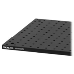 |
| Ø12.7 mm Optical Post, SS, M4 Setscrew, M6  Tap, L = 40 mm, 5 Pack (Thorlabs,  [TR40/M-P5](https://www.thorlabs.de/thorproduct.cfm?partnumber=TR40/M-P5)) | 2           | Thorlabs                         | [TR40/M-P5](https://www.thorlabs.de/thorproduct.cfm?partnumber=TR40/M-P5) |  |
| Ø12.7 mm Optical Post, SS, M4 Setscrew, M6  Tap, L = 50 mm, 5 Pack (Thorlabs,  [TR50/M-P5](https://www.thorlabs.de/thorproduct.cfm?partnumber=TR50/M-P5)) | 2           | Thorlabs                         | [TR50/M-P5](https://www.thorlabs.de/thorproduct.cfm?partnumber=TR50/M-P5) |  |
| Ø12.7 mm Optical Post, SS, M4 Setscrew, M6  Tap, L = 75 mm, 5 Pack (Thorlabs,  [TR75/M-P5](https://www.thorlabs.de/thorproduct.cfm?partnumber=TR75/M-P5)) | 2           | Thorlabs                         | [TR75/M-P5](https://www.thorlabs.de/thorproduct.cfm?partnumber=TR75/M-P5) |  |
| Ø12.7 mm Optical Post, SS, M4 Setscrew, M6  Tap, L = 100 mm, 5 Pack (Thorlabs,  [TR100/M-P5](https://www.thorlabs.de/thorproduct.cfm?partnumber=TR100/M-P5)) | 2           | Thorlabs                         | [TR100/M-P5](https://www.thorlabs.de/thorproduct.cfm?partnumber=TR100/M-P5) |  |
| Ø12.7 mm Optical Post, SS, M4 Setscrew, M6  Tap, L = 150 mm, 5 Pack (Thorlabs,  [TR150/M-P5](https://www.thorlabs.de/thorproduct.cfm?partnumber=TR150/M-P5)) | 2           | Thorlabs                         | [TR150/M-P5](https://www.thorlabs.de/thorproduct.cfm?partnumber=TR150/M-P5) |  |
| Ø12.7 mm Optical Post, SS, M4 Setscrew, M6  Tap, L = 200 mm (Thorlabs, [TR200/M](https://www.thorlabs.de/thorproduct.cfm?partnumber=TR200/M)) | 10          | Thorlabs                         | [TR200/M](https://www.thorlabs.de/thorproduct.cfm?partnumber=TR200/M) |  |
| Ø12.7 mm Optical Post, SS, M4 Setscrew, M6  Tap, L = 250 mm (Thorlabs, [TR250/M](https://www.thorlabs.de/thorproduct.cfm?partnumber=TR250/M)) | 10          | Thorlabs                         | [TR250/M](https://www.thorlabs.de/thorproduct.cfm?partnumber=TR250/M) |  |
| Ø12.7 mm Optical Post, SS, M4 Setscrew, M6  Tap, L = 300 mm (Thorlabs, [TR300/M](https://www.thorlabs.de/thorproduct.cfm?partnumber=TR300/M)) | 10          | Thorlabs                         | [TR300/M](https://www.thorlabs.de/thorproduct.cfm?partnumber=TR300/M) |  |
| Ø38.1 mm Sorbothane  Feet, Internal M6 Mounting Thread, 4 Pieces  (Thorlabs, [AV5/M](https://www.thorlabs.de/thorproduct.cfm?partnumber=AV5/M)) | 2           | Thorlabs                         | [AV5/M](https://www.thorlabs.de/thorproduct.cfm?partnumber=AV5/M) |  |
| Ø12.7 mm Post Holder, Spring-Loaded  Hex-Locking Thumbscrew, L=75 mm, 5 Pack  (Thorlabs, [PH75/M-P5](https://www.thorlabs.de/thorproduct.cfm?partnumber=PH75/M-P5#ad-image-0)) | 2           | Thorlabs                         | [PH75/M-P5](https://www.thorlabs.de/thorproduct.cfm?partnumber=PH75/M-P5#ad-image-0) |  |
| Ø12.7 mm Post Holder, Spring-Loaded  Hex-Locking Thumbscrew, L=40 mm, 5 Pack  (Thorlabs, [PH40/M-P5](https://www.thorlabs.de/thorproduct.cfm?partnumber=PH40/M-P5#ad-image-0)) | 2           | Thorlabs                         | [PH40/M-P5](https://www.thorlabs.de/thorproduct.cfm?partnumber=PH40/M-P5#ad-image-0) |  |
| Right-Angle Clamp for Ø1/2" Posts, 5 mm Hex, 5 Pack (Thorlabs, [RA90/M-P5](https://www.thorlabs.de/thorproduct.cfm?partnumber=RA90/M-P5)) | 2           | Thorlabs                         | [RA90/M-P5](https://www.thorlabs.de/thorproduct.cfm?partnumber=RA90/M-P5) |  |
| Right-Angle End Clamp for Ø1/2" Posts, M6 Stud and 5 mm  Hex, 5 Pack (Thorlabs, [RA180/M-P5](https://www.thorlabs.de/thorproduct.cfm?partnumber=RA180/M-P5)) | 1           | Thorlabs                         | [RA180/M-P5](https://www.thorlabs.de/thorproduct.cfm?partnumber=RA180/M-P5) | 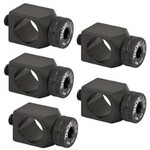 |
| Parallel Clamp for Ø1/2" Posts, M4 Counterbore and 5 mm  Hex (Thorlabs, [RA360/M](https://www.thorlabs.de/thorproduct.cfm?partnumber=RA360/M)) | 4           | Thorlabs                         | [RA360/M](https://www.thorlabs.de/thorproduct.cfm?partnumber=RA360/M) |  |
| Rotating Clamp for Ø1/2" Posts, 360° Continuously  Adjustable, 5 mm Hex (Thorlabs, [SWC/M](https://www.thorlabs.de/thorproduct.cfm?partnumber=SWC/M)) | 4           | Thorlabs                         | [SWC/M](https://www.thorlabs.de/thorproduct.cfm?partnumber=SWC/M) |  |
| Mounting Base, 25 mm x 75  mm x 10 mm, 5 Pack (Thorlabs, [BA1/M-P5](https://www.thorlabs.de/thorproduct.cfm?partnumber=BA1/M-P5)) | 1           | Thorlabs                         | [BA1/M-P5](https://www.thorlabs.de/thorproduct.cfm?partnumber=BA1/M-P5) | 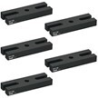 |
| BA1S/M-P5 - Mounting Base, 25 mm x 58 mm x 10 mm, 5 Pack (Thorlabs, [BA1S/M-P5](https://www.thorlabs.de/thorproduct.cfm?partnumber=BA1S/M-P5)) | 2           | Thorlabs                         | [BA1S/M-P5](https://www.thorlabs.de/thorproduct.cfm?partnumber=BA1S/M-P5) | 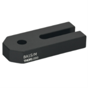 |
| - Mounting Base, 25 mm x 75 mm x 10 mm (Thorlabs, [BA1SL/M](https://www.thorlabs.de/thorproduct.cfm?partnumber=BA1SL/M#ad-image-0)) | 2           | Thorlabs                         | [BA1SL/M](https://www.thorlabs.de/thorproduct.cfm?partnumber=BA1SL/M#ad-image-0) |  |
| - Mounting Base, 25 mm x 115 mm x 10 mm (Thorlabs, [BA1L/M](https://www.thorlabs.de/thorproduct.cfm?partnumber=BA1L/M#ad-image-0)) | 2           | Thorlabs                         | [BA1L/M](https://www.thorlabs.de/thorproduct.cfm?partnumber=BA1L/M#ad-image-0) | 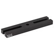 |
|                                          |             |                                  |                                          |                                          |
| **Screws & Fixation**                    |             |                                  |                                          |                                          |
| Low-Profile T-Nut, M6 x 1.0 Tapped Hole  (Thorlabs,  [XE25T3/M](https://www.thorlabs.de/thorproduct.cfm?partnumber=XE25T3/M)) | 4           | Thorlabs                         | [XE25T3/M](https://www.thorlabs.de/thorproduct.cfm?partnumber=XE25T3/M) |  |
| M6 x 1.0 Low-Profile Channel Screw, 10 mm Long, 100 Pack (Thorlabs, [SH6M10LP](https://www.thorlabs.de/thorproduct.cfm?partnumber=SH6M10LP)) | 1           | Thorlabs                         | [SH6M10LP](https://www.thorlabs.de/thorproduct.cfm?partnumber=SH6M10LP) |  |
| M4 x 0.7 Stainless Steel Cap Screw, 10 mm Long, 50 Pack (Thorlabs, [SH4MS10](https://www.thorlabs.de/thorproduct.cfm?partnumber=SH4MS10)) | 1           | Thorlabs                         | [SH4MS10](https://www.thorlabs.de/thorproduct.cfm?partnumber=SH4MS10) |  |
| M6 x 1.0 Stainless Steel Cap Screw, 10 mm Long, 25 Pack (Thorlabs, [SH6MS10](https://www.thorlabs.de/thorproduct.cfm?partnumber=SH6MS10)) | 1           | Thorlabs                         | [SH6MS10](https://www.thorlabs.de/thorproduct.cfm?partnumber=SH6MS10) |  |
| M6 x 1.0 Stainless Steel Cap Screw, 12 mm Long, 25 Pack (Thorlabs, [SH6MS12](https://www.thorlabs.de/thorproduct.cfm?partnumber=SH6MS12)) | 1           | Thorlabs                         | [SH6MS12](https://www.thorlabs.de/thorproduct.cfm?partnumber=SH6MS12) |  |
| M6 x 1.0 Stainless Steel Cap Screw, 16 mm Long, 25 Pack (Thorlabs, [SH6MS16](https://www.thorlabs.de/thorproduct.cfm?partnumber=SH6MS16)) | 1           | Thorlabs                         | [SH6MS16](https://www.thorlabs.de/thorproduct.cfm?partnumber=SH6MS16) |  |
| M6 x 1.0 Stainless Steel Cap Screw, 20 mm Long, 25 Pack (Thorlabs, [SH6MS20](https://www.thorlabs.de/thorproduct.cfm?partnumber=SH6MS20)) | 1           | Thorlabs                         | [SH6MS20](https://www.thorlabs.de/thorproduct.cfm?partnumber=SH6MS20) |  |
| M6 x 1.0 Stainless Steel Setscrew, 6 mm Long, 25 Pack (Thorlabs, [SS6MS6](https://www.thorlabs.de/thorproduct.cfm?partnumber=SS6MS6)) | 1           | Thorlabs                         | [SS6MS6](https://www.thorlabs.de/thorproduct.cfm?partnumber=SS6MS6) |  |
| M6 x 1.0 Stainless Steel Setscrew, 10 mm Long, 25 Pack (Thorlabs, [SS6MS10](https://www.thorlabs.de/thorproduct.cfm?partnumber=SS6MS10)) | 1           | Thorlabs                         | [SS6MS10](https://www.thorlabs.de/thorproduct.cfm?partnumber=SS6MS10) |  |
| M6 x 1.0 Stainless Steel Setscrew, 12 mm Long, 25 Pack (Thorlabs, [SS6MS12](https://www.thorlabs.de/thorproduct.cfm?partnumber=SS6MS12)) | 1           | Thorlabs                         | [SS6MS12](https://www.thorlabs.de/thorproduct.cfm?partnumber=SS6MS12) |  |
| M6 x 1.0 Stainless Steel Setscrew, 16 mm Long, 25 Pack (Thorlabs, [SS6MS16](https://www.thorlabs.de/thorproduct.cfm?partnumber=SS6MS16)) | 1           | Thorlabs                         | [SS6MS16](https://www.thorlabs.de/thorproduct.cfm?partnumber=SS6MS16) |  |
| M6 x 1.0 Stainless Steel Setscrew, 20 mm Long, 25 Pack (Thorlabs, [SS6MS20](https://www.thorlabs.de/thorproduct.cfm?partnumber=SS6MS20)) | 1           | Thorlabs                         | [SS6MS20](https://www.thorlabs.de/thorproduct.cfm?partnumber=SS6MS20) |  |
| M2 self-tapping screws   with countersunk head (Amazon.nl,    [B07RYLM9N2](https://www.amazon.nl/-/en/dp/B07RYLM9N2)) | 1           | Amazon.nl                        | [B07RYLM9N2](https://www.amazon.nl/-/en/dp/B07RYLM9N2) |  |
| M2 M3 Hexagonal Socket   Flat Head Screw (Amazon.nl,   [B0963DYT9X](https://www.amazon.nl/-/en/dp/B0963DYT9X/)) | 1           | Amazon.nl                        | [B0963DYT9X](https://www.amazon.nl/-/en/dp/B0963DYT9X/) | 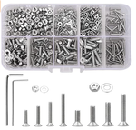 |
| Chipboard Screw  (amazon.de,   [B00B22VFM2](https://www.amazon.de/-/en/Connex-Assortment-Box-Pre-sorted-Ironmongery/dp/B00B22VFM2/)) | 1           | amazon.de                        | [B00B22VFM2](https://www.amazon.de/-/en/Connex-Assortment-Box-Pre-sorted-Ironmongery/dp/B00B22VFM2/) |  |
| M3 x 12mm Hex Socket  Countersunk Stainless Steel Plain Socket Screw (RS Components, [232-8372](https://benl.rs-online.com/web/p/socket-screws/2328372/)) | 2pkg        | RS Components                    | [232-8372](https://benl.rs-online.com/web/p/socket-screws/2328372/) |  |
| M2 x 6mm Nickel Plated  Brass Flat Head Machine Screws (RS Components, [482-7685](https://benl.rs-online.com/web/p/machine-screws/4827685)) | 2pkg        | RS Components                    | [482-7685](https://benl.rs-online.com/web/p/machine-screws/4827685) |  |
| Plain Stainless Steel Self   Tapping Screw No. 4 x 9.5mm Long (RS Components, [521-541](https://benl.rs-online.com/web/p/self-tapping-screws/0521541/)) | 2pkg        | RS Components                    | [521-541](https://benl.rs-online.com/web/p/self-tapping-screws/0521541/) |  |
| M2x10 Pozi Csk Machine   Screw (RS Components, [179-5670](https://benl.rs-online.com/web/p/machine-screws/1795670/)) | 2pkg        | RS Components                    | [179-5670](https://benl.rs-online.com/web/p/machine-screws/1795670/) |  |
| M3 x 10mm Hex Socket Countersunk   Screw Black, (RS Components, [281-394](https://benl.rs-online.com/web/p/socket-screws/0281394/)) | 2pkg        | RS Components                    | [281-394](https://benl.rs-online.com/web/p/socket-screws/0281394/) |  |
| M2, 12mm Screw Brass   Nickel Plated, (RS Components, [482-9114](https://benl.rs-online.com/web/p/machine-screws/4829114)) | 5pkg        | RS Components                    | [482-9114](https://benl.rs-online.com/web/p/machine-screws/4829114) |  |
| M2 Stainless Steel, Hex   Nut (RS Components, [248-4551](https://benl.rs-online.com/web/p/hex-nuts/2484551/)) | 5pkg        | RS Components                    | [248-4551](https://benl.rs-online.com/web/p/hex-nuts/2484551/) |  |
| M3 Bright Zinc Plated Steel  Hex Nut (RS Componentss, [560-293](https://benl.rs-online.com/web/p/hex-nuts/0560293)) | 2pkg        | RS Componentss                   | [560-293](https://benl.rs-online.com/web/p/hex-nuts/0560293) |  |
| M2 x 6mm Pozidriv   Countersunk Stainless Steel, Machine Screw (RS Components, [914-1753](https://benl.rs-online.com/web/p/machine-screws/9141753)) | 2pkg        | RS Components                    | [914-1753](https://benl.rs-online.com/web/p/machine-screws/9141753) |  |
| M1.6 x 6 mm Pozi Csk   Machine Screw (RS Components, [179-5667](https://benl.rs-online.com/web/p/machine-screws/1795667)) | 1pkg        | RS Components                    | [179-5667](https://benl.rs-online.com/web/p/machine-screws/1795667) |  |
| M2 x 8mm Screw Stainless   Steel (RS Components, [914-1762](https://benl.rs-online.com/web/p/machine-screws/9141762/)) | 1pkg        | RS Components                    | [914-1762](https://benl.rs-online.com/web/p/machine-screws/9141762/) |  |
|                                          |             |                                  |                                          |                                          |
| **Workshop Tools and Equipment**         |             |                                  |                                          |                                          |
| File set (Conrad,   [829638](https://www.conrad.be/nl/p/c-k-t0124p-naaldvijlenset-6-delig-140-mm-1-stuk-s-829638.html?searchType=SearchRedirect) , [406897](https://www.conrad.be/nl/p/bernstein-5-240-set-sleutelvijlen-met-houten-heft-in-etui-6-dlg-100-mm-1-stuk-s-406897.html?searchType=SearchRedirect) ;  Amazon.de, [B012DDEK16](https://www.amazon.de/Draper-68904-68904-Redline-Feilen-Set-16-teilig/dp/B012DDEK16) | 1           | Conrad                           | [406897](https://www.conrad.be/nl/p/bernstein-5-240-set-sleutelvijlen-met-houten-heft-in-etui-6-dlg-100-mm-1-stuk-s-406897.html?searchType=SearchRedirect) [B012DDEK16](https://www.amazon.de/Draper-68904-68904-Redline-Feilen-Set-16-teilig/dp/B012DDEK16) |  |
| Mini Drill                               | 1           | Conrad                           | [VTHD05](https://www.conrad.be/nl/p/multifunctioneel-gereedschap-162-delen-velleman-vthd05-135-w-85101.html?searchType=SearchRedirect) | 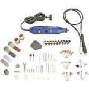 |
| Table Jigsaw (Conrad,   [818878](https://www.conrad.be/nl/p/dremel-ms20-1-5-tafeldecoupeerzaag-70-w-zaagblad-lengte-100-mm-818878.html?searchType=SearchRedirect));  Saw Blade Set (Conrad, [819573- 8J](https://www.conrad.be/nl/p/universele-houtzaag-ms51-dremel-2615ms51ja-n-a-819573.html)) | 1           | Conrad                           | [818878](https://www.conrad.be/nl/p/dremel-ms20-1-5-tafeldecoupeerzaag-70-w-zaagblad-lengte-100-mm-818878.html?searchType=SearchRedirect) | 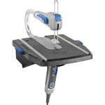 |
| Glue gun (Conrad, [826290](https://www.conrad.be/nl/p/steinel-gluematic-3002-set-lijmpistool-826290.html)) | 1           | conrad                           | [826290](https://www.conrad.be/nl/p/steinel-gluematic-3002-set-lijmpistool-826290.html) |  |
| Lead wires holder   (Digi-Key, [501-1113-ND](https://www.digikey.be/nl/products/detail/pomona-electronics/4408-POM/604309); [501-1053-ND](https://www.digikey.be/nl/products/detail/pomona-electronics/1508-POM/603361)) | 2           | Digi-Key                         | [501-1113-ND](https://www.digikey.be/nl/products/detail/pomona-electronics/4408-POM/604309) |  |
| cSafety Glasses (RS  Components, [740-1453](https://benl.rs-online.com/web/p/safety-glasses/7401453/); [278-020](https://benl.rs-online.com/web/p/safety-glasses/0278020/) ) | 1           | RS Components                    | [740-1453](https://benl.rs-online.com/web/p/safety-glasses/7401453/) |  |
| Vice (RS Components, [667-7189](https://benl.rs-online.com/web/p/products/6677189/)) | 1           | RS Components                    | [667-7189](https://benl.rs-online.com/web/p/products/6677189/) |  |
| Wire cutters (RS   Components, [864-0772](https://benl.rs-online.com/web/p/cutters/8640772/)) | 1           | RS Components                    | [864-0772](https://benl.rs-online.com/web/p/cutters/8640772/) |  |
| Wire Stripper (RS   Components,  [613-044](https://benl.rs-online.com/web/p/wire-strippers/0613044/)) | 1           | RS Components                    | [613-044](https://benl.rs-online.com/web/p/wire-strippers/0613044/) |  |
| Air Duster (RS Components,   [169-9912](https://benl.rs-online.com/web/p/air-dusters/1699912/); Conrad, [827802](https://www.conrad.be/nl/search.html?search=827802)) | 3           | RS Components   &   Conrad       | [169-9912](https://benl.rs-online.com/web/p/air-dusters/1699912/)       &       [827802](https://www.conrad.be/nl/search.html?search=827802) |  |
| Digital Multimeter  (Digi-Key, [MN35-ND](https://www.digikey.be/product-detail/en/flir-extech/MN35/MN35-ND/7322804)) | 1           | Digi-Key                         | [MN35-ND](https://www.digikey.be/product-detail/en/flir-extech/MN35/MN35-ND/7322804) | 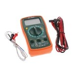 |
| Hacksaw (Conrad,  [840390](https://www.conrad.be/nl/search.html?search=840390); RS Components, [734-393](https://nl.rs-online.com/web/p/hand-saws/0734393); Blades [185-3710](https://nl.rs-online.com/web/p/hand-saw-blades/1853710)) | 1           | RS Components                    | [734-393](https://nl.rs-online.com/web/p/hand-saws/0734393) | 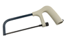 |
| Hacksaw (Conrad,  [840390](https://www.conrad.be/nl/search.html?search=840390); RS Components, [734-393](https://nl.rs-online.com/web/p/hand-saws/0734393); Blades [185-3710](https://nl.rs-online.com/web/p/hand-saw-blades/1853710)) | 1           | RS Components                    | [185-3710](https://nl.rs-online.com/web/p/hand-saw-blades/1853710) |  |
| Driver Bit Set (RS Components,  [668-5723](https://benl.rs-online.com/web/p/screwdriver-bit-sets/6685727); amazon.de, [B01M7PPJI7](https://www.amazon.co.uk/Precision-Screwdriver-Magnetic-Macbook-Electronics/dp/B01M7PPJI7)) | 1           | RS Components                    | [668-5727](https://benl.rs-online.com/web/p/screwdriver-bit-sets/6685727) |  |
| Crimping  tool, (Amazon.nl,[97 22 240 ](https://www.amazon.nl/KNIPEX-Krimptang-240-97-22/dp/B004LY28J2/)) | 1           | Amazon.nl                        | [97 22 240 ](https://www.amazon.nl/KNIPEX-Krimptang-240-97-22/dp/B004LY28J2/) |  |
| Combination pliers (Amazon.de,  [M10997](https://www.amazon.nl/KNIPEX-Krimptang-240-97-22/dp/B004LY28J2/))        Telephone nose pliers (Amazon.de,  [M10997](https://www.amazon.nl/KNIPEX-Krimptang-240-97-22/dp/B004LY28J2/))        Side Cutters (Amazon.de,  [M10997](https://www.amazon.nl/KNIPEX-Krimptang-240-97-22/dp/B004LY28J2/))        Wassep pump pliers (Amazon.de,  [M10997](https://www.amazon.nl/KNIPEX-Krimptang-240-97-22/dp/B004LY28J2/)) | 1           | Amazon.de                        | [M10997](https://www.amazon.nl/KNIPEX-Krimptang-240-97-22/dp/B004LY28J2/) | 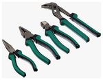 |
| Stanley Aufbewahrungsbox  mit 39-teilig, 1-93-981 | 1           | Amazon.de                        | [B008DHZXY0](https://www.amazon.de/Aufbewahrungsbox-Schubf%C3%A4chern-geeignet-Wandmontage-1-93-981/dp/B008DHZXY0) |  |
| Glass Tubing Cutter (Amazon.com,  [B085L1XV57](https://www.amazon.com/LabZhang-Tubing-Replacement-Cutting-Diameter/dp/B085L1XV57/); amazon.nl,  [B07KM4FW9F](https://www.amazon.nl/Aramox-buissnijder-snijgereedschap-zinklegering-handgereedschap/dp/B07KM4FW9F) ) | 1           | Amazon.com                       | [B085L1XV57](https://www.amazon.com/LabZhang-Tubing-Replacement-Cutting-Diameter/dp/B085L1XV57/) |  |
| Mini hand Drill (amazon.de,  [B07DXLFRQ8](https://www.amazon.de/-/en/FOCCTS-0-5-3-0-Rotating-Jewellery-Beeswax/dp/B07DXLFRQ8)) | 1           | amazon.de                        | [B07DXLFRQ8](https://www.amazon.de/-/en/FOCCTS-0-5-3-0-Rotating-Jewellery-Beeswax/dp/B07DXLFRQ8) | 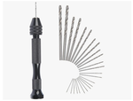 |
| Soldering Station (RS  Components, [122-7917](https://benl.rs-online.com/web/p/soldering-stations/1227917); for Hot Air Amazon.de, [8786D](https://www.amazon.de/-/en/Soldering-Desoldering-Temperature-Adjustable-Conversion/dp/B08C51QRH5/)) | 1           | Amazon.de                        | [8786D](https://www.amazon.de/-/en/Soldering-Desoldering-Temperature-Adjustable-Conversion/dp/B08C51QRH5/) |  |
| Soldering Station (RS  Components, [122-7917](https://benl.rs-online.com/web/p/soldering-stations/1227917); for Hot Air Amazon.de, [8786D](https://www.amazon.de/-/en/Soldering-Desoldering-Temperature-Adjustable-Conversion/dp/B08C51QRH5/)) | 1           | RS Components                    | [122-7917](https://benl.rs-online.com/web/p/soldering-stations/1227917) |  |
| Soldering Arm Stand (RS  Components, [208-3892](https://benl.rs-online.com/web/p/soldering-accessories/2083892)) | 1           | RS Components                    | [208-3892](https://benl.rs-online.com/web/p/soldering-accessories/2083892) |  |
| Lead Free Solder (RS  Componentss, [756-8884](https://benl.rs-online.com/web/p/solder/7568884) ; [625-8233](https://benl.rs-online.com/web/p/solder/6258233)) | 1           | RS Componentss                   | [756-8884](https://benl.rs-online.com/web/p/solder/7568884) |  |
| Lead Free Solder Paste  Syringe (RS Components, [226-170](https://benl.rs-online.com/web/p/solder-pastes/0226170)) | 1           | RS Components                    | [226-170](https://benl.rs-online.com/web/p/solder-pastes/0226170) |  |
| Soldering Iron Tip  Cleaning  (RS Components,  [914-0110](https://benl.rs-online.com/web/p/soldering-accessories/9140110/)) | 1           | RS Components                    | [914-0110](https://benl.rs-online.com/web/p/soldering-accessories/9140110/) |  |
| Heat shrink tubing  (amazon.de, [ET1002](https://www.amazon.de/Eventronic-ET1002-Schrumpfschlauch-Farben-560-tlg/dp/B071D7LJ31)) | 1           | amazon.de                        | [ET1002](https://www.amazon.de/Eventronic-ET1002-Schrumpfschlauch-Farben-560-tlg/dp/B071D7LJ31) |  |
| Conductive Copper Tape, 6mm  x 16m (RS Components, [885-5195](https://befr.rs-online.com/web/p/metallic-tapes/8855195/)) | 1           | RS Components                    | [885-5195](https://befr.rs-online.com/web/p/metallic-tapes/8855195/) |  |
| Scalpel Handle (RS  Components, [850-079](https://benl.rs-online.com/web/p/scalpels-craft-knives/0850079/); Blade [847-7596](https://benl.rs-online.com/web/p/knife-blades/8477596)) | 1           | RS Components                    | [850-079](https://benl.rs-online.com/web/p/scalpels-craft-knives/0850079/) |  |
| Scalpel Blade (RS  Components, [850-079](https://benl.rs-online.com/web/p/scalpels-craft-knives/0850Blade [847-7596](https://benl.rs-online.com/web/p/knife-blades/8477596))) | 2pkg        | RS Components                    | [847-7596](https://benl.rs-online.com/web/p/knife-blades/8477596) |  |
| Cutter (lyreco, [1863235](https://www.lyreco.com/webshop/FRFR/cutter-professionnel-lyreco-premium-antiderapant-18-mm-product-000000000001863235.html)) | 1           | lyreco                           | [1863235](https://www.lyreco.com/webshop/FRFR/cutter-professionnel-lyreco-premium-antiderapant-18-mm-product-000000000001863235.html) |  |
| Fork ring wrench  (amazon.de,  [M19652](https://www.amazon.de/-/en/Brothers-Mannesmann-M19652-wrench-pieces/dp/B000ET7G0E?th=1) ; [B001ILAFRI](https://www.amazon.de/-/en/171198-Combination-Spanner-Set-SW/dp/B001ILAFRI/)) | 1           | amazon.de                        | [M19652](https://www.amazon.de/-/en/Brothers-Mannesmann-M19652-wrench-pieces/dp/B000ET7G0E?th=1) | 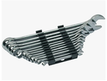 |
| Drill set bits (Amazon.nl,   [DT40283-GER](https://www.amazon.nl/-/en/dp/B08F7L4RWB)) | 1           | Amazon.nl                        | [DT40283-GER](https://www.amazon.nl/-/en/dp/B08F7L4RWB) |  |
| Drill Tap bits,  Metric thread M3-M10  (Amazon.nl,   [B086C2PGR9](https://www.amazon.nl/dp/B086C2PGR9/)) | 1           | Amazon.nl                        | [B086C2PGR9](https://www.amazon.nl/dp/B086C2PGR9/) |  |
| Digitales Thermo-Hygrometer  (Amazon.de, [B01H1R0K68](https://www.amazon.de/-/en/ThermoPro-TP50-thermo-hygrometer-temperature-humidity/dp/B01H1R0K68/) ; Amazon.nl, [B01H1R0K68](https://www.amazon.nl/ThermoPro-TP50-hygrometer-binnenklimaat-indicator-binnenklimaatbeheersing/dp/B01H1R0K68/)) | 3           | Amazon.de                        | [B01H1R0K68](https://www.amazon.de/-/en/ThermoPro-TP50-thermo-hygrometer-temperature-humidity/dp/B01H1R0K68/) |  |
|                                          |             |                                  |                                          |                                          |
| **Springs & Magnets**                    |             |                                  |                                          |                                          |
| Stainless Steel Compression  Spring, 20.6mm x 2.82mm (RS Components, [821-267](https://benl.rs-online.com/web/p/compression-springs/0821267/)) | 2pkg        | RS Components                    | [821-267](https://benl.rs-online.com/web/p/compression-springs/0821267/) |  |
| Steel Alloy Compression Spring, 15.7mm x 2.75mm (RS Components,   [751-360](https://benl.rs-online.com/web/p/compression-springs/0751360/)) | 2pkg        | RS Components                    | [751-360](https://benl.rs-online.com/web/p/compression-springs/0751360/) |  |
| Stainless Steel   Compression Spring, 15.7mm x 2.75mm (RS Components, [821-245 ](https://benl.rs-online.com/web/p/compression-springs/0821245/)) | 2pkg        | RS Components                    | [821-245 ](https://benl.rs-online.com/web/p/compression-springs/0821245/) |  |
| 5mm Neodymium Magnetic Disc  (RS Components, [792-4559 ](https://benl.rs-online.com/web/p/neodymium-magnets/7924559/)) | 2 pack      | RS Components                    | [792-4559 ](https://benl.rs-online.com/web/p/neodymium-magnets/7924559/) |  |
| 3 mm x 1 mm Thick Neodymium  Magnet (Amazon.de, [F331-N35-50 3](https://www.amazon.de/-/en/first4magnets-F331-N35-50-Diameter-Neodymium-Magnet/dp/B00TACKU36)) | 3           | Amazon.de                        | [F331-N35-50 3](https://www.amazon.de/-/en/first4magnets-F331-N35-50-Diameter-Neodymium-Magnet/dp/B00TACKU36) |  |
| 5 mm x 1 mm Thick Neodymium  Magnet (Amazon.de, [F351-N35-50 5](https://www.amazon.de/-/en/first4magnets-F351-N35-50-Diameter-Neodymium-Magnet/dp/B00TACKN4M)) | 2           | Amazon.de                        | [F351-N35-50 5](https://www.amazon.de/-/en/first4magnets-F351-N35-50-Diameter-Neodymium-Magnet/dp/B00TACKN4M) |  |
| 2mm x 1 mm Thick Magnet  (Amazon.de, [F321-50](https://www.amazon.de/-/en/MAGNET-Expert-0-13kg-Neodymium-Magnets/dp/B007JTKHR6)) | 3           | Amazon.de                        | [F321-50](https://www.amazon.de/-/en/MAGNET-Expert-0-13kg-Neodymium-Magnets/dp/B007JTKHR6) |  |
|                                          |             |                                  |                                          |                                          |
| **Adhesive Tape & Glue**                 |             |                                  |                                          |                                          |
| White Silicone Sealant  Paste Tube (RS Components, [494-118](https://benl.rs-online.com/web/p/silicone-sealants/0494118/) ; Farnell, [2289630](https://be.farnell.com/dowsil-formerly-dow-corning/732-white-90ml/rtv-silicone-732-white-90ml/dp/2289630)) | 1           | RS Components                    | [494-118](https://benl.rs-online.com/web/p/silicone-sealants/0494118/) |  |
| Loctite 431 20 g Super Glue  (RS Components, [313-8596](https://benl.rs-online.com/web/p/cyanoacrylate-adhesives/3138596)) | 2           | RS Components                    | [313-8596](https://benl.rs-online.com/web/p/cyanoacrylate-adhesives/3138596) |  |
| Loctite 406 20 g Super Glue  (RS Componentss, [133-0093](https://benl.rs-online.com/web/p/glues/1330093/)) | 5           | RS Componentss                   | [133-0093](https://benl.rs-online.com/web/p/glues/1330093/) |  |
| Silicon paste clear(  Farnell, [2289628](https://be.farnell.com/dowsil-formerly-dow-corning/732-clear-90ml/rtv-silicone-732-clear-90ml/dp/2289628?ost=2289628) ; white Farnell, [2289630](https://be.farnell.com/dowsil-formerly-dow-corning/732-white-90ml/rtv-silicone-732-white-90ml/dp/2289630)) | 1           | Farnell                          | [2289628](https://be.farnell.com/dowsil-formerly-dow-corning/732-clear-90ml/rtv-silicone-732-clear-90ml/dp/2289628?ost=2289628)  [2289630](https://be.farnell.com/dowsil-formerly-dow-corning/732-white-90ml/rtv-silicone-732-white-90ml/dp/2289630) |  |
| Adhesive double-sided tape (RS Components, [273-598](https://benl.rs-online.com/web/p/double-sided-tapes/0273598)) | 1           | RS Components                    | [273-598](https://benl.rs-online.com/web/p/double-sided-tapes/0273598) |  |
|                                          |             |                                  |                                          |                                          |
| **Wires & Power Cables**                 |             |                                  |                                          |                                          |
| 4 mm Test lead With Needle   Test Probe Male, 1.2m Lead Length (RS Components, [888-3705](https://benl.rs-online.com/web/p/4-mm-test-probe-leads/8883705/)) | 1           | RS Components                    | [888-3705](https://benl.rs-online.com/web/p/4-mm-test-probe-leads/8883705/) |  |
| Cable (red and black pair),   banana , male (World Percision Instruments, [504713](https://www.wpiinc.com/504713-extension-cable-male-banana-to-male-banana-36)) | 5           | World Percision   Instruments    | [504713](https://www.wpiinc.com/504713-extension-cable-male-banana-to-male-banana-36) |  |
| 4 mm Test Lead Banana to Banana (60" Digi-Key, [501-1791-ND](https://www.digikey.be/de/products/detail/pomona-electronics/2BA-60/736432); 48" Digi-Key, [501-1663-ND](https://www.digikey.be/de/products/detail/pomona-electronics/2BA-48/736431) ;24" [501-1696-ND](https://www.digikey.be/de/products/detail/pomona-electronics/2BA-24/736429)) | 4           | Digi-Key                         | [501-1791-ND](https://www.digikey.be/de/products/detail/pomona-electronics/2BA-60/736432) |  |
| 4 mm Test Lead Banana to Banana (Digi-Key,    9.4" [BKCT2062-25-0-ND](https://www.digikey.be/de/products/detail/cal-test-electronics/CT2062-25-0/5398848); 24"  [BKCT2062-50-0-ND](https://www.digikey.be/de/products/detail/cal-test-electronics/CT2062-50-0/5398854); 39.4" [BKCT2060-100-0-ND](https://www.digikey.be/de/products/detail/cal-test-electronics/CT2060-100-0/5398800); 59.1" [BKCT2062-150-0-ND](https://www.digikey.be/de/products/detail/cal-test-electronics/CT2062-150-0/5398836)) | 5           | Digi-Key                         | [BKCT2062-25-0-ND](https://www.digikey.be/de/products/detail/cal-test-electronics/CT2062-25-0/5398848) |  |
| 4 mm Test Lead Banana to Banana (Digi-Key, 9.4" [BKCT2062-25-2-ND](https://www.digikey.be/de/products/detail/cal-test-electronics/CT2062-25-2/5398849); 24" [BKCT2062-50-2-ND](https://www.digikey.be/de/products/detail/cal-test-electronics/CT2062-50-2/5398855); 39.4" [BKCT2062-100-2-ND](https://www.digikey.be/de/products/detail/cal-test-electronics/CT2062-100-2/5398831); 59.1" [BKCT2062-150-2-ND](https://www.digikey.be/de/products/detail/cal-test-electronics/CT2062-150-2/5398837)) | 5           | Digi-Key                         | [BKCT2062-25-2-ND](https://www.digikey.be/de/products/detail/cal-test-electronics/CT2062-25-2/5398849) |  |
| 4 mm Test Lead Banana to Banana (Digi-Key,    60", [501-2180-ND](https://www.digikey.be/de/products/detail/pomona-electronics/1368-A-60/736172); 48" [501-1734-ND](https://www.digikey.be/de/products/detail/pomona-electronics/1368-A-48/736171)) | 2           | Digi-Key                         | [501-2180-ND](https://www.digikey.be/de/products/detail/pomona-electronics/1368-A-60/736172) |  |
| Test Lead Banana to Grabber ( Red, Digi-Key, [501-2329-ND](https://www.digikey.be/de/products/detail/pomona-electronics/5053-48-2/737122) ; Black [501-2328-ND](https://www.digikey.be/de/products/detail/pomona-electronics/5053-48-0/737121)) | 2           | Digi-Key                         | [501-2329-ND](https://www.digikey.be/de/products/detail/pomona-electronics/5053-48-2/737122) |  |
| Test Lead Banana to Grabber ( Red, Digi-Key, [501-2329-ND](https://www.digikey.be/de/products/detail/pomona-electronics/5053-48-2/737122) ; Black [501-2328-ND](https://www.digikey.be/de/products/detail/pomona-electronics/5053-48-0/737121)) | 2           | Digi-Key                         | [501-2328-ND](https://www.digikey.be/de/products/detail/pomona-electronics/5053-48-0/737121) |  |
| 4mm Banana Plug (Black RS   Components, [641-8019](https://benl.rs-online.com/web/p/banana-connectors/6418019/); Blue RS Components, [156-0014](https://benl.rs-online.com/web/p/banana-connectors/1560014/); Red RS Components, [641-8075](https://benl.rs-online.com/web/p/banana-connectors/6418075/); Yellow , RS Components, [655-0242](https://benl.rs-online.com/web/p/banana-connectors/6550242/)) | 10          | RS Components                    | [641-8019](https://benl.rs-online.com/web/p/banana-connectors/6418019/) |  |
| Black, Red Female Banana  Socket - Solder Termination (RS Componentss, [888-4588](https://benl.rs-online.com/web/p/banana-connectors/8884588)) | 20          | RS Componentss                   | [888-4588](https://benl.rs-online.com/web/p/banana-connectors/8884588) |  |
| Black 4mm Socket (RS   Components, [737-803](https://benl.rs-online.com/web/p/banana-connectors/0737803) ; [884-8734](https://benl.rs-online.com/web/p/banana-connectors/8848734/) ; [738-345](https://benl.rs-online.com/web/p/banana-connectors/0738345); [787-2338](https://benl.rs-online.com/web/p/banana-connectors/7872338) ; [738-474](https://benl.rs-online.com/web/p/banana-connectors/0738474/)) | 10          | RS Components                    | [737-803](https://benl.rs-online.com/web/p/banana-connectors/0737803) |  |
| Black 4mm Socket (RS   Component, [787-2338](https://benl.rs-online.com/web/p/banana-connectors/7872338) ; [738-474](https://benl.rs-online.com/web/p/banana-connectors/0738474/)) | 10          | RS Components                    | [787-2338](https://benl.rs-online.com/web/p/banana-connectors/7872338) |  |
| RED 4mm Socket (RS   Components(RS Components, [737-819](https://benl.rs-online.com/web/p/banana-connectors/0737819/); [787-2467](https://benl.rs-online.com/web/p/banana-connectors/7872467) ; [738-351](https://benl.rs-online.com/web/p/banana-connectors/0738351?sra=pstk); [738-480](https://benl.rs-online.com/web/p/banana-connectors/0738480/); [738-480](https://benl.rs-online.com/web/p/banana-connectors/0738480/) ; [787-2332](https://benl.rs-online.com/web/p/banana-connectors/7872332/) ) | 10          | RS Components                    | [737-819](https://benl.rs-online.com/web/p/banana-connectors/0737819/) |  |
| RED 4mm Socket (RS   Components(RS Components; [738-480](https://benl.rs-online.com/web/p/banana-connectors/0738480/) ; [787-2332](https://benl.rs-online.com/web/p/banana-connectors/7872332/) ) | 10          | RS Components                    | [738-480](https://benl.rs-online.com/web/p/banana-connectors/0738480/) |  |
| Black Wire Reel (RS   Components, [168-1559](https://benl.rs-online.com/web/p/harsh-environment-wire/1681559)) | 2           | RS Components                    | [168-1559](https://benl.rs-online.com/web/p/harsh-environment-wire/1681559) |  |
| Blue Wire Reel (RS   Components, [168-1593 ](https://benl.rs-online.com/web/p/harsh-environment-wire/1681593)) | 1           | RS Components                    | [168-1593 ](https://benl.rs-online.com/web/p/harsh-environment-wire/1681593) |  |
| Red Wire Reel (RS   Components ([168-1571](https://benl.rs-online.com/web/p/harsh-environment-wire/1681571/)) | 2           | RS Components                    | [168-1571](https://benl.rs-online.com/web/p/harsh-environment-wire/1681571/) |  |
| White Wire Reel (RS   Components, [168-1543 ](https://benl.rs-online.com/web/p/harsh-environment-wire/1681543)) | 1           | RS Components                    | [168-1543 ](https://benl.rs-online.com/web/p/harsh-environment-wire/1681543) |  |
| Multicore Cable, Control,   Per M, Screened, 2 Core, 19 AWG, 0.75 mm² | 5           | Farnell                          | [1504145](https://be.farnell.com/lapp-kabel/0012640/cable-ctrl-in-sf-2core-0-75-per/dp/1504145) |  |
| Multicore Cable, Control,   Per M, Screened, 4 Core, 19 AWG, 0.75 mm² | 5           | Farnell                          | [1504147](https://be.farnell.com/lapp-kabel/0012642/cable-ctrl-in-sf-4core-0-75-per/dp/1504147) |  |
| Brown Wire Reel (RS  Components, [111-8708](https://benl.rs-online.com/web/p/harsh-environment-wire/1118708/)) | 1           | RS Components                    | [111-8708](https://benl.rs-online.com/web/p/harsh-environment-wire/1118708/) |  |
| Yellow Wire Reel (RS  Components,[111-8685](https://benl.rs-online.com/web/p/harsh-environment-wire/1118685/)) | 1           | RS Components                    | [111-8685](https://benl.rs-online.com/web/p/harsh-environment-wire/1118685/) |  |
| JST PH 2 Pin Female Cable  (Digi-Key, [1528-1126-ND](https://www.digikey.be/product-detail/en/adafruit-industries-llc/261/1528-1126-ND/5353586)) | 100         | Digi-Key                         | [1528-1126-ND](https://www.digikey.be/product-detail/en/adafruit-industries-llc/261/1528-1126-ND/5353586) | 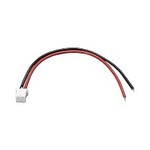 |
| JST PH 2 pin cable male  Header (Digi-Key, [1528-2617-ND](https://www.digikey.be/product-detail/en/adafruit-industries-llc/3814/1528-2617-ND/9380221)) | 50          | Digi-Key                         | [1528-2617-ND](https://www.digikey.be/product-detail/en/adafruit-industries-llc/3814/1528-2617-ND/9380221) |  |
| 3-pin female to female  jumper wire dupont cable (Amazon.nl, [B07DK31W19](https://www.amazon.nl/-/en/dp/B07DK31W19) ) | 1           | Amazon.nl                        | [B07DK31W19](https://www.amazon.nl/-/en/dp/B07DK31W19) |  |
|                                          |             |                                  |                                          |                                          |
| **Thermal management & Heatsink**        |             |                                  |                                          |                                          |
| Heatsink Aluminum Top   Mount, Extrusion   136.53mm   x 914.40mm (Digikey, [345-1936-ND](https://www.digikey.be/product-detail/en/wakefield-vette/125404/345-1936-ND/9957688)) | 1           | Digikey                          | [345-1936-ND](https://www.digikey.be/product-detail/en/wakefield-vette/125404/345-1936-ND/9957688) |  |
| Heatsink Aluminum  (Digi-Key, [AE10889-ND](https://www.digikey.be/product-detail/en/assmann-wsw-components/V6560Y/AE10889-ND/3511467)) | 1           | Digi-Key                         | [AE10889-ND](https://www.digikey.be/product-detail/en/assmann-wsw-components/V6560Y/AE10889-ND/3511467) |  |
| Aluminium Flat Bar, 609.6mm  x 25.4mm (RS Components, [681-104](https://benl.rs-online.com/web/p/metal-bars-metal-rods/0681104/)) | 2           | RS Components                    | [681-104](https://benl.rs-online.com/web/p/metal-bars-metal-rods/0681104/) | 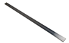 |
| Heatsink Aluminum, 1000 x  32 x 20mm (RS Components, [168-6346](https://benl.rs-online.com/web/p/heatsinks/1686346)) | 1           | RS Components                    | [168-6346](https://benl.rs-online.com/web/p/heatsinks/1686346) |  |
| Heatsink Aluminum, 1000 x  60 x 15mm (RS Components, [168-6295](https://benl.rs-online.com/web/p/heatsinks/1686295)) | 1           | RS Components                    | [168-6295](https://benl.rs-online.com/web/p/heatsinks/1686295) |  |
| Angle Profile Aluminum,  1000 x 15 x 10 mm (Amazon.nl, ‎[Amazon-B00ZXPLX3K  alu -15x10](https://www.amazon.nl/-/en/gp/product/B00ZXPLX3K/)) | 2           | Amazon.nl                        | [B00ZXPLX3K](https://www.amazon.nl/-/en/gp/product/B00ZXPLX3K/) |  |
| LED Heatsink 300mm x 25mm x  10mm  (Amazon.nl,  [B09Q1V2XLR](https://www.amazon.nl/-/en/gp/product/B09Q1V2XLR)) | 3           | Amazon.nl                        | [B09Q1V2XLR](https://www.amazon.nl/-/en/gp/product/B09Q1V2XLR) | 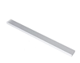 |
| Thermal pad 100mmX100mm Digi-Key,  [1168-1951-ND](https://www.digikey.be/nl/products/detail/t-global-technology/LI98CN-100-100-0-18/3064388) | 5           | Digi-Key                         | [1168-1951-ND](https://www.digikey.be/nl/products/detail/t-global-technology/LI98CN-100-100-0-18/3064388) | 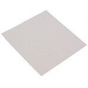 |
| Thermally Conductive Double-Sided Tape (Thorlabs, [TCDT1](https://www.thorlabs.de/thorproduct.cfm?partnumber=TCDT1)) | 1           | Thorlabs                         | [TCDT1](https://www.thorlabs.de/thorproduct.cfm?partnumber=TCDT1) |  |
| Heatsink, , 84 x 28 x  10.3mm, (RS Components, [722-6883](https://benl.rs-online.com/web/p/heatsinks/7226883)) | 2           | RS Components                    | [722-6883](https://benl.rs-online.com/web/p/heatsinks/7226883) |  |
|                                          |             |                                  |                                          |                                          |
| **Vibration Isolation**                  |             |                                  |                                          |                                          |
| Anti Vibration Feet 12.7mm  Natural Rubber (RS Components, [236-509](https://benl.rs-online.com/web/p/anti-slip-pads/0236509/)) | 1           | RS Components                    | [236-509](https://benl.rs-online.com/web/p/anti-slip-pads/0236509/) |  |
| Hemisphere Anti Vibration  Feet (RS Components, [236-464 ](https://benl.rs-online.com/web/p/anti-slip-pads/0236464/)) ,11.1mm dia. Natural Rubber | 1           | RS Components                    | [236-464 ](https://benl.rs-online.com/web/p/anti-slip-pads/0236464/) |  |
| Anti Vibration Feet 22.4mm  Natural Rubber (RS Components, [179-4808](https://benl.rs-online.com/web/p/anti-slip-pads/1794808/)) | 3           | RS Components                    | [179-4808](https://benl.rs-online.com/web/p/anti-slip-pads/1794808/) |  |
|                                          |             |                                  |                                          |                                          |
| **Plastic Sheets & Light Diffuser**      |             |                                  |                                          |                                          |
| Clear Plastic Sheet, 500mm  x 400mm x 5mm (RS Components, [824-676](https://benl.rs-online.com/web/p/plastic-sheets/0824660)) | 1           | RS Components                    | [824-676](https://benl.rs-online.com/web/p/plastic-sheets/0824660) |  |
| Clear Plastic Sheet, 500mm  x 400mm x 1.5mm (RS Componentss,  [769-8724](https://benl.rs-online.com/web/p/plastic-sheets/7698724)) | 1           | RS Componentss                   | [769-8724](https://benl.rs-online.com/web/p/plastic-sheets/7698724) |  |
| Light Diffuser  2mm (Pyrasied,  [Colorado LED DB 71 opal](https://pyrasied.com/en/all-plastics/colours/opal/colorado-led-db-71-opal-1/)) | 1           | pyrasied                         | [Colorado LED DB 71 opal](https://pyrasied.com/en/all-plastics/colours/opal/colorado-led-db-71-opal-1/) | 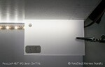 |
| Light Diffuser 2mm  (Pyrasied, [Fuerto UV PyraLed5 opal](https://pyrasied.com/en/all-plastics/colours/opal/fuerto-uv-pyraled5-opal-1/)) | 1           | praised                          | [Fuerto UV PyraLed5 opal](https://pyrasied.com/en/all-plastics/colours/opal/fuerto-uv-pyraled5-opal-1/) |  |
| Light  Diffuser Perspex Opaal 2 mm (Plexikopen, [Perspex Opaal](https://www.plexikopen.be/perspex-opaal-2-mm)) | 1           | Plexikopen                       | [Perspex Opaal](https://www.plexikopen.be/perspex-opaal-2-mm) |  |
| Diffuser  Polycarbonaat Opaal 3 mm  (Plexikopen, [Polycarbonaat Opaal](https://www.plexikopen.be/polycarbonaat-opaal-3-mm)) | 1           | Plexikopen                       | [Polycarbonaat Opaal](https://www.plexikopen.be/polycarbonaat-opaal-3-mm) |  |
| Self-Adhesive Mirror with  Sticker , PET 15x15x0.01 cm (Amazon.de, ‎[JMTBJ-180717-11](https://www.amazon.de/-/en/X-Mile-Stickers-Self-Adhesive-Surfaces-Decoration/dp/B07G46CFTK?th=1)) | 1           | Amazon.de                        | ‎[JMTBJ-180717-11](https://www.amazon.de/-/en/X-Mile-Stickers-Self-Adhesive-Surfaces-Decoration/dp/B07G46CFTK?th=1) |  |
| ITO (Indium Tin Oxide) Coated  PET Plastic - 100mm x 200mm (Mouser.be/adafruit /, [1309](https://www.mouser.be/ProductDetail/Adafruit/1309?qs=GURawfaeGuBVbBVf4Krrdw%3D%3D)) | 2           | Mouser.be/Adafruit               | [1309](https://www.mouser.be/ProductDetail/Adafruit/1309?qs=GURawfaeGuBVbBVf4Krrdw%3D%3D) |  |
| LEE Filters 100mm System  Polyester 87 Infrared Filter unmounted (Robertwhite, [LEEB10087C](https://www.robertwhite.co.uk/lee-filters-100mm-system-polyester-87c-infrared-filter.html)) | 3           | RobertWhite                      | [LEEB10087C](https://www.robertwhite.co.uk/lee-filters-100mm-system-polyester-87c-infrared-filter.html) |  |
| Aluminum Sandwich Panel Black 510x762 mm  (Plexikopen, [Black RAL 9005 3 mm](https://www.plexikopen.be/aluminium-sandwichpaneel-kleur)) | 2           | Plexikopen                       | [Black RAL 9005 3 mm](https://www.plexikopen.be/aluminium-sandwichpaneel-kleur) | 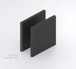 |
|                                          |             |                                  |                                          |                                          |
| **Silicon rubber sheet**                 |             |                                  |                                          |                                          |
| 0.3mm Thicknes 500x500MM  (20"x20") Silicone Rubber Sheet Plate Mat High Temp Commercial  Grade | 1           | Amazon.co.uk                     | [B06XG14FG4](https://www.amazon.co.uk/Thicknes-500x500MM-Silicone-Rubber-Commercial/dp/B06XG14FG4) |  |
| Translucent Silicone Rubber  Sheet, 600mm x 600mm x 1.5mm (RS Components, [840-5541](https://benl.rs-online.com/web/p/silicone-rubber-sheets/8405541/)) | 1           | RS Components                    | [840-5541](https://benl.rs-online.com/web/p/silicone-rubber-sheets/8405541/) |  |
|                                          |             |                                  |                                          |                                          |
| **Glass Tubing**                         |             |                                  |                                          |                                          |
| Glass Tubing, Borosilicate  Glass, Out Diameter 4mm (Amazon.com, [B017CNYUV2](https://www.amazon.com/Pack-Glass-Tubing-Borosilicate-Diameter/dp/B017CNYUV2)) | 1 pack      | Amazon.com                       | [B017CNYUV2](https://www.amazon.com/Pack-Glass-Tubing-Borosilicate-Diameter/dp/B017CNYUV2) |  |
| Glass Tubing, Borosilicate  Glass, Out Diameter 6mm (Amazon.com, [B017DVI4TC](https://www.amazon.com/Pack-Glass-Tubing-Borosilicate-Diameter/dp/B017DVI4TC)) |             | Amazon.com                       | [B017DVI4TC](https://www.amazon.com/Pack-Glass-Tubing-Borosilicate-Diameter/dp/B017DVI4TC) | 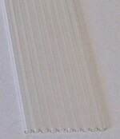 |
| Pyrex Glass Tubing (TriKinetics, [PGT5x80](https://trikinetics.com/)) | 1 pack      | TriKinetics                      | [PGT5x80](https://trikinetics.com/)      |  |
|                                          |             |                                  |                                          |                                          |
| **Relays & MOSFET**                      |             |                                  |                                          |                                          |
| Dual powerful MOSFET   trigger switch drive module  PWM DC   5V-36V 15A (Amazon.nl, [B07VRCXGFY](https://www.amazon.nl/dp/B07VRCXGFY/)) | 1           | Amazon.nl                        | [B07VRCXGFY](https://www.amazon.nl/dp/B07VRCXGFY/) |  |
| 5V one channel relay module  board Shield for Arduino relay (Amazon.de, [B07DJ4ZD99](https://www.amazon.de/DollaTek-KY-019-Relais-Shield-Arduino/dp/B07DJ4ZD99); Amazon.nl,   [B07DJ4ZD99](https://www.amazon.nl/dp/B07DJ4ZD99/)) | 1           | Amazon.de                        | [B07DJ4ZD99](https://www.amazon.de/DollaTek-KY-019-Relais-Shield-Arduino/dp/B07DJ4ZD99) |  |
| SPNO Reed Relay, 5V dc, PCB  Mount (RS Components, [291-9710](https://benl.rs-online.com/web/p/reed-relays/2919710?sra=pstk)) | 10          | RS Components                    | [291-9710](https://benl.rs-online.com/web/p/reed-relays/2919710?sra=pstk) |  |
| SPDT Reed Relay, 5V dc, PCB  Mount (RS Components, [256-2241 ](https://benl.rs-online.com/web/p/reed-relays/2562241/)) | 10          | RS Components                    | [256-2241 ](https://benl.rs-online.com/web/p/reed-relays/2562241/) |  |
| SPDT Reed Relay, 5V dc, PCB  Mount (Digi-Key, [HE100-ND](https://www.digikey.be/nl/products/detail/littelfuse-inc/HE721A0500/133183)) | 10          | Digi-Key                         | [HE100-ND](https://www.digikey.be/nl/products/detail/littelfuse-inc/HE721A0500/133183) |  |
|                                          |             |                                  |                                          |                                          |
| **Vibration Motors**                     |             |                                  |                                          |                                          |
| Vibration Motor  11000 RPM 5VDC (Digi-Key, [1528-1177-ND](https://www.digikey.be/nl/products/detail/adafruit-industries-llc/1201/5353637)) | 10          | Digi-Key                         | 1528-[1177-ND](https://www.digikey.be/nl/products/detail/adafruit-industries-llc/1201/5353637) | 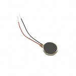 |
|                                          |             |                                  |                                          |                                          |
| **Water bath & Vacuum**                  |             |                                  |                                          |                                          |
| Water bath, 2 L (VWR, [462-0554](https://be.vwr.com/store/product?keyword=462-0554%20)) | 1           | VWR                              | [462-0554](https://be.vwr.com/store/product?keyword=462-0554%20) |  |
| Vacuum Pump  Fisherbrand™ FB70155 (Fisher, [11533485](https://www.fishersci.be/shop/products/product/11533485)) | 2           | Fisher                           | [11533485](https://www.fishersci.be/shop/products/product/11533485) |  |
|                                          |             |                                  |                                          |                                          |
| **Crimping Sockets**                     |             |                                  |                                          |                                          |
| Socket, Crimp,  Wire-to-Board Crimp Housings (Farnell, [1593529](https://be.farnell.com/multicomp/2226tg/crimp-terminal-24-28awg/dp/1593529?ost=1593529)) | 1500        | Farnell                          | [1593529](https://be.farnell.com/multicomp/2226tg/crimp-terminal-24-28awg/dp/1593529?ost=1593529) | 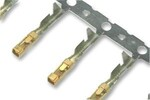 |
| Connector Socket   Crimp,  Micro Timer 2 Contact with Double Locking  Lance (Digi-Key, [962876-2](https://www.digikey.be/en/products/detail/te-connectivity-amp-connectors/962876-2/2332160)) | 250         | Digi-Key                         | [962876-2](https://www.digikey.be/en/products/detail/te-connectivity-amp-connectors/962876-2/2332160) |  |
| Connector Housing, 2 Ways,  2.54 mm (Farnell, [1593506](https://be.farnell.com/multicomp/2226a-02/crimp-housing-1-row-2-way/dp/1593506)) | 50          | Farnell                          | [1593506](https://be.farnell.com/multicomp/2226a-02/crimp-housing-1-row-2-way/dp/1593506) |  |
| Connector Housing, 4 Ways,  2.54 mm (RS Components, [681-2824](https://benl.rs-online.com/web/p/wire-housings-plugs/6812824/)) | 30          | RS Components                    | [681-2824](https://benl.rs-online.com/web/p/wire-housings-plugs/6812824/) |  |
| 2.54 mm Male Female  Dupont Wire Jumper with Pin Header Connector Housing Kit (amazon.de, [B07BTB3MC7](https://www.amazon.de/-/en/KINCREA-Female-Dupont-Connector-Housing/dp/B07BTB3MC7)) | 1           | amazon.de                        | [B07BTB3MC7](https://www.amazon.de/-/en/KINCREA-Female-Dupont-Connector-Housing/dp/B07BTB3MC7) |  |
|                                          |             |                                  |                                          |                                          |
| **PCB Pin Headers**                      |             |                                  |                                          |                                          |
| Straight Pin Header, 2.54mm  Pitch, 6 Way, 2 Row (RS Components, [251-8137](https://benl.rs-online.com/web/p/pcb-headers/2518137)) | 50          | RS Components                    | [251-8137](https://benl.rs-online.com/web/p/pcb-headers/2518137) |  |
| Straight Pin Header, 2.54mm  Pitch, 6 Way, 1 Row (RS Components, [681-2994](https://benl.rs-online.com/web/p/pcb-headers/6812994/)) | 50          | RS Components                    | [681-2994](https://benl.rs-online.com/web/p/pcb-headers/6812994/) |  |
| Turned Pin Open Frame IC  Dip Socket, 2.54mm Pitch 14 Way (RS Components, [674-2476](https://benl.rs-online.com/web/p/dil-sockets/6742476/)) | 20          | RS Components                    | [674-2476](https://benl.rs-online.com/web/p/dil-sockets/6742476/) |  |
| 2 Way Vertical PCB Mount  5.08mm SIL Socket, Solder (RS Components, [909-4234 ](https://benl.rs-online.com/web/p/sil-sockets/9094234/)) | 20          | RS Components                    | [909-4234 ](https://benl.rs-online.com/web/p/sil-sockets/9094234/) |  |
| Contact PST, Terminal Block  Header, 5mm Pitch, 2 Way, 1 Row (RS Components, [548-7171](https://benl.rs-online.com/web/p/pcb-headers/5487171)) | 10          | RS Components                    | [548-7171](https://benl.rs-online.com/web/p/pcb-headers/5487171) |  |
| Straight Through Hole  Female Socket ,15.24mm 14 Way 2 (RS Components, [710-8700](https://benl.rs-online.com/web/p/oscillator-sockets/7108700/)) | 30          | RS Components                    | [710-8700](https://benl.rs-online.com/web/p/oscillator-sockets/7108700/) |  |
| Contact, PST Straight Pin  Header, 1.0/ 4-3.5, 4 Way, 1 Row (RS Components,   [548-7222](https://benl.rs-online.com/web/p/pcb-headers/5487222)) | 40          | RS Components                    | [548-7222](https://benl.rs-online.com/web/p/pcb-headers/5487222) |  |
| 32 Way SIL Sockel  2,54 mm – Turned Pin – 2 Stück | 2           | Amazon.de                        | [B00KM1K0NE](https://www.amazon.de/32-Way-SIL-Sockel-Turned-St%C3%BCck/dp/B00KM1K0NE) |  |
| 2 Way Preci-Dip Straight  Through Hole 2.54mm SIL Socket, Solder, 3A 100 V ac, 150 V dc | 5           | RS Components                    | [702-2969](https://benl.rs-online.com/web/p/sil-sockets/7022969) |  |
|                                          |             |                                  |                                          |                                          |
| **Toggle Switches**                      |             |                                  |                                          |                                          |
| Cap Toggle Bat Black   (Digi-Key, [EG2471-ND](https://www.digikey.be/product-detail/en/e-switch/T1002BLKTOGGLECAP/EG2471-ND/378940)) | 10          | Digi-Key                         | [EG2471-ND](https://www.digikey.be/product-detail/en/e-switch/T1002BLKTOGGLECAP/EG2471-ND/378940) | 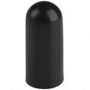 |
| Toggle Switch DPDT  (Digi-Key, [EG2400-ND](https://www.digikey.be/product-detail/en/e-switch/100DP1T1B1M2QEH/EG2400-ND/378869)) | 4           | Digi-Key                         | [EG2400-ND](https://www.digikey.be/product-detail/en/e-switch/100DP1T1B1M2QEH/EG2400-ND/378869) |  |
| Toggle Switch SPDT   (Digi-Key, [EG2352-ND](https://www.digikey.de/en/products/detail/e-switch/100SP1T1B1M2QEH/378821)) | 5           | Digi-Key                         | [EG2352-ND](https://www.digikey.de/en/products/detail/e-switch/100SP1T1B1M2QEH/378821) |  |
| Push Button Switch, 6.5   (Dia.) mm, Panel Mount (RS Components, [332-830](https://benl.rs-online.com/web/p/push-button-switches/0332830/); [133-6502](https://benl.rs-online.com/web/p/push-button-switches/1336502/)) | 10          | RS Components                    | [332-830](https://benl.rs-online.com/web/p/push-button-switches/0332830/) |  |
| Push Button Switch, Panel   Mount SPST (Digi-Key, [40-4526-00](https://www.digikey.be/product-detail/en/judco-manufacturing-inc/40-4526-00/545PB-ND/1277805)) | 10          | Digi-Key                         | [40-4526-00](https://www.digikey.be/product-detail/en/judco-manufacturing-inc/40-4526-00/545PB-ND/1277805) | 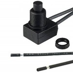 |
|                                          |             |                                  |                                          |                                          |
| **Screw terminal block connectors**      |             |                                  |                                          |                                          |
| Terminal Block   2P side 5.08mm  PCB (Digi-Key, [A113320-ND](https://www.digikey.be/products/en?keywords=A113320-ND)) | 10          | Digi-Key                         | [A113320-ND](https://www.digikey.be/products/en?keywords=A113320-ND) | 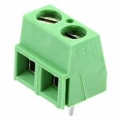 |
| Terminal Block   2P side 5.08mm  PCB (Digi-Key, [ED2609-ND](https://www.digikey.be/products/en?keywords=ED2609-ND)) | 25          | Digi-Key                         | [ED2609-ND](https://www.digikey.be/products/en?keywords=ED2609-ND) | 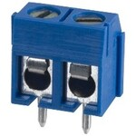 |
| Terminal Block   3P side 5.08mm  PCB (Digi-Key, [ED2610-ND](https://www.digikey.be/products/en?keywords=ED2610-ND)) | 10          | Digi-Key                         | [ED2610-ND](https://www.digikey.be/products/en?keywords=ED2610-ND) | 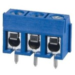 |
| Terminal Block   2P side 5.08mm  PCB mount (Farnell, [1716993](https://be.farnell.com/camdenboss/ctb1202-2bk/terminal-block-wire-to-brd-2pos/dp/1716993)) | 100         | Farnell                          | [1716993](https://be.farnell.com/camdenboss/ctb1202-2bk/terminal-block-wire-to-brd-2pos/dp/1716993) | 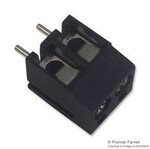 |
| Terminal Block, 2.54mm   Pitch, 10-pin PCB (RS Components, [220-4355](https://benl.rs-online.com/web/p/pcb-terminal-blocks/2204355)) | 5           | RS Components                    | [220-4355](https://benl.rs-online.com/web/p/pcb-terminal-blocks/2204355) |  |
| Terminal Block Connector   for Arduino, 5mm Pitch 2-Pin & 3-Pin PCB Mounting Screw (Amazon.nl, [B082ZNRQMJ](https://www.amazon.nl/-/en/dp/B082ZNRQMJ)) | 1           | Amazon.nl                        | [B082ZNRQMJ](https://www.amazon.nl/-/en/dp/B082ZNRQMJ) |  |
| Terminal Block Connector   for Arduino, 5mm pitch 2-pin and 3-pin PCB Mounting Screw (Amazon.nl, [B087RN8FDZ](https://www.amazon.nl/-/en/dp/B087RN8FDZ/)) | 1           | Amazon.nl                        | [B087RN8FDZ](https://www.amazon.nl/-/en/dp/B087RN8FDZ/) |  |
| 12 Circuit - Terminal   Strip Connector Screws (Digi-Key, [277-15432-ND](https://www.digikey.be/en/products/detail/phoenix-contact/3240171/3603832)) | 4           | Digi-Key                         | [277-15432-ND](https://www.digikey.be/en/products/detail/phoenix-contact/3240171/3603832) | 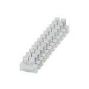 |
| 12 Circuit - Terminal   Strip Connector Screws (Digi-Key,   [277-15433-ND](https://www.digikey.be/en/products/detail/phoenix-contact/3240173/4484753)) | 4           | Digi-Key                         | [277-15433-ND](https://www.digikey.be/en/products/detail/phoenix-contact/3240173/4484753) | 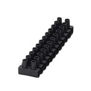 |
|                                          |             |                                  |                                          |                                          |
| **Resistors & Diode**                    |             |                                  |                                          |                                          |
| Resistor Kit, 10ohm to   1Mohm Resistors (Farnell, [MF0W4FFE006KIT](https://be.farnell.com/multicomp/mf0w4ffe006kit/resistor-kit-0-25w-1-e6/dp/9342362)) |             | Farnell                          | [MF0W4FFE006KIT](https://be.farnell.com/multicomp/mf0w4ffe006kit/resistor-kit-0-25w-1-e6/dp/9342362) |  |
| Diode (RS Components, [628-8931](https://benl.rs-online.com/web/p/rectifier-diodes-schottky-diodes/6288931/)) | 20          | RS Components                    | [628-8931](https://benl.rs-online.com/web/p/rectifier-diodes-schottky-diodes/6288931/) |  |
|                                          |             |                                  |                                          |                                          |
| **Solderable Breadboard PCB**            |             |                                  |                                          |                                          |
| Solderable Breadboard With  Adaption Circuit Board 42.54 x 31.75 x 1.5mm (RS Components, [897-1654](https://benl.rs-online.com/web/p/breadboards/8971654/)) | 10          | RS Components                    | [897-1654](https://benl.rs-online.com/web/p/breadboards/8971654/) |  |
| EPCB Prototype Board,  Snappable Strip Board (Amazon.nl, [B081R45KN8](https://www.amazon.nl/-/en/dp/B081R45KN8) ) | 1           | Amazon.nl                        | [B081R45KN8](https://www.amazon.nl/-/en/dp/B081R45KN8) | 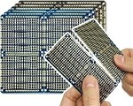 |
| RE 521-HP, Single-Sided  Stripboard FR-2 100 x 160 x 1.5mm DIN 41612 FR2 | 10          | RS Components                    | [206-5879](https://benl.rs-online.com/web/p/stripboards/2065879) |  |
| Stripboard Cutter (RS  Components, [543-535](https://benl.rs-online.com/web/p/stripboard-cutters/543535)) | 1           | RS Components                    | [543-535](https://benl.rs-online.com/web/p/stripboard-cutters/543535) |  |
| Tinned-Copper Wire  Breadboard Jumper Wire (RS Components,0.5mm [199-6217](https://benl.rs-online.com/web/p/breadboard-jumper-wire/1996217) ;0.8mm RS Componentss, [199-6231](https://benl.rs-online.com/web/p/breadboard-jumper-wires/1996228) ;1mm RS Componentss, [199-6228](https://benl.rs-online.com/web/p/breadboard-jumper-wires/1996231)) | 3           | RS Components                    | [199-6217](https://benl.rs-online.com/web/p/breadboard-jumper-wire/1996217) | 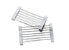 |
|                                          |             |                                  |                                          |                                          |
| 3D-printer Materials                     |             |                                  |                                          |                                          |
| Ultimaker 2.85mm Black PC  3D Printer Filament, 750g (RS Components, [159-6351](https://benl.rs-online.com/web/p/3d-printing-materials/1596351)) | 1           | RS Components                    | [159-6351](https://benl.rs-online.com/web/p/3d-printing-materials/1596351) |  |
| Ultimaker 2.85mm  Transparent 3D Printer Filament, 750g (RS Components, [159-6352](https://benl.rs-online.com/web/p/3d-printing-materials/1596352/)) | 1           | RS Components                    | [159-6352](https://benl.rs-online.com/web/p/3d-printing-materials/1596352/) |  |
| Ultimaker 2.85mm Black CPE  3D Printer Filament, 750g (RS Components, [134-8174](https://benl.rs-online.com/web/p/3d-printing-materials/1348174)) | 4           | RS Components                    | [134-8174](https://benl.rs-online.com/web/p/3d-printing-materials/1348174) | 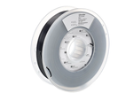 |
| Ultimaker 2.85mm Black CPE+  3D Printer Filament, 700g (RS Components, [159-6348](https://benl.rs-online.com/web/p/3d-printing-materials/1596348)) | 2           | RS Components                    | [159-6348](https://benl.rs-online.com/web/p/3d-printing-materials/1596348) |  |
| Ultimaker 2.85mm White CPE+  3D Printer Filament, 700g (RS Components, [159-6350](https://benl.rs-online.com/web/p/3d-printing-materials/1596350)) | 1           | RS Components                    | [159-6350](https://benl.rs-online.com/web/p/3d-printing-materials/1596350) |  |
| Ultimaker Print Table Glass  (RS Components, [908-2950](https://benl.rs-online.com/web/p/3d-printer-parts/9082950)) | 2           | RS Components                    | [908-2950](https://benl.rs-online.com/web/p/3d-printer-parts/9082950) |  |
|                                          |             |                                  |                                          |                                          |
| **Arduino**                              |             |                                  |                                          |                                          |
| Arduino Mega2560  (Digi-Key, [1050-1018-ND](https://www.digikey.be/nl/products/detail/arduino/A000067/2639006?s=N4IgTCBcDaIIwAYCsCC0i4A5UDkAiIAugL5A); RS Components, [715-4084 ](https://benl.rs-online.com/web/p/arduino/7154084/)) | 1           | Digi-Key                         | [1050-1018-ND](https://www.digikey.be/nl/products/detail/arduino/A000067/2639006?s=N4IgTCBcDaIIwAYCsCC0i4A5UDkAiIAugL5A) |  |
|                                          |             |                                  |                                          |                                          |
| **Power Supply**                         |             |                                  |                                          |                                          |
| AC/DC Converter 12V 600W  (Digi-Key, [SE-600-12](https://www.digikey.be/nl/products/detail/mean-well-usa-inc/SE-600-12/7706613)) | 1           | Digi-Key                         | [SE-600-12](https://www.digikey.be/nl/products/detail/mean-well-usa-inc/SE-600-12/7706613) |  |
| DC Laboratory Power Supply,  0-30V 0-10A DC   Adjustable Switching  (banggood, [1121229](https://nl.banggood.com/LONG-WEI-LW-K3010D-110V-or-220V-30V-10A-Adjustable-Digital-DC-Power-Supply-Switching-Power-Supply-p-1121229.html); amazon.de, [KPS-3010D](https://www.amazon.de/-/en/Eventek-Laboratory-Adjustable-Stabilised-Digital/dp/B071HW378T/) ; [B085S34NNW](https://www.amazon.de/-/en/KAIWEETS-Laboratory-adjustable-DC0-10A-overload/dp/B085S34NNW/); [B07D358Q96](https://www.amazon.de/dp/B07D358Q96/)) | 1           | amazon.de                        | [KPS-3010D](https://www.amazon.de/-/en/Eventek-Laboratory-Adjustable-Stabilised-Digital/dp/B071HW378T/) |  |
| 4000W AC 220V Variable  voltage regulator for temperature dimmer (Amazon.nl, [B074Z48BSW](https://www.amazon.nl/dp/B074Z48BSW/)) | 1           | Amazon.nl                        | [B074Z48BSW](https://www.amazon.nl/dp/B074Z48BSW/) | 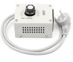 |
| AC/DC Wall Mount Adaptor  12V 18W (DigiKey, [1470-3149-ND](https://www.digikey.be/product-detail/en/xp-power/VEL18US120-EU-JA/1470-3149-ND/5864659)) | 5           | DigiKey                          | [1470-3149-ND](https://www.digikey.be/product-detail/en/xp-power/VEL18US120-EU-JA/1470-3149-ND/5864659) | 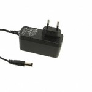 |
| DC-DC Buck Converter  Voltage Regulator Step Down Module Adjustable (Amazon.nl, [B07HKP5ZHM](https://www.amazon.nl/-/en/dp/B07HKP5ZHM)) | 5           | Amazon.nl                        | [B07HKP5ZHM](https://www.amazon.nl/-/en/dp/B07HKP5ZHM) |  |
| DC DC Buck Converter Step  Down Module  (Amazon.de, [B08K37TS6F](https://www.amazon.de/-/en/Greluma-LM2596S-Converter-Stabiliser-Downward/dp/B08K37TS6F?th=1); Amazon.de, [B07TWFSFR3](https://www.amazon.de/Packungen-Spannungsregler-Abw%C3%A4rtswandler-Einstellbare-Abw%C3%A4rtsmodul/dp/B07TWFSFR3/)) | 1           | Amazon.de                        | [B08K37TS6F](https://www.amazon.de/-/en/Greluma-LM2596S-Converter-Stabiliser-Downward/dp/B08K37TS6F?th=1) |  |
|                                          | 2           | Ama                              |                                          |                                          |
| Digital Voltmeter Three  Line DC 0-100 V (Amazon.de, [B07FQ4QRVH](https://www.amazon.de/ZkeeShop-Mini-Digital-Voltmeter-3-Draht-Gleichstrom-Spannungspr%C3%BCfer-R%C3%BCckw%C3%A4rtsschutz/dp/B07FQ4QRVH/)) | 1           | Amazon.de                        | [B07FQ4QRVH](https://www.amazon.de/ZkeeShop-Mini-Digital-Voltmeter-3-Draht-Gleichstrom-Spannungspr%C3%BCfer-R%C3%BCckw%C3%A4rtsschutz/dp/B07FQ4QRVH/) |  |
| Digital Voltmeter two Line  DC 2.6-30 V (Digikey.be, [1597-1237-ND](https://www.digikey.be/de/products/detail/seeed-technology-co-ltd/114990164/5487639)) | 5           | Digikey.be                       | [1597-1237-ND](https://www.digikey.be/de/products/detail/seeed-technology-co-ltd/114990164/5487639) |  |
|                                          |             |                                  |                                          |                                          |
| **Thermal Management & regulators**      |             |                                  |                                          |                                          |
| Digital LED Temperature   Control Module,   Thermostat Switch   (Amazon.nl, [B07RJD44J1](https://www.amazon.nl/-/en/dp/B07RJD44J1/) ; [B08RDJZM7X](https://www.amazon.nl/-/en/dp/B08RDJZM7X/); [B08JP82MV8](https://www.amazon.nl/-/en/dp/B08JP82MV8/)) | 1           | Amazon.nl                        | [B07RJD44J1](https://www.amazon.nl/-/en/dp/B07RJD44J1/) |  |
| Heating Element, 400 W, 240  V ac (RS Components, [860-7185](https://benl.rs-online.com/web/p/heating-elements/8607185)) | 1           | RS Components                    | [860-7185](https://benl.rs-online.com/web/p/heating-elements/8607185) |  |
| PTC 100 W 12 V electric fan  heater, heating element (Amazon.nl, [B07JHQKXFR](https://www.amazon.nl/-/en/dp/B07JHQKXFR)) | 1           | Amazon.nl                        | [B07JHQKXFR](https://www.amazon.nl/-/en/dp/B07JHQKXFR) | 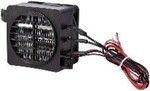 |
| Heat Insulation Foam Tube  (amazon.de, [B09QKDKWNC](https://www.amazon.de/-/en/Conditioning-Insulation-Retardant-Diameter-6mm-50mm/dp/B09QKDKWNC/) 6mmx15mmx1.8m) | 14.25       | amazon.de                        | [B09QKDKWNC](https://www.amazon.de/-/en/Conditioning-Insulation-Retardant-Diameter-6mm-50mm/dp/B09QKDKWNC/) , 6mmx15mmx1.8m |  |
| Thermal Interface Sheet,  Graphite, Self-Adhesive (RS Components, [882-0228](https://benl.rs-online.com/web/p/thermal-pads/8820228/)) | 1           | RS Components                    | [882-0228](https://benl.rs-online.com/web/p/thermal-pads/8820228/) |  |
|                                          |             |                                  |                                          |                                          |
| **PCB Headers and IDC connectors**       |             |                                  |                                          |                                          |
| Straight PCB Header, 2.54mm  Pitch, 6 Way, 2 Row, Through Hole (RS Components, [832-3496](https://benl.rs-online.com/web/p/pcb-headers/8323496/)) | 25          | RS Components                    | [832-3496](https://benl.rs-online.com/web/p/pcb-headers/8323496/) |  |
| 6-Way IDC Connector Socket  for Cable Mount, 2-Row (Farnell, [T812106A101CEU](https://be.farnell.com/amphenol/t812106a101ceu/socket-idc-s-relief-2-54mm-6way/dp/2215245); RS Components, [832-3648](https://benl.rs-online.com/web/p/idc-connectors/8323648/)) | 25          | RS Components                    | [832-3648](https://benl.rs-online.com/web/p/idc-connectors/8323648/) |  |
| Straight Pin Header, 2.54mm  Pitch, 20 Way, 2 Row, Through Hole (RS Components, [673-7534](https://benl.rs-online.com/web/p/pcb-headers/6737534/)) | 15          | RS Components                    | [673-7534](https://benl.rs-online.com/web/p/pcb-headers/6737534/) |  |
| Straight PCB Header, 2.54mm  Pitch, 20 Way, 2 Row, Through Hole (RS Components, [832-3499](https://benl.rs-online.com/web/p/pcb-headers/8323499/)) | 25          | RS Components                    | [832-3499](https://benl.rs-online.com/web/p/pcb-headers/8323499/) |  |
| 20-Way IDC Connector Socket  for Cable Mount, 2-Row (RS Components, [832-3516](https://benl.rs-online.com/web/p/idc-connectors/8323516)) | 50          | RS Components                    | [832-3516](https://benl.rs-online.com/web/p/idc-connectors/8323516) |  |
| Right Angle PCB Header,  2.54mm Pitch,  20 Way, 2 Row (RS  Components, [832-3519](https://benl.rs-online.com/web/p/pcb-headers/8323519)) | 25          | RS Components                    | [832-3519](https://benl.rs-online.com/web/p/pcb-headers/8323519) |  |
| 20 Way Unscreened Flat  Ribbon Cable, 25.4 mm Width, 10m (RS Components, [214-0683](https://benl.rs-online.com/web/p/flat-ribbon-cable/2140683)) | 2           | RS Components                    | [214-0683](https://benl.rs-online.com/web/p/flat-ribbon-cable/2140683) |  |
| Ribbon Cable - 10 wire  (15ft) (Amazon.de, [B076ZDKSVW](https://www.amazon.nl/Platte-kabelband-Bestomz-IDC-kabel-regenboog/dp/B076ZDKSVW/)) | 1           | Amazon.de                        | [B076ZDKSVW](https://www.amazon.nl/Platte-kabelband-Bestomz-IDC-kabel-regenboog/dp/B076ZDKSVW/) |  |
|                                          |             |                                  |                                          |                                          |
| **Tubing Fitting & Manifolds**           |             |                                  |                                          |                                          |
| Straight Threaded Adaptor, M5 Male to   Push In 6 mm, Threaded-to-Tube Connection Style (RS   Components, [121-6039 ](https://benl.rs-online.com/web/p/pneumatic-fittings/1216039/)) | 1  bag      | RS Components                    | [121-6039 ](https://benl.rs-online.com/web/p/pneumatic-fittings/1216039/) |  |
| Straight Threaded-to-Tube   Adapter, R 1/8 Male, Push In 6 mm (RS Components, [771-5080 ](https://benl.rs-online.com/web/p/pneumatic-fittings/7715080/)) | 1 Pack      | RS Components                    | [771-5080 ](https://benl.rs-online.com/web/p/pneumatic-fittings/7715080/) |  |
| Straight Threaded-to-Tube   Adapter, Uni 1/8 Male, Push In 6 mm (RS Components, [771-5100](https://benl.rs-online.com/web/p/pneumatic-fittings/7715100/)) | 1 pack      | RS Components                    | [771-5100](https://benl.rs-online.com/web/p/pneumatic-fittings/7715100/) |  |
| Tube-to-Tube Straight  Union, Push In 6 mm to Push In 6 mm (RS Components, [916-0873](https://benl.rs-online.com/web/p/pneumatic-straight-tube-to-tube-adaptors/9160873/)) | 10          | RS Components                    | [916-0873](https://benl.rs-online.com/web/p/pneumatic-straight-tube-to-tube-adaptors/9160873/) |  |
| Straight Threaded Adaptor,  G 1/4 Male to Push In 6 mm, Threaded-to-Tube Connection Style (RS Components, [125-9600](https://benl.rs-online.com/web/p/pneumatic-fittings/1259600)) | 1           | RS Components                    | [125-9600](https://benl.rs-online.com/web/p/pneumatic-fittings/1259600) |  |
| Distributor Block FR-4-1/8-B (RS Components, [202-3549](https://benl.rs-online.com/web/p/pneumatic-manifold-fittings/2023549)) | 2           | RS Components                    | [202-3549](https://benl.rs-online.com/web/p/pneumatic-manifold-fittings/2023549) |  |
| G 1/4 Brass Corrosion  Resistant Plug (RS  Components, [367-6105](https://benl.rs-online.com/web/p/pneumatic-fitting-accessories/3676105)) | 5           | RS Components                    | [367-6105](https://benl.rs-online.com/web/p/pneumatic-fitting-accessories/3676105) |  |
| G 1/8 Brass Corrosion  Resistant Plug (RS  Components, [367-6098](https://benl.rs-online.com/web/p/pneumatic-fitting-accessories/3676098)) | 5           | RS Components                    | [367-6098](https://benl.rs-online.com/web/p/pneumatic-fitting-accessories/3676098) |  |
| 4 Outlet Pneumatic Manifold  Threaded Fitting, G 1/4 G 1/8 (RS Components, [431-7194](https://benl.rs-online.com/web/p/pneumatic-manifold-fittings/4317194)) | 3           | RS Components                    | [431-7194](https://benl.rs-online.com/web/p/pneumatic-manifold-fittings/4317194) |  |
| Non Return Valve, 6mm Tube  Inlet, 6mm Tube Outlet (RS Components,  [367-0624](https://benl.rs-online.com/web/p/pneumatic-non-return-valves/3670624)) | 10          | RS Components                    | [367-0624](https://benl.rs-online.com/web/p/pneumatic-non-return-valves/3670624) |  |
| Threaded Flow Regulator x  6mm Tube Outlet Port (RS  Components, [197-5337](https://benl.rs-online.com/web/p/pneumatic-function-fittings/1975337)) | 10          | RS Components                    | [197-5337](https://benl.rs-online.com/web/p/pneumatic-function-fittings/1975337) |  |
| Straight Threaded Adaptor,  M3 to Barbed 4 mm, Threaded-to-Tube Connection Style (RS Components, [768-1612](https://benl.rs-online.com/web/p/pneumatic-fittings/7681612/)) | 1           | RS Components                    | [768-1612](https://benl.rs-online.com/web/p/pneumatic-fittings/7681612/) | 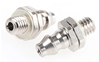 |
| Elbow Threaded Adaptor, M5  Male to Push In 6 mm, Threaded-to-Tube Connection Style (RS Components, [121-6024](https://benl.rs-online.com/web/p/pneumatic-fittings/1216024)) | 1           | RS Components                    | [121-6024](https://benl.rs-online.com/web/p/pneumatic-fittings/1216024) |  |
| Straight Threaded Adaptor,  M5 Male to Push In 6 mm, Threaded-to-Tube Connection Style (RS Components, [121-6039](https://benl.rs-online.com/web/p/pneumatic-fittings/1216039/)) | 1           | RS Components                    | [121-6039](https://benl.rs-online.com/web/p/pneumatic-fittings/1216039/) |  |
| Variable Area Flow Meter,  0.05 L/min → 0.5 L/min, (RS  Components, [198-2896](https://benl.rs-online.com/web/p/flow-sensors/198-2896)) | 6           | RS Components                    | [198-2896](https://benl.rs-online.com/web/p/flow-sensors/198-2896) |  |
| Variable Area Flow Meter,  0.4 L/min → 5 L/min, (RS  Components, [198-2919](https://benl.rs-online.com/web/p/flow-sensors/1982919/)) | 3           | RS Components                    | [198-2919](https://benl.rs-online.com/web/p/flow-sensors/1982919/) |  |
| Y Tube-to-Tube Adapter,  Push In 6 mm x Push In 6 mm x Push In 6 mm (RS Components, [916-0918](https://benl.rs-online.com/web/p/pneumatic-y-tube-to-tube-adaptors/9160918/)) | 10          | RS Components                    | [916-0918](https://benl.rs-online.com/web/p/pneumatic-y-tube-to-tube-adaptors/9160918/) |  |
| Straight Threaded Adaptor,  G 1/8 Male to Push In 6 mm, Threaded-to-Tube Connection Style (RS Components, [121-6009](https://benl.rs-online.com/web/p/pneumatic-fittings/1216009/)) | 2           | RS Components                    | [121-6009](https://benl.rs-online.com/web/p/pneumatic-fittings/1216009/) |  |
| Elbow Threaded Adaptor, M5  Male to Push In 4 mm, Threaded-to-Tube Connection Style (RS  Components,  [200-9346](https://befr.rs-online.com/web/p/pneumatic-fittings/2009346)) | 2           | RS Components                    | [200-9346](https://befr.rs-online.com/web/p/pneumatic-fittings/2009346) |  |
| Straight Threaded Adaptor,  M5 Male to Push In 4 mm, Threaded-to-Tube Connection Style (RS Components, [121-6037](https://benl.rs-online.com/web/p/pneumatic-fittings/1216037)) | 1           | RS Components                    | [121-6037](https://benl.rs-online.com/web/p/pneumatic-fittings/1216037) |  |
| Carbon-Cap Disposable Activated Carbon Capsules(Fisher, [10526921](https://www.fishersci.be/shop/products/whatman-carbon-cap-disposable-activated-carbon-capsules/10526921) | 2           | Fisher                           | [10526921](https://www.fishersci.be/shop/products/whatman-carbon-cap-disposable-activated-carbon-capsules/10526921) |  |
|                                          |             |                                  |                                          |                                          |
| **Solenoid Valves**                      |             |                                  |                                          |                                          |
| Solenoid Valve 3 port(s) ,  NO/NC, 12 V dc, M5 (RS  Components, [838-8660](https://benl.rs-online.com/web/p/solenoid-valves/8388660)) | 4           | RS Components                    | [838-8660](https://benl.rs-online.com/web/p/solenoid-valves/8388660) |  |
| Solenoid Valve 2 port(s) ,  NC, 12 V dc, 1/8in (RS Components,  [840-7020](https://benl.rs-online.com/web/p/solenoid-valves/8407020/)) | 2           | RS Components                    | [840-7020](https://benl.rs-online.com/web/p/solenoid-valves/8407020/) |  |
| DC 4.5V Solenoid Air Gas  valve Release exhaust Valve Switch 2-position 3-way (Aliexpress/Miniyard,  [32881849871 (4.5V)](https://www.aliexpress.com/item/32881849871.html)) | 20          | Aliexpress/Miniyard              | [32881849871 (4.5V)](https://www.aliexpress.com/item/32881849871.html) |  |
| DC 12V Solenoid Air Gas  valve Release exhaust Valve Switch 2-position 3-way (Aliexpress/Miniyard,  [32881849871 (12V)](https://www.aliexpress.com/item/32881849871.html)) | 50          | Aliexpress/Miniyard              | [32881849871 (12V)](https://www.aliexpress.com/item/32881849871.html) |  |
| Two-position Three-way Air  Gas Exhaust Valve Switch DC 12V Solenoid Valve (Aliexpress/Miniyard, [32884679847 (12V)](https://www.aliexpress.com/item/32884679847.html)) | 10          | Aliexpress/Miniyard              | [32884679847 (12V)](https://www.aliexpress.com/item/32884679847.html) |  |
| DC 12V Electric Solenoid  Valve N/C Normally Closed Air Release Valve 2-way for Gas Air Valve (Aliexpress/Motor-house  Store, [1005001840156994 (12V)](https://www.aliexpress.com/item/1005001840156994.html)) | 20          | Aliexpress/Motor-house  Store    | [1005001840156994 (12V)](https://www.aliexpress.com/item/1005001840156994.html) |  |
|                                          |             |                                  |                                          |                                          |
| **Tubing**                               |             |                                  |                                          |                                          |
| PTFE Tube High Temperature  Pressure Resistant   White-OD 2mm x ID 1mm (Aliexpress/NGS  Pneumatic Store, [1005001908520315](https://www.aliexpress.com/item/1005001908520315.html)) | 1           | Aliexpress/NGS Pneumatic  Store  | [1005001908520315](https://www.aliexpress.com/item/1005001908520315.html) |  |
| PTFE Tube High Temperature  Pressure Resistant White-OD 4mm x ID 2mm (Aliexpress/NGS Pneumatic Store, [1005001908520315](https://www.aliexpress.com/item/1005001908520315.html)) | 1           | Aliexpress/NGS Pneumatic  Store  | [1005001908520315](https://www.aliexpress.com/item/1005001908520315.html) |  |
| PTFE Tube High Temperature  Pressure Resistant   White-OD 6mm x ID 4mm (Aliexpress/NGS  Pneumatic Store, [1005001908520315](https://www.aliexpress.com/item/1005001908520315.html)) | 2           | Aliexpress/NGS Pneumatic  Store  | [1005001908520315](https://www.aliexpress.com/item/1005001908520315.html) |  |
| Air Hose Green Nylon 6mm (RS Components, [483-4964](https://benl.rs-online.com/web/p/air-hoses/4834964)) | 1           | RS Components                    | [483-4964](https://benl.rs-online.com/web/p/air-hoses/4834964) |  |
| Air Hose Red Nylon 6mm (RS Components, [483-4964](https://benl.rs-online.com/web/p/air-hoses/4834964)) | 1           | RS Components                    | [843-5029](https://benl.rs-online.com/web/p/air-hoses/8435029) |  |
| Air Hose Blue Nylon 6mm (RS Components, [843-5025](https://benl.rs-online.com/web/p/air-hoses/8435025/)) | 1           | RS Components                    | [843-5025](https://benl.rs-online.com/web/p/air-hoses/8435025/) |  |
| PVC Tubing OD 4mm x ID 2mm (VWR, [228-3831](https://be.vwr.com/store/catalog/product.jsp?catalog_number=228-3831)) | 2           | VWR                              | [228-3831](https://be.vwr.com/store/catalog/product.jsp?catalog_number=228-3831) |  |
| Silicon Tubing ID 1mm x 3  mm OD (VWR, [228-0701](https://be.vwr.com/store/product?keyword=228-0701P%09)) | 2           | VWR                              | [228-0701](https://be.vwr.com/store/product?keyword=228-0701P%09) |  |
| Silicon Tubing ID 1.5mm x 3  mm OD (VWR, [228-1450](https://be.vwr.com/store/catalog/product.jsp?catalog_number=228-1450)) | 2           | VWR                              | [228-1450](https://be.vwr.com/store/catalog/product.jsp?catalog_number=228-1450) |  |
| Silicon Tubing ID 2mm x 4  mm OD (VWR, [228-0704](https://be.vwr.com/store/catalog/product.jsp?catalog_number=228-0704)) | 2           | VWR                              | [228-0704](https://be.vwr.com/store/catalog/product.jsp?catalog_number=228-0704) |  |
| Silicon Tubing ID 4mm x 6  mm OD (VWR, [228-0709](https://be.vwr.com/store/product/nl/577021/slangen-silicone)) | 1           | VWR                              | [228-0709](https://be.vwr.com/store/product/nl/577021/slangen-silicone) |  |
| Silicone rubber laboratory  tubing (Sigmaaldrich  /Merck, [T1914-25FT](https://www.sigmaaldrich.com/EG/en/product/sigma/t1914)) |             | Sigmaaldrich /Merck              | [T1914-25FT](https://www.sigmaaldrich.com/EG/en/product/sigma/t1914) |                                          |
| PVC laboratory tubing I.D. × O.D. 1/8 in. × 1/4 in. |             | Sigmaaldrich /Merck              | [Z280356-1PAK]( https://www.sigmaaldrich.com/BE/en/product/aldrich/z280356) |  |
| PVC laboratory tubing I.D. × O.D. 3/16 in. × 5/16 in. |             | Sigmaaldrich /Merck              | [Z280364-1PAK]( https://www.sigmaaldrich.com/BE/en/product/aldrich/z280364) |  |
| Tygon 3603 Tubing   (6.4mm ID X 9.5mm OD X1.6) (Fisher/Saint-Gobain  [ACF00017](https://www.fishersci.de/shop/products/tygon-e-3603-transparent-tubing-12/15121859)  &  RS Components, [313-9533](https://befr.rs-online.com/web/p/hose-pipes/3139533)) | 2           | Fisher/ Saint-Gobain             | [15121859](https://www.fishersci.de/shop/products/tygon-e-3603-transparent-tubing-12/15121859) |  |
| Transparent Tygon 3603 Hose  Pipe,   (2.4mm ID X 4mm OD X 0.8mm  WT)  (RS  Componentss, [313-9482](https://befr.rs-online.com/web/p/hose-pipes/3139482/)) | 2           | RS Componentss                   | [313-9482](https://befr.rs-online.com/web/p/hose-pipes/3139482/) |  |
| Transparent Tygon 3603 Hose  Pipe,   Metric  (4mm ID X 6mm OD X 1mm WT)   (RS Componentss, [418-9882](https://befr.rs-online.com/web/p/hose-pipes/4189882)) | 2           | RS Componentss                   | [418-9882](https://befr.rs-online.com/web/p/hose-pipes/4189882) |  |
|                                          |             |                                  |                                          |                                          |
| **Glass Bottles**                        |             |                                  |                                          |                                          |
| Laboratory bottles, 100 ML (VWR, [LENZ07105037](https://be.vwr.com/store/product?keyword=LENZ07105037)) | 1           | VWR                              | [LENZ07105037](https://be.vwr.com/store/product?keyword=LENZ07105037) |  |
| Laboratory bottles, 5000 ML (VWR, [215-0057](https://be.vwr.com/store/product/en/544458/laboratory-bottles-round)) | 4           | VWR                              | [215-0057](https://be.vwr.com/store/product/en/544458/laboratory-bottles-round) |  |
| Laboratory bottles, 2000 ML (VWR, [215-1596](https://be.vwr.com/store/product/en/544458/laboratory-bottles-round)) | 4           | VWR                              | [215-1596](https://be.vwr.com/store/product/en/544458/laboratory-bottles-round) |  |
| GL 45 Cap Connection  System, 2 Hose Barb Connectors (Fisher, [15363647](https://www.fishersci.be/shop/products/gl45-screw-cap-pyrex-gl-45-media-lab-bottle-1/15193927)) | 5           | Fisher                           | [15363647](https://www.fishersci.be/shop/products/gl45-screw-cap-pyrex-gl-45-media-lab-bottle-1/15193927) |  |
|                                          |             |                                  |                                          |                                          |
| **Syringe Needles**                      |             |                                  |                                          |                                          |
| BD microlance 3  1,2mm x    40mm (Becton   Dickinson, [304622](https://www.farmaline.be/apotheek/bestellen/bd-microlance-3-naald-18g-12mm-x-40mm-rose-100-stuks/)) | 2           | Becton Dickinson                 | [304622](https://www.farmaline.be/apotheek/bestellen/bd-microlance-3-naald-18g-12mm-x-40mm-rose-100-stuks/) |  |
| BD    microlance 3  1,6mm x  40mm (Becton Dickinson, [300637](https://www.farmaline.be/apotheek/bestellen/bd-microlance-3-naald-16g-1-12-lavendel-300637/)) | 4           | Becton Dickinson                 | [300637](https://www.farmaline.be/apotheek/bestellen/bd-microlance-3-naald-16g-1-12-lavendel-300637/) |  |
| BD    microlance 3  11mm x  40mm (Becton Dickinson, [301500](https://www.farmaline.be/apotheek/bestellen/bd-microlance-3-naald-19g-1-12-rb-11mm-40mm-cr/)) | 2           | Becton Dickinson                 | [301500](https://www.farmaline.be/apotheek/bestellen/bd-microlance-3-naald-19g-1-12-rb-11mm-40mm-cr/) |  |
| BD    microlance 3 0,5 mm x 16 mm (Becton Dickinson, [300600](https://www.farmaline.be/apotheek/bestellen/bd-microlance-3-naalden-25g-58-rb-05x16-mm-1/)) | 2           | Becton Dickinson                 | [300600](https://www.farmaline.be/apotheek/bestellen/bd-microlance-3-naalden-25g-58-rb-05x16-mm-1/) |  |
| BD    microlance 3 0,6 mm x 25 mm (Becton Dickinson, [300800](https://www.farmaline.be/apotheek/bestellen/bd-microlance-3-naalden-23g-1-rb-06x25mm-blauw-1/)) | 1           | Becton Dickinson                 | [300800](https://www.farmaline.be/apotheek/bestellen/bd-microlance-3-naalden-23g-1-rb-06x25mm-blauw-1/) |  |
| BD microlance 3 0,8 mm x 40mm (Becton Dickinson, [304423](https://www.farmaline.be/apotheek/bestellen/bd-microlance-3-naald-21g-1-12-rb-08x40-mm-groen-1/)) | 1           | Becton Dickinson                 | [304423](https://www.farmaline.be/apotheek/bestellen/bd-microlance-3-naald-21g-1-12-rb-08x40-mm-groen-1/) |  |
| BD microlance 3 0,8 mm x 50mm (Becton   Dickinson, [301155](https://www.farmaline.be/apotheek/bestellen/bd-microlance-3-wegwerpnaalden-08mm-x-50mm-ref-301155/)) | 2           | Becton Dickinson                 | [301155](https://www.farmaline.be/apotheek/bestellen/bd-microlance-3-wegwerpnaalden-08mm-x-50mm-ref-301155/) |  |
| BD Plastipak  20ml  Leur (Becton   Dickinson, [300613](https://www.farmaline.be/apotheek/bestellen/bd-plastipak-spuit-luer-20ml-300613/)) | 1           | Becton Dickinson                 | [300613](https://www.farmaline.be/apotheek/bestellen/bd-plastipak-spuit-luer-20ml-300613/) |  |
| BD Plastipak  50ml  Leur (Becton   Dickinson, [300866](https://www.farmaline.be/apotheek/bestellen/wegwerpspuit-bd-zonder-naald-luer-50-60-ml-300866/)) | 1           | Becton Dickinson                 | [300866](https://www.farmaline.be/apotheek/bestellen/wegwerpspuit-bd-zonder-naald-luer-50-60-ml-300866/) |  |
|                                          |             |                                  |                                          |                                          |
| **Luer Fittings**                        |             |                                  |                                          |                                          |
| Nylon Female Luer Cap (Fisher, [11780199](https://www.fishersci.be/shop/products/nylon-female-luer-cap/11780199)) | 2           | Fisher                           | [11780199](https://www.fishersci.be/shop/products/nylon-female-luer-cap/11780199) |  |
| Nylon Male Luer Lock Plug (Fisher, [11790199](https://www.fishersci.be/shop/products/nylon-male-luer-lock-plug/11790199)) | 2           | Fisher                           | [11790199](https://www.fishersci.be/shop/products/nylon-male-luer-lock-plug/11790199) |  |
| Luer Accessory, Snap Luer   Lock Rings, (Cole-Parmer ,    [GZ-45518-74](https://www.coleparmer.de/i/masterflex-fitting-polypropylene-straight-snap-luer-lock-ring-25-pk/4551874?searchterm=GZ-45518-74)) | 4           | Cole-Parmer                      | [GZ-45518-74](https://www.coleparmer.de/i/masterflex-fitting-polypropylene-straight-snap-luer-lock-ring-25-pk/4551874?searchterm=GZ-45518-74) |  |
| Polycarbonate Female Luer   Fitting ( Female luer x female luer adapter) (Fisher, [13477728](https://www.fishersci.be/shop/products/polycarbonate-female-luer-fitting-5/13477728)) | 2           | Fisher                           | [13477728](https://www.fishersci.be/shop/products/polycarbonate-female-luer-fitting-5/13477728) |  |
| Polycarbonate Female Luer   Fitting ¼ (Fisher, [13518810](https://www.fishersci.be/shop/products/polycarbonate-female-luer-fitting-5/13518810)) | 2           | Fisher                           | [13518810](https://www.fishersci.be/shop/products/polycarbonate-female-luer-fitting-5/13518810) |  |
|                                          |             |                                  |                                          |                                          |
| Nylon Male Luer Fitting   1/4 (Fisher, [11720089](https://www.fishersci.be/shop/products/cole-parmer-nylon-male-luer-fitting/11720089)) | 1           | Fisher                           | [11720089](https://www.fishersci.be/shop/products/cole-parmer-nylon-male-luer-fitting/11720089) |  |
| Polycarbonate Female Luer   Fitting 1/16 (Fisher, [15819911](https://www.fishersci.be/shop/products/polycarbonate-female-luer-fitting-5/15819911)) | 2           | Fisher                           | [15819911](https://www.fishersci.be/shop/products/polycarbonate-female-luer-fitting-5/15819911) |  |
| Polypropylene Male Luer   Adapter 1/16 (Fisher, [15240428](https://www.fishersci.be/shop/products/polypropylene-male-luer-adapter-5/15240428)) | 4           | Fisher                           | [15240428](https://www.fishersci.be/shop/products/polypropylene-male-luer-adapter-5/15240428) |  |
| Male Luer with lock ring x   1/16" hose barb (Cole-Parmer ,    [GZ-45518-00](https://www.coleparmer.de/i/masterflex-fitting-polypropylene-straight-male-luer-lock-to-hosebarb-adapter-1-16-id-25-pk/4551800?searchterm=GZ-45518-00)) | 4           | Cole-Parmer                      | [GZ-45518-00](https://www.coleparmer.de/i/masterflex-fitting-polypropylene-straight-male-luer-lock-to-hosebarb-adapter-1-16-id-25-pk/4551800?searchterm=GZ-45518-00) |  |
| Polycarbonate Female Luer   Fitting 3/16 (Fisher, [13538810](https://www.fishersci.be/shop/products/polycarbonate-female-luer-fitting-5/13538810)) | 2           | Fisher                           | [13538810](https://www.fishersci.be/shop/products/polycarbonate-female-luer-fitting-5/13538810) |  |
| Polycarbonate Male Luer   Adapter 3/16 (Fisher, [15216088](https://www.fishersci.be/shop/products/polycarbonate-male-luer-adapter-3/15216088)) | 2           | Fisher                           | [15216088](https://www.fishersci.be/shop/products/polycarbonate-male-luer-adapter-3/15216088) | 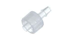 |
| Male Luer with lock ring x   3/32" hose barb, (Cole-Parmer ,   [GZ-45518-02](https://www.coleparmer.de/i/masterflex-fitting-polypropylene-straight-male-luer-lock-to-hosebarb-adapter-3-32-id-25-pk/4551802?searchterm=GZ-45518-02)) | 4           | Cole-Parmer                      | [GZ-45518-02](https://www.coleparmer.de/i/masterflex-fitting-polypropylene-straight-male-luer-lock-to-hosebarb-adapter-3-32-id-25-pk/4551802?searchterm=GZ-45518-02) |  |
| Polypropylene Male Luer   Adapter 3/32 (Fisher, [15260428](https://www.fishersci.be/shop/products/polypropylene-male-luer-adapter-5/15260428)) | 4           | Fisher                           | [15260428](https://www.fishersci.be/shop/products/polypropylene-male-luer-adapter-5/15260428) |  |
| Female Luer Fitting for   1/16" ID Tubing (World   Percision Instruments, [13156-100](https://www.wpiinc.com/13156-100-female-luer-fitting-for-1-16-id-tubing)) | 2           | World Percision   Instruments    | [13156-100](https://www.wpiinc.com/13156-100-female-luer-fitting-for-1-16-id-tubing) |  |
| Male Luer Fitting for   1/16" ID Tubing  (World Percision   Instruments, [13160-100](https://www.wpiinc.com/13160-100-male-luer-fitting-for-1-16-id-tubing)) | 1           | World Percision   Instruments    | [13160-100](https://www.wpiinc.com/13160-100-male-luer-fitting-for-1-16-id-tubing) |  |
| Female Luer Fitting for   3/32" ID Tubing (World Percision Instruments, [13157-100](https://www.wpiinc.com/13157-100-female-luer-fitting-for-3-32-id-tubing)) | 2           | World Percision   Instruments    | [13157-100](https://www.wpiinc.com/13157-100-female-luer-fitting-for-3-32-id-tubing) |  |
| Male Luer Fitting for   3/32" ID Tubing (World   Percision Instruments, [13161-100](https://www.wpiinc.com/13161-100-male-luer-fitting-for-3-32-id-tubing)) | 1           | World Percision   Instruments    | [13161-100](https://www.wpiinc.com/13161-100-male-luer-fitting-for-3-32-id-tubing) |  |
| 3-Port Infusion Y Swivel   Thread (World   Percision Instruments, [14048-20](https://www.wpiinc.com/14048-20-3-port-infusion-y-swivel-thread)) | 1           | World Percision   Instruments    | [14048-20](https://www.wpiinc.com/14048-20-3-port-infusion-y-swivel-thread) | 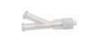 |
| 4-Port Infustion Y Swivel   Thread (World   Percision Instruments, [14047-10](https://www.wpiinc.com/14047-10-4-port-infustion-y-swivel-thread)) | 1           | World Percision   Instruments    | [14047-10](https://www.wpiinc.com/14047-10-4-port-infustion-y-swivel-thread) |  |
| Polycarbonate Female Luer   Fitting (Female x Female x Female) (Fisher, [13487728](https://www.fishersci.be/shop/products/polycarbonate-female-luer-fitting-5/13487728)) | 2           | Fisher                           | [13487728](https://www.fishersci.be/shop/products/polycarbonate-female-luer-fitting-5/13487728) | 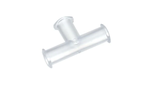 |
| Tubing connectors, T-type (VWR, [COWI016.1102.5.2](https://be.vwr.com/store/product?keyword=COWI016.1102.5.2)) | 5pkg        | VWR                              | [COWI016.1102.5.2](https://be.vwr.com/store/product?keyword=COWI016.1102.5.2) | 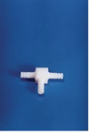 |
| T-CONNECTOR FOR SILICONE   TUBING (Digi-Key, [1528-4662-ND](https://www.digikey.be/en/products/detail/adafruit-industries-llc/4662/13170962)) | 4           | Digi-Key                         | [1528-4662-ND](https://www.digikey.be/en/products/detail/adafruit-industries-llc/4662/13170962) |  |
| Tubing connectors,   straight_ 2,0 mm hole (VWR, [229-0713](https://be.vwr.com/store/product?keyword=229-0713)) | 2Pkg        | VWR                              | [229-0713](https://be.vwr.com/store/product?keyword=229-0713) |  |
| Tubing connectors,   straight_3,5 mm hole (VWR, [229-0714](https://be.vwr.com/store/product?keyword=229-0714)) | 2pkg        | VWR                              | [229-0714](https://be.vwr.com/store/product?keyword=229-0714) |  |
| 1-Way Stopcock - Luer   Lock, Polyacetal & Polycarbonate (World Percision Instruments, [14038-10](https://www.wpiinc.com/14038-10-1-way-stopcock-luer-lock-polyacetal-polycarbonate)) | 1           | World Percision   Instruments    | [14038-10](https://www.wpiinc.com/14038-10-1-way-stopcock-luer-lock-polyacetal-polycarbonate) |  |
| 4-way Stopcock (Fisher, [11742683](https://www.fishersci.be/shop/products/4-way-stopcock/11742683)) | 2           | Fisher                           | [11742683](https://www.fishersci.be/shop/products/4-way-stopcock/11742683) |  |
| Polycarbonate Manifolds   (3  ports) (Fisher, [11715279](https://www.fishersci.be/shop/products/polycarbonate-manifolds-luer-fittings-5/11715279)) | 2           | Fisher                           | [11715279](https://www.fishersci.be/shop/products/polycarbonate-manifolds-luer-fittings-5/11715279) |  |
| Polycarbonate Manifolds (4   ports) (Fisher, [11785239](https://www.fishersci.be/shop/products/polycarbonate-manifolds-luer-fittings-5/11785239)) | 2           | Fisher                           | [11785239](https://www.fishersci.be/shop/products/polycarbonate-manifolds-luer-fittings-5/11785239) |  |
| Polycarbonate Manifolds   (5  ports) (Fisher, [11700529](https://www.fishersci.be/shop/products/polycarbonate-manifolds-luer-fittings-5/11700529)) | 10          | Fisher                           | [11700529](https://www.fishersci.be/shop/products/polycarbonate-manifolds-luer-fittings-5/11700529) |  |
| Check Valve HDPE (VWR, [NALG6120-0010](https://be.vwr.com/store/catalog/product.jsp?catalog_number=NALG6120-0010)) | 1           | VWR                              | [NALG6120-0010](https://be.vwr.com/store/catalog/product.jsp?catalog_number=NALG6120-0010) |  |
| Check Valve, Female Luer   Lock Inlet, Male Luer Lock Outlet (World Percision Instruments, [14039-10](https://www.wpiinc.com/14039-10-check-valve-female-luer-lock-inlet-male-luer-lock-outlet)) | 3           | World Percision   Instruments    | [14039-10](https://www.wpiinc.com/14039-10-check-valve-female-luer-lock-inlet-male-luer-lock-outlet) |  |
| One-Way Luer Check Valves (Fisher, [11909638](https://www.fishersci.be/shop/products/san-one-way-luer-fitting/11909638)) | 3           | Fisher                           | [11909638](https://www.fishersci.be/shop/products/san-one-way-luer-fitting/11909638) |  |
| Luer Valve Assortment Kit (World Percision   Instruments, [14011](https://www.wpiinc.com/14011-luer-valve-assortment-kit)) | 1           | World Percision   Instruments    | [14011](https://www.wpiinc.com/14011-luer-valve-assortment-kit) |  |
| Luer-to-Tubing Coupler   Assortment Kit (polypropylene) (World Percision Instruments, [504954](https://www.wpiinc.com/var-504954-luer-to-tubing-coupler-assortment-kit)) | 1           | World Percision   Instruments    | [504954](https://www.wpiinc.com/var-504954-luer-to-tubing-coupler-assortment-kit) |  |
| Metal Dispensing   Needlewith Blunt Tip, (1" x 11G) (Aliexpress, [1005003616968306](https://www.aliexpress.com/item/1005003616968306.html)) | 7           | Aliexpress                       | [1005003616968306](https://www.aliexpress.com/item/1005003616968306.html) |  |
| Female Luer Bulkhead   Fitting (Aliexpress/MicroFluidics   Store, [RH-C-M024](https://www.aliexpress.com/item/4000025751111.html)) | 1           | Aliexpress/MicroFluidics   Store | [RH-C-M024](https://www.aliexpress.com/item/4000025751111.html) | 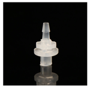 |
|                                          |             |                                  |                                          |                                          |
| **Lightings LEDs**                       |             |                                  |                                          |                                          |
| DC 12V Blue Dimmable Flexible LED  Strips 120 LEDs Per Meter 8mm Width (LEDLightsWorld, [5M-HK-8MM-F3528Blue60-NW-12](https://ledlightsworld.com/products/colorful-dc-12v-dimmable-smd3528-600-flexible-led-strips-120-leds-per-meter-8mm-width-600lm-per-meter?variant=17870690320474)) |             | LEDLightsWorld                   | [5M-HK-8MM-F3528Blue60-NW-12](https://ledlightsworld.com/products/colorful-dc-12v-dimmable-smd3528-600-flexible-led-strips-120-leds-per-meter-8mm-width-600lm-per-meter?variant=17870690320474) |  |
| DC 12V Red Dimmable Flexible LED Strips  120 LEDs Per Meter 8mm (LEDLightsWorld, [5M-HK-8MM-F3528Red60-NW-12](https://ledlightsworld.com/products/colorful-dc-12v-dimmable-smd3528-600-flexible-led-strips-120-leds-per-meter-8mm-width-600lm-per-meter?variant=17870690189402)) |             | LEDLightsWorld                   | [5M-HK-8MM-F3528Red60-NW-12](https://ledlightsworld.com/products/colorful-dc-12v-dimmable-smd3528-600-flexible-led-strips-120-leds-per-meter-8mm-width-600lm-per-meter?variant=17870690189402) |  |
| DC 12V Green Dimmable Flexible LED  Strips 120 LEDs Per Meter 8mm Width (LEDLightsWorld, [5M-HK-8MM-F3528Green60-WW-12](https://ledlightsworld.com/products/colorful-dc-12v-dimmable-smd3528-600-flexible-led-strips-120-leds-per-meter-8mm-width-600lm-per-meter?variant=17870690451546)) |             | LEDLightsWorld                   | [5M-HK-8MM-F3528Green60-WW-12](https://ledlightsworld.com/products/colorful-dc-12v-dimmable-smd3528-600-flexible-led-strips-120-leds-per-meter-8mm-width-600lm-per-meter?variant=17870690451546) |  |
| DC12V IR InfraRed (850nm) Flexible LED Strips 60LEDs Per Meter (LEDLightsWorld, [5M-HK-10MM-F5050-850-30-NW-IR-12](https://ledlightsworld.com/products/dc12v-smd5050-300-ir-infrared-850nm-940nm-tri-chip-flexible-led-strips-60leds-14-4w-per-meter)) |             | LEDLightsWorld                   | [5M-HK-10MM-F5050-850-30-NW-IR-12](https://ledlightsworld.com/products/dc12v-smd5050-300-ir-infrared-850nm-940nm-tri-chip-flexible-led-strips-60leds-14-4w-per-meter) | 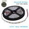 |
| DC 12V Dimmable Flexible LED Strips 60 LEDs Per Meter 10mm Width  (Natural White) (LEDLightsWorld, [5M-HK-10MM-F5050NW30-NW-CRI80-12](https://ledlightsworld.com/products/dc-12v-dimmable-smd5050-300-flexible-led-strips-60-leds-per-meter-10mm-width-900lm-per-meter-1?variant=17867978211418)) |             | LEDLightsWorld                   | [5M-HK-10MM-F5050NW30-NW-CRI80-12](https://ledlightsworld.com/products/dc-12v-dimmable-smd5050-300-flexible-led-strips-60-leds-per-meter-10mm-width-900lm-per-meter-1?variant=17867978211418) | 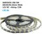 |
| RGB LED Strip Light (LEDSupply,  [R6060-IP20-RGBS](https://www.ledsupply.com/led-strips/side-emitting-12v-led-strip-lights)) |             | LEDSupply                        | [R6060-IP20-RGBS](https://www.ledsupply.com/led-strips/side-emitting-12v-led-strip-lights) | 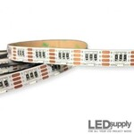 |
| Luxeon Rebel Color LEDs_trible-3_RED/627nm (LEDSupply, [07007-PD000-F](https://www.ledsupply.com/leds/luxeon-rebel-color-leds)) |             | LEDSupply                        | [07007-PD000-F](https://www.ledsupply.com/leds/luxeon-rebel-color-leds) | 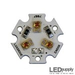 |
| Single Color Mini Rotary Dimmer (LEDSupply, [GL-DIM1002](https://www.ledsupply.com/led-dimmers/mini-rotary-knob-dimmer)) |             | LEDSupply                        | [GL-DIM1002](https://www.ledsupply.com/led-dimmers/mini-rotary-knob-dimmer) |  |
| DynaOhm DC Resistor Power Module 20mA (LEDSupply,   [04006-020](https://www.ledsupply.com/led-drivers/dynaohm-dc-resistor-power-module)) |             | LEDSupply                        | [04006-020](https://www.ledsupply.com/led-drivers/dynaohm-dc-resistor-power-module) | 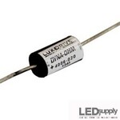 |
| DynaOhm DC Resistor Power Module 30mA (LEDSupply,   [04006-030](https://www.ledsupply.com/led-drivers/dynaohm-dc-resistor-power-module)) |             | LEDSupply                        | [04006-030](https://www.ledsupply.com/led-drivers/dynaohm-dc-resistor-power-module) | 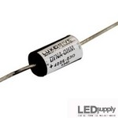 |
| BuckToot DC LED Driver 350mA (LEDSupply,  [07027-D-350](https://www.ledsupply.com/led-drivers/bucktoot-dc-led-driver)) |             | LEDSupply                        | [07027-D-350](https://www.ledsupply.com/led-drivers/bucktoot-dc-led-driver) |  |
| BuckPuck DC LED Drivers 1000mA (LEDSupply,  [03023-D-E-1000P](https://www.ledsupply.com/led-drivers/buckpuck-dc-led-drivers)) |             | LEDSupply                        | [03023-D-E-1000P](https://www.ledsupply.com/led-drivers/buckpuck-dc-led-drivers) |  |
| 5mm LED - Infrared (IR) 940nm 30 Degree Viewing Angle (LEDSupply, [L2-0-IR5TH30-1](https://www.ledsupply.com/leds/5mm-led-infrared-940nm-30-degree-viewing-angle)) |             | LEDSupply                        | [L2-0-IR5TH30-1](https://www.ledsupply.com/leds/5mm-led-infrared-940nm-30-degree-viewing-angle) |  |
| Thermal Adhesive Tape for 10 mm Square LED Assemblies - (Luxeon  Star LEDs, [LXT-R-10](https://www.luxeonstar.com/pre-cut-thermal-tape-for-10mm-square-bases-10pcs)) |             | Luxeon Star LEDs                 | [LXT-R-10](https://www.luxeonstar.com/pre-cut-thermal-tape-for-10mm-square-bases-10pcs) |  |
| Thermal Adhesive Tape for 20 mm Star LED Assemblies  (Luxeon Star LEDs, [LXT-S-12](https://www.luxeonstar.com/pre-cut-thermal-tape-for-20mm-hex-bases-12pcs)) |             | Luxeon Star LEDs                 | [LXT-S-12](https://www.luxeonstar.com/pre-cut-thermal-tape-for-20mm-hex-bases-12pcs) |  |
| Saber 10 mm Square Blank Aluminum MCPCB Base For Rebel LEDs (Luxeon  Star LEDs, [LXB-RS10A](https://www.luxeonstar.com/saber-10mm-square-blank-mcpcb-base-for-rebel-leds)) |             | Luxeon Star LEDs                 | [LXB-RS10A](https://www.luxeonstar.com/saber-10mm-square-blank-mcpcb-base-for-rebel-leds) | 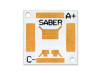 |
| Saber 20 mm Tri-Star Blank Aluminum MCPCB Base For Rebel LEDs (Luxeon  Star LEDs, [LXB-RT20B](https://www.luxeonstar.com/saber-20mm-tri-star-mcpcb-base-for-rebel-leds)) |             | Luxeon Star LEDs                 | [LXB-RT20B](https://www.luxeonstar.com/saber-20mm-tri-star-mcpcb-base-for-rebel-leds) |  |
| TRU  COMPONENTS 1577375 LED bedraad Rood Rond 3 mm 12500 mcd 25 ° 20 mA | 25          | Conrad****                       | [1577375](https://www.conrad.be/nl/p/tru-components-1577375-bedrade-led-rood-rond-3-mm-12500-mcd-25-20-ma-1577375.html) |  |
| IR-diode  850 nm 30 ° 3 mm  (Conrad, [1577522](https://www.conrad.be/nl/p/tru-components-1577522-ir-diode-850-nm-30-3-mm-radiaal-bedraad-1577522.html)) | 20          | Conrad                           | [1577522](https://www.conrad.be/nl/p/tru-components-1577522-ir-diode-850-nm-30-3-mm-radiaal-bedraad-1577522.html) |  |
| IR-diode  940 nm 30 ° 3 mm (Conrad, [1577525](https://www.conrad.be/nl/p/tru-components-1577525-ir-diode-940-nm-30-3-mm-radiaal-bedraad-1577525.html)) | 20          | Conrad                           | [1577525](https://www.conrad.be/nl/p/tru-components-1577525-ir-diode-940-nm-30-3-mm-radiaal-bedraad-1577525.html) | 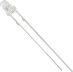 |
| 940Nm IR LED, 3mm TSAL4400  Vishay (RS Components, [699-7629 ](https://benl.rs-online.com/web/p/ir-leds/6997629/)) | 1 pack = 25 | RS Components                    | [699-7629](https://benl.rs-online.com/web/p/ir-leds/6997629/) |  |
| 940Nm IR LED, 5mm TSAL6100  Vishay (RS Components, [699-7626 ](https://benl.rs-online.com/web/p/ir-leds/6997626/)) | 1 pack = 25 | RS Components                    | [699-7626 ](https://benl.rs-online.com/web/p/ir-leds/6997626/) |  |
| LED LUXEON REBEL BLUE SMD                | 200         | Digi-Key                         | [LXML-PB01-0040](https://www.digikey.be/nl/products/detail/lumileds/LXML-PB01-0040/3961252) |  |
| LED LUXEON REBEL GREEN SMD               | 100         | Digi-Key                         | [LXML-PM01-0100](https://www.digikey.be/nl/products/detail/lumileds/LXML-PM01-0100/3961259) |  |
| Lumileds LXM2-PD01-0050,  LUXEON Rebel 627 nm Red High-Power LED, 3-Pin SMD package | 200         | Digi-Key                         | [LXM2-PD01-0050](https://www.digikey.be/nl/products/detail/lumileds/LXM2-PD01-0050/3961247) |  |
| Flexible Lightpipe FLX 08  LED Tubes / FLX_08 VCC | 50          | Mouser                           | [593-FLX08](https://www.mouser.be/ProductDetail/VCC/FLX_08?qs=%2FvU7ivDUWU%2FE3tZ6zoTTZA%3D%3D) |  |
| 3 mm 5 mm LED  with 5 colors (amazon.de, [110040_SML](https://www.amazon.de/-/en/APTWONZ-Diffuse-Emitting-Electronic-Components/dp/B06X3VT6TD)) | 1           | amazon.de                        | [110040_SML](https://www.amazon.de/-/en/APTWONZ-Diffuse-Emitting-Electronic-Components/dp/B06X3VT6TD) |  |
|                                          |             |                                  |                                          |                                          |
|                                          |             |                                  |                                          |                                          |
