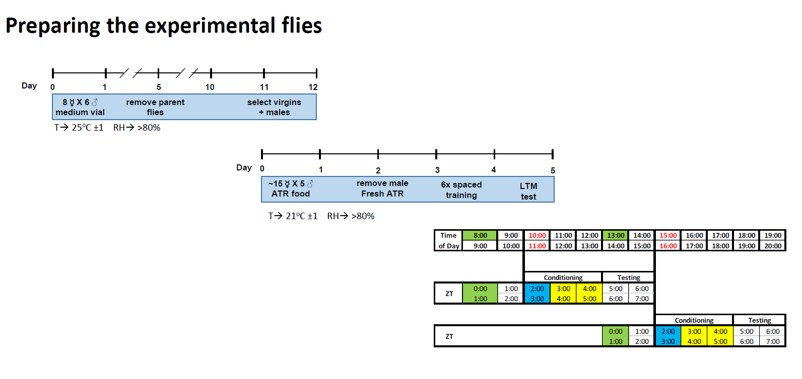

# **Behavior-Monitoring_IDOC_Operation**

** **

### **Fly maintenance, crosses and collection **

### **Preparing the experimental flies**

-         Maintain fly stocks for parents collection at 21 °C - 25 °C, controlled humidity under a 12:12 h light/dark cycle in standard fly food vials. 
-         Select virgin females of UAS  x males of Gal4 in standard fly food vials.
-         Allow parents flies to mate and lay eggs for 3–5 d, and then remove parent flies and wait for progeny. 
-         Collect flies (~15 females + 5 males) on a CO2 fly pad under a stereomicroscope with blue light filter Lighting Insert Filter (Blue) (Fisher, [11830963](https://www.fishersci.be/shop/products/insert-filter-10/11830963))
-         Make sure flies are of normal size with fully expanded wings. Exclude sick flies.
-         Place flies into a standard food vial with ATR (400µM).
-         Maintain collected flies at Tritech incubators (21±°C , 12:12 h blue light/dark cycle and >90% humidity for one to two days to letting them to mate, we only test mated female flies.
-         Select only mated female flies into a new standard food vial with ATR.  (See next step for Preparing ATR-food-vial)
-         Move flies to new standard food vial with ATR at least 24 h before experiment. 
-         Use adult flies that are age-matched and in the range of 4-5 days post-eclosion for IDOC and sleep assays.

### **Preparing ATR-food-Vial** & **ATR-normal-food-tube**

- Place 200 ml of fresh food in a microwave oven and heat it for about 45s or until start melting. 
- Stir the food with a pipette to remove clumps and heat it for a few more seconds until melted.
- Wait until the temperature of the food become around 50oC, use thermometer [(e.g., 620-0787)](https://nl.vwr.com/store/product/573889/milieuvriendelijke-thermometers-easy-read) to monitor the temperature.
- Add the stock of ATR 4ul /1 ml food in this case if you prepared 200-ml you will need 800ul of 100mM ATR stock solution.  **Note:** ATR stock was prepared in ethanol with 100mM concentration. Then split into small aliquots tubes either 200ul for 50-ml food preparation or 800ul for 200-ml food preparation.
- stir and mix the ATR food very well until you see the color is more yellowish.
- Transfer the food into small vials about 5ml for each tube.
- Keep tubes in the room temperature for few minutes before moving to the 4oC storage room. Cover the tubes with aluminum foil to protect from light.
- You can keep a small portion of the above prepared food to prepare Normal-ATR-food-agar-tube for some experiments e.g. Appetitive memory. 

### **Preparing ATR-sucrose-Agar-tubes**

- Place 50ml of fresh or refrigerated 5% sucrose/2% fly agar in a microwave oven and heat it for about 60s or until melts completely. Before you start be sure to heat up the wax.

-  Wait until the temperature of the food become around 50ºC, use thermometer [(e.g., 620-0787)](https://nl.vwr.com/store/product/573889/milieuvriendelijke-thermometers-easy-read) to monitor the temperature.

- Add the stock of ATR 4ul /1 ml food in this case if you prepared 50-ml you will need 200ul of ATR stock solution. 

- Stir and mix the ATR-sucrose-Agar very well until you see the color is more yellowish.

- Pour the mixed solution to a petri dish 50-ml good for ~150 tubes, put groups of tubes bundled with rubber band in the dish. Try to make media ~1 cm high and make sure tubes are vertical. Wrap the tubes and container with aluminum foil to protect from light. Keep the wrapped tubes and container at the bench or you can move it to 4ºC for at least 30 min.

- Carefully separate tubes from sucrose/agar.  Using a paper wipe each tube, completely remove all the remaining Agar media. use the lab standard protocol to cover the Agar end with paraffin wax.

  ​

  ​

  ### **Start of an experiment in IDOC**

  ​

  1. Prepare the experimental flies as described above.

  ​

  ​                                                                  Suggested plan for long term memory experiment

  ​

  2. **Checklist** before  starting your experiments :

  - [ ] Turn on Main Power and Check the water level in water bath.

  - [ ] Balanced airflow (inflow & outflow) see photo, adjust flow regulators while no air connected to the manifolds of the setup before you connect the chambers, then double check after connecting chambers to the inflow and outflow system.

  - [ ] Mineral oil and Odor bottles are in the correct places and connected properly and  with no leakage. check That all leur all locked and connected correctly as mapped with color coded tubes.  [Blue marker --> odor A] &  [Red markers --> odor B] &  [black markers --> Air).

  - [ ] If you cleaned the setup be sure the there is no remaining water in the setup or odor delivery system (use air-gun to remove remaining water in all tubing).  this can lead to unbalance chambers

  - [ ] for spaced training; be sure to spray the cotton/yarn with water, and remove the excessive water to close the food tubes between training sessions.

  - [ ] Main Power supply of the solenoid valves and infrared is ON and connected to the controller board (12.00 VDC).

  - [ ] Electric shock power supply is ON and connected to the controller board (75.00 VDC). Switch to current mode mA Check that the current is (000), if you read any value that means that the circuit is ON. Check the relay board

  - [ ] Red LEDs (627 nm) power supply is ON and connected to the controller board  (this is critical step) be sure that the power supply set to the maximum voltage of the power supply all of the current limited and light intensity were  calibrated at the maximum power from the power supply. even minor change will change the total power delivered to the power supply.

        e.g. 

        $input.voltage = 31.3 V  $

        $Current.needed = 7 A$

        $Total.power =  VxA = 31.3x3.5 = 219.1W $

        if the input voltage changed to less amount for example 25V the total power then will be drifted to 175 watt  this power can change the light intensity few  micro watts which can affect the behavior of the fly.

        ​

  - [ ] Check Air/odor solenoid valves via test buttons or switch while no air is running from the main valve.   

  - [ ] Exhaust system is working properly to avoid pressure in the tubing and to remove any extra odor after stopping odor delivery.

  - [ ] Arduino is connected (ON LED on board)

  - [ ] Camera is connected, and you can see images in Pylon software

  - [ ] Paradigm is ready and pre tested especially for new protocols. The software is online communication 

  - [ ] When ready and all of the above list  checked , switch from continuous air flow of the air cleaning system to air/odor delivery system controlled by the Arduino   ---> must switch the manual valves [4-way Stopcock] to deliver air and odors to the IDOC setup. (see diagram) (critical step). if you forgot to change the valves first no odors will be delivered to the chambers when you run your protocol. Additionally the cleaned air is running with higher air flow than the inflow controlled by the  air/odor delivery system. accumulate the air in the pressure while no vacuum running to suck the air will generate a pressure on the vacuum system leading to reverse back of the water into the vacuum tubing. so it is necessary to switch to 

3. Use aspiration tubes to gently suck the fly to the inlet gate of the recording chamber. Loading female fly (ZT 2-4) into chamber. When Loading the fly, pick up the flies that can fly to the top of food vial.
4. Mount chambers to their recessed place in the chamber holders of the setup.
5. Secure the chambers and  check the connection of the electric shock electrodes 
6. Connect inflow tubing to the chambers, tubing with red rings are connected to the right side while the blue rings connected to the left side.
7. We use active vacuum: connect the outlet tubing to the fitting luers of the suction system. bend the tubing by the way not block the visualization of the ROI during tracking.
8. Double Check the electric connection to ITO chambers via the lead cable. Connect the tip of the test lead to the end of each electrodes. you will see that the blue light target on the top of the light box is ON when good connection established while blinking or OFF if poor connection exist. 
9. Do not forget to return the toggle switch back to the bottom after checking the ITO electrodes connections. 
10. Double check that the 4-way Stopcock is directed to the inflow coming only from the air delivery system
11. Start an experiment  (software) see  software section
12. Spaced training requires moving trained flies to food tube between training sessions. After each  electric shock session, relocate the fly from chamber to sucrose plus retina tube with wet cotton/yarn. (better to spray the cotton/yarn with water, and remove the excessive water). Just keep flies for few minutes in the food tubes. Then reload the flies into the recording chambers and replace  the chamber on IDOC system. Connect all the tubing.
13. After training (e.g. 6 times electric shock), place the conditioned fly into a fresh sucrose tube with retina.
14. Put the fly into ethoscope arena and track sleep for 24 hours for long term memory testing

##  **Troubleshooting** 

- **No IR-backlighting is detected by the tracking camera**

  --> Check the power supply (input voltage ) of the IR-LED  is ON. Use the side switch to run the IR-LED manual, if it is illuminated then consider miscommunication between Arduino and the relay board. change the relay, we have many of the them. see how to replace a relay.

- **Very dim IR-backlighting detected by the camera** 

  --> check the power supply

  --> check the exposure time of the camera set to 25.000 if not.

- **No region of interests (ROIs) is detected by the camera.**

  --> check that three IR-LED targets are ON and nothing blocking them at the edge of the light boxes. The power supply of the IR-Target is connected to the same power supply of the Backlighting IR. So if you can see the chambers ROIs then you can exclude a power problem then you need to think about weather the setup targets are shifted away from the center of the visualization window either  because the camera mounting base has been moved or the setup has been shifted a bit. then considering re-center the camera and the set up.

* **Optogenetic-LED does not run**

  --> Check the power supply connection. Move to the external mode to test.  Check that the Arduino is powered.  

* **IR-LED backlighting does not run in both sides of the setup** 

--> Check the power supply connection.  The power supply of the IR-Target is connected to the same power supply of the backlighting IR. So if you can see the three targets then you can exclude a power problem then you need to think about weather the socket that deliver the power to the IR-LED is connected in a proper way for both sides. JST PH 2 Pin Female Cable (Digi-Key, [1528-1126-ND](https://www.digikey.be/product-detail/en/adafruit-industries-llc/261/1528-1126-ND/5353586)) & JST PH 2 pin cable male Header (Digi-Key, [1528-2617-ND](https://www.digikey.be/product-detail/en/adafruit-industries-llc/3814/1528-2617-ND/9380221)) are used to connect such LEDs.

**IR-LED backlighting does not run in one side of the setup** 

--> Check the power supply connection for this LED-string. JST PH 2 Pin Female Cable (Digi-Key, [1528-1126-ND](https://www.digikey.be/product-detail/en/adafruit-industries-llc/261/1528-1126-ND/5353586)) & JST PH 2 pin cable male Header (Digi-Key, [1528-2617-ND](https://www.digikey.be/product-detail/en/adafruit-industries-llc/3814/1528-2617-ND/9380221)) are used to connect such LEDs. most likely accidentally they unplugged. 

- **Optogenetics-LED brightness does not change while turning  knob potentiometer or while increasing PWM or external input voltage **

  --> be sure that the input voltage is higher enough to reach the maximum brightness, the it can be modulated via PWM and regulated and limited by 

- **The brightness of the optogenetic-LEDs is too small** 

 --> increase the current  limit. Check the current limit and adjust it if necessary. The LED current limit control potentiometer is placed on the front side of the driver. A screwdriver is necessary to adjust the LED current limit to 350mA.

- **Post training test shows that most or none of the the fly  have been conditioned.**

  -->  This is a bit tricky. 

  - First look for recorded video during training paradigm and check weather the electrical shock IR-LED markers are illuminated and pulsed the same numbers as  you set into your paradigm. If no blinking IR-LED markers then you figured out the problem. (due to no electric shock delivery). Check  that you returned the toggle switch back to the bottom after checking the ITO electrodes connections. use the test button in the side of the Arduino control unit   to deliver power to the setup, if the markers illuminated then consider miscommunication between Arduino and the relay board. very rare but possible that you need to replace the relay.

  - when the relay is damaged due to shortcut or overload you might notice that the electric shocks  IR-LED indicators is either ON all of the time or cannot be tracked by the camera when the signal delivered by the Arduino or just using the mechanical test button. So you will need definitely to replace it. 

    ​

  - Sometimes the contact between the electric shock electrodes and their holders in the chambers are not being connected very well. chambers must be secured in place. You if you doubt the you must check the connection of each electrode before you start via the test lead (RS , [888-3705](https://benl.rs-online.com/web/p/4-mm-test-probe-leads/8883705/)) and the parallel checking circuit. Simply move the toggle switch  to the top (you will notice that a blue LED illuminated on the side of the setup). Then connect the tip of the test lead to the end of each electrodes. you will see that the blue light target on the top of the light box is ON when good connection established while blinking or OFF if poor connection exist. With practice when loading chamber you will get the sense if some bad connections exists.

  - If olfaction conditioning: Check the odor concentration , be sure to replace the odors and mineral oil more frequent and same date to avoid humidity problem. fresh odors is recommended for each set of experiments. 

  - If opto timulation:  Check the light intensity, check the recorded video to  see blinking markers.

  - control your fly maintenance, crosses and collection. e.g. humidity  level &  temperature 

* **The air inflow is not equal to the outflow**

  --> Calibrate and adjust the flow regulators to 2l/min for each and check one of the chamber connections with the mounted flow regulators assembly. You should read out 100ml/min from each side. we used active suction system by vacuum  machine so regulate the vacuum rate until you establish no air  pressure in the chamber and the air only getting out from the outlet ports. 

* **Fly is not moving very well , slow speed or freeze** 

  --> set the flow regulators  to max 2l/m. check the outflow system to be balanced with inflow. Arouse the fly with a short pulse of vibration motors.

  ​

**How to replace the relay:**

Turned Pin Open Frame IC Dip Socket,with 14 Way (RS Components, [674-2476](https://benl.rs-online.com/web/p/dil-sockets/6742476/)) is used to place the relay. simply remove the old relay and insert the new one in the direction 

EShock relays: SPDT Reed Relay, 5V dc, PCB Mount (RS Components, [256-2241 ](https://benl.rs-online.com/web/p/reed-relays/2562241/)) [datasheet](https://docs.rs-online.com/0e08/0900766b813980e6.pdf)

IR&Vibration motors: SPNO Reed Relay, 5V dc, PCB Mount (RS Components, [291-9710](https://benl.rs-online.com/web/p/reed-relays/2919710?sra=pstk)) [datasheet](https://docs.rs-online.com/d68b/0900766b81580421.pdf)

Solenoid Valves; SPDT Reed Relay, 5V dc, PCB Mount (Digi-Key, [HE100-ND](https://www.digikey.be/nl/products/detail/littelfuse-inc/HE721A0500/133183)) [datasheet](https://www.littelfuse.com/~/media/electronics/datasheets/reed_relays/littelfuse_reed_relays_he700_datasheet.pdf.pdf)