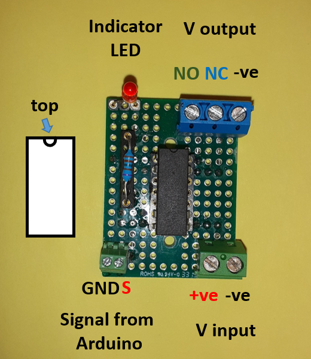

# Frequently Asked Questions (FAQs)

## Very Dim IR-Backlighting Detected by the Camera
- Ensure the power supply is connected.
- Make sure the camera's exposure time is set to 25 ms.

## No Region of Interest (ROIs) Detected by the Camera
- Ensure the 3 IR-LED targets are turned on and unobstructed at the edges of the light boxes.
- The IR-Target's power supply is connected to the Backlighting IR's power supply. If you can observe the chamber ROIs, this indicates that power isn't the issue. Instead, check if the setup targets have shifted from the visualization window's center, possibly due to movement of the camera mount or the setup. Consider re-centering both the camera and the setup.

## Optogenetic-LED Doesn't Work
- Confirm the power supply connection.
- Switch to external mode for testing.
- Ensure the Arduino is powered on.

## IR-LED Backlighting Doesn't Work on Both Sides of the Setup
- Check the power supply connection.
- Since the IR-Target's power supply is the same as the backlighting IR's, seeing the three targets suggests power isn't the problem. Instead, consider whether the sockets delivering power to the IR-LED are properly connected on both sides. Note: Use the JST PH 2 Pin Female Cable ([1528-1126-ND](https://www.digikey.be/product-detail/en/adafruit-industries-llc/261/1528-1126-ND/5353586)) & JST PH 2 Pin Male Header ([1528-2617-ND](https://www.digikey.be/product-detail/en/adafruit-industries-llc/3814/1528-2617-ND/9380221)) to connect these LEDs.

## IR-LED Backlighting Doesn't Work on One Side of the Setup
- Confirm the power supply connection for this LED string. If using the aforementioned JST cables, they might have been unintentionally disconnected.

## Optogenetics-LED Brightness Unaffected by Potentiometer Adjustments or PWM/Input Voltage Changes
- Ensure the input voltage is sufficiently high to achieve maximum brightness. Afterwards, it can be modulated using PWM.

## Low Brightness on Optogenetic-LEDs
- Increase the current limit. Inspect and adjust as required. The LED current limit control potentiometer is on the driver's front. Use a screwdriver to set the LED current limit to 350mA.

## Post-Training Test Indicates Flies Weren't Conditioned
- Review recorded videos during training to verify if the electrical shock IR-LED markers blinked as intended. No blinking markers indicate a power issue.
- Check that the toggle switch is in the correct position following ITO electrode inspections.
- Use the Arduino control unit's test button. If markers light up, there may be a communication issue between the Arduino and the relay board.
- If the relay is faulty, you might need to replace it. Signs include consistent illumination of IR-LED indicators or camera tracking failures.

## Unequal Air Inflow and Outflow
- Calibrate and adjust flow regulators to 2l/min for both and verify readings from each chamber. Aim for 100ml/min per side. Use a vacuum machine for suction and adjust its rate to maintain air pressure balance in the chamber.

## Flies Exhibit Reduced Mobility or Stagnation
- Adjust flow regulators to a maximum of 2l/m.
- Balance the inflow and outflow systems.
- Use vibration motors to stimulate the flies.

## How to Replace the Relay
- A Turned Pin Open Frame IC Dip Socket, with 14 Way ([674-2476](https://benl.rs-online.com/web/p/dil-sockets/6742476/)) is utilized for the relay. To replace, remove the old relay and insert the new one as shown:

- EShock relays: SPDT Reed Relay, 5V dc, PCB Mount ([256-2241](https://benl.rs-online.com/web/p/reed-relays/2562241/)) [datasheet](https://docs.rs-online.com/0e08/0900766b813980e6.pdf)
- IR & Vibration motors: SPNO Reed Relay, 5V dc, PCB Mount ([291-9710](https://benl.rs-online.com/web/p/reed-relays/2919710?sra=pstk)) [datasheet](https://docs.rs-online.com/d68b/0900766b81580421.pdf)
- Solenoid Valves: SPDT Reed Relay, 5V dc, PCB Mount ([HE100-ND](https://www.digikey.be/nl/products/detail/littelfuse-inc/HE721A0500/133183)) [datasheet](https://www.littelfuse.com/~/media/electronics/datasheets/reed_relays/littelfuse_reed_relays_he700_datasheet.pdf.pdf)
