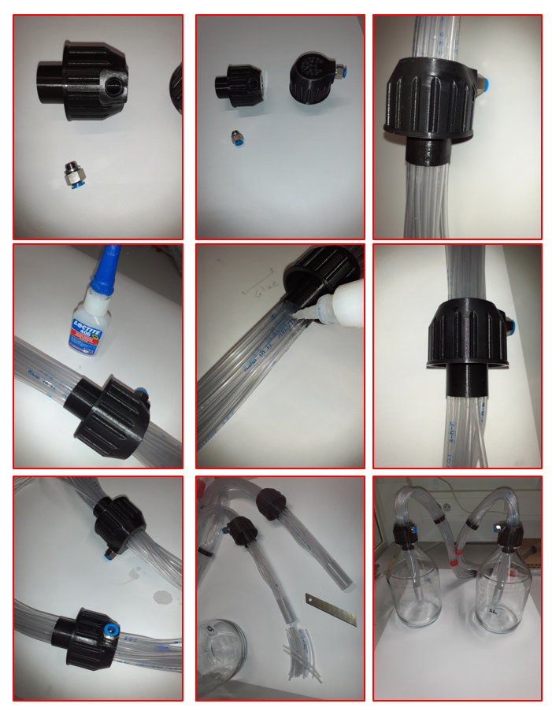

# Air/Odors Delivery System

## Table of Contents

1. [Overview](#overview)
2. [Map](#map)
3. [Installation of flow meters](#installation-of-flow-meters)
4. [Installation of the **2-port Main Valve**](#installation-of-the-2-port-main-valve)
5. [Installation of the **3-port solenoid valve**](#installation-of-the-3-port-solenoid-valve)
6. [Powering cables to the mounting board](#powering-cables-to-the-mounting-board)
7. [Installation of the **Exhaust release Valves**](#installation-of-the-exhaust-release-valves)
8. [Installation of the **Vacuum Suction system**](#installation-of-the-vacuum-suction-system)
9. [Parts index](#parts-index)
10. [3D printed parts](#3d-printed-parts)

## Overview

The IDOC Air/Odors Delivery System is in charge of delivering controlled air and odor stimuli to *Drosophila* during behavioral experiments. The system consists of a custom-built manifold, solenoid valves, and an Arduino microcontroller.

1. **Solenoid** valves, which regulate the flow of air and odor stimuli through the manifold.
2. **The manifold**, which consists of a series of ports for delivering air and odor stimuli to the IDOC chamber.
3. **The vacuum suction system**, which regulates and balances the outflow of air and odor stimuli from IDOC chamber. 
4. **The Arduino microcontroller**, which determines the timing and choice of olfactory stimuli by operating the solenoid valves.

## Map

NOTE: This map shows the connections needed to run a 1-odor conditioning experiment. If you wish to run 2-odor conditioning, you need to add one more valve on each side (to switch between either of the odors). The best way to achieve this is by putting one more solenoid valve for each side, placed between the mineral oil and the existing solenoid valve. The tubing should be connected so that following the Normally Open (NO) outflow of each valve takes you to the mineral oil. Then either odor can be delivered if its corresponding valve is turned on, which makes the air flow through its Normally Close (NC) outflow. Such an arrangement would avoid any odor mixing.

The numbered list below describes how they air and odors are processed, while the assembly of key parts will be discussed in later sections.

1. Air is provided from a controlled constant pressure source.
2. The air is passed through an activated carbon capsule (Fisher, [10526921](https://www.fishersci.be/shop/products/whatman-carbon-cap-disposable-activated-carbon-capsules/10526921)) to be filtered and dried.

3. The dry filtered air is tube is connected to a 2-port solenoid valve (RS [840-7020](https://benl.rs-online.com/web/p/solenoid-valves/8407020/)) (denoted as the **Main Valve** in the map). This valve is closed by default (Normal Close or NC). Arduino controls a relay unit switch that when turned on, provides the needed 12 V of DC for it to open. Only then can the experiment start.

4. When the 2-port Main Valve is open, the air is passed through air washing-bottles for controlled re-humidification. The bottles are capped with a GL 45 cap connection system (Fisher, [15363647](https://www.fishersci.be/shop/products/gl45-screw-cap-pyrex-gl-45-media-lab-bottle-1/15193927)). One-way no return valves are also introduced between each part to prevent water flowback (RS, [367-0624](https://benl.rs-online.com/web/p/pneumatic-non-return-valves/3670624)). The entire humidification process involves two key steps: 

    1. The first one is to heat up a glass bottle of water to 50°C  (~600ml of water in 1L glass bottle), immersed in a 2L water bath (VWR, [462-0554](https://be.vwr.com/store/product?keyword=462-0554%20)) to get vaporized air.

    2. The hot moist air is then passed through a larger 5L bottle filled with 4L of water (VWR, [215-0057](https://be.vwr.com/store/product/en/544458/laboratory-bottles-round) ) at room temperature to regulate the moisture air temperature.

5. The moist air is passed through a 4-outlet manifold (RS, [431-7194](https://benl.rs-online.com/web/p/pneumatic-manifold-fittings/4317194)). The list below describes how each of the 4 ports is connected along the path of airflow through the manifold. Note that each outflow port has a screw valve (RS, [197-5337](https://benl.rs-online.com/web/p/pneumatic-function-fittings/1975337)) on it to control the amounts of exhaust and usable air. This is particularly useful to have on the air left/right ports, as this allows you to easily fix imbalances the flies might feel due to slightly varied airflow rates from either sides of the chambers.

    1. First exhaust - Used to extract any condensed water that has accumulated in the tubing by this point. This tube is directed into a waste bucket.

    2. Second exhaust - Used to fine tune the amount of usable air with the previusly mentioned screw valves. This outflow tube can be left as an open free-hanging exhaust since at this point no odors have been added to the flow.

    3. Air left - Airflow that will be supplied from the left sides of all the chambers.

    4. Air right - Airflow that will be supplied from the right sides of all the chambers.

6. The threaded flow regulator output is split into two streams to provide the ability to deliver **different stimuli in the left and right side** of the chambers. Every component from here onwards is thus duplicated, once for each side. Each stream (left and right) is passed through a flowmeter (0.4 L/min → 5 L/min, RS, [198-2919](https://benl.rs-online.com/web/p/flow-sensors/1982919/)). The flowmeters could be used to adjust the flow, but they are left fully open because the flow is meant to be controlled by the threaded flow regulator mentioned earlier. They are however useful to measure the actual flow going through each stream independently, because this information can help diagnose problems affecting one of the streams but not the other. 

7. The output flowmeter is connected to a 3-port solenoid valve, therefore providing 2 outputs: Normal Open (NO) and Normal Close (NC) (12 V dc, M5, RS, [838-8660](https://benl.rs-online.com/web/p/solenoid-valves/8388660)). One 3-port solenoid valve allows us to switch between air and odor on one side.

    1. The NO outlet is connected to the solvent (Mineral oil) bottle.
    2. The NC outlet is connected to the odor A (odor diluted in mineral oil at desired concentration) bottle. 

        * One-way check valves were used between connections to prevent mineral oil backflow (WPI, [14039-10](https://www.wpiinc.com/14039-10-check-valve-female-luer-lock-inlet-male-luer-lock-outlet) , Fisher, [11909638](https://www.fishersci.be/shop/products/san-one-way-luer-fitting/11909638)).   ​

8. The humidified air/odor is now delivered to the recording chambers via 2 [20-port 3D printed manifolds](https://github.com/shaliulab/idoc_docs/blob/master/docs/assets/src/3D_printed_parts/Air_inflow_outflow_olfaction_system/manifold%2021x%20wide%20side%20hole%20-%20Manifold.stl). Each manifold provides the stimuli to all 20 chambers, but only on one side (1 manifold for all the left-side inflows, another for all the right-side inflows). This tubing should either be made from chemically resistant silicon or Tygon to ensure it is not affected by the oil/odor residue and can withstand cleaning with SDS. Each of the 20 tubes coming out of the manifold should terminate with a male luer to ensure that it can connect to the female connector on the recording chambers.

9. After the odor valves are closed, there can be an undesired residual flow of diluted odor arriving to the animals.  To ensure that this never happens, and the stimuli are delivered with high time precision, each input is first passed through a **3-port solenoid exhaust valve** (Aliexpress/Miniyard, [32881849871 (12V)](https://www.aliexpress.com/item/32881849871.html)) that only opens when getting a 12V DC signal. This way, when stopping the odor valves, the residual odor is diverted to the NO port of the exhaust valve, which collects to a waste bottle. We found that a residual current was present (via visible bubbling) in the waste bottle for about 7 seconds after stopping the **3-port solenoid valve**.

<!-- TODO Check if we need to insert the link to the male luer -->

<!-- Old version of the outflow description
    1. Connected to an inflow regulator, **threaded flow regulator** (RS, [197-5337](https://benl.rs-online.com/web/p/pneumatic-function-fittings/1975337)) used to provide only the required volume of air.

    2. Connected to a glass bottle used to collect water which may condensate throughout the tubing.

    3. Left open to release any extra pressure and stabilize the output of the inflow regulators.

    4. Plugged (RS, [367-6098](https://benl.rs-online.com/web/p/pneumatic-fitting-accessories/3676098)).
-->

<!-- 
    * If you are going to switch between two odors then the NO outlet of the above solenoid valve 3-ports connected to to the inlet port of  another solenoid valve 3-ports in each side.

  - The NO outlet of the second valve then connected to the air washing bottle to deliver air to the solvent (Mineral oil),  

  - The NC outlet of the first valve connected to an air washing bottle to deliver air to the odor A (odor diluted in mineral oil at desired concentration), 

  - The NC outlet of the second valve connected to an air washing bottle to deliver air to the odor B (odor diluted in mineral oil at desired concentration). -->
  ​
If you need only air flow to your chambers, for example when performing optogenetic experiments, you just need a **2-port** solenoid valve and a water bottle, one for each side
  

## Installation of flow meters

The installation of either in- or outflow meters has the same procedure. Use a fork ring wrench or spanner #13 (amazon.de, [M19652](https://www.amazon.de/-/en/Brothers-Mannesmann-M19652-wrench-pieces/dp/B000ET7G0E?th=1); [B001ILAFRI](https://www.amazon.de/-/en/171198-Combination-Spanner-Set-SW/dp/B001ILAFRI/)) to connect the straight threaded adaptor (RS Components, [121-6009](https://benl.rs-online.com/web/p/pneumatic-fittings/1216009/)) to the flow meter (0.05 L/min → 0.5 L/min, RS Components, [198-2896](https://benl.rs-online.com/web/p/flow-sensors/198-2896)). Then use screws provided with the flowmeters to fix them to the [3D printed holders](https://github.com/shaliulab/idoc_docs/blob/master/docs/assets/src/3D_printed_parts/Air_inflow_outflow_olfaction_system/Flowmeter_holder_double%20_Power%20-%20flowmeter%20hoder.stl). Connect a 10-cm optical post to each holder to be fixed at the mounting base of the breadboard.

**Tip:** Backlighting of the flow helps to precisely adjust the meters to the same level. Just add a white LED in the back hole of each flow regulators, and then connect all LEDs in series with a switch so they only illuminate when needed (especially important when recording in a dark room).

## Installation of the 2-port Main Valve

Use fork ring wrench or spanner #12 (amazon.de, [M19652](https://www.amazon.de/-/en/Brothers-Mannesmann-M19652-wrench-pieces/dp/B000ET7G0E?th=1) ; [B001ILAFRI](https://www.amazon.de/-/en/171198-Combination-Spanner-Set-SW/dp/B001ILAFRI/))  to connect the Straight Threaded-to-Tube Adapter (RS Components, [771-5100](https://benl.rs-online.com/web/p/pneumatic-fittings/7715100/)) to both ports of the 2-port Main Valve (RS Components, [840-7020](https://benl.rs-online.com/web/p/solenoid-valves/8407020/)). Then use 2 M3x10mm screws to fix the 2-port Main Valve to the 3D printed holders (composed of 2 parts, a [holder base](https://github.com/shaliulab/idoc_docs/blob/master/docs/assets/src/3D_printed_parts/Air_inflow_outflow_olfaction_system/main%20valve%20holder%20-%20Main_valve_holder.stl) and [top locker](https://github.com/shaliulab/idoc_docs/blob/master/docs/assets/src/3D_printed_parts/Air_inflow_outflow_olfaction_system/main%20valve%20holder%20-%20Valve_Locker.stl)). 

## Installation of 3-port solenoid valves

Use fork ring wrench or spanner #12 (amazon.de, [M19652](https://www.amazon.de/-/en/Brothers-Mannesmann-M19652-wrench-pieces/dp/B000ET7G0E?th=1) ; [B001ILAFRI](https://www.amazon.de/-/en/171198-Combination-Spanner-Set-SW/dp/B001ILAFRI/)) to connect the threaded elbow tube adaptor (RS Components, [121-6024](https://benl.rs-online.com/web/p/pneumatic-fittings/1216024)) to the top outlet of the 3-port solenoid valve (RS Components, [838-8660](https://benl.rs-online.com/web/p/solenoid-valves/8388660)). Then connect the straight threaded adaptor (RS Components, [121-6039 ](https://benl.rs-online.com/web/p/pneumatic-fittings/1216039/)) to the other ports of the 3-port solenoid valve. Then use 2 M3x10mm screws to fix the base of each valve to the [3D printed holder](https://github.com/shaliulab/idoc_docs/blob/master/docs/assets/src/3D_printed_parts/Air_inflow_outflow_olfaction_system/Solenoid%20valve%20holder%20-%20valve_holder.stl). Attach a 10-cm optic post to each holder to be fixed at the mounting base of the breadboard. In total, four 3-port solenoid valves are needed to control a two odor system.

------

## Powering Cables to the mounting board

To power the valves through the connection with the Arduino controlled relay switch unit, connect a 20-way ribbon cable with an IDC connector to the control board, while the other end is open and connected to the power station. The power station contains a screw terminal block (12 Circuit - Terminal Strip Connector Screws (Digi-Key, [277-15432-ND](https://www.digikey.be/en/products/detail/phoenix-contact/3240171/3603832))), that enable easy and robust connection between the valves and the Arduino. This is the white plastic piece on the mounting board.

Fix the terminal strip connector with M3 10mm screws to the 3D printed powering station holder. Then with M6 screws fix the holder to the breadboard.  

<!-- TODO 3D file is missing for the station holder -->

With the use of a wire stripper, remove at least 1 cm casing to expose the cut wires and then flip the breadboard to the back and insert the wires through the back holes, to be connected to the screw terminal from the top of the breadboard. 

**Here is the pinout mapping of the cable connections:**

|               **+**               |               **+**               |      **+**       |         **+**          |         **+**         |         **+**          |             **+**             |       **+**       |               **+**                |               **+**                |
| :-------------------------------: | :-------------------------------: | :--------------: | :--------------------: | :-------------------: | :--------------------: | :---------------------------: | :---------------: | :--------------------------------: | :--------------------------------: |
| **Odor B  Left IR-LED indicator** | **Odor A  Left IR-LED indicator** | **EShock  Left** | **IR  LED back light** | **Vibration  Motors** | **Tracking 3 objects** | **Low Voltage  ES Indicator** | **EShock  Right** | **Odor A  Right IR-LED indicator** | **Odor B  Right IR-LED indicator** |
|               **-**               |               **-**               |      **-**       |         **-**          |         **-**         |         **-**          |             **-**             |       **-**       |               **-**                |               **-**                |

## Installation of the **Exhaust release Valves**

To ensure that the odors are precisely delivered at only the time of the applications, each input is first passed through a 3-port solenoid exhaust valve (Aliexpress/Miniyard, [32881849871 (12V)](https://www.aliexpress.com/item/32881849871.html)) that only opens when getting a 12VDC signal. This way, upon stopping the odor valves, the air flow delivered to the chambers/flies will stop and be diverted to the NO port of the exhaust valves. In turn, this is connected to a water receiver to avoid spreading in the room. We consistently found an undesired flow of air up to 7 seconds after stopping the odor (because there is bubbling in the water bottle for as much time). Had this stream not been released, the fly would continue receiving diluted odor stimuli at the end of each treatment. 

**To install this unit you will need the following items:**

- Female Luer Bulkhead Fitting (Aliexpress/MicroFluidics Store, [RH-C-M024](https://www.aliexpress.com/item/4000025751111.html)) Q:12x

- 3D-printed [exhaust valves holder](https://github.com/shaliulab/idoc_docs/blob/master/docs/assets/src/3D_printed_parts/Air_inflow_outflow_olfaction_system/exhaust%20valves%20holder%20II%20-%20exhaust%20valves%20holder.stl)  Q:1x

- DC 12V Solenoid Air Gas valve Release exhaust Valve Switch 2-position 3-way (Aliexpress/Miniyard, [32881849871 (12V)](https://www.aliexpress.com/item/32881849871.html)) Q: 6x

- Straight PCB Header, 2.54mm Pitch, 6 Way, 2 Row, Through Hole (RS Components, [832-3496](https://benl.rs-online.com/web/p/pcb-headers/8323496/)) Q:2x

- 6-Way ribbon cable with one IDC Connector Socket at one side (Farnell, [T812106A101CEU](https://be.farnell.com/amphenol/t812106a101ceu/socket-idc-s-relief-2-54mm-6way/dp/2215245); RS Components, [832-3648](https://benl.rs-online.com/web/p/idc-connectors/8323648/)), while the other side is open.

- Resistor Kit, 10ohm to 1Mohm Resistors (Farnell, [MF0W4FFE006KIT](https://be.farnell.com/multicomp/mf0w4ffe006kit/resistor-kit-0-25w-1-e6/dp/9342362))

**You also will need**

- Soldering Station (RS Components, [122-7917](https://benl.rs-online.com/web/p/soldering-stations/1227917); for Hot Air Amazon.de, [8786D](https://www.amazon.de/-/en/Soldering-Desoldering-Temperature-Adjustable-Conversion/dp/B08C51QRH5/))

- Lead Free Solder (RS Componentss, [756-8884](https://benl.rs-online.com/web/p/solder/7568884) ; [625-8233](https://benl.rs-online.com/web/p/solder/6258233))

- Side Cutters (Amazon.de, [M10997](https://www.amazon.nl/KNIPEX-Krimptang-240-97-22/dp/B004LY28J2/))

- Heat shrink tubing (amazon.de, [ET1002](https://www.amazon.de/Eventronic-ET1002-Schrumpfschlauch-Farben-560-tlg/dp/B071D7LJ31))

- Wire Stripper (RS Components, [613-044](https://benl.rs-online.com/web/p/wire-strippers/0613044/))

**Procedure:**

- Attach  12 female [luer fittings](https://www.aliexpress.com/item/4000025751111.html) at each circle of the holder, screw them with the included plastic nut and fixers. 

- Insert [solenoid valves](https://www.aliexpress.com/item/32881849871.html) in the recessed area in the 3D printed holder. Press all of them in place so that the NO outlet faces the bottom while the two u-shaped ports appear from the top face of the holder.

- Attach two 6-Way PCB headers (RS, [832-3496](https://benl.rs-online.com/web/p/pcb-headers/8323496/)) to the recessed areas.

- Connect and solder each solenoid valve to two pins of the 6-way box.

- Connect a LED of your preferred color (amazon.de, [110040_SML](https://www.amazon.de/-/en/APTWONZ-Diffuse-Emitting-Electronic-Components/dp/B06X3VT6TD)) in parallel with each of the valve pins to act as marker when they're ON. While you can use a 1K Ohm resistor for all the LEDs, its encouraged to use more correct resistors (Farnell, [MF0W4FFE006KIT](https://be.farnell.com/multicomp/mf0w4ffe006kit/resistor-kit-0-25w-1-e6/dp/9342362)). Use the example below to see how you can choose the optimal resistor.

  - **Source Voltage**: 12 VDC
  - **Forward Voltage**: white: 3.2-3.4 V; green: 3.0-3.2 V; yellow: 2.0-2.2 V; blue: 3.2-3.4 V; red: 2-2.2 V
  - **Forward Current**: 20 mA
  - **Resistor**: (Source Voltage - Forward Voltage)/(Forward Current)

  - **Example**: Red color LED  = (12-2)/0.020 = 500 Ohm

  [Go to this website to calculate the resistor according the above values for each color](https://www.digikey.be/en/resources/conversion-calculators/conversion-calculator-led-series-resistor)

- Connect two 6-Way IDC ribbon cables to the 6-way box. The opposite side must be connected to the corresponding 3-port solenoid valve connection at the powering station to be synchronized and prevent extra odor air to be delivered after stopping the odor valves. 

------

## Installation of the **Vacuum Suction system**

Each chamber has two outputs in the middle. Each output allows the air to flow out of the chamber. To provide clear decision zones we connected each outlet port to an active vacuum. It is important that the out flow equals the inflow, which can be challenging to achieve. To make sure the system is balanced, we connect each outlet individually via a luer fitting male-female connection. Then all tubes are bundled together to be embedded into a vacuum receiver for each side. A 3D-designed and printed [GL45 threaded cap with 20 holes](https://github.com/shaliulab/idoc_docs/blob/master/docs/assets/src/3D_printed_parts/Air_inflow_outflow_olfaction_system/Bottle%20Threaded%20Cap%20GL-45%20-%20Cap_GL45_succion_system.stl) were used to gather all of the tubes of one side. Glue and/or silicon paste was used to completely fix the tubing to the holes of the each cap. Each cap has an outlet port that connects to a Threaded-to-Tube adaptor (RS Components, [121-6009](https://benl.rs-online.com/web/p/pneumatic-fittings/1216009/)), which is connected to the manifold of the vacuum system.

**Vacuum manifold:**

## Parts index  

| **Article   Description**                | **Qty**     | **Supplier**                     | **Item # & link**                        | **Supplier   Image**                     |
| ---------------------------------------- | ----------- | -------------------------------- | ---------------------------------------- | ---------------------------------------- |
| Carbon-Cap Disposable Activated Carbon Capsules (Fisher)                                  | 1       |                 Fisher               | [10526921](https://www.fishersci.be/shop/products/whatman-carbon-cap-disposable-activated-carbon-capsules/10526921) | |
| Solenoid Valve 3-port(s) , NO/NC, 12 V dc, M5 (RS Components)                             | 2       |    RS | [838-8660](https://benl.rs-online.com/web/p/solenoid-valves/8388660)                                         |
| Solenoid Valve 2 port(s) , NC, 12 V dc, 1/8in (RS Components)                             | 1       | RS |  [840-7020](https://benl.rs-online.com/web/p/solenoid-valves/8407020/)                                        |
| DC 12V Solenoid Air Gas valve Release exhaust Valve Switch 2-position 3-way (Aliexpress/Miniyard) | 6       |  AliExpress | [32881849871 (12V)](https://www.aliexpress.com/item/32881849871.html)                                        |
| Laboratory bottles, 100 ML (VWR)                                                          | 6       | VWR | [LENZ07105037](https://be.vwr.com/store/product?keyword=LENZ07105037)                                        |
| Laboratory bottles, 5000 ML (VWR)                                                         | 1       | VWR |  [215-0057](https://be.vwr.com/store/product/en/544458/laboratory-bottles-round)                               |
| Laboratory bottles, 1000 ML (VWR)                                                         | 1       | VWR | [215-1595](https://be.vwr.com/store/product/en/544458/laboratory-bottles-round)                               |
| GL 45 Cap Connection System, 2 Hose Barb Connectors (Fisher)                              | 8       | Fisher | [15363647](https://www.fishersci.be/shop/products/gl45-screw-cap-pyrex-gl-45-media-lab-bottle-1/15193927)     |
| Water bath, 2 L (VWR)                                                                     | 1       | VWR | [462-0554](https://be.vwr.com/store/product?keyword=462-0554%20)                                             |
| Luer fitting check valves (WPI, Fisher)                                                   | 10      | | [14039-10](https://www.wpiinc.com/14039-10-check-valve-female-luer-lock-inlet-male-luer-lock-outlet), [11909638](https://www.fishersci.be/shop/products/san-one-way-luer-fitting/11909638) |
| Non Return Valve, 6mm Tube Inlet, 6mm Tube Outlet (RS Components)                         | 2       | RS | [367-0624](https://benl.rs-online.com/web/p/pneumatic-non-return-valves/3670624)                              |
| 4 Outlet Pneumatic Manifold Threaded Fitting, G 1/4 G 1/8 (RS Components)                 | 1       | RS | [431-7194](https://benl.rs-online.com/web/p/pneumatic-manifold-fittings/4317194)                              |
| G 1/8 Brass Corrosion Resistant Plug (RS Components)                                      | 1       | RS | [367-6098](https://benl.rs-online.com/web/p/pneumatic-fitting-accessories/3676098)                            |
| G 1/4 Brass Corrosion Resistant Plug (RS Components)                                      | 1       | RS | [367-6105](https://benl.rs-online.com/web/p/pneumatic-fitting-accessories/3676105)                            |
| Straight Threaded Adaptor, G 1/4 Male to Push In 6 mm, Threaded-to-Tube Connection Style (RS Components) | 1       | RS | [125-9600](https://benl.rs-online.com/web/p/pneumatic-fittings/1259600)                                       |
| Straight Threaded-to-Tube Adapter, Uni 1/8 Male, Push In 6 mm (RS Components)             | 2       | RS | [771-5100](https://benl.rs-online.com/web/p/pneumatic-fittings/7715100/)                                      |
| Threaded Flow Regulator  6mm Tube Outlet Port (RS Components)                            | 3       | RS | [197-5337](https://benl.rs-online.com/web/p/pneumatic-function-fittings/1975337)                              |
| Elbow Threaded Adaptor, M5 Male to Push In 6 mm, Threaded-to-Tube Connection Style (RS Components) | 2  | RS | [121-6024](https://benl.rs-online.com/web/p/pneumatic-fittings/1216024)                                       |
| Straight Threaded Adaptor, M5 Male to Push In 6 mm, Threaded-to-Tube Connection Style (RS Components) | 4   |  RS | [121-6039](https://benl.rs-online.com/web/p/pneumatic-fittings/1216039/)                                      |
| Variable Area Flow Meter, 0.05 L/min → 0.5 L/min, (RS Components)                        | 2       |  RS | [198-2896](https://benl.rs-online.com/web/p/flow-sensors/198-2896)                                          
| Straight Threaded Adaptor, G 1/8 Male to Push In 6 mm, Threaded-to-Tube Connection Style | 4 | RS | [121-6009](https://benl.rs-online.com/web/p/pneumatic-fittings/1216009/)
| 12 Circuit - Terminal Strip Connector Screws | 1 | Digi-Key | [277-15432-ND](https://www.digikey.be/en/products/detail/phoenix-contact/3240171/3603832)) | |
| IDC ribbon cable , one IDC connector in one end while the other end is opened. | 1 | |

**Other parts**

| **Article   Description**                | **Qty**     | **Supplier**                     | **Item # & link**                        | **Supplier   Image**                     |
| ---------------------------------------- | ----------- | -------------------------------- | ---------------------------------------- | ---------------------------------------- |
| Fork ring wrench | 1 | Amazon.de | [M19652](https://www.amazon.de/-/en/Brothers-Mannesmann-M19652-wrench-pieces/dp/B000ET7G0E?th=1) or [B001ILAFRI](https://www.amazon.de/-/en/171198-Combination-Spanner-Set-SW/dp/B001ILAFRI/) | |
| Ø12.7 mm Optical Post, SS, M4 Setscrew, M6 Tap, L = 100 mm, 5 Pack | 10 | Thorlabs | [TR100/M-P5](https://www.thorlabs.de/thorproduct.cfm?partnumber=TR100/M-P5) | |

## 3D-printed parts

  - **2 port Main Valve** holder [base](https://github.com/shaliulab/idoc_docs/blob/master/docs/assets/src/3D_printed_parts/Air_inflow_outflow_olfaction_system/main%20valve%20holder%20-%20Main_valve_holder.stl) and [top](https://github.com/shaliulab/idoc_docs/blob/master/docs/assets/src/3D_printed_parts/Air_inflow_outflow_olfaction_system/main%20valve%20holder%20-%20Valve_Locker.stl) Q:1x
  - Manifold holder Q:1x - we have the files but their usage is not described in the doc
  - [Exhaust valves holder](https://github.com/shaliulab/idoc_docs/blob/master/docs/assets/src/3D_printed_parts/Air_inflow_outflow_olfaction_system/exhaust%20valves%20holder%20II%20-%20exhaust%20valves%20holder.stl) Q:1x
  - [**3-port solenoid valve** holder](https://github.com/shaliulab/idoc_docs/blob/master/docs/assets/src/3D_printed_parts/Air_inflow_outflow_olfaction_system/Solenoid%20valve%20holder%20-%20valve_holder.stl) Q:4x
  - [Flowmeter holder double](https://github.com/shaliulab/idoc_docs/blob/master/docs/assets/src/3D_printed_parts/Air_inflow_outflow_olfaction_system/Flowmeter_holder_double%20_Power%20-%20flowmeter%20hoder.stl) Q:1x 
  - Powering station holder  Q:1x - file missing for now