# Chamber holder tray

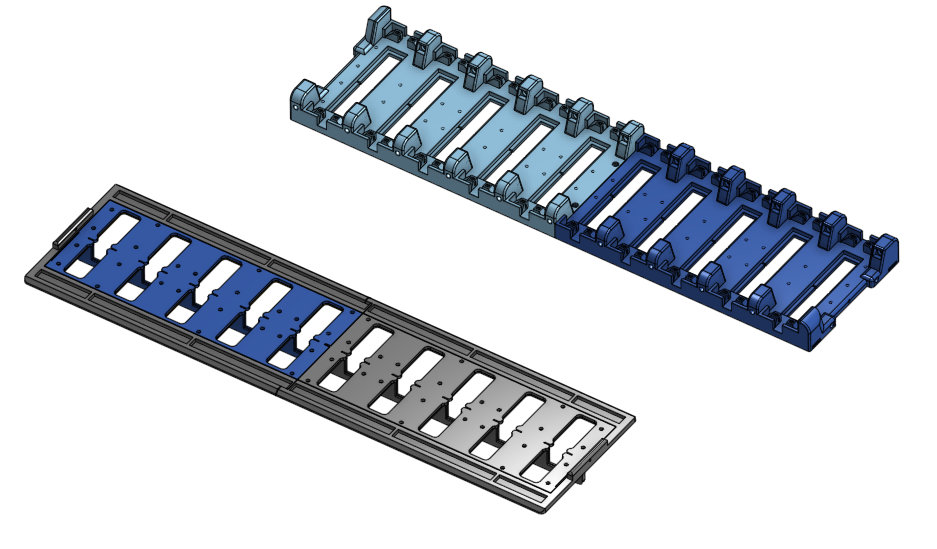

## Table of contents

1. [Overview](#overview)
2. [Part list](#part-list)
    * [Commercial parts](#commercial-parts)
    * [3D printed parts](#3d-printed-parts)
3. [Assembly and wiring](#assembly)
4. [Joining the tray with the rest of the system]()

## Overview
The chamber tray is a key component required to hold the chambers in place while also housing the following key parts required for full functionality of the IDOC system:

- Out-flow ports for the air/odor
- The cables and electrodes required to transmit current to the chambers
- Vibrators
- Light-blocking screens

## Part list
Like most of the IDOC system, the bulk of the chamber is composed of 3D printed parts, with some key parts such as nozzles, electrodes and vibrators being sourced commercially. The lists below should provide you with all the components necessary to build a functional chamber holder.

### Commercial parts

- Electrodes
- Outflow nozzles
- Outflow tubing
- Vibrators
- IR light filter material
- Diffuser material

### 3D printed parts

TODO Copy the links from below also here

- Chamber_holder front (uprade_IDOC1_to_IDOC2/081-082_Chamber_holder_FRONT_2X_1_of_2)
- Chamber_holder_back (uprade_IDOC1_to_IDOC2/079-080_Chamber_holder_BACK_2X_1_of_2)
- EShock_cover_front (uprade_IDOC1_to_IDOC2/EShock_cover_Chamber_holder_boarder_slider_FRONT)
- EShock_cover_back (uprade_IDOC1_to_IDOC2/EShock_cover_Chamber_holder_boarder_slider_BACK)
- White_light_box_front (uprade_IDOC1_to_IDOC2/White_light_box_FRONT)
- White_light_box_back (uprade_IDOC1_to_IDOC2/White_light_box_BACK)
- IR_filter_holder_splitter_front (uprade_IDOC1_to_IDOC2/IR_filter_holder_splitter_FRONT)
- IR_filter_holder_splitter_back (uprade_IDOC1_to_IDOC2/IR_filter_holder_splitter_BACK)
- IR filter cutting template base [3D file](https://github.com/shaliulab/idoc_docs/blob/master/docs/assets/src/3D_printed_parts/IR_sheet_cutter/IR%20sheet%20cutter%20-%20Part%201.stl)
- IR filter cutting template top [3D file](https://github.com/shaliulab/idoc_docs/blob/master/docs/assets/src/3D_printed_parts/IR_sheet_cutter/IR%20sheet%20cutter%20-%20Part%202.stl)
- Diffuser frame (IDOC_2_setup/Diffuser Holder_1)

Suggested materials
- CPE
- CPE+
- White PLA

## Assembly

### 1. Joining the two halves of the chamber tray

The 3D printer parts needed here are:

- Chamber holder front (2x) [3D part](https://github.com/shaliulab/idoc_docs/blob/master/docs/assets/src/3D_printed_parts/IDOC_setup/081-082_Chamber_holder_FRONT_2X_1_of_2.stl)
- Chamber holder back (2x) [3D part](https://github.com/shaliulab/idoc_docs/blob/master/docs/assets/src/3D_printed_parts/IDOC_setup/079-080_Chamber_holder_BACK_2X_1_of_2.stl)

Join these with 2 screws using the designated holes. Additionally, to ensure a stable connection, we also recommend using superglue to join the flat parts together. Repeat this joining process for a total of 2 trays.

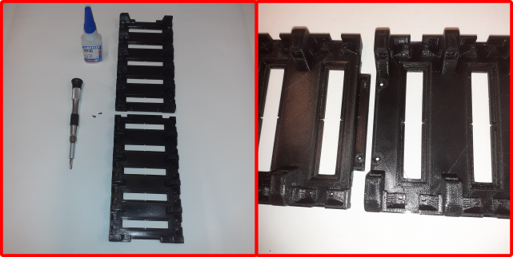

<!-- (IMAGES TO BE USED 20220307_182449 AND 20220307_182535) -->

### 2. Running wires throughout the tray

The underside of the chamber trays are designed to have channels that neatly accomodate all the necessary wiring, however depending on the quality of the print, you might need to widen the holes/bridges that the wires are led through to ensure a good fit. For this we used a small handheld drill bit.

Once the holes have been cleared, run your positive and negative wires through both the left and right channels. Make sure to leave plenty of extra wiring hanging out at either end (roughly 30cm). This will ensure that you have more than enough for the upcoming steps.

<!-- (IMAGES TO BE USED 20220316_103206 AND 20220316_135914 AND 20220321_164638) -->

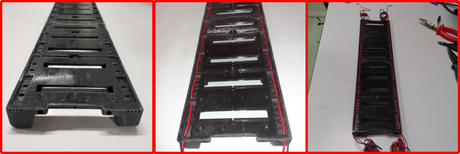

### 3. Assembling and inserting the electroshock electrodes

The electrodes are custom made from 2 commercially available components:

- Clamp type connector socket (Digi-Key, 962876-2)
- Straight pin header (RS Components, 681-2994) or (RS Components, 251-8137)

In total, the system requires 80 electrodes. To assemble them, remove the tail section of the clamp type connector and separate the straight pin headers from their plastic housing. Insert the straight pin header into the connector socket and crimp it shut. Finally, to ensure a proper connection, solder the pin into the socket.

<!-- (IMAGES TO BE USED 20220316_143635, 20220316_145134, 20220316_150258, 20220316_150444, 20220316_150532, 20220316_160139) -->

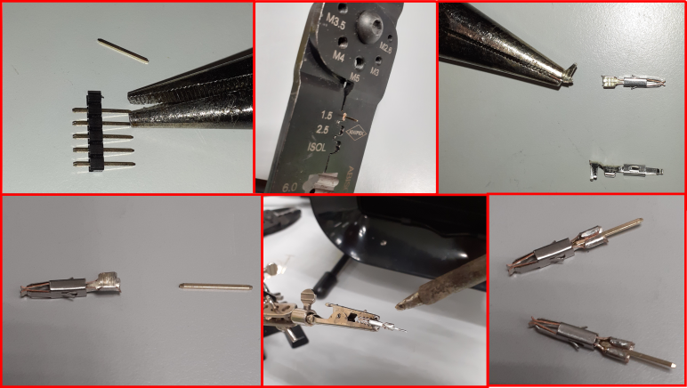

Follow up by placing all the electrodes into their designated sockets at the bottom of the chamber tray, making sure that the clamp section is fully through the body of the tray.

<!-- (IMAGES TO BE USED 20220316_163506 AND 20220316_164825) -->
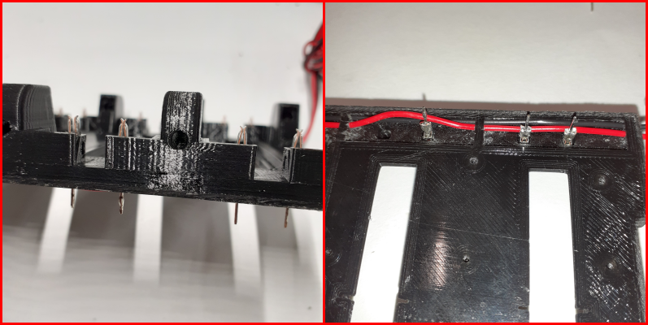

### 4. Connecting wires to the electrodes

Start by bending the straight pin end of the electrodes (side near the wires) so that they create a 90-degree angle. Follow up by cutting a wire at a point next to the electrode, strip the casing and solder both ends onto the same electrode. Repeat this for all the positive and negative wires and electrode connections. Note that the pattern of positive/negative electrode should be mirrored between the left and right sides of the tray.

<!-- (IMAGES TO BE USED 20220321_164746, 20220321_165155, 20220321_165740, 20220321_170300 AND 20220321_170638) -->
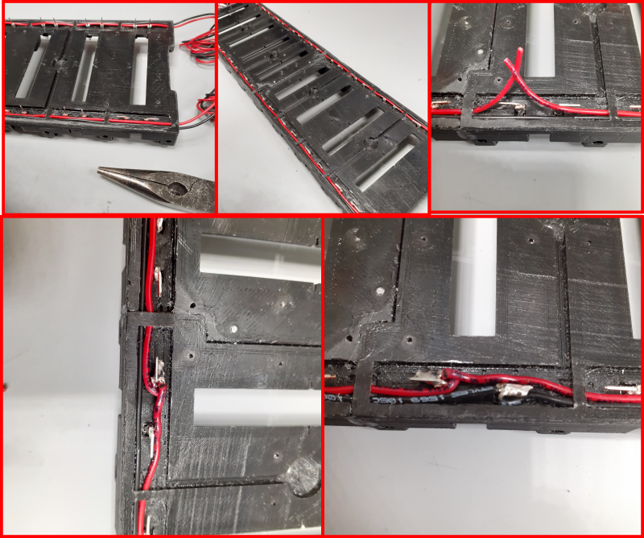

The final product of this stage should look as shown in the figure below. Note that there should still be wiring left over at one end of the tray to allow you to connect it to the rest of the system.

<!-- (IMAGE HERE 20220322_184941) -->
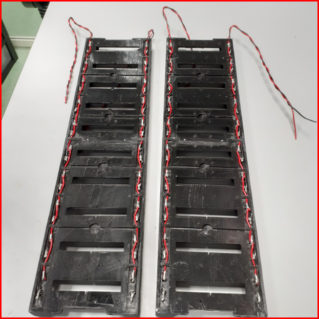

Additionally, to provide the user with information regarding when the shocks are delivered, we connect female JST cable headers to the end of one of the trays. Note that you should have one of these headers for both the left and right side of a single tray, thus allowing you to monitor the sides where shocks are given independently. Refer to the images below for clarification:

<!-- (IMAGES HERE 20220322_190359 AND 20220322_190601) -->
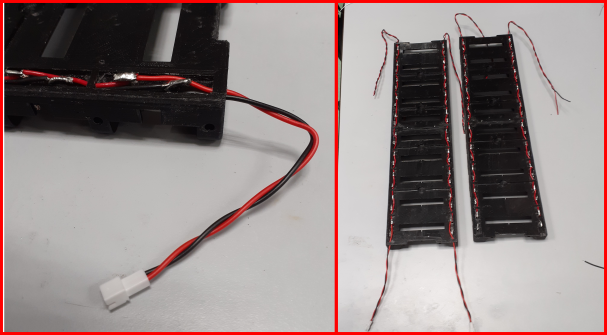

### 5. Adding the vibration motors

Here we will be inserting the vibrators (Digi-Key, 1528-1177-ND) responsible for shaking the tray with the goal of waking up "sleepy" flies during certain phases of experiments.

Start by attaching the vibrators to their designated slots in the chamber tray (located on the underside with the wires). Make sure that the wires coming out of it are directed into the channels to minimize bending and that all of them are pointing towards the same side of the tray.

<!-- (IMAGE 20220323_100056) -->
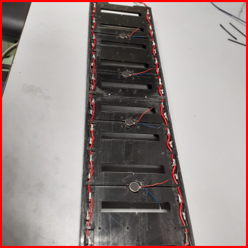

When connecting the vibrators to power cables, they should all be connected in series. Refer to the wiring map and the figures below for an illustration. Additionally, ensure that the solder points on each vibrator are isolated with heatshrink wrapping to ensure no short-circuiting occurs between them. Finally, while setting up the wiring, set them up so that all the wires fit cleanly into the channels. This is crucial to ensure that the covers fit without any bulging.

<!-- (IMAGES 20220323_105057 AND vibrator_wiring_placeholder) -->
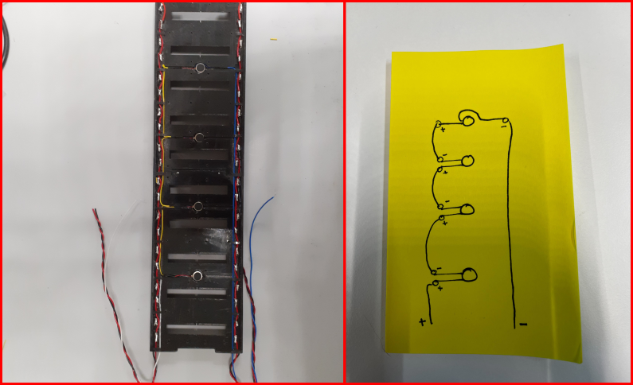

### 6. Attaching the light dividers and wire covers

3D printed parts needed here:

- IR_filter_holder_splitter_BACK (2x) [3D part](https://github.com/shaliulab/idoc_docs/blob/master/docs/assets/src/3D_printed_parts/IDOC_setup/084-IR_filter_holder_splitter_BACK.stl)
- IR_filter_holder_splitter_FRONT (2x) [3D part](https://github.com/shaliulab/idoc_docs/blob/master/docs/assets/src/3D_printed_parts/IDOC_setup/083-IR_filter_holder_splitter_FRONT.stl)
- White_light_box_BACK (2x) [3D part](https://github.com/shaliulab/idoc_docs/blob/master/docs/assets/src/3D_printed_parts/IDOC_setup/085-White_light_box_BACK.stl)
- White_light_box_FRONT (2x) [3D part](https://github.com/shaliulab/idoc_docs/blob/master/docs/assets/src/3D_printed_parts/IDOC_setup/086-White_light_box_FRONT.stl)
- EShock_cover_Chamber_holder_boarder_slider_BACK (2x) [3D part](https://github.com/shaliulab/idoc_docs/blob/master/docs/assets/src/3D_printed_parts/IDOC_setup/090-EShock_cover_Chamber_holder_boarder_slider_BACK.stl)
- EShock_cover_Chamber_holder_boarder_slider_FRONT (2x) [3D part](https://github.com/shaliulab/idoc_docs/blob/master/docs/assets/src/3D_printed_parts/IDOC_setup/091-EShock_cover_Chamber_holder_boarder_slider_FRONT.stl)

Before starting any assembly steps, verify the quality of your prints. Usual spots that might require further processing/cleaning are the slits in the base of the IR filter holder and the screw holes in all the parts.

Start by joining the IR filter holders and the white light boxes by placing them over one another and aligning the holes. Note the orientation of the white light box with respect to the outer and inner end of the tray (see figure below for illustration). Finish up by joining the back and front halves of the light dividers assemblies.

<!-- (IMAGE 20220323_121026) -->
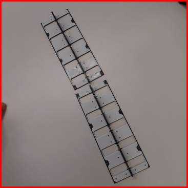

Continue by joining the light dividers and the chamber trays by screwing them in place with 6 mm screws. Note that you might need to prepare the holes with a handheld drillbit. Be careful to not screw them too far - they are not meant to go all the way through the chamber tray body!

<!-- (IMAGE 20220323_122312 AND 20220323_122502) -->
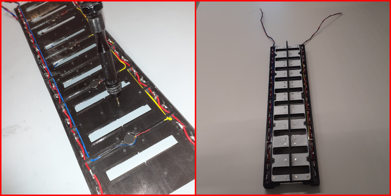

Follow this up by attaching the wire covers to the tray. Pay special attention to how smoothly it can cover the wires - if any of your electrodes were not sufficiently bent or pressed in, then the cover might not fit well. Forcing it on top in this scenario could end up breaking some of them, so make adjustments where needed. Once the wire covers are in place, screw them into place with the same screws as before. Note that there is also an extra screw hole at either far end of the tray - this should also be used to further lock the covers in place with X mm screws.

<!-- (IMAGES 20220323_182646, 20220323_183013 AND 20220323_183234) -->
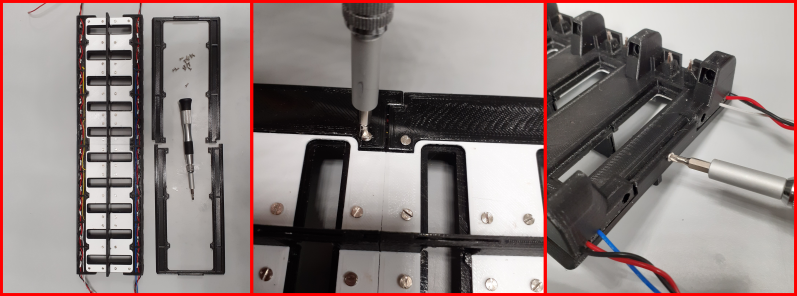

### 7. Cutting and inserting the IR light dividers

The light dividers are cut from their original storebough form into the required shape with the help of a 3D printed cutting template. 

- Template lower layer [3D file](https://github.com/shaliulab/idoc_docs/blob/master/docs/assets/src/3D_printed_parts/IR_sheet_cutter/IR%20sheet%20cutter%20-%20Part%201.stl)
- Template upper layer [3D file](https://github.com/shaliulab/idoc_docs/blob/master/docs/assets/src/3D_printed_parts/IR_sheet_cutter/IR%20sheet%20cutter%20-%20Part%202.stl)

Note that to secure the 2 halves of the template together you will need X mm screws. Ideally also use a scalpel to ensure a clean cut of the filter material.

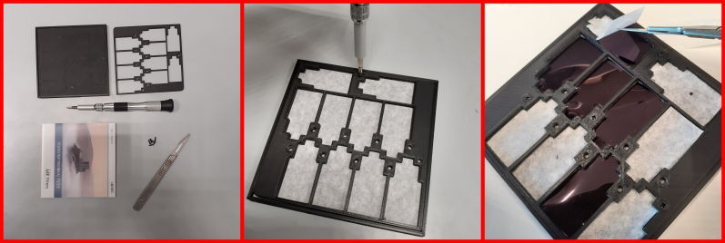

<!--(IMAGES 20220323_190243 AND 20220323_190635 AND 20220418_144316) -->

Once filter pieces are cut, place them into their respective slots from the borrom of the chamber tray, inserting them flat side up. Push them until the "steps" in their structure meet resistance. Note that there is supposed to be some leftover filter jutting out from the gap. This extra material is supposed to be folded and tucked into the gap to create friction that holds it in place.

<!--(IMAGES 20220418_145711 AND 20220419_111909)-->
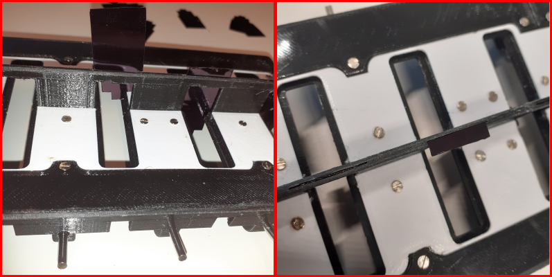

### 8. Assembling and inserting the light diffusers

For this stage you will need to 3D print the diffuser holder (Diffuser_holder). You will need a total of 20 of these as each chamber slot needs one. The diffuser material itself (Plexikopen, Polycarbonaat Opaal - product no longer valid) will also need to cut into 2 _mm by _mm pieces. These are to be inserted into the holder from either side. Note that they should be able to slide along the holder's grooves. At this stage you should leave a small gap between them.

Once prepared, insert each holder with the diffuser into their respective slots, ensuring that the IR filter material can reach through it. Then follow up by closing the gap you previously left between the 2 diffuser blocks to lock the filter in place.

<!--(IMAGE 20220419_175312 AND 20220419_175343) -->
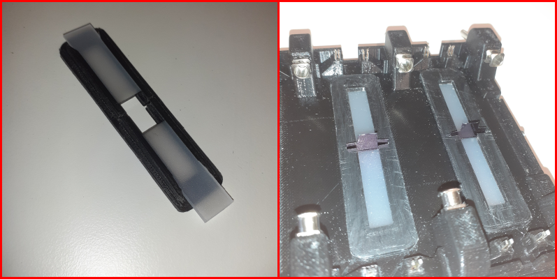

### 9. Inserting the air outflow ports

The metallic outflow ports have slots already prepared for them in the chamber tray, however to ensure optimal attachment, they should be inserted and then pushed a little further with the help of a solder iron. This would allow the metal to heat up and melt the surroundings into an ideal fitting.

<!-- (IMAGE 20220419_175358)-->
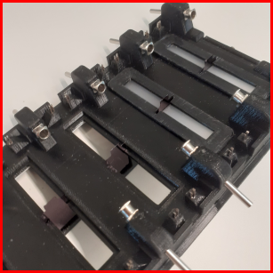

Once they have been inserted, you should be able to simply pull the vacuum tubing over the male end of the port. However, this should be done later when the entire chamber tray is finalized and being locked in place.

### 10. Assemble and add the display system

NOTE - this part is not actually part of the tray itself, but for now, no other section describes how to build and connect it. Put it here for now and move elsewhere when a better point is found.

For this you will need the following 3D printed parts:

- LED holder - EShock indicator [3D part](https://github.com/shaliulab/idoc_docs/blob/master/docs/assets/src/3D_printed_parts/IDOC_setup/044_3D_EShock_LED_indicator.stl)
- LED holder - Odor indicator [3D part](https://github.com/shaliulab/idoc_docs/blob/master/docs/assets/src/3D_printed_parts/IDOC_setup/042_3D_Odors_indicator.stl)
- EShock indicator cover [3D part](https://github.com/shaliulab/idoc_docs/blob/master/docs/assets/src/3D_printed_parts/IDOC_setup/045_3D_EShock_LED_indicator_cover.stl)
- Odor indicator cover [3D part](https://github.com/shaliulab/idoc_docs/blob/master/docs/assets/src/3D_printed_parts/IDOC_setup/043_3D_Odors_indicator_cover.stl)
- Large LED spacer [3D part](https://github.com/shaliulab/idoc_docs/blob/master/docs/assets/src/3D_printed_parts/IDOC_setup/046-051_5mm_LED_indcator_holder_6X_1_of_6.stl)
- Small LED spacer [3D part](https://github.com/shaliulab/idoc_docs/blob/master/docs/assets/src/3D_printed_parts/IDOC_setup/052-057_3D_Holder_of_3-mm_LED_6X_1_of_6.stl)

### 11. Joining the tray to the IDOC body

(this section assumes that the display system is already added and the long screws jutting out from there are already in place)

<!--(Do we need to print a frame piece for the "bottom end" of the tray - see image 20220506_112358) -->

Start by covering the screws that come from the display system with springs. These are necessary to facilitate some freedom of movement during tray vibrations.

<!--(IMAGES 20220506_112338 AND 20220506_112358) -->
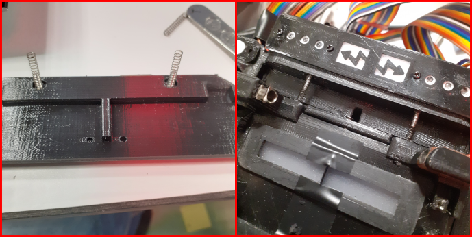

Similarly, place screws on the "bottom" end of the IDOC frame and cover them with springs before fully driving them into the tray.

### Final product

<!--(IMAGE 20220516_185807) -->
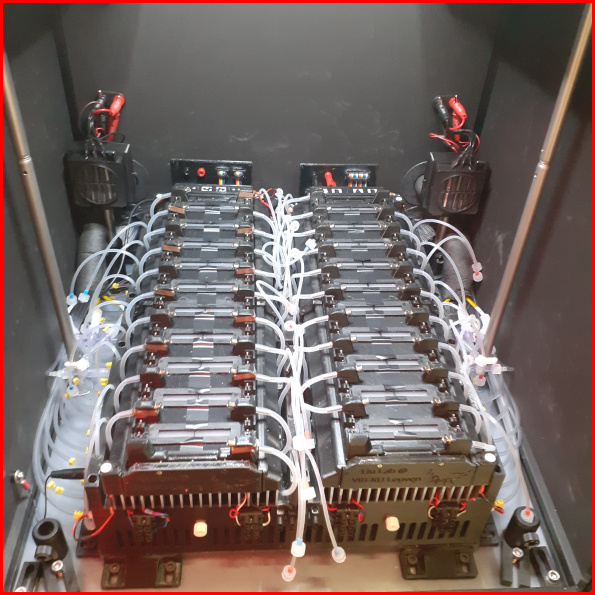

## Joining the tray with the system

Where to place the screws + springs

How to connect the electronics in the tray to the main system

How to connect the tubing in the tray to the main system.
This part should be quite simple since its mainly just "pull tubing over the nozzle/port we melted into the tray"