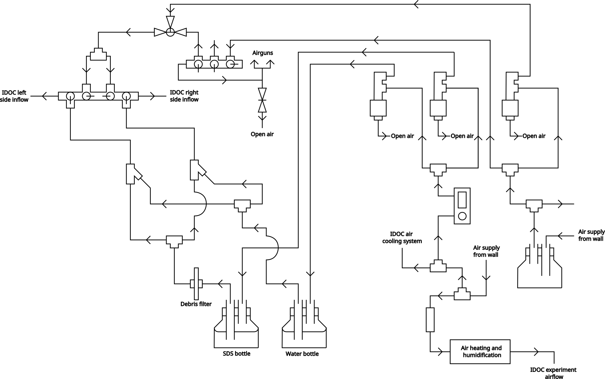

# Cleaning and maintenance of IDOC

## Table of contents
1. [Overview](#overview)
2. [Regular chamber cleaning](#regular-chamber-cleaning)
3. [Odor system cleaning](#odor-system-cleaning)
    1. [Cleaning system](#cleaning_system)
    2. [Cleaning manifold](#cleaning_manifold)
    3. [Cleaning protocol](#cleaning_protocol)

## Overview 
Many components in the IDOC system can get dirty or worn down with use. However any negative results of this can be prevented with regular maintenance, particularly on the chambers and the odor delivery system inside the IDOC system.

While the chambers can get contaminated with remains from the flies that inhabit them, the air/odor delivery system can have some buildup of odor residue that could cause confusion for the flies during conditioning.

## Regular chamber cleaning
The chambers should be cleaned regularly, roughly once every 3-4 weeks, or more depending on your frequency of experiments. The protocol is practically identical for non-ITO and ITO chambers, and any differences will be highlighted below.

To clean the chambers, you will need:

- The same hex nut driver you used to seal the chambers
- Dust free wipes (Kimtech Kimwipes)
- Ethanol

When dealing with ITO chambers specifically, as an optional first step, put a small piece of masking tape onto the top glass. This will help you keep track of which side is conductive and not when reassembling the chambers.

Start by undoing the 8 hex nuts holding the top of the chamber in place. Take off the top lid, rubber and glass. Ideally always keep the glass resting on the rubber so that it doesn’t scrape against your work surface.

Wet the Kimwipes with ethanol and clean both the top and bottom glasses. Use a separate Kimwipe to dry the glasses right after, and then leave the chambers to air dry further (don’t seal them for at least an hour).

For ITO chambers, note that over time the glass could develop regions that have darkened from electrical charring. To the naked eye this will look like debris that cannot be removed with ethanol wipes, so be careful to not wipe too aggressively in attempts to remove this. Too much force could damage the ITO coating.

Once properly dried, seal the chambers. Make sure the glass and rubber are nicely centered before sealing them up with the top cover and hex nuts. At this point wrap up with quality control to ensure nothing went wrong during reassembly. Use an airflow meter to test whether the amount of inflow equals outflow.

If dealing with ITO chambers, also run a continuity check with a multimeter. The electrodes designated for the same polarity should be connected to each other. For example, the electrodes on the bottom left and right sides should be in continuity.

Conversely, there should be NO continuity between the opposite polarities! The top and bottom electrodes should register no continuity. If they do, that means somewhere inside the chamber there is a short circuit. If this is the case, this issue will prevent the entire electroshock system from triggering as intended.

## Odor system cleaning
Periodically, the IDOC air delivery systems should be cleaned to ensure uncontaminated air/odor is reaching the flies. To do this, the passive air delivery system is connected to a secondary cleaning system, that allows a mixture of water and SDS to be pumped through the odor delivery paths.

It should be noted that the cleaning mixture is pushed through the system with the same air that is used to provide passive air. Hence there is a slight overlap between the air delivery systems and the cleaning system which will be further clarified in the assembly stage.

Since the cleaning system uses the same path as the passive airflow to reach the IDOC, the only sections that will be cleaned are the manifolds inside the IDOC and the tubes that carry the air/odor to the flies. The cleaning path does not include the tubes that carry the air/odor from their respective mineral oil bottles to these manifolds.

The figure below shows the point at which the air/odor path meets the passive air path and enter the recording area. The red path brings the air/odor A/odor B to the system, while the green path brings the passive air, or in this case, the cleaning solution. This should illustrate that the cleaning system does not clean every section that is exposed to odor, but just the parts where these odors enter the bulk of the IDOC system.

The process is mostly automated, with the help of a programmed paradigm that controls the flow of water and SDS, similar to how it would work during an actual experiment. You will however need to flip a few valves to switch from the air/odor system to the cleaning system. Also, you will need to add a cleaning manifold to the IDOC tray in place of the chambers you normally use. This is necessary to provide the waste water a path to the waste container instead of having it spill into the recording area.

In the upcoming sections you will find more detailed descriptions of how the cleaning system that pumps the water + SDS works, and how to assemble the cleaning manifold. These two parts will be brought together in a final section which describes how to actually carry out the cleaning.

- [Cleaning system assembly](#cleaning-system-assembly)
    - A separate path of pumps and tubes that would direct cleaning solutions through the IDOC airflow paths
- [Cleaning manifold](#cleaning-manifold)
    - A manifold that would mimic the presence of chambers during cleaning to prevent leaks
- [Cleaning protocol](#cleaning-protocol)
    - Actual step-by-step guide for carrying out the cleaning with the previously described systems

### Cleaning system assembly
The entire network is connected as shown in the following figure. The more detailed description will follow the path from sources towards the main IDOC system itself.

**Path of airflow until solenoids**
The right air supply source is passively always on, since downstream it provides the IDOC with the passive air supply that is left active whenever it’s not being used for experiments. This is meant to ensure any leftover odors are evacuated from the tubes while also ensuring they are as dry as possible.

The path for this passive airflow can be seen by following the path of air that ignores the solenoid and goes directly to a manifold. From here the flow splits into what is used for the IDOC and what is used for the airguns.

The right side air supply also provides the air that is used to push all the SDS/water mixture around the IDOC system (but not pump them out of their bottles). This is controlled by the right-most solenoid in the figure.

The left air supply is used to supply the air that pumps the SDS and water out of their respective bottles. This is done with the air that goes through the flow controller to the solenoids. The same air source is also used for the IDOC air cooling system (where air is pumped between the aluminium cooling fins under the main tray) and the air that is actually supplied to the flies during experimentation.

The air that is used to create odors during experimentation also comes from here. It's supply is controlled by a general solenoid which allows air to pass through the warming and humidification path. This path is described in more detail in the [air delivery system](Air-odors-delivery-system.md#airodors-delivery-system) page as its not the focus of the cleaning section. It should just be noted that the cleaning and experimental airflow systems are linked, even though the figure in the other page might not indicate it directly.

**Path of airflow after solenoids**

*After air solenoid*

The air from the air control solenoid is then pathed to a 3-way T-valve. 

This normally has all its paths open, thus allowing both the passive airflow from earlier to reach the IDOC system, and also any air that is sent through the solenoid. Note that even though the solenoid path is normally open, there isn’t really anything coming from that path until the cleaning paradigm is activated.

For cleaning, this T-valve is positioned so that it would block the passive airflow and only allow the air from the solenoid to reach the further stages, thus giving us full control over when air enters the system.

This controlled air supply is then routed into a mixing manifold. Along the way it’s also split into 2 separate paths, each dedicated to either the left or right sides of the IDOC ROIs respectively. In this mixing manifold, the valves are directed so that no flow would mix in the middle, and the air needs to have it’s inflows more centrally located than the water/SDS inflows to ensure that the air will actually push the mixture towards the IDOC system.

*After SDS/water solenoid*

The SDS and water pumping happens practically identically. For both substances, they are pushed out of their respective bottles by the air from the corresponding solenoids. In the diagram, this means that any flow leading into the bottles is air, and anything coming out is SDS or water.

The only difference in the water and SDS flow paths is that the SDS bottle outflow has a debris filter placed in front of it. *Not sure why specifically the SDS and not the water*

Flows of both SDS and water are split into 2 separate paths (SDS-LEFT, Water-LEFT, SDS-RIGHT, Water-RIGHT). The liquids designated for the same side are then combined at a Y-junction before being directed to the mixing manifold. The mixed liquids enter the manifold at their corresponding sides where they then travel to the IDOC, occasionally being accelerated/pushed by the air as described earlier.

The valves which control the flow of the SDS/water mixture into the mixing manifold, are normally closed to prevent any unwanted liquid flow when not cleaning. However, when actually cleaning, they should be fully opened.

## Cleaning manifold
The cleaning manifold is composed of 3 main parts/sections.

- The legs
- The acrylic board
- The manifold/tubing system

The legs are 3D printed to ensure an ideal fit into the IDOC chamber tray, so that the entire manifold system could slot in the same way your chambers normally do. The file for this can be found in the [SL lab Onshape](https://cad.onshape.com/documents/edf76fc92b14f5ce3f5c94c3/w/2d8bab8cd1acf1da1c5d2593/e/9aa1e7703f398292cb559f48) (IDOC/Cleaning_manifold_leg).

The acrylic board is simply there to provide stability and provide a nice base to keep everything together as one bulk. A board of 2.8mm thickness should be more than enough to support everything.

The manifold/tubing system is responsible for collecting the waste water that is coming from the air/odor inflow channels, and then directing it to the waste outflow and its respective container. 
The manifolds are the ones depicted [here](https://www.avantorsciences.com/us/en/product/39537969/manifold-fittings-with-female-luer-locks-polycarbonate). These manifolds are screwed onto the acrylic board using 2M x 8mm screws (with the corresponding nuts in the end).

Each of the inflows (outward facing parts of manifold) have [one-way flow valves](https://www.wpiinc.com/14039-10-check-valve-female-luer-lock-inlet-male-luer-lock-outlet.html) attached to them.

The interconnecting parts of the manifold are connected with (3mm OD - 2mm ID) vinyl or tygon tubing with male-to-female luers at either end. The waste outflow section (right side of the overview) has slightly wider tubing (4mm OD - 2mm ID). These connect to the same one-way check valves as shown earlier, via male-to-female luers. The one-way flow valves then lead to a T-junction which can then be connected to the waste channel.

## Cleaning protocol
This step-by-step protocol will cover the cleaning from start to finish. All references to mechanisms should also be mentioned in the flow diagram shown above. Note that this is the protocol for our setup, and since your assembly might vary a bit in some place, you might need to adapt accordingly to the description.

1. Ensure that the water and SDS supply bottles are sufficiently filled
    - Water bottle: 5L of dionized water
    - SDS bottle: 1L minimum of 1% SDS
2. Check that the SDS bottle outflow has a fresh debris filter. Change if needed.
    - This might not be necessary each time, but always verify.
3. Open the valves on the water and SDS bottles
    - Keep in mind that these will be need to closed at the end of the cleaning protocol
4. Use the red valve (stopcock) to ensure that only air from the solenoid path can reach the mixing manifold. While normally both the passive air and solenoid air have open paths here, it should end up with the passive air path being blocked and the others being open.

    

5. Fully open the flowmeter to the water and SDS solenoids
6. Insert both the cleaning manifolds into the IDOC chamber tray. Use the first and last chamber slots to ensure that the manifold is properly placed and stable. 
7. Connect all the inflow tubes (normally for air/odor) to the cleaning manifolds. Also connect the manifold outflow to the waste channel.
8. Make sure that all the valves on the manifold are fully open (no restricted flow paths).
9. Ensure that the IDOC flow selectors on the sides of the IDOC system are set to the “passive airflow” path, and that the air/odor path is blocked. This is crucial since the cleaning mixture will flow along the same channel as the passive airflow.
10. Check the waste container. It should be completely empty before any cleaning is initialized.
11. Check the valves in the main manifold. The valve that controls inflow of SDS + water into the manifold should be opened. The valves for airflow should be open but directed so that the LEFT and RIGHT paths are separated/closed off from one another.
    - In our case we have 2 IDOC systems connected to the same cleaning system. For this we also have added one more pair of valves that allows to direct flow to either IDOC separately. Assuming you only have 1 of these systems, these valves can be ignored in the image.

    

12. Check that the solenoids activate the correct systems (air, water and SDS) and that flow for each is functioning normally. You can do this with the manual switches near the solenoids. You can let a little bit of water and/or SDS flow all the way through to the waste channel to make sure everything is working as expected, before starting the automated cleaning paradigm.
    - Note that the flow of water and SDS is largely achieved by the air pushing it through the system, so you will probably need to juggle between activating the water/SDS and the air solenoid. Try activating the water solenoid first so that the tubing fills up with water, and then activate the air solenoid to have it push the water throughout the system. At this point the flow should be able to continue on its own.
    - Close the solenoids from the same switches you used to test just now.
13. Log in to the `idoc_cli` on the computer you use to control the IDOC, and run the `clean (without vacuum)` paradigm
    - Note that no warm-up is needed for this paradigm (as opposed to normal experiments).
    - If the paradigm refuses to start it is likely because the software still wants the 3 tracking dots to be activated. The paradigm should have been updated to take care of this though.
14. Once the paradigm has finished running, you’ll need to let the air run through the system to ensure proper drying. To do this, turn the red valve (stopcock) from step 4 to enable the passive airflow from earlier. Let this drying run for roughly 1-2 hours.
15. Begin the stage of removing the cleaning manifold from the IDOC. Doing this stage properly is crucial for ensuring any residual water is properly removed from the system.
16. Remove the stopcocks from the bottom of the IDOC tray. This prevents overpressure in the upcoming steps. Have a paper towel ready since water could leak out of these during the opening and later steps.

    

17. Close the waste outflow valves on the cleaning manifold.
    - To minimize the presence of water in the manifold, once both outflows are closed, open just one again (either left or right side). This should create more pressure that can push the remaining water in the manifold towards the open outflow. Close that outflow and repeat for the other.
18. At this point there should be nowhere for the air to flow, except the 2 stopcocks that you unplugged in step 16. Have a couple paper towels ready. **One at a time**, disconnect each inflow tube and ensure there is no more water being pushed through it. Dry it if needed and then reconnect it. Repeat this for each inflow tube.
    - This needs to be done one at a time, to ensure that only one tube gets the maximum air pressure pushing the residual water out. Since the airflow has nowhere to go, it will rush through the single inflow tube you opened at that moment. 
19. Once each inflow tube has been checked, disconnect the waste outflow and all the inflows from the manifold and remove it from the system.
20. Re-attach the stopcocks from step 16.
21. Let the passive airflow continue overnight (ideally over the weekend even) to ensure as much drying as possible.
22. Finish up by checking the following:
    1. Overflow stopcocks at the base of the IDOC tray have been closed again.
    2. Flow valves are closed on the SDS and water bottles
    3. Flow control manifolds are back at their original settings
        - Red stopcock for passive airflow open
        - SDS/water valve for main manifold closed
    4. Waste container emptied for next user.