# Assembly of chambers in Learning Memory Setup

## Table of contents

1. [Overview](#overview)
2. [Fabricating the normal IDOC chambers](#fabricating-the-normal-idoc-chambers)
3. [Fabricating the electroshock chambers](#fabricating-the-electroshock-chambers)
4. [Quality control for chambers](#quality-control-for-chambers)
5. [Laser cutting rubbers](#laser-cutting-rubber-seals-for-chambers)

## Overview

The IDOC chambers are the key to delivering stimuli to isolated flies while also being able to visually monitor them. Their core design revolves around having controlled points of air in-/out-flow and transparent windows to allow for tracking. Other stimuli such as electric shocks, heat and light (for optogenetic stimulation) can be incorporated as well, via modifications to the chambers or the rest of the machine.

For our IDOC system, we have 2 main chamber variants:

1. "Normal" IDOC chambers which only have air/odor as the in/outputs

2. Electroshock chambers, which have the basic air/odor functionality but also incorporate a conductive glass to deliver current to the flies.

The following sections describe how to build and test either of the chamber types. Since both of these are made from a combination of 3D-printed and bought parts, a printing and shopping list will be linked for each. Overlapping components will be highlighted where relevant.

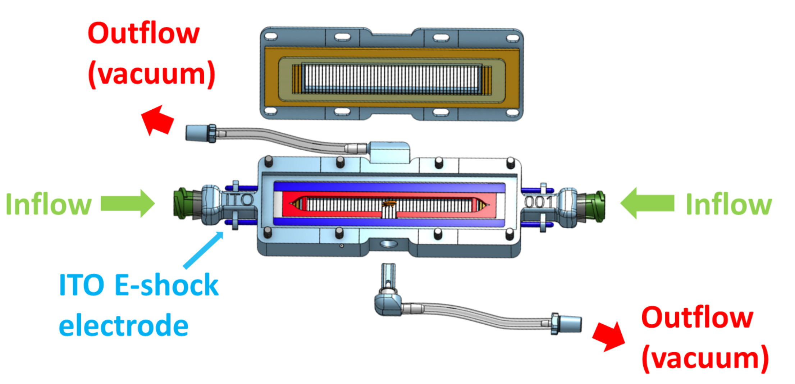

## Fabricating the normal IDOC chambers

**3D printed parts**

* Main chamber body - [3D part](https://github.com/shaliulab/idoc_docs/blob/master/docs/assets/src/3D_printed_parts/Recording_chambers/Chamber_%20Non-ITO_body.stl)
* Chamber top window - [3D part](https://github.com/shaliulab/idoc_docs/blob/master/docs/assets/src/3D_printed_parts/Recording_chambers/Chamber_%20Non-ITO_top.stl)
* Inner chamber frame - [3D part](https://github.com/shaliulab/idoc_docs/blob/master/docs/assets/src/3D_printed_parts/Recording_chambers/inner_chamber.stl)
* L-shaped plug - [3D part](https://github.com/shaliulab/idoc_docs/blob/master/docs/assets/src/3D_printed_parts/Recording_chambers/chamber_L-plug.stl)

[List of files to print](https://github.com/shaliulab/idoc_docs/tree/master/docs/assets/src/3D_printed_parts/Recording_chambers)

### 1. Cleaning and Adjusting printed parts

* Make sure to remove any remaining material from the **support** or **adhesion** of your 3D printed parts. Use warm water to dissolve PVA Material.

* Remove any excess material in the 8 screw holes using a [2 mm drill bit](https://www.amazon.de/-/en/FOCCTS-0-5-3-0-Rotating-Jewellery-Beeswax/dp/B07DXLFRQ8).

* Ensure that the needle holes are clean by removing any excess material in them with a [0.8 mm drill bit](https://www.amazon.de/-/en/FOCCTS-0-5-3-0-Rotating-Jewellery-Beeswax/dp/B07DXLFRQ8). Check all 3 needle holes (top, left and right).

### 2. Screws and Needles Insertion

* Insert the 8x long-screws (2M-12 mm) (RS, [482-9114](https://benl.rs-online.com/web/p/machine-screws/4829114)) from the bottom side, and check that everything is centered and vertical. Then, using flat screwdriver bit (RS, [668-5723](https://benl.rs-online.com/web/p/screwdriver-bit-sets/6685727); Amazon, ([B01M7PPJI7](https://www.amazon.co.uk/Precision-Screwdriver-Magnetic-Macbook-Electronics/dp/B01M7PPJI7))), screw them as far into the chamber as possible. You want the heads of the screws to be flush with the holes they're resting in.

* Center left and right green 0.8mm needles (BD, [304423](https://www.farmaline.be/apotheek/bestellen/bd-microlance-3-naald-21g-1-12-rb-08x40-mm-groen-1/)), with 6 mm rubber ring (VWR, [228-0709](https://be.vwr.com/store/product/nl/577021/slangen-silicone)), in either side of chamber. Introduce them gently inside enough to be seen from the other side.

* The needle and 6-mm rubber ring are custom cut to a specific length. To shorten the needle, cut it in a way that leaves you roughly 5 mm of extra material, and then sand down that last section. This is necessary to ensure you don't leave behind a "crimped" opening on the needle after cutting it.

### 3. Bottom Glass insertion

* Fix a rubber gasket to the bottom of the chamber. The rubber must stand out and fit in its place. Note that the bottom rubber is custom cut to a specific size from translucent silicone rubber sheet (RS Components, [840-5541](https://benl.rs-online.com/web/p/silicone-rubber-sheets/8405541/))

* Add a glass slide to the bottom of the chamber. Keep them horizontal on the bench. 

### 4. Inner Chamber Insertion

* Center the middle rubber piece on the top of the glass. Make sure that it is placed correctly in its holder, then insert right and left needles into the rubber.   
note: the middle rubber that hold the inner chamber is custom made to a specific size, and both needle holes are drilled.
  

* Place the window-like template in the top of chamber to create  a room for the inner chamber by cutting out a rectangle inside the rubber. Use a **sharp blade** and the guides of the template. Make it as vertical as possible. Ideally, each side should be done in one stroke

* Carefully remove the cut part of the rubber. use sharp blade and forceps if needed, then remove the window template.

* Place one inner chamber in the center of the rubber  

* Prepare the inner chamber 0.8 mm holes. Use 0.8 mm drill bit and a very sharp 0.8 mm needle to adjust the three holes. Check the quality of **fish-shape**.

* Insert the green needles from step 2, until their tip comes out inside the triangular cavities in the inner chamber. Make sure the needles are not blocked or closed. Pressing air through with a syringe can help.

* Insert and center the **middle needle** to the inner chamber from direction of the inner chamber. Be sure that needle is **not blocked or closed**. Cut the outer part of the needle. 

### 5. Connecting outflow tubing and fly gate rubber

* Attach small piece (~5 cm) of tubing (Silicon Tubing ID 1.5mm x 3 mm OD (VWR, [228-1450](https://be.vwr.com/store/catalog/product.jsp?catalog_number=228-1450)) with WPI lure, [13160-100](https://www.wpiinc.com/13160-100-male-luer-fitting-for-1-16-id-tubing)) to the outer tip of middle needle.

* Place a 6 mm tubing in the side opening to create an O-ring Rubber in the place where the fly is loaded (gate to provide no leak). Cut it to be aligned with the outer side of the chamber. 

### 6. Cleaning, top Glass insertion and Closing

* Add a second glass-slide on the top of the inner chamber; Keep them horizontal on the bench. The slide must stand out and fit into its place 

* Add the top rubber above the glass-slide 

* Add the window to the chamber, then attach 8x nuts (RS, [248-4551](https://benl.rs-online.com/web/p/hex-nuts/2484551/)) to the screws. Balance and twist them using 4 mm Hexagon Nut Driver (RS, [323-2581](https://benl.rs-online.com/web/p/nut-drivers/3232581)). **Do not add much force** Only more squeezing, when they have leakage during testing the chamber.

## Fabricating the electroshock chambers

**Indium Tin Oxide coated patterned glass slides** 

For aversive electric shock learning conditioning, we used patterned coated indium tin oxide (ITO) transparent glass slides. ITO is a conductive transparent substance. A grid was laser-cut and -etched onto the ITO glass in order to insulate the positive and negative electrodes. Our ITO slides were designed with the following specifications: 69.0 mm length x 14.0 mm width x 1.1 mm Thicknesses [0.5 mm ITO electrodes (100 electrodes) – 0.1 mm inter electrode-spacing ]. The two halves of the grid can be independently controlled. 

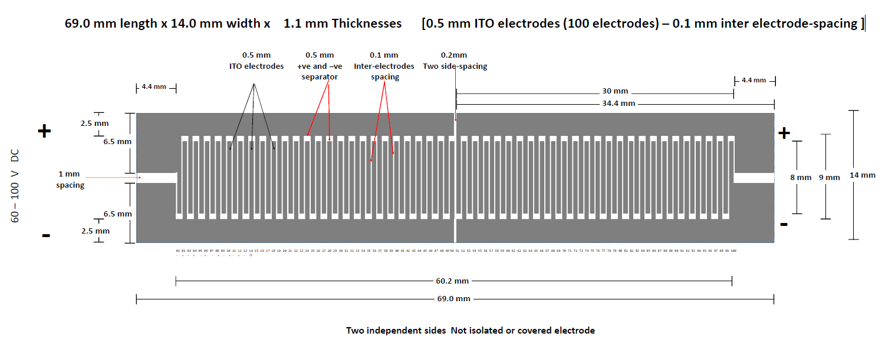

**Electrical connections in the chamber**

Each chamber is designed to have four custom-made electrodes that create a connection between the interior and exterior of the IDOC chambers. Inside the chambers, each electrode pin is connected to a long metal strip that connects the left and right side of the chambers. Also, to ensure that the entire ITO slide is subjected to the current, 2 of these metal strips are needed - one for the top and another for the bottom half of the chamber. The ITO slides themselves will rest in contact with these metal strips.

Both the pins and the connecting metal strip are made in-house from standard electrical components. The metal strips are made from the flat section that crimp sockets are usually delivered with (Farnell, [1593529](https://be.farnell.com/multicomp/2226tg/crimp-terminal-24-28awg/dp/1593529?ost=1593529)). The pins that connect the interior and exterior of the chambers are also simply taken from fairly standard pin headers ([548-7171](https://benl.rs-online.com/web/p/pcb-headers/5487171) or  [548-7222](https://benl.rs-online.com/web/p/pcb-headers/5487222)). To establish a connection between the pins and metal strips, you will simply have to solder them together.

### ITO chamber component list
The ITO chambers are assembled from a combination of 3D printed parts and storebought parts (which have been further modified in some cases). The overall list of parts looks as follows:

* 3D printed parts:
    * Main chamber body - [3D part](https://github.com/shaliulab/idoc_docs/blob/master/docs/assets/src/3D_printed_parts/Recording_chambers/Chamber_%20ITO_body.stl)
    * Top window - [3D part](https://github.com/shaliulab/idoc_docs/blob/master/docs/assets/src/3D_printed_parts/Recording_chambers/Chamber_%20ITO_top.stl)
    * Inner chamber frame - [3D part](https://github.com/shaliulab/idoc_docs/blob/master/docs/assets/src/3D_printed_parts/Recording_chambers/inner_chamber.stl)
    * L-shaped air plug - [3D part](https://github.com/shaliulab/idoc_docs/blob/master/docs/assets/src/3D_printed_parts/Recording_chambers/chamber_L-plug.stl)
    * Rubber cutting templates:
        * Cutting base [3D part](https://github.com/shaliulab/idoc_docs/blob/master/docs/assets/src/3D_printed_parts/Recording_chambers/rubber_cutting_base.stl)
        * Bottom rubber template [3D part](https://github.com/shaliulab/idoc_docs/blob/master/docs/assets/src/3D_printed_parts/Recording_chambers/template_bottom_rubber.stl)
        * Middle rubber template [3D part](https://github.com/shaliulab/idoc_docs/blob/master/docs/assets/src/3D_printed_parts/Recording_chambers/template_middle_rubber.stl)
        * Top rubber template [3D part](https://github.com/shaliulab/idoc_docs/blob/master/docs/assets/src/3D_printed_parts/Recording_chambers/template_top_rubber.stl)
* Storebought:
    * 2x ITO glass slides
    * 3x needles with 0.8mm diameter
    * Conductive copper tape
    * 12x 2Mx12mm screws (8x for the chamber body + 4x for the rubber cutting template)
    * 12x 2M hex nuts (8x for the chamber body + 4x for the rubber cutting template)
    * Leftover metal strip from crimp socket heads (exact length will vary slightly)
    * 4x Pin headers
    * Liquid silicone filler
    * Silicone sheet of 1.5mm thickness
    * Rubber tubing:
        * Outer diam 6mm, inner diam 4mm
        * Outer diam 3mm, inner diam 1mm

* Tools
    * Scalpel with fresh blade
    * Collection of files
    * Tweezers
    * Cutters
    * Soldering station
    * 0.8mm drill bit + handle of your choice
    * Multimeter

*Figure 0: Overview of all the necessary components to build an ITO chamber*

### 1. Preparing and using the rubber cutting templates

This is an optional section for those using the 3D printed template for the rubber cutting. For optimal results, a laser cutter would be ideal.

* On both the template base and the top inserts, prepare the screw holes with a 1.8mm drill bit.
* Insert the 2Mx12mm screws and make sure the top templates can fit nicely on top
* Pre-cutting the rubber inserts
    * Cut out 3 rectangles of 19mm x 78mm from your silicone sheet. These don't need to be exact as they are just the starting parts that will be further cut into the desired shapes with the template (Figure 1 A).
    * Cut the bottom, middle and top rubber shapes from your starting pieces by using the corresponding template pieces. Results can be seen in Figure 1 B.
        * Place your starting rubber piece on the template base. Cover it with the corresponding template piece and fix it in place with the hex nuts. Make sure there is no warping of the rubber after tightening the nuts.
        * Proceed to cut along the inner and outer walls of the template. Note that you will need to do small cuts afterwards to finish the areas where the template supports are covering the rubber.

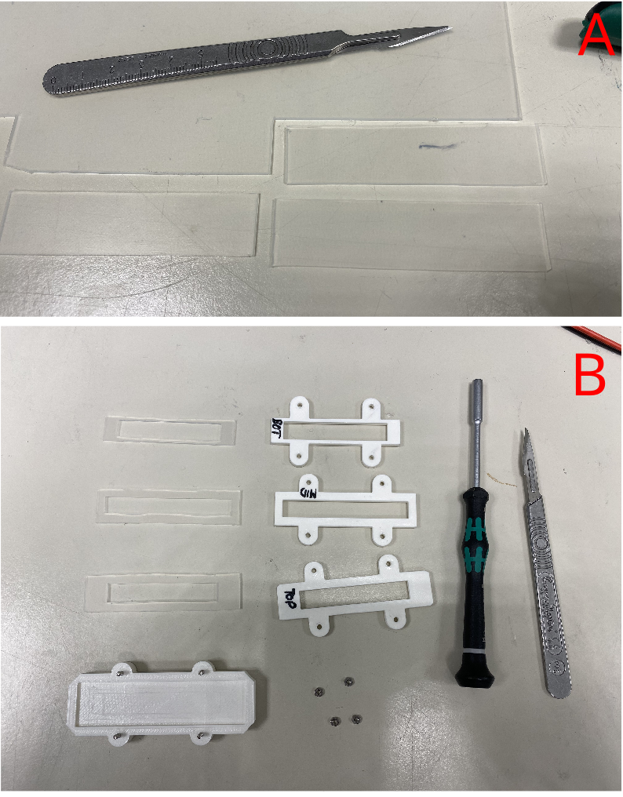

*Figure 1: The process of making the rubber seals from a silicone sheet, starting with generic template pieces (A) and finishing up with rubber pieces fit for their specific chamber layer (B)*

### 2. Quality control for 3D printed parts

* Make sure you've thoroughly soaked the parts long enough to dissolve all the PVA. Verify that any and all holes are clear with a needle and pressurised air.
* For the main chamber body:
    * Inspect the insides for any printing faults. Pay special attention to areas with overhangs, as errors mainly happen there. Remove any excess material with a scalpel/tweezers.
    * Prepare the 8 screw holes with the 1.8mm drill bit. You might even need to upgrade to a 1.9mm drill bit (Figure 2 B).
    * Prepare the airflow holes with a 0.8mm needle by rotating and pressing it through the pre-existing holes on the sides and top of the chamber (Figure 2 C).
    * Check if your pin headers can fit through the pin slots near left/right inflows. If not, use a drill bit to remove some material until they can fit snugly (Figure 2 A).
    * Check if the glass slides can fit snugly into the bottom. If not, remove material where relevant with a file or blade. The usual areas with issues should be highlighted in the following image:
* For the inner chamber frame:
    * Prepare the holes on the sides and top with a 0.8mm needle (Figure 2 D).
* For the L-shaped plug:
    * Check if the airflow path is clear with a needle.

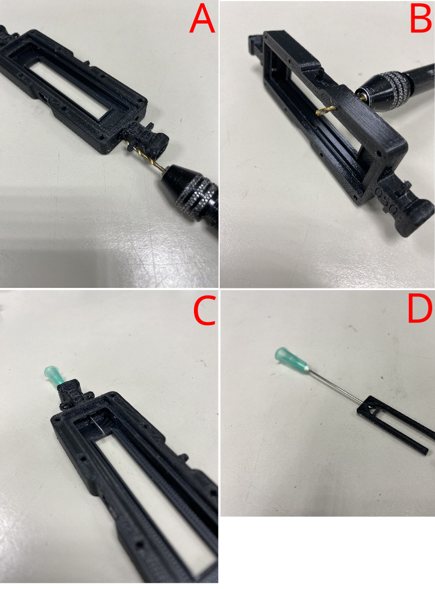

*Figure 2: Verifying the quality of the air and screw holes in the 3D printed parts. Image A shows the prep for the electrode holes. Image B shows the prep for the screw holes used to seal the chamber later. Images C and D show how you'd make sure that the needles can fit through the chamber base and inner chamber frame respectively.*

### 3. Making the electrodes

* Prepare the electrodes. The instructions below describe how to assemble a single electrode, but keep in mind you will need to make 4 in total (and maybe some extras as back-up, as some will inevitably break during assembly):
    * Cut a 2cm piece of a metal strip. In case it still has leftover material from the attachment points, trim them off with pliers and/or sand them down with a file.
    * Solder the pin to one of the holes. Try to leave as much of the pin sticking out as possible.
    * Remove as much solder as possible from the flat side with a file.
    * Cut down the remaining metal until there is roughly 3-5mm to either side of the pin.
    * Using tweezers, bend the flat metal sections so they form a very thin U-shape

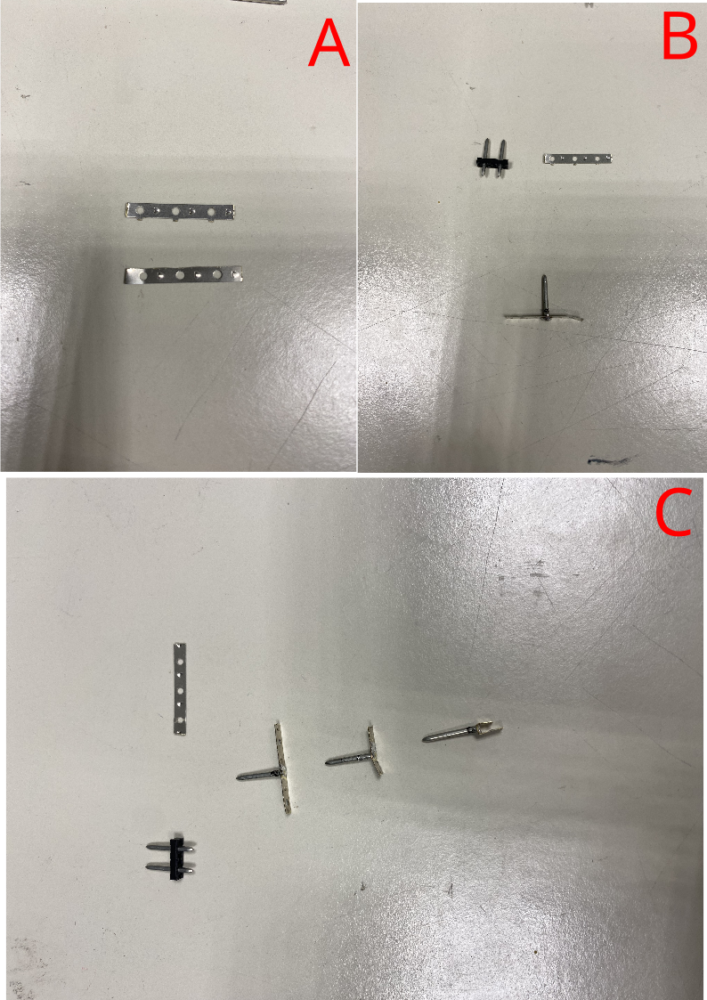

*Figure 3: Making the electrodes from start to finish. Figure 3 A shows what is meant by removing the excess material on the strips - the top one has the extra material while the bottom one has them cut and filed off. Figure 3 B illustrates how the pin and strip are meant to be combined. Figure 3 C also highlights the final length trimming and bending of the strips into the desired U-shape.*

### 4. Assembling the base of the chamber

* Insert the 8x 2Mx12mm screws to the bulk of the chamber.
* Add the bottom rubber insert to the base of the IDOC chamber.
* Place the ITO-glass slide on top of the rubber. It should fit snugly and be roughly level with the surrounding steps in the chamber.
* Add strips of conductive copper tape to both sides of the ITO-glass slide. The strips should be long enough to reach to the electrode holes in the sides.
    * For the bottom side (with the big open port), we need the conductive tape to not obscure the path into the chamber, hence we leave a small gap in the tape there. See Figure 4 D for clarification.

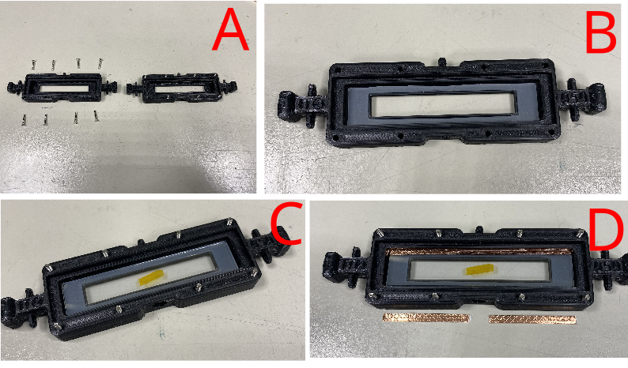

*Figure 4: Assembling the base layer of the chamber. Figure A shows the screw insertions. Figures B and C illustrate how the rubber and ITO-glass slide should rest in the chamber respectively. Figure D highlights how the conductive copper tape is positioned and how one side needs to be split down the middle.*

### 5. Assembling the middle layer of the chamber

* Add the 4 electrodes (from step 3) into the chamber.
    * These need to be pushed as far out as possible so as to take minimal space inside the chamber. Make sure that the each electrode is making contact with the copper tape on the inside of the chamber.
* Inserting the middle rubber layer
    * Just like with the copper tape, we need to cut out a small section from the middle rubber that would block the bottom port. Before inserting the rubber, check if the inner chamber frame can easily fit inside the slot in the rubber.
        * If not, you'll need to trim down the inner walls of the rubber until it fits.
    * Insert the middle rubber piece and ensure that its properly pushed to all the edges of the chamber
    * Insert the inner chamber frame

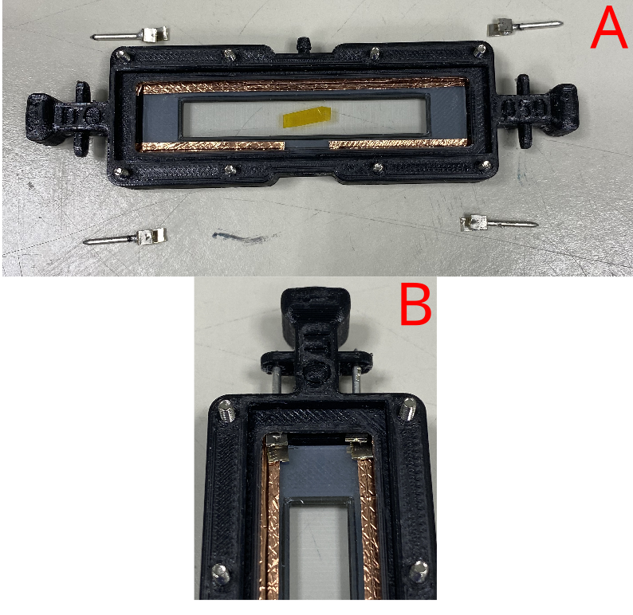

*Figure 5: Inserting the electrodes into the chamber. Figure B highlights how the electrodes should rest in the chamber.*

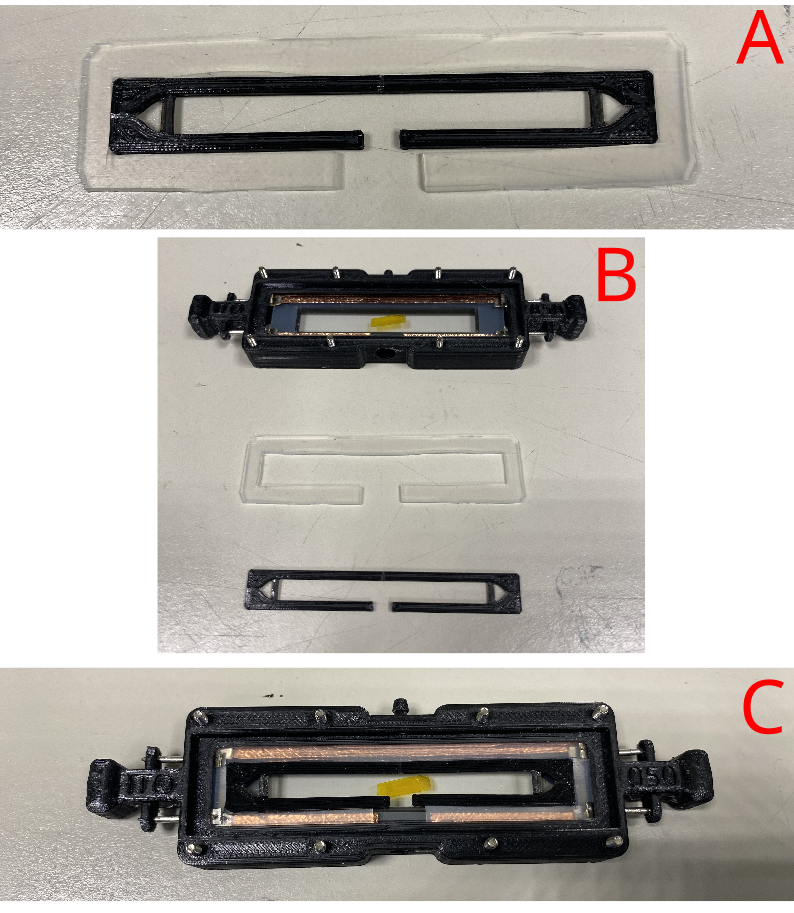

*Figure 6: Visualization of how the inner frame and the middle rubber layer should be inserted. Figure A highlights how the inner frame should be able to be surrounded by the rubber without any warping of either part. Figures B and C highlight the orientation of the 2 parts and how they should rest in the chamber.*

### 6. Finalizing the airflow channels

* Prepare the airflow paths on the sides and top with a 0.8mm needle.
* Make and insert the side inflow needles:
    * Cut the needle so that roughly 15mm of metal is left. This could vary for different needle body shapes. The important factor is that the needle can reach inside the triangular section of the inner chamber frame without extending too far into the rest of the chamber.
    * File the needle down until you get a clean O-shaped opening. Test with a smaller needle whether the hole is clean enough.
    * Add a small bit of the 6mm silicone tubing to the needle to act as rubber seal once the needle is placed into the chamber.
    * Insert the needle into the chamber. Make sure the tip only reaches very slightly into the triangular section of the inner chamber frame.
* Making and inserting the top airflow needle
    * Cut a 14.5mm long piece of the 0.8mm needle. This length should not include the sharp end section of the needle
    * File both ends of the needle down
    * Insert the filed needle. Push it in by gently pressing with tweezers/pliers. Make sure that by the end there is little to no excess both in and outside the chamber.

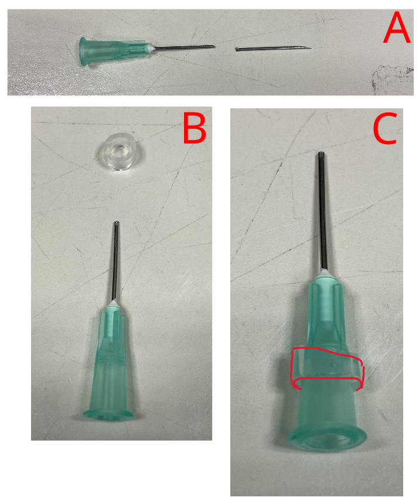

*Figure 7: How the prepare one of the side airflow needles. Figure A highlights how much of the needle you need to keep, while Figures B and C show how the rubber O-ring shoudl rest around the needle.*

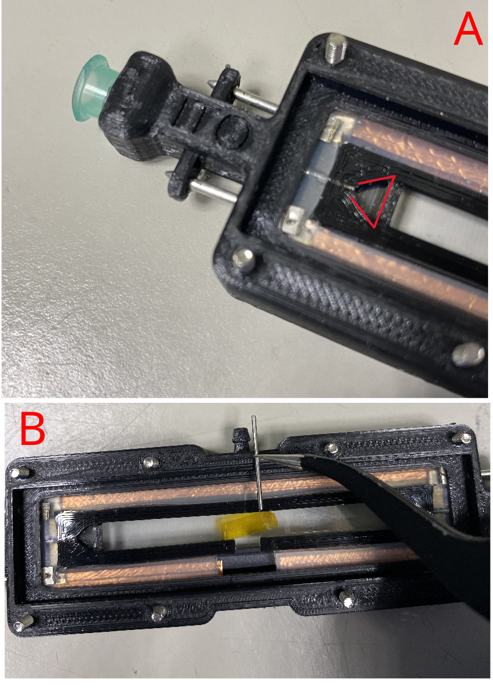

*Figure 8: How the needles should be inserted. Figure A shows how the side needle should rest once inserted, just barely entering the triangle/fish-shaped section of the inner frame. Figure B highlights what the top airflow needle should look like after preparation and where it should be inserted.*

### 7. Finalizing the electrode connections

* Make and insert the top electrode strips
    * The top electrode strips are made from the same metal strips as were used for the electrodes themselves. Measure out 2 strips long enough to reach from the left to the right electrode. To ensure a good fit, make sure you trim any excess material off of the strip.
    * To insert, tuck both ends under the lip of the chamber or underneath the protruding piece of electrode. Make sure that they are not bulging and rest flat

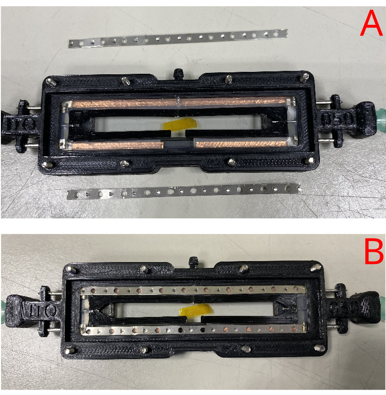

*Figure 9: Illustration of the chamber before (A) and after (B) adding the top layer of electrode strips.*

### 8. Closing the chamber

* Add the top ITO-glass slide and make sure it is properly centered in the slot.
* Cover the glass with the top rubber. Again, make sure the glass is centered and the rubber hadn't moved it.
* Add the top chamber cover and add the 8 nuts to secure it. Start tightening them from the middle outwards. To achieve the best seal without breaking anything, do not apply too much force while turning, but instead press down harder and then turn.

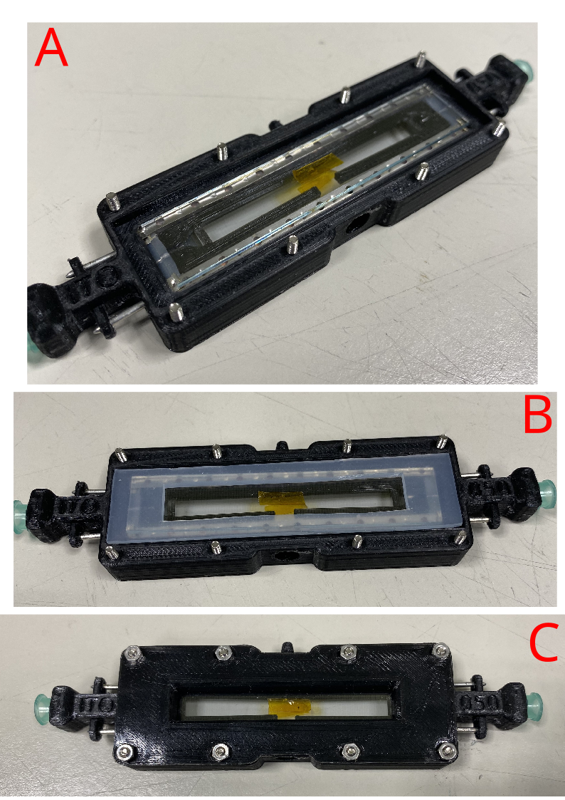

*Figure 10: Building the final layer of the chamber. Figure A shows how the glass should rest on the electrodes, B shows the rubber thats been added and finally C shows the full chamber in its sealed form.*

### 9. External finishes and outflow tubes

* Apply liquid silicone/sealant at the electrode entry points. Make sure to press the sealant down into the hole and wipe away the excess.
* Add a short piece (around 3.5mm) of 6mm tubing to the bottom outflow.
* Assemble and connect the top outflow tube.
    * Cut a 45mm piece of 3mm tubing.
    * Add a luer to one end and connect the other end to the nozzle on the chamber.
* Assemble the L-shaped outflow tube for the bottom of the chamber. Note that this piece does not need to remain connected to the chamber and is only needed during actual usage.
    * Cut a 45mm piece of 3mm tubing and connect it to the end of the 3D printed L-shaped plug. Add a luer to the other end.

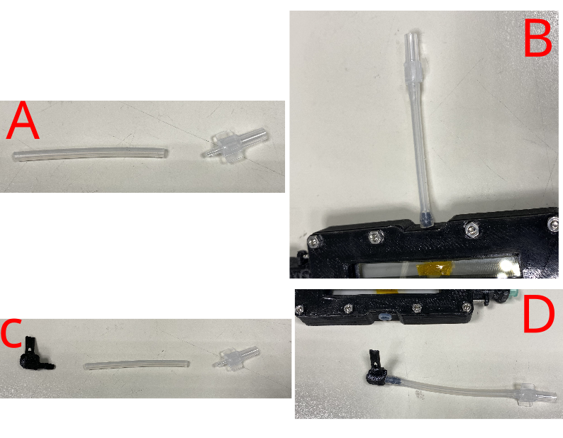

*Figure 11: How to assemble and connect the outflow tubing. Figures A and B illustrate the process for the top outflow, while C and D illustrate it for the bottom outflow tube.*

## **Quality control for chambers**

**How to check chambers once assembled**

* Test the chamber by connecting it to the flowmeter. Max 500 ml per litre.  Inflow must equal outflow.
* Test right and left sides independently  
* Use a waterbath to visually identify the source of any leak. 
    * With the air inflows connected, submerge the chamber in the water. Make sure you're holding the outflow channels above the water. Block these outflows with your finger and you should see bubbles at any leaks your chamber has.

## **Laser cutting rubber seals for chambers**

Laser cutting the rubbers is preferable to doing it by hand with the templates as it greatly speeds up the process and makes the dimensions much more accurate. The latter is crucial to ensure optimal fits with minimal chances of air leaks.

We used the xTool P2 55W CO2 laser to cut out the rubber pieces with the following dimensions:

**Bottom rubber**
- Outer width = 68.2 mm
- Outer height = 13.8 mm
- Inner width = 55 mm
- Inner height = 9.8 mm

**Middle rubber**
- Outer width = 72.8 mm
- Outer height = 17.8 mm
- Inner width = 65 mm
- Inner height = 9 mm
- Gap for L plug (in middle) = 5 mm

**Top rubber**
- Outer width = 76.2 mm
- Outer height = 18.8 mm
- Inner width = 54.8 mm
- Inner height = 10.8 mm

Before carrying out the laser cutting, clean the rubber sheet as much as possible with ethanol and dust free wipes to ensure minimal debris that could interfere with the laser. Then, try to stabilize the rubber sheet as much as possible within the system. This is crucial since as it heats up from the cutting, it is prone to warp and bend a little during the process.

When planning the laser cutter paths, try to balance leaving space between each piece you cut and also not wasting material. This helps also prevent cutting inaccuracies resulting from the material heating up, since if you place two long cuts next to each other, the area might have warped by the time the machine does the second run.

From personal experience, while it might be possible to fully cut through the rubber sheet with the laser, it is not advised to do so here. Using the laser at higher powers that would allow for this also leads to wider regions of charring around the cut, greatly reducing accuracy of the cuts and creating differences between the top and bottom sides. Using our 55W laser at 40% power seemed to be an ideal balance between sufficient cut depth and minimal charring. Notably however, this way the laser cuts through roughly 90% of the material, which means that you still need to finish the process with a scalpel. However, this is vastly easier than doing it all by hand, as the laser cut sections act as great guides for the scalpel.

After cutting, the rubber still needs to be cleaned of any char and debris buildup that occurred. This can be easily done by scrubbing the cut sections with a sponge soaked in 1% SDS. This is best done while all the rubbers are still attached to the bulk of the rubber sheet. See image below for an illustration of the effect that cleaning with SDS can have.

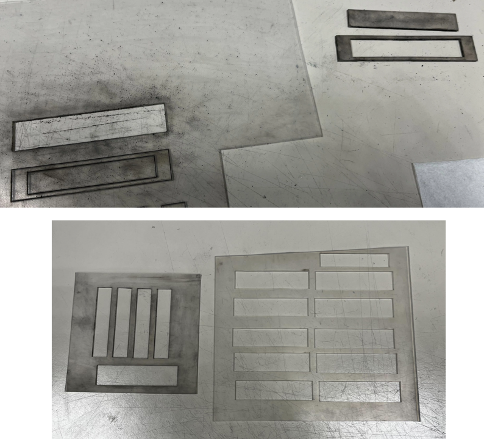

Once cleaned, it should be very easy to finish the process by cutting across the laser lines with a fresh scalpel. Make sure you are holding the blade as vertical as possible as you cut.

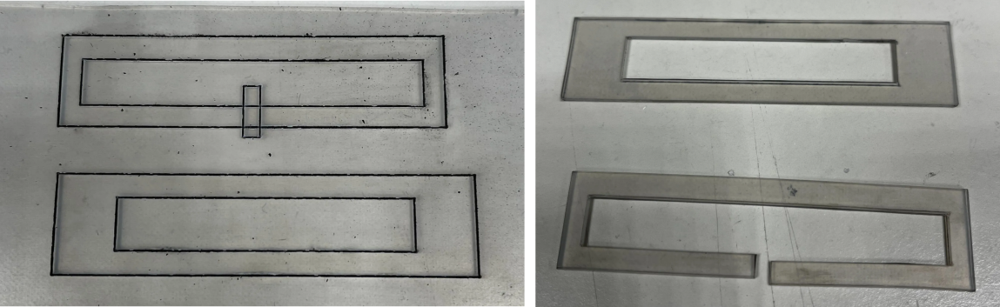
