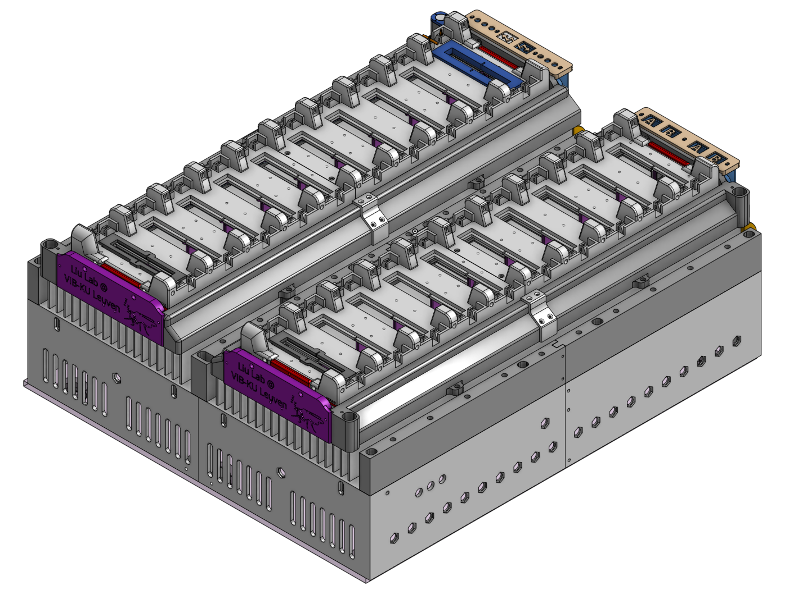
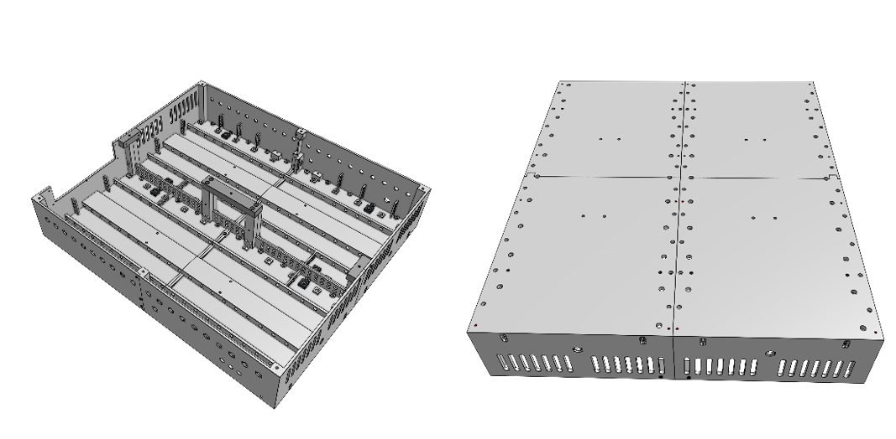
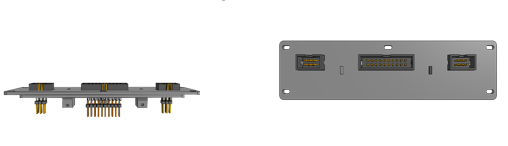
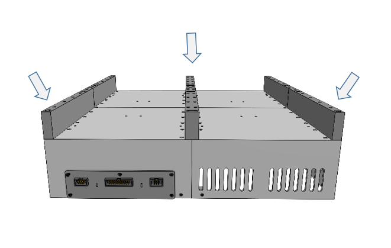
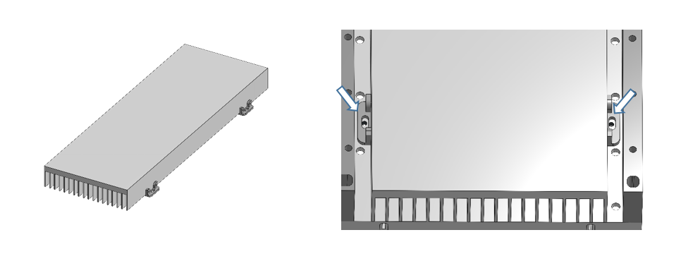
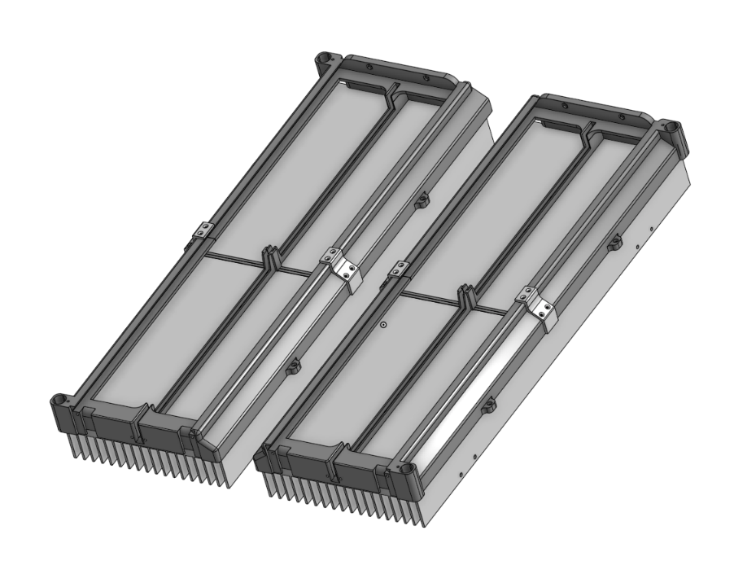
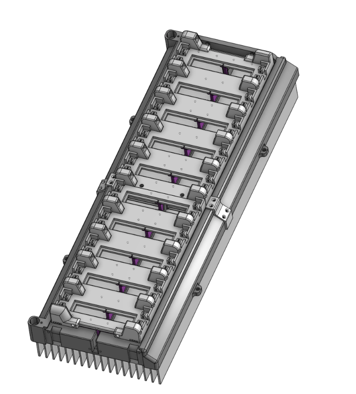
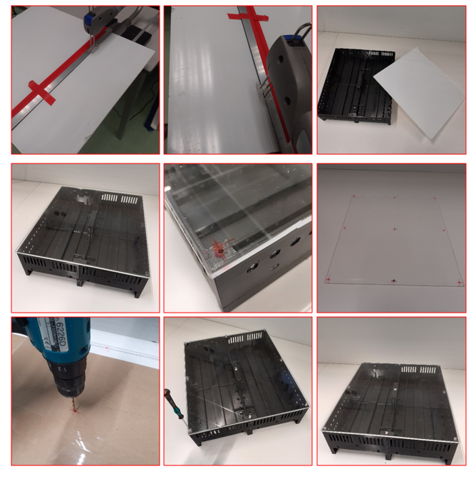
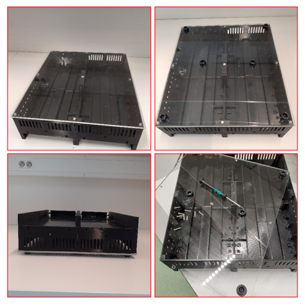

# **IDOC Assembly**

## Overview

This section will focus on the assembly of the main testing area contained in the enclosure. Note that while most of the assembly revolves around joining together 3D printed parts, there are certain components/sections of the system that warrant their own section where their development is documented with more detail. Here we're mainly trying to show how all these parts come together.

The IDOC setup consists of multiple 3D printed parts. The dimension of the setup is 400x350 mm (L x W) and due to its relatively large size that cannot fit into the build volume of our 3D printers, components have been split into smaller parts to be printed part by part. Printed parts have been assembled with screws and plastic adhesive glue. Cyanoacrylate, or superglue (RS Components, [133-0093](https://benl.rs-online.com/web/p/glues/1330093/)), is the best option for gluing 3D printed parts together.

Using 3D printing can be a cost-effective and efficient way to build the IDOC system, as it eliminates the need for custom machining or purchasing expensive components. However, it requires access to a 3D printer and a moderate level of technical expertise to assemble the parts and construct the system to perform olfactory, optogenetic, and thermogenetic experiments on *Drosophila*.

The relevant 3D designs will be linked to wherever relevant, and they should be accompanied by descriptions of printing parameters that could be deemed necessary to achieve satisfactory print quality.

## **Printing overview**

The entire catalogue of 3D printed parts is available for download from the [IDOC GitHub page](https://github.com/shaliulab/idoc_docs/tree/master/docs/assets/src/3D_printed_parts). Each file is accompanied by a Cura profile file containing the optimal parameters for printing. Regarding materials, you have some options, however the ones listed below are deemed optimal for these applications.

[List of files](../assets/src/3D_printed_parts/IDOC_setup/3d_files.zip)

For our prints, we used the Ultimaker 2+ and S3 series printers. The listed 3D items should be printed with very solid and tough materials to ensure they can handle the light, heat, air pressure, and odors. The suggested materials will achieve best surface quality with increased mechanical and thermal performance without risk of the materials turning too brittle over time.

## **Materials needed**

| **Material Name**                      | **Color**                               | **Vendor/Link**                          | **Notes**                                |
| ---------------------------------- | --------------------------------------- | ---------------------------------------- | ---------------------------------------- |
| Ultimaker CPE (co-polyester)       | Black                                   | RS Components,  Black [134-8174](https://benl.rs-online.com/web/p/3d-printing-materials/1348174) | [How to print CPE](https://support.ultimaker.com/hc/en-us/articles/360012051939-How-to-print-with-Ultimaker-CPE) |
| Ultimaker  CPE+ (co-polyester)     | Black  & White                          | Black; RS Components, [159-6348](https://benl.rs-online.com/web/p/3d-printing-materials/1596348);  White RS Components, [159-6350](https://benl.rs-online.com/web/p/3d-printing-materials/1596350) | [How to print CPE+](https://support.ultimaker.com/hc/en-us/articles/360011955120-How-to-print-with-Ultimaker-CPE-) |
| Ultimaker PC (polycarbonate)       | Transparent  & Black                    | Transparent, RS Components, [159-6352](https://benl.rs-online.com/web/p/3d-printing-materials/1596352/) ;  Black, RS Components, [159-6351](https://benl.rs-online.com/web/p/3d-printing-materials/1596351) | [How to print PC](https://support.ultimaker.com/hc/en-us/articles/360012055159-How-to-print-with-Ultimaker-PC ) |
| Ultimaker  PVA  (polyvinyl alcohol) | Natural  water-soluble support material | PVA, RS Components,  [1348195](https://benl.rs-online.com/web/p/3d-printing-materials/1348195) | [How to print and dissolve PVA](https://support.ultimaker.com/hc/en-us/articles/360012055939-How-to-print-with-Ultimaker-PVA) |

Ultimaker CPE+ (co-polyester) is similar to Ultimaker CPE, but tougher and with higher temperature resistance. PC (polycarbonate) is one of the toughest print materials, making it a perfect choice for printing strong objects and high thermal resistance. CPE+ or PC, in particular, are suited for the lighting box and recording chamber due to its higher heat resistance. We also used water-soluble PVA as the support material for large parts, so as to maintain high quality and smooth surfaces.

**Note:** We don’t recommend using PLA or Tough PLA filament. Items printed with PLA can lose their properties and may become brittle over time. In addition, both filaments may deform at temperatures above 50 °C.

**Note:**  Printing with PC can be challenging due to the high temperature required to print.

For further information, refer to the material data sheets for technical data and the [material guides](https://support.ultimaker.com/hc/en-us/categories/360002336619) for printing instructions.

## Assembly

- Prior to assembly, examine all 3D-parts for damage, clean and smooth the edges and surfaces with a file set (File set (e.g., Conrad, [829638](https://www.conrad.be/nl/p/c-k-t0124p-naaldvijlenset-6-delig-140-mm-1-stuk-s-829638.html?searchType=SearchRedirect) , [406897](https://www.conrad.be/nl/p/bernstein-5-240-set-sleutelvijlen-met-houten-heft-in-etui-6-dlg-100-mm-1-stuk-s-406897.html?searchType=SearchRedirect), Amazon, [B012DDEK16](https://www.amazon.de/Draper-68904-68904-Redline-Feilen-Set-16-teilig/dp/B012DDEK16)))

- If the part has a finishing defect, or looks misshapen, please reprint it with the high quality printing configurations specified for each part.

- Driver Bit Set (RS Components, [668-5723](https://benl.rs-online.com/web/p/screwdriver-bit-sets/6685727); amazon.de, [B01M7PPJI7](https://www.amazon.co.uk/Precision-Screwdriver-Magnetic-Macbook-Electronics/dp/B01M7PPJI7)) &  M2 self-tapping screws with countersunk head (Amazon.nl, [B07RYLM9N2](https://www.amazon.nl/-/en/dp/B07RYLM9N2)) are necessary tools to fix the parts together

- This [file](/IDOC_3D_Assembly_Parts.pdf) provides a step by step guide for assembling the different 3D printed parts.

### Base box

This box will act as an important base for the IDOC system contained in the enclosure. It houses all the tubing and wiring necessary for the stimulations, while also acting as a foundation for the heatsinks and lighting box. The base is designed to protect the sensitive interior with acrylic covers and vibration damping rubber feet.

This box is necessary for housing the inflow manifold, the outflow vacuum/exhaust tubing, and the wiring that is required to power the setup components. The bottom side of the box holds the rubber feet for the whole setup, while the top side of the box serves as a foundation for the heatsink and lighting box.

The box size is 400 mm x 350 mm. For 3D printability, we need to split this box to four parts of equal surface area (LxW 200mm x175mm). Printed parts can be assembled with screws. For figures illustrating the assembly of the box, see pages 1-4 of this [file](/IDOC_3D_Assembly_Parts.pdf).

To bring power to the setup, this box also holds a panel with all the necessary sockets built in. This panel consists of [pin headers]() to hold an [IDC cable]() powering the whole setup: IR-LED, Electric shocks, odor indicators, and vibration motors. This panel is placed on the backside of the tubing & wiring box, at the allocated slot.

For illustrations of the powering panel assembly and attachment, see pages 8-10 of this [file](/IDOC_3D_Assembly_Parts.pdf).

 

**Mapping of the 20-way IDC header**

|               **+**               |               **+**               |      **+**       |         **+**          |         **+**         |         **+**          |             **+**             |       **+**       |               **+**                |               **+**                |
| :-------------------------------: | :-------------------------------: | :--------------: | :--------------------: | :-------------------: | :--------------------: | :---------------------------: | :---------------: | :--------------------------------: | :--------------------------------: |
| **Odor B  Left IR-LED indicator** | **Odor A  Left IR-LED indicator** | **EShock  Left** | **IR  LED back light** | **Vibration  Motors** | **Tracking 3 objects** | **Low Voltage  ES Indicator** | **EShock  Right** | **Odor A  Right IR-LED indicator** | **Odor B  Right IR-LED indicator** |
|               **-**               |               **-**               |      **-**       |         **-**          |         **-**         |         **-**          |             **-**             |       **-**       |               **-**                |               **-**                |

 

**Mapping of left 6-way header**

|               **+**               |               **+**               |      **+**                    |
| :-------------------------------: | :-------------------------------: | :---------------------------: |
| **Left Red light indicator**      | **Left Blue light indicator**     | **Green light indicator**     |
|               **-**               |               **-**               |      **-**                    |

 

**Mapping of right 6-way header**

|               **+**               |               **+**               |      **+**                    |
| :-------------------------------: | :-------------------------------: | :---------------------------: |
| **Right Red light indicator**     | **Right Blue light indicator**    | **Green light indicator**     |
|               **-**               |               **-**               |      **-**                    |

NOTE: Green light is not split into left and right, therefore there is no need to have two, just one is enough

### Tubing collector

This part is placed at on the flat top part of the basement box. It is designed to hold the air/odor inflow tubes in place. There is one hole for each tube coming from the main manifold inside the basement box total 40 tubes. The assembly of these tube collectors and their attachment to the base box is illustrated in pages 5-7 of this [file](/IDOC_3D_Assembly_Parts.pdf).

### Heatsink installation

The heatsink is a heavily customized assembly of commercial parts, and as such it has its [own section](/how-to-build/Heatsink-Installation/) regarding it's manufacturing and assembly. This section will simply illustrate how to install it into the rest of the setup.

The heatsink relies on 3D printed mounting brackets that connect it to the flat side of the basement box. For a more detailed illustration of how it's attached, see page 11 of [file](/IDOC_3D_Assembly_Parts.pdf).

### Light box

This box is mounted on the top heatsink to cover the IR-LED backlighting and optogenetic LED panels. The light box mainly acts as a frame for the the chamber holder to ensure proper alignment of the parts. To have a more thorough description of how its mounted onto the heatsink, refer to the [corresponding section](/how-to-build/Heatsink-Installation/#6-fixing-the-light-box) in the heatsink page.

Like many other parts, the light box has to be printed in multiple smaller parts due to printer limitations. For detailed figures of how to join the parts together, see pages 12-13 of [file](/IDOC_3D_Assembly_Parts.pdf).

### Chambers holder

This is another part that has been heavily customized and requires its own section regarding its assembly (refer to the dedicated [chamber holder](Chamber_holder.md) section). 
The finalized chamber holder is designed to be placed on top of the lightbox, with the IR filters fitting into the midline.

The holders are meant to have some freedom of movement to accomodate any motion from the vibration pads. To allow for this, they are designed to be held in place by loosely fitting screws that are covered by a spring.

### Acrylic sheet base

Until now, the entire basement box has been exposed on the bottom side. This area needs to be covered to protect the tubing/wiring on the inside while also providing a more stable foundation for the system.

We used an acrylic plastic glass sheet (RS Components, [824-676](https://benl.rs-online.com/web/p/plastic-sheets/0824660)) to act as a cover for the system. To prepare this sheet to be mounted on the setup base, you'll first need to cut it to the setup size. For all the cutting tasks, we used a table-mounted jigsaw (Conrad, [818878](https://www.conrad.be/nl/p/dremel-ms20-1-5-tafeldecoupeerzaag-70-w-zaagblad-lengte-100-mm-818878.html?searchType=SearchRedirect); Conrad, [819573- 8J](https://www.conrad.be/nl/p/universele-houtzaag-ms51-dremel-2615ms51ja-n-a-819573.html)). 
After cutting, the sheet was placed in its intended spot to allow us to mark the fixation holes. The holes were created by drilling the marked area. Note that they should be sized for M3 screws. Then simply fix the acrylic sheet to the box using 9 M3x12mm screws (Amazon, [B0963DYT9X](https://www.amazon.nl/-/en/dp/B0963DYT9X/)).

To isolate the setup from vibration, we added rubber feet (RS Components, [179-4808](https://benl.rs-online.com/web/p/anti-slip-pads/1794808/)) to the bottom of the setup.

1. Remove the backing sheet from the rubber feet.
2. Position the feet as desired, then press and hold for a few seconds until the adhesive has bonded.
3. The setup may now be sitting on its rubber feet.

