#   Optogenetic System

## Table of contents
1. [LED drivers](#led-drivers)
2. [Power supply](#power-supply)
3. [Light sources](#light-sources-ir--optogenetic-led-installations) 

## Overview

The Optogenetics-LED module is specially designed to provide high power light to control neural activity, enabling experiments where we can writi and recall memories in *Drosophila* by for example using virtual odorants or punishments (see https://doi.org/10.1016/j.cell.2009.08.034 for pioneering work in this regard). Optogenetic experiments are carried out with a freely moving fly inside a custom-made chamber.

When selecting an optogenetic light source, you need to consider two key factors: the required light wavelength and light intensity. The light intensity is dependent on the illuminated area the opsin channels you select at certain wavelengths of light. Therefore, we selected power LEDs as a light source, which are close to the peak wavelength to achieve optimal activation. For example, we used LED wavelengths close to 627nm for optogenetic activation of CsChrimson. We decide to use high power LEDs in our setup for many reasons: LEDs are low cost, have a long lifetime, are stable, easy to mount, easily turned on and off with high frequencies and low operating temperatures. The setup has the capacity to use different wavelengths independently with modulation of the light intensity to stimulate different sets of neurons.

Here we explain all the key components necessary to build an optogenetics setup including power supply, LED-drivers, high power LED-light sources, cooling system, control unit, and more. Components are custom-designed or sold separately from different seller, all of them are designed to work with each other.

The following sketch shows the optogenetics system components:

  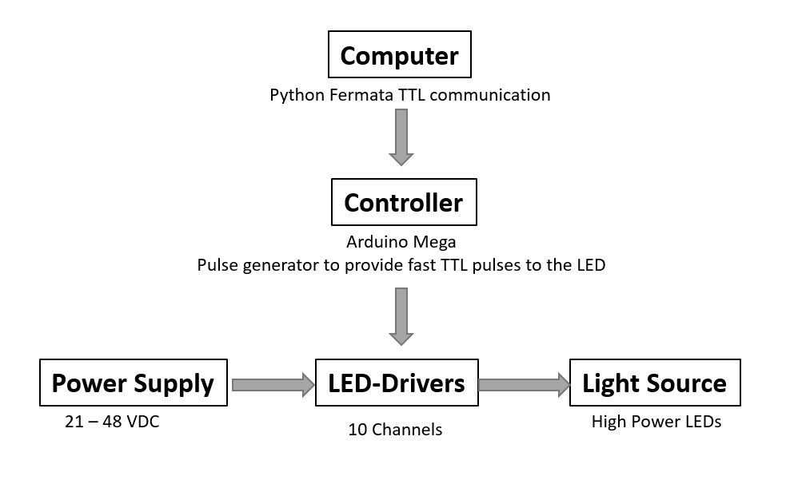

## LED Drivers

Custom-made LED drivers were used for controlling high power LEDs mounted below each recording chambers. The board of LED-drivers is relatively small (9 x 11 cm), and contains 10 drivers for the individual adjustment of LED intensities to ensure they are the same across all recording chambers. The current delivered to turn LEDs ON can be limited by means of a single turn-control potentiometer knob at the top of each driver to set the maximum current needed for each channel to ensure that all LED strings get the same forward current. A global pulse width modulation (PWM) signal is used to control the current and the brightness of the LEDs via the software communication. We also added a I²C (the IC is a [PCA9685](https://www.nxp.com/docs/en/data-sheet/PCA9685.pdf) to PWM driver). This chip is the same as the one used in the Adafruit PCA9685 16-Channel Servo Driver ([Adafruit PCA9685 library](https://learn.adafruit.com/16-channel-pwm-servo-driver/using-the-adafruit-library)). This chip could allow us to calibrate the LEDs in software if someone later wants this as an option (to expand the functionality of this board up to 16-Channel LED controller). This chip has a general PWM and an individual PWM for each output. So using the individual PWM you can equalize the light output, and with the general PWM you can control the overall light output.

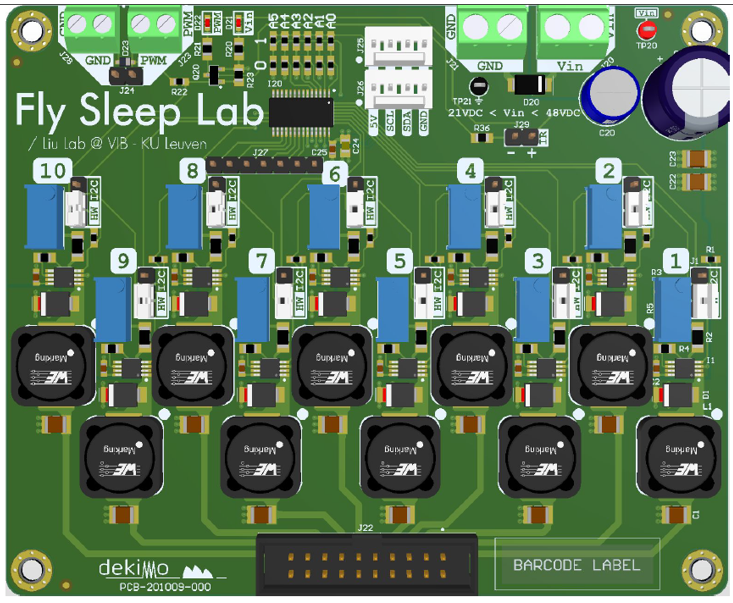

The board footprint is 9 x 11 cm and contains 10 drivers or via PCA9685 16-Channels. LED power can be adjusted using the potentiometer on the front panel. Each channel can be regulated independently but they all have the same PWM signal & frequency to run.

**Specifications**

| Board                                  | **[LED_Driver_.01](../assets/src/Design_Files_LED_Driver_.01)** |
| -------------------------------------- | ---------------------------------------- |
| **Digital modulation inputs**          | TTL, Arduino Mega                        |
| **Connector for TTL and Analog input** | Terminal block                           |
| **Analog input voltage range**         | 0-5 V                                    |
| **Input Voltage**                      | 21-45 V                                  |
| **LED Current Range**                  | Each channel tuned for 350 mA            |
| **Output channels**                    | 10 drivers & 16  via I²C  [PCA9685](https://www.nxp.com/docs/en/data-sheet/PCA9685.pdf) |
| **Modulation Form**                    | PWM , knob potentiometer                 |
| **Input  Forward Voltage**             | 21-48 VDC                                |
| **Software control**                   | Python Fermata , [Adafruit PCA9685 library](https://learn.adafruit.com/16-channel-pwm-servo-driver/using-the-adafruit-library) |
| **Light Source**                       | High Power LEDs                          |
| **Board dimensions**                   | 9 x 11 cm                                |

****
### Number of required boards

At least 2 boards are needed to run the left and right side optogenetic panels independently. 5 boards would be perfectly  required to drive the complete setup in case you use Red, Green and Blue light. Having 5 identical boards with 10 channels each are cheaper and easier to produce than large board with all the drivers.

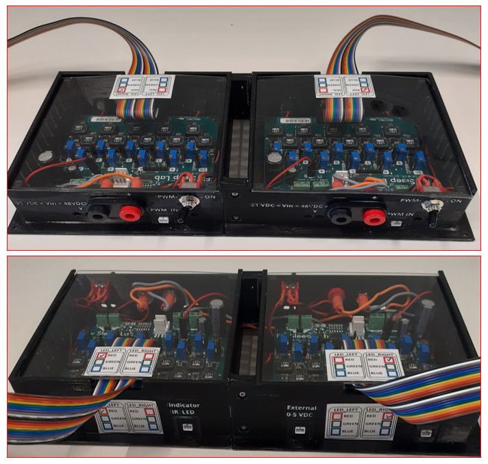

### Output ports and pinouts

There are 10 output ports. Each port has 2 pins: V+ and GND (-ve). The LED drivers and optogenetic LED panels are connected via the ribbon cables with 20-way IDC connector, which is compatible with all LED assemblies in the system - see Section [LED Connectors & IDC Cables](/how-to-build/Setup-Wiring-and-Powering-Cables). The figure below shows the pin-out of the male connector at the bottom of the driver board.

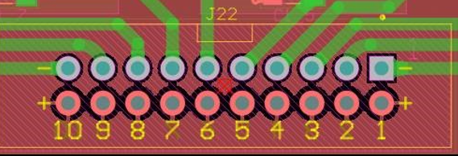

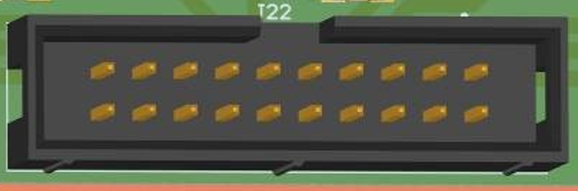

### LED-Driver enclosure & mounting

<!--
TODO
This link does not work or is not public ([Onshape](https://cad.onshape.com/documents/e2a3015a5be66d64a272dfeb/w/6a8e9cd394533e2a757eea92/e/c6d580c0b45ee44fe75fdcbc)) 
-->

We designed a 3D-printable enclosure to hold and protect the board of the LED driver. At least two independent boards are required to drive both right and left LED panels at either half of the setup. By extension, two enclosures are also needed to mount both boards.

**The front panel of Optogenetics-LED driver enclosure features:**

- Power input sockets
- Connector socket for PWM signal for control of LED power from Arduino & computer
- Toggle switch PWM Input/External to enable LED (ON/OFF) by external 0-5 VDC signal

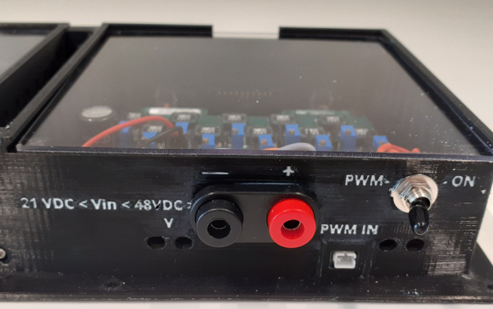

**The back panel of Optogenetics-LED unit features:**

- Connector socket for external input (0-5V) for control of LED power ON/OFF manually.
- Connector socket for Indicator IR LED during recording.

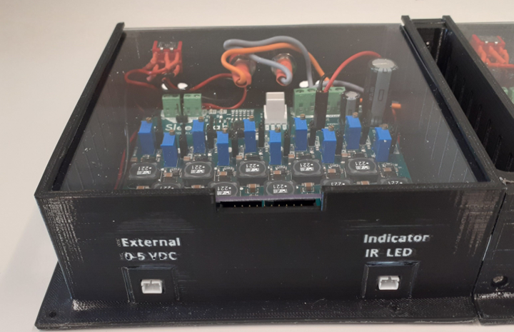

**The Optogenetics-LED driver board itself features:**

- Terminal screw for power input (Right).
- Terminal screws for PWM input (LEFT).
- 10 turn knop potentiometer for manual setup of output power.
- IR LED straight pin header, 2.54mm pitch, 20 way, 1 row, Marker signal.

The connections indicated as 1 2 M1 and 3 refer to the schematic shown [in the electrical diagram](../Setup-Wiring-and-Powering-Cables/#Overview)

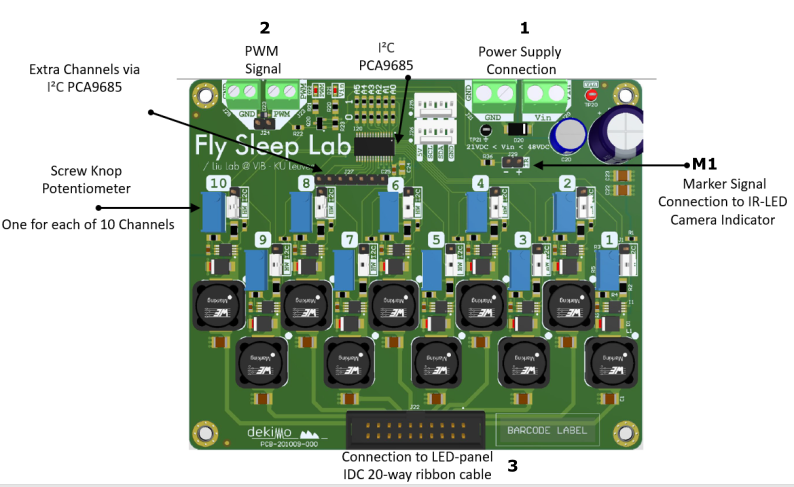

Note 1 2 M1 and 3 refer to the Optogenetics-LED driver board that drives the RED color on the left side. But exactly the same driver can be used for either side or color.

|   Connection         | Red left             |  Blue left           | Red right            |  Blue right
| -------------------- | -------------------- | -------------------- | -------------------- | -------------------- | 
| PSU                  | 1 | 6 | 11 | 16 | 
| Signal               | 2 | 7 | 12 | 17 | 
| Indicator            | M1 | M2 | M3 | M4 | 
| Output               | 3 | 8 | 13 | 18 | 

### Assembling the LED-board enclosure

**You will need the following components:**

- 3D-printed boxes (2 in total, 1 per [Left](https://github.com/shaliulab/idoc_docs/blob/master/docs/assets/src/3D_printed_parts/LED-Drivers_enclosure/Box_left.stl)/[Right](https://github.com/shaliulab/idoc_docs/blob/master/docs/assets/src/3D_printed_parts/LED-Drivers_enclosure/Box%20Right.stl) side)

- LED Driver PCB [Driver-.01](../assets/src/Design_Files_LED_Driver_.01)

- Black, Red Female Banana Socket - Solder Termination (RS Componentss, [888-4588](https://benl.rs-online.com/web/p/banana-connectors/8884588)) (Q:1 for each box)

- JST PH 2 pin cable male Header (Digi-Key, [1528-2617-ND](https://www.digikey.be/product-detail/en/adafruit-industries-llc/3814/1528-2617-ND/9380221)) (Q: 3 for each box)

- 2 different colors of hook up wire (about 15cm each color)

- Toggle Switch DPDT (Digi-Key, [EG2400-ND](https://www.digikey.be/product-detail/en/e-switch/100DP1T1B1M2QEH/EG2400-ND/378869)) (1 for each)

- Clear Plastic Sheet, 500mm x 400mm x 1.5mm (RS Componentss, [769-8724](https://benl.rs-online.com/web/p/plastic-sheets/7698724))

- Socket, Crimp, Wire-to-Board Crimp Housings (Farnell, [1593529](https://be.farnell.com/multicomp/2226tg/crimp-terminal-24-28awg/dp/1593529?ost=1593529))

- Connector Housing, 2 Ways, 2.54 mm (Farnell, [1593506](https://be.farnell.com/multicomp/2226a-02/crimp-housing-1-row-2-way/dp/1593506))
- M3 x 10mm Hex Socket Countersunk Screw Black, (RS Components, [281-394](https://benl.rs-online.com/web/p/socket-screws/0281394/))

**You also need the following tools:**

- Screw Driver Bit Set (RS Components, [668-5723](https://benl.rs-online.com/web/p/screwdriver-bit-sets/6685727); amazon.de, [B01M7PPJI7](https://www.amazon.co.uk/Precision-Screwdriver-Magnetic-Macbook-Electronics/dp/B01M7PPJI7))

- Soldering Station (RS Components, [122-7917](https://benl.rs-online.com/web/p/soldering-stations/1227917); for Hot Air Amazon.de, [8786D](https://www.amazon.de/-/en/Soldering-Desoldering-Temperature-Adjustable-Conversion/dp/B08C51QRH5/))

- Lead Free Solder (RS Components, [756-8884](https://benl.rs-online.com/web/p/solder/7568884) ; [625-8233](https://benl.rs-online.com/web/p/solder/6258233))

- Crimping  tool, (Amazon.nl,[97 22 240 ](https://www.amazon.nl/KNIPEX-Krimptang-240-97-22/dp/B004LY28J2/))

- Side Cutters (Amazon.de, [M10997](https://www.amazon.nl/KNIPEX-Krimptang-240-97-22/dp/B004LY28J2/))

- Heat shrink tubing (amazon.de, [ET1002](https://www.amazon.de/Eventronic-ET1002-Schrumpfschlauch-Farben-560-tlg/dp/B071D7LJ31))

- Wire Stripper (RS Components, [613-044](https://benl.rs-online.com/web/p/wire-strippers/0613044/))

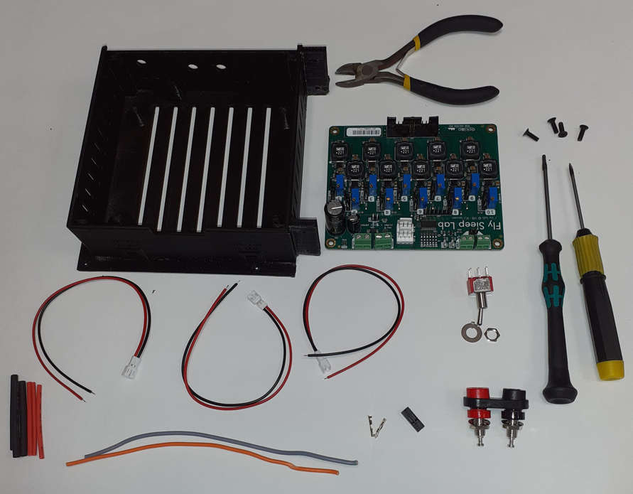

**Procedure**

**1\.** Connect the banana socket (RS, [888-4588](https://benl.rs-online.com/web/p/banana-connectors/8884588)) at the two holes named Vin in the front panel of the enclosure, solder two 10cm hook wires to the end of the socket, insulate both with a heat shrink tubing. The other opened end will be connected to the LED drivers board

**2\.** Add one toggle switch DPDT at the right hole to switch between signals coming from Arduino PWM signal or an external source

**3\.** Insert one JST PH 2 pin cable male Header into the PWM socket in the front of the box.

**4\.** With the use of a wire stripper, remove at least 1 cm casing to expose the cut wires and then add two pieces of heat shrink tubes on each wire.

**5\.** Solder the end of the cable with male header to the pins of the left side of the switch, then solder the middle pins of the toggle switch to the pre-cut wires. The black and red wires should point in the same direction. This open end wires will be connected to the PWM connector screw terminal at the PCB.

**6\.** Add a second JST PH 2 pin cable male header from the back panel into the left socket  named (external 0-5VDC), add heat shrink tubing, then solder these wire endings to the right bins of the toggle switch.

**7\.** Add one last wire into the IR-LED socket, the other open end should connect to the crimp socket connected to the straight pins in the PCB named IR.
<!--

 -->

**8\.** Place the LED driver board into the the center of the enclosure. Connect the power hook up wires to the left terminal blocks, where the red socket must be connected to the positive while the black socket must be connected to the GND.

**9\.** Then connect the middle wires of the toggle switch to the PWM screws terminal block. Where the red socket must connected to the PWM +ve while the black cable must connected to the GND.

**10\.** Mount the board to the center of the enclosure with four M3 screws at each corner.
<!--

-->

**11\.** Repeat the above steps to install other boards

**Tip!** The inputs and outputs of the front and back panels are marked and engraved during 3D-printing. For making it easily readable even with dim light just fill the engraved text with a white paste e g. Silicon Rubber (RS, [494-118](https://benl.rs-online.com/web/p/silicone-sealants/0494118/) ; Farnell, [2289630](https://be.farnell.com/dowsil-formerly-dow-corning/732-white-90ml/rtv-silicone-732-white-90ml/dp/2289630))
<!--

-->
**12\.**  To connect two assembled box-board just slide both enclosures together and then screw them with 2 M3x10mm screws from the front and the back panel of the enclosure.

<!--

-->

**13\.** If you are going to use the same power supply you can connect both board  via bridge hook up wires through right screw terminal of each board.
<!--

-->

**Initial operation & test of LED Driver**

**14\.** Connect the driver to the power supply. Also the power supply can be connected directly via terminal screws at the PCB. **Attention!** Connect the LED driver to an already powered external power supply. Be sure that the input voltage corresponds to the input voltage range of the power LEDs.

**15\.** Connect LED panel with 20-way ribbon cable to the socket of the LED driver. Do not operate the connector with excessive force.

**16\.** Connect an external 5VDC volt to the header from the back panel of the enclosure and PWM signal from the Arduino

**Note:** The LED (ON/OFF) is controlled by two means of signal: PWM or external mode. When operating in external mode, an external up to 5VDC signal starts the LEDs of all channels at high brightness. This is ideal for checking the system. The LED current limit control potentiometer is placed on the front side of the driver. A screwdriver is necessary to adjust the LED current limit to 350mA.

**17\.** Switch the toggle switch in the front panel to the external mode and then Increase the voltage from 0 to 5V and notice how the LED brightness increases accordingly.

**18\.** If a PWM signal is applied via Arduino, switch the toggle switch in the front panel to the PWM mode, then LED is modulated accordingly.

**19\.** Your LED driver is now ready for use.

<!--

-->

**Important!** To avoid current imbalances when connecting several LEDs in parallel and therefore having a different light intensities between different chambers, we connect two right LEDs and two left LEDs panel from each side in series.

Each panel is connected via 20-way IDC cable to the powering platform of the enclosure. From the outer backside of the enclosure, the cables of the same side panel are then connected to a custom-made board.

### Assembling the custom-made connection hub

**You will need:**

- PCB Prototype Board, Snappable Strip Board (Amazon.nl, [B081R45KN8](https://www.amazon.nl/-/en/dp/B081R45KN8)).

- Tinned-Copper Wire Breadboard Jumper Wire (RS Components,0.5mm [199-6217](https://benl.rs-online.com/web/p/breadboard-jumper-wire/1996217) ;0.8mm RS Componentss, [199-6231](https://benl.rs-online.com/web/p/breadboard-jumper-wires/1996228) ;1mm RS Componentss, [199-6228](https://benl.rs-online.com/web/p/breadboard-jumper-wires/1996231)).

- Right Angle PCB Header, 2.54mm Pitch, 20 Way, 2 Row (RS Components, [832-3519](https://benl.rs-online.com/web/p/pcb-headers/8323519)).

- Straight PCB Header, 2.54mm Pitch, 20 Way, 2 Row, Through Hole (RS Components, [832-3499](https://benl.rs-online.com/web/p/pcb-headers/8323499/)).

- 3D-designed [enclosure](https://github.com/shaliulab/idoc_docs/blob/master/docs/assets/src/3D_printed_parts/Enclosure%26Powering/Two_side_connection_IDC_cables/two_side_connection%20-%20Box.stl) and [cover](https://github.com/shaliulab/idoc_docs/blob/master/docs/assets/src/3D_printed_parts/Enclosure%26Powering/Two_side_connection_IDC_cables/two_side_connection%20-%20cover.stl)

**You'll also need the following tools:**

- Soldering Station (RS Components, [122-7917](https://benl.rs-online.com/web/p/soldering-stations/1227917); for Hot Air Amazon.de, [8786D](https://www.amazon.de/-/en/Soldering-Desoldering-Temperature-Adjustable-Conversion/dp/B08C51QRH5/))

- Lead Free Solder (RS Componentss, [756-8884](https://benl.rs-online.com/web/p/solder/7568884) ; [625-8233](https://benl.rs-online.com/web/p/solder/6258233))

- Soldering Arm Stand (RS Components, [208-3892](https://benl.rs-online.com/web/p/soldering-accessories/2083892))

- Screw Driver Bit Set (RS Components, [668-5723](https://benl.rs-online.com/web/p/screwdriver-bit-sets/6685727); amazon.de, [B01M7PPJI7](https://www.amazon.co.uk/Precision-Screwdriver-Magnetic-Macbook-Electronics/dp/B01M7PPJI7))

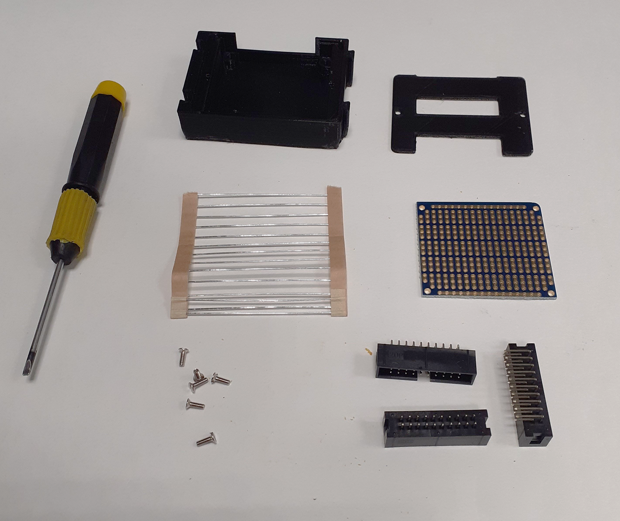

**Procedure:**

**1\.** Using jumper wire to connect the +ve and -ve side of the 20-way PCB headers from each side

**2\.** Connect and solder solder the two +ve sides (line connectign the top and bottom of the board in the figure below)

**3\.** Connect and solder the 20-way PCB headers into the recessed place to establish the series connection (yellow rectangles in figure below)

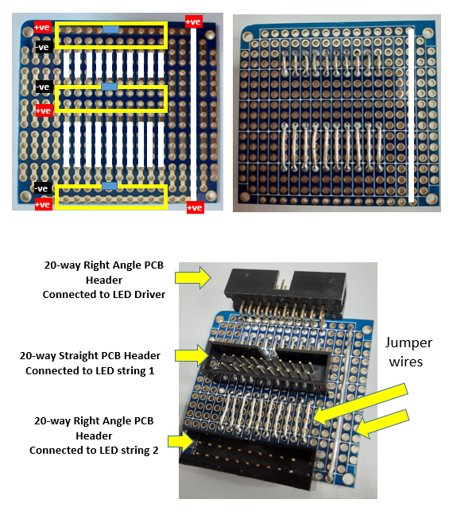

**4\.** After  soldering, to avoid shortcuts, place the board into the 3D-printed box and screw it with 4 3Mx6mm screws.

**5\.** Cover the box and screw it with 2 3Mx6mm screws

**6\.** Now the box is ready

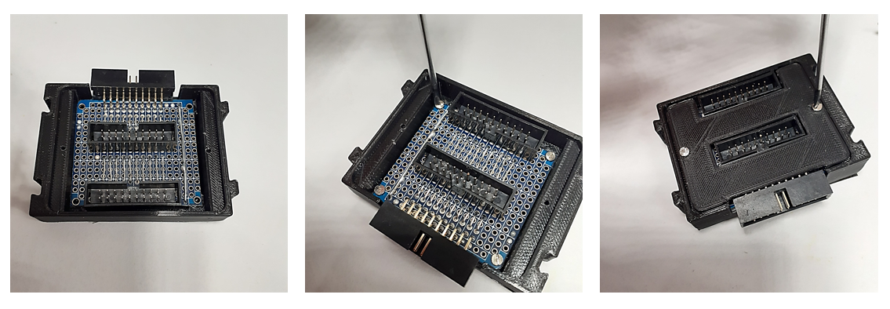

**7\.** Due to its small size, multiple boxes can be to combined together. To do so, simply connect two boxes through the male and female mate-slides in the opposite directions.

**Series-connection-LED-PCB-2Box**

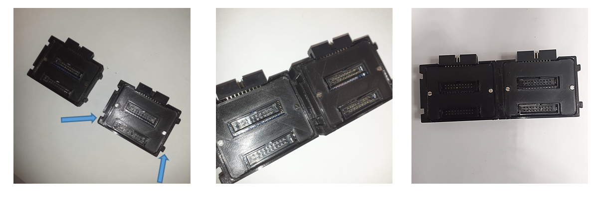

**8\.** Finally, insert a 4mm screw set to the wall of the one box and then connect an optical post in your desired length to be mounted in the back of the setup of the enclosure.

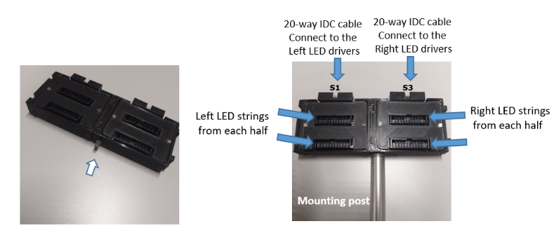

Note the S1 and S3 annotations refer to the red color as shown [in the electrical diagram](../Setup-Wiring-and-Powering-Cables/#Overview).
You need to replicate this hub for any other color (for example blue, which would provide you with S2 and S4)

## Power supply

In addition to our customized LED driver, you will also need a DC power supply. The drivers are connected to the power supply using high load power leads. It is necessary that the input DC voltage and current are more than the inputs required to run the LEDs. Use of LEDs with a lower or high forward current could result in damage to the LED. Power supply with an output voltage of 30V, and a current output of more than 7A would be ideal to run 20 series circuits of 4 square PCBs with each 1 LED at 0.35A. An example of a PSU that would fulfil this would be the DC Laboratory Power Supply, 0-30V 0-10A DC Adjustable Switching (Amazon.de, [KPS-3010D](https://www.amazon.de/-/en/Eventek-Laboratory-Adjustable-Stabilised-Digital/dp/B071HW378T/) ; [B085S34NNW](https://www.amazon.de/-/en/KAIWEETS-Laboratory-adjustable-DC0-10A-overload/dp/B085S34NNW/); [B07D358Q96](https://www.amazon.de/dp/B07D358Q96/)). 

One of the possible power supplies for the LED star drivers also would be the [LRS-350-36](https://www.digikey.be/en/products/detail/mean-well-usa-inc/LRS-350-36/7705032) from Meanwell to run  20 series circuits of 4 star PCBs with each 3 LEDs at 0.35A = 7A. for example using switching power supplies, the LED driver will output 0.35A at 12xVf (which could be as low as 30.6V or as high as 33.48V).

LED drivers and power supplies are connected via 4 mm Test Lead Banana to Banana. The length of the cables you need will depend on the distances between different devices, so below you can find a variety of options to accomodate this:
- 60" Digi-Key, [501-1791-ND](https://www.digikey.be/de/products/detail/pomona-electronics/2BA-60/736432)

- 59.1" Digi-Key, [BKCT2062-150-2-ND](https://www.digikey.be/de/products/detail/cal-test-electronics/CT2062-150-2/5398837) or [BKCT2062-150-0-ND](https://www.digikey.be/de/products/detail/cal-test-electronics/CT2062-150-0/5398836)

- 48" Digi-Key, [501-1663-ND](https://www.digikey.be/de/products/detail/pomona-electronics/2BA-48/736431)

- 39.4" Digi-Key, [BKCT2060-100-0-ND](https://www.digikey.be/de/products/detail/cal-test-electronics/CT2060-100-0/5398800) or [BKCT2062-100-2-ND](https://www.digikey.be/de/products/detail/cal-test-electronics/CT2062-100-2/5398831)

- 24" Digi-Key, [501-1696-ND](https://www.digikey.be/de/products/detail/pomona-electronics/2BA-24/736429)

- 19.7" Digi-Key, [BKCT2062-50-0-ND](https://www.digikey.be/de/products/detail/cal-test-electronics/CT2062-50-0/5398854) or [BKCT2062-50-2-ND](https://www.digikey.be/de/products/detail/cal-test-electronics/CT2062-50-2/5398855)

- 9.8" Digi-Key, [BKCT2062-25-2-ND](https://www.digikey.be/de/products/detail/cal-test-electronics/CT2062-25-2/5398849) or [BKCT2062-25-0-ND](https://www.digikey.be/de/products/detail/cal-test-electronics/CT2062-25-0/5398848)

## Light Sources (IR & Optogenetic LED installations)

We designed and 3D printed plastic stencils to be fixed on the top surface of the heatsink to be used as a guide for stuffing the LEDs in the correct positions to provide homogenous illumination beneath each recording chamber.

### Install the IR backlighting

**For this step, you will need:**

- 2x 3D-designed LED placement stencil [3D part](https://github.com/shaliulab/idoc_docs/blob/master/docs/assets/src/3D_printed_parts/IDOC_setup/089-Stencil_LEDs.stl)

- Soldering station ([Amazon](https://www.amazon.de/-/en/Soldering-Desoldering-Temperature-Adjustable-Conversion/dp/B08C51QRH5/ref=sr_1_17?keywords=alpha+metals+om338+pastel%C3%B6tmittel&qid=1639747374&sr=8-17) or RS components, [122-7917](https://benl.rs-online.com/web/p/soldering-stations/1227917))

- Male JSC cable (Digikey, [1528-2617-ND](https://www.digikey.be/en/products/detail/adafruit-industries-llc/3814/9380221))

- 220-cm IR LED Strips (Ledlightsworld, [SMD5050-300-IR](https://ledlightsworld.com/products/dc12v-smd5050-300-ir-infrared-850nm-940nm-tri-chip-flexible-led-strips-60leds-14-4w-per-meter)) (Q:22x cut 10-cm each)

**Procedure**

**1\.** Mount the plastic stencil at the top surface of the heatsink. Fix with at least two M1.6x6mm screw from the midline of the heatsink.

**2\.** Cut twenty-two pieces of 10-cm LED strips, eleven to be mounted on each heatsink.

**3\.** You might want to clean the surface of the heatsink from any remaining residue or dust with some ethanol and air pressure (e.g., "Dust-Off" from RS, [169-9912](https://benl.rs-online.com/web/p/air-dusters/1699912/) or Conrad, [827802](https://www.conrad.be/nl/search.html?search=827802)).

**4\.** Peel off the tape backing of the strips back to expose the adhesive side

**5\.** Place the IR-LED strip of tape at the top mount of the aluminum heatsink.

**6\.** Make sure to press firmly on the IR-LED strips to prevent it from peeling it off.

**7\.** Heat your soldering iron station to 350-400 degrees Celsius.

**8\.** Add a small part of soldering material to the surface of the copper pads on the IR LED strips

**9\.** Wiring the IR-LED-strips together by connecting the +ve to the +ve copper pads and the -ve to the -ve pads.

**10\.** Once you have attached the two wires, wait for at least 30 seconds for it to cool down.

**11\.** Use hot air gun to place a shrink tube over the exposed soldered part at the end of each LED stripes.

**12\.** At the end of the strip connect a JST wire with female plug to be connected to the male JST power supply plug on the setup powering panel at the back side of the wiring box.

**Type of LEDs used for optogenetic application**

|               Item                       |  Amount    |   Supplier       |                          Link                |                                          |
| ---------------------------------------- | ---- | -------- | ---------------------------------------- | ---------------------------------------- |
| LED LUXEON REBEL BLUE High-Power LED, 3-Pin SMD. | 200  | Digi-Key | [LXML-PB01-0040](https://www.digikey.be/nl/products/detail/lumileds/LXML-PB01-0040/3961252) | 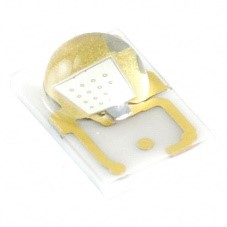 |
| LED LUXEON REBEL GREEN High-Power LED, 3-Pin SMD. | 100  | Digi-Key | [LXML-PM01-0100](https://www.digikey.be/nl/products/detail/lumileds/LXML-PM01-0100/3961259) | 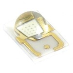 |
| LUXEON Rebel 627 nm Red High-Power LED, 3-Pin SMD package. | 200  | Digi-Key | [LXM2-PD01-0050](https://www.digikey.be/nl/products/detail/lumileds/LXM2-PD01-0050/3961247) | 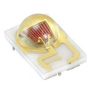 |
|                                          |      |          |                                          |                                          |

### Installing LEDs for optogenetics

#### Number of LEDs and arrangements

The number of LEDs depends on the required light intensity that could be able to activate or inhibit select populations of neurons. Another factor is the size of the mounting and illuminated areas on the heatsink. Fortunately, the above LED types are sold in any quantity. If you order for example 200 pieces,they will be in a single cut tape from the same bin. Also, if you provide your vendor or supplier with your PO they might ensure that your repeat orders of LEDs are sent with the same [LED bin number](https://support.luxeonstar.com/hc/en-us/articles/360022625594-What-does-LED-binning-mean-) each time you order.

Beneath each half-chamber we can mount eight aluminum 10-mm square bases, four for RED colorLEDs and four for blue color LEDs. If you would like to use only one-color LED, using two of 3-up stars LEDs will be the best option. We already installed such system in one of our setups. They can still be driven by the same driver system.

#### LED soldering and assembly

We mounted our LEDs on Saber brand 10 mm Square Metal CorePrinted Circuit Board construction (MCPCB) Aluminum blank bases (Luxeonstar, [LXB-RS10A](https://www.luxeonstar.com/saber-10mm-square-blank-mcpcb-base-for-rebel-leds)). Each base is designed to accommodate a single Luxeon Rebel LED.

We decided to order the power LEDs from Digikey and their MCPCB bases (Luexeonstar) to be assembled with standard hand soldering method using an appropriate lead-free solder paste with a hot air soldering iron or top-soldering hotplate and accordingto the [assembly Procedure forLUXEON® Rebel LEDs.](https://lumstatic.com/En/0i/WQb7sgG5kseBR4dwjA.pdf).

Homemade soldering ensures that all of your LEDs will have the same specific flux, color, and forward voltage bins. In addition, you will not need to wait for four to five weeks to have additional stock.

An extra reason to solder the LEDs ourselves is that same order of multiple LED assemblies of the same type can have different binning across LED modules which can cause a variability in the power, wavelength, and the light intensity across the illuminated area. Additionally, most manufacture cannot provide LED assemblies from same bin (read more about [LED-binning](https://support.luxeonstar.com/hc/en-us/articles/360022625594-What-does-LED-binning-mean-)) unless you order in reels in 1,000 piece increments.

**LED assembly Procedure**

**1\.** Order the solder free paste, refrigerate it at 4-8°C.

**2\.** At the date of the soldering allow the paste to reach the room temperature before heating up (~ 1-2 hour).

**3\.** Connect a dispensing blunt tip luer lock needle to the luer taper of the solder syringe.

**4\.** Cover the three copper pads in the center of the aluminum board with solder paste. Be consistent and do not add too much paste, only enough to achieve a solder joint thickness of approximately 50μm.

**5\.** Pick up a LED with the sides of the substrate (not touching the lens).

**6\.** Center the LEDs on the copper pads with the soldering paste.

**7\.** Move the board + LED onto the warming plate that matches the melting point of the solder paste. **Note!** Use tweezers to pick up the board from the sides.

**8\.** You can also fix the board onto soldering clamp and use hot air iron to heat up the paste to reach its melting point.

**9\.** Regardless of whether you are using a hot-plate or hot-air to melt the paste, maintain the heating for a couple seconds until you see paste melting from the sides of the LED. Try to balance the time and temperature so that you can get proper paste melting and solder joint forming, without damaging the LED.

**10\.** Once the board is heated to a peak temperature and the melting point of the solder paste is confirmed, move the board away from the warming area to cool down. It is recommended to move the board onto a heatsink to cool down properly, and allow the solder to freeze in place faster (preventing damage the components or the board).

**11\.** Test the LEDs using a proper current regulated power source or LED driver

**12\.** Do not stare while operating LED. May be harmful to the eyes.

#### LED Cooling and top mount of optogenetic LEDs panel

Running high power LEDs requires a cooling system to dissipate the heat produced inside the LEDs. In our setup cooling is already achieved by mounting the LED directly to a finned [aluminum heat sink](https://www.digikey.be/en/products/detail/wakefield-vette/125404/9957688) with a running air flow to extract the heat from the heatsink enclosure. The assembly of this is covered in more detail in the [heatsink installation](./Heatsink-Installation.md) section.

#### Adding the LEDs to the IDOC system

After soldering the LEDs to MCPCB aluminum base. The assembly is mounted directly to the heatsink using [double-sided thermal tape](https://www.luxeonstar.com/pre-cut-thermal-tape-for-10mm-square-bases-10pcs) without the need for screws or fasteners.

**1\.** You might want to clean the surface of the heatsink from any remaining residue or dust with some ethanol and air pressure (e.g., dust off  RS , [169-9912](https://benl.rs-online.com/web/p/air-dusters/1699912/) or Conrad, [827802](https://www.conrad.be/nl/search.html?search=827802)).

**2\.** Remove the film from one side of the thermal tape to expose the adhesive part of this side.

**3\.** With forceps, place the thermal tape on the square window and press it down a little to make sure it sticks to the heatsink.

**4\.** When you have placed every thermal tape, you can unscrew and remove the LED-stuffing guide.

**5\.** Mark each square as zigzag for blue LED (e.g., B) and red LEDs (e.g., R) to ensure that the LED boards are attached in the correct arrangement.

**6\.** Remove the remaining top film from the thermal tape for red color LEDs.

**7\.** Place the LED boards onto the thermal tape with the orienation you see in the figure below. The orientation is important for optimizing space for wiring connections.

**8\.** Apply even pressure to each single square LED assembly for at least 30 seconds, to fasten the assembly to the heatsink/thermal tape. Due to the small area of our LED array on the heat sink we could not use the free [assembly press tool](https://www.luxeonstar.com/assembly-press-single-z-leds) provided with the thermal tape.

<!-- **8\.** 
TODO Add a link to the 3d printed part and replace the section 8 above
Using the 3D-designed part (XX), apply even pressure to each single square LED assembly for at least 30 seconds, to fasten the assembly to the heatsink/thermal tape. Due to the small area of our LED array on the heat sink we could not use the free [assembly press tool](https://www.luxeonstar.com/assembly-press-single-z-leds) provided with the thermal tape  instead we designed, and 3D printed another assembly press tool to ensure an optimal thermal interface is created.
--> 
**9\.** Repeat steps 6,7 and 8 for the blue color LEDs

#### LED-interconnections and powering

Once all the LEDs are mounted to the heatsink, you can inter wire them to form series circuit connections between strings of the same color.

**1\.** Cut about 250 pieces of roughly 2cm long wires. Try to maintain colour coding where possible, so that red wires are used to interconnect red LEDs, and blue wires are used for blue LEDs.

**2\.** With the use of a wire stripper, remove 0.5cm casing from each side.

**3\.** Add a small part of soldering material to the surface of the copper pads of each LED MCPCB

**4\.** Wire the LED-strips together by connecting the positive to the negative copper pads of the LEDs of the same color.

**5\.** Once you have attached all wires to all LED strings, insert the 40 powering cable from the holes of the aluminum angle profile and then solder the end of the cable with +ve and -ve of each LED string according to the following mapping and color of the wires.

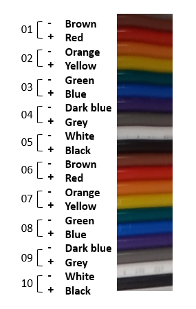

#### LED Power Connector

The LED drivers and optogenetic LED panels are connected via the ribbon cables with 20-way IDC connectors, which are compatible with all LED assemblies in the system. See Section pinout of [LED drivers](#led-drivers), **Arduino control board**. You can go to the section [Setup wiring & Optogenetic LEDs panel Connectors](./Setup-Wiring-and-Powering-Cables.md) to know how to assemble flat ribbon cables with an IDC connector.

