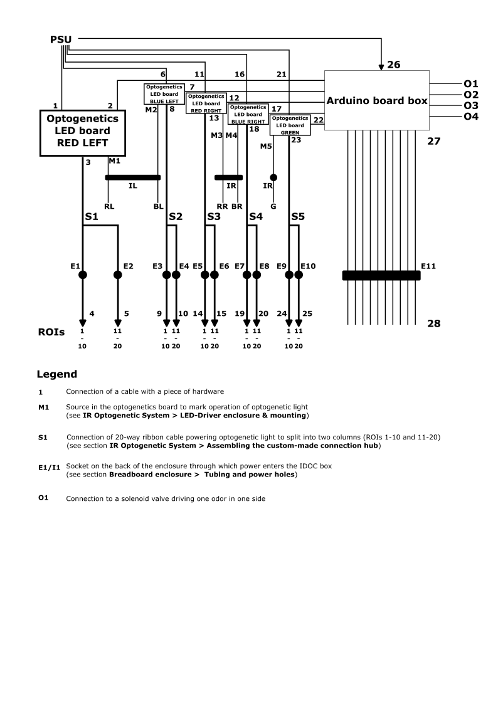
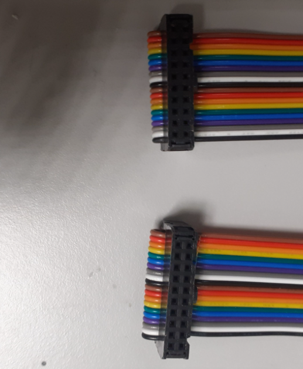
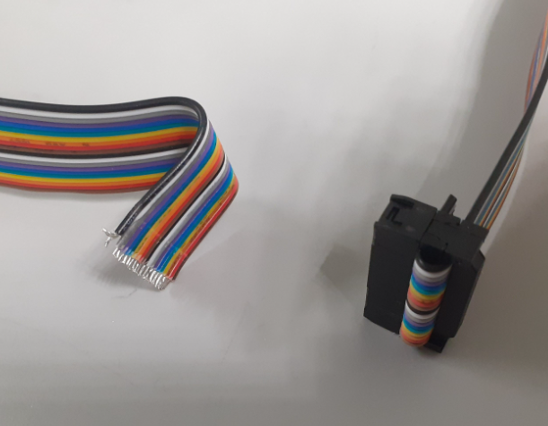

# **Setup wiring & Optogenetic LEDs panel Connectors**

## Overview

The Arduino control unit, the LED drivers, optogenetic LED panels, solenoid valves and the IDOC setup  are connected via the ribbon cables with20-way IDC connector, which is compatible with all LED assemblies in the system. In this following section two 20-way IDC female connectors and flat ribbon cables are used to assemble a cable with an IDC connector.

**The following ribbon cables with IDC connecters are needed to wire the system devices:**

| Description                              | Connection                     | Length                                   | Qt:  | End  1                | End  2         | Image                                    |
| ---------------------------------------- | ---------------------------------------- | ---------------------------------------- | ---- | --------------------- | -------------- | ---------------------------------------- |
| 20-way   | 3 → S1    8 → S2     13 → S3    18 → S4    23 → S5   | 25 cm                                    | 5    | 20-way IDC  connector | 20-way IDC connector                   |  |
| 20-way   | S1 → E1    S1 → E2     S2 → E3    S2 → E4    S3 → E5    S3 → E6    S4 → E7    S4 → E8    S5 → E9    S5 → E10   | 25 cm                                    | 5    | 20-way IDC  connector | 20-way IDC connector     |  |
| 20-way   | E1 → 4    E2 → 5    E3 → 9    E4 → 10    E5 → 14    E6 → 15    E7 → 19    E8 → 20    E9 → 24    E10 → 25    | 25 cm       | 10    | 20-way IDC  connector | Open end     |  |
| 20-way   | 27 → E11 | 100-150  cm  | 1    | IDC  connector        |  Open end     |  |
| 20-way   | E11 → 28 | 100-150  cm  | 1    | IDC  connector        |  Open end     |  |
| 6-way    | M1&M2 → IL    M3&M4&M5 → IR    IL → RL&BL    IR → RR&BR&G    | 25 cm    | 4    | IDC  connector        |  Open  end    |  |

**Assembling 20-way IDC Ribbon Cable**

For this step, you will need:

- 20 Way Flat Ribbon Cable (RS Components, [214-0683](https://benl.rs-online.com/web/p/flat-ribbon-cable/2140683))
- Ribbon Cable - 10 wire  (Amazon.de, [B076ZDKSVW](https://www.amazon.nl/Platte-kabelband-Bestomz-IDC-kabel-regenboog/dp/B076ZDKSVW/))
- 6-Way IDC Connector Socket for Cable Mount, 2-Row (Farnell, [T812106A101CEU](https://be.farnell.com/amphenol/t812106a101ceu/socket-idc-s-relief-2-54mm-6way/dp/2215245); RS Components, [832-3648](https://benl.rs-online.com/web/p/idc-connectors/8323648/))
- 20-Way IDC Connector Socket for Cable Mount, 2-Row (RS Components, [832-3516](https://benl.rs-online.com/web/p/idc-connectors/8323516))
- Scissor
- Vice (RS Components, [667-7189](https://benl.rs-online.com/web/p/products/6677189/))
- Digital Multimeter (Digi-Key, [MN35-ND](https://www.digikey.be/product-detail/en/flir-extech/MN35/MN35-ND/7322804))
- Wassep pump pliers (Amazon.de, [M10997](https://www.amazon.nl/KNIPEX-Krimptang-240-97-22/dp/B004LY28J2/))

**Procedure:**

1. Cut pieces of ribbon cable to the desired length (see the above table). compensate for about 2 cm more length for strain relief because this will turn cable back 180 degrees.
2. Identify pin 1 on the IDC connector which is marked by a narrow arrow as shown in the image below.
3. Insert the ribbon cable so by the way the cable can go into the connector from the opposite side of the pin 1 marker. The right end of the cable in front; black and white wires, while the brown, red wires on the left side. (!**critical step for DC inputs direction in all of the setup**!)
4. Push the top clip down as hard as you can with your fingers or use pliers so that it starts to clamp the cable. Now insert the connector into the vice and tighten the vice to crimp the connector to the cable.
5. Bend the cable back 180 degrees on the top part of the IDC connecter and insert the strain relief clip, push it down as hard as you can with your fingers or use pliers.
6. Perform tests for each contact to ensure that all bins are connected.
7. The same method can be used to assemble a cable of 6-way ribbon cable.

**Here is the pinout mapping of the cable connections:**

**For making the header boxes for the connect IDC ribbon cables to be plugged between different devices as shown table above**. Since pin header designed to be mounted on PCB, only short (~2mm) terminal appeared  from the bottom side of the box. so we aimed to ass an extra extension to such terminal to mount other cable from the other side and can be used as a bridge and connection for two IDC ribbon cable.

<u>Be sure that you have the following items:</u>

Straight Pin Header, 2.54mm Pitch, 20 Way, 2 Row, Through Hole (RS Components, [673-7534](https://benl.rs-online.com/web/p/pcb-headers/6737534/))

Straight PCB Header, 2.54mm Pitch, 20 Way, 2 Row, Through Hole (RS Components, [832-3499](https://benl.rs-online.com/web/p/pcb-headers/8323499/))

Straight PCB Header, 2.54mm Pitch, 6 Way, 2 Row, Through Hole (RS Components, [832-3496](https://benl.rs-online.com/web/p/pcb-headers/8323496/))

Straight Pin Header, 2.54mm Pitch, 6 Way, 2 Row (RS Components, [251-8137](https://benl.rs-online.com/web/p/pcb-headers/2518137))

**You also need:**

- Soldering Station (RS Components, [122-7917](https://benl.rs-online.com/web/p/soldering-stations/1227917); for Hot Air Amazon.de, [8786D](https://www.amazon.de/-/en/Soldering-Desoldering-Temperature-Adjustable-Conversion/dp/B08C51QRH5/))
- Lead Free Solder (RS Componentss, [756-8884](https://benl.rs-online.com/web/p/solder/7568884) ; [625-8233](https://benl.rs-online.com/web/p/solder/6258233))
- Soldering Arm Stand (RS Components, [208-3892](https://benl.rs-online.com/web/p/soldering-accessories/2083892))

**Steps**

1. Clamp the end of straight pin header with box using a soldering arm stand.

2. Heat your soldering iron station to 350-400 degrees Celsius.
3. Add a small portion of soldering material to the end of the outside terminals
4. solder another opened headers to the pre-dropped materials on the the edge of the fixed header
5. Once you have attached the two wires, wait for at least 30 seconds for it to cool down.
6. Align both headers and then solder all pins  from both sides. There are a lot of them!.

<!--  -->
