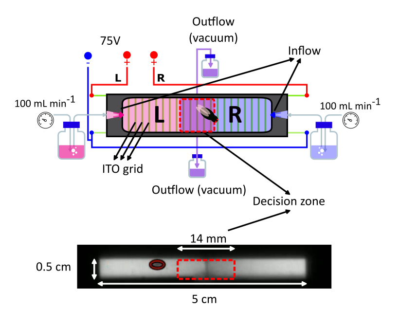

# Individual Drosophila Olfactory Conditioner (IDOC)

Paper describing the tool coming out soon to _bioarxiv_.

<!-- Embed YouTube Video -->
<iframe width="100%" height="315" src="https://www.youtube.com/embed/oatrOTn3igg?si=PqejeFb9SjmcuttM" title="YouTube video player" frameborder="0" allow="accelerometer; autoplay; clipboard-write; encrypted-media; gyroscope; picture-in-picture; web-share" allowfullscreen></iframe>

The IDOC (<b>I</b>ndividual *<b>D</b>rosophila*  <b>O</b>lfactory  <b>C</b>onditioner) is a versatile custom-built system, developed at [Fly Sleep Lab](https://www.flysleeplab.com), for studying olfactory learning and memory in individual Drosophila. This documentation provides researchers with detailed guidance for using the IDOC system to study fly learning and memory, as well as for constructing and configuring the system for their experimental needs. It includes:

* Experimental Procedure: An outline of how to use the IDOC system.

* Equipment and Materials: A list of items needed for constructing the IDOC.

* Assembly Instructions: A step-by-step guide for building IDOC chambers and setting up the system.

* Software and Data Analysis: Information on software installation, including video tracking and data processing.

For a detailed description of IDOC system, please see the [preprint](https://doi.org/10.1101/2024.12.18.629135). We are still actively maintaining this documentation.

Contact: erik.tedre@kuleuven.be, antonio.ortega@kuleuven.be, or e.baz@science.suez.edu.eg.

Updated on September 2025
